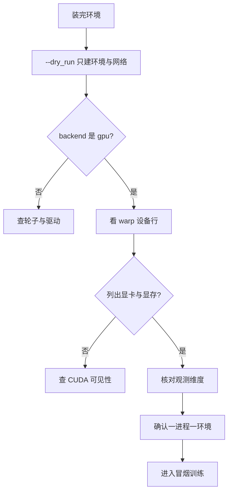
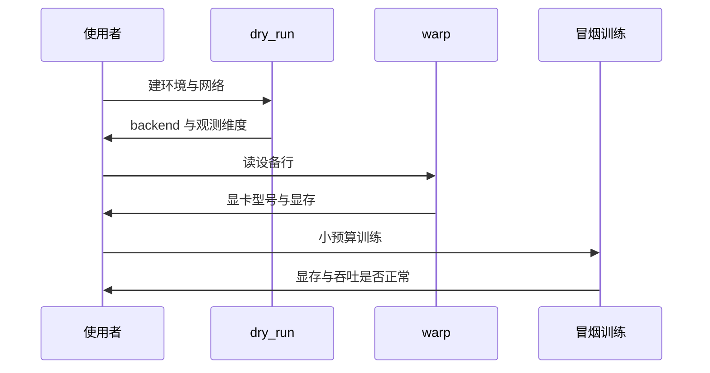

装完之后总得跑点什么才算确认环境可用。这套工程提供了两个不带训练的入口：一个只建环境与网络，另一个是起身环境自检脚本；再往前一步是短跑评估或查看器。三个入口的开销依次增加，覆盖的问题也依次变多。

装配错误的现象有很强的欺骗性：装了不匹配的轮子，程序照样启动，只是后端悄悄变成 CPU；显存预留不合理，训练前几千步一切正常，之后突然分配失败。把现象与原因先对应起来，再按入口顺序验证，可以省掉大量试错。

## 1. 三个自检入口

第一个入口是带 `--dry_run` 的训练脚本，它只建环境和网络，不进入训练循环（`README.md`）。第二个是起身环境自检脚本，用来确认环境本身的构造与复位（`README.md`）。第三个是短跑的评估或查看器，用来确认渲染与推理通路（`README.md`）。

| 入口 | 覆盖范围 | 开销 | 失败时指向 |
| --- | --- | --- | --- |
| `--dry_run` | 环境、网络、后端 | 最小 | 依赖与后端 |
| 环境自检脚本 | 环境构造与复位 | 小 | 环境实现 |
| 短跑评估 | 推理与物理 | 中 | 物理与显存 |
| 查看器 | 渲染与交互 | 中 | 渲染路径 |

## 2. 自检要看的四个点

第一看后端打印，确认是 gpu；第二看 warp 初始化里的设备行，确认列出显卡与显存；第三看观测维度打印，确认与环境定义一致；第四确认进程数——一个进程只建一个环境实例（`当前状态.md`）。

第三点最容易被跳过。观测维度是环境与网络之间的接口，维度对不上不会立刻报错，而是让策略收到错位的输入；续训时守卫会拦住这种不一致（`train/train_go1.py`）。

## 3. 四类装配错误

第一类是导入失败，通常出现在版本不匹配的包上，报错里带包名与路径。第二类是后端退回 CPU，表现为 `backend: cpu`，训练能跑但吞吐低一个数量级。

第三类是显存不足，特征是启动阶段或训练中途的分配失败，报错里带一个字节数（`train/train_getup.py`）。第四类是渲染变慢，只在查看器出现，训练不受影响，原因是没有指定直通驱动（`docs/viewer-guide.md`）。

| 现象 | 出现位置 | 常见原因 | 排查入口 |
| --- | --- | --- | --- |
| 导入失败 | 脚本第一行导入 | 版本不匹配 | 对照依赖清单 |
| 后端退回 CPU | 启动打印 | 轮子与驱动不匹配 | 核对后端标记 |
| 显存分配失败 | 启动或训练中途 | 预留比例不合理 | 查比例与同卡进程 |
| 渲染变慢 | 查看器 | 未指定直通驱动 | 打印实际渲染器 |
| 观测维度不一致 | 续训守卫 | 环境改动未同步 | 核对维度打印 |

## 4. 从现象到原因的顺序

遇到问题时按“后端、设备、显存、渲染”的顺序排查，因为这四层是依赖关系：后端不对时看不到设备，设备不对时谈显存没有意义，渲染只在最后才涉及。

这条顺序也适用于改完环境之后的回归：先跑 `--dry_run` 确认后端与维度，再跑小预算确认物理与显存，最后才开查看器确认渲染。

## 5. 自检结果要留档

自检的输出不要只看一眼就丢。冒烟训练的完整输出会被启动脚本重定向到日志文件，其中包含配置自述、维度与续训自检；评估的完整输出同样留在 `data/` 下的日志里。留档的意义在对比：下一次改环境之后，把新的自检输出与旧的对照，差异会直接浮出来。

留档还有个副作用：日志里记录了当时实际使用的版本与配置，几个月后要解释某个数字时，这份证据比记忆可靠。

## 6. 依赖之外的运行时差异

同一份依赖在不同机器上表现不同，差异来自依赖之外的三样：显卡型号与计算能力代号、驱动版本、以及 CPU 与内存规模。查看器文档在开头就把测试机器写成一行——WSL2、16 核、RTX 5060 Laptop，并注明所有数字都是本机实测（`docs/viewer-guide.md`）。

因此环境记录里除了版本清单，还应写明机器指纹。这份工程的做法是把平台写进依赖清单的注释里，并在状态文档里重复一次；换机器时这两处都要更新，否则旧数字会被误当成新机器的基线。

| 差异来源 | 影响 | 记录位置 |
| --- | --- | --- |
| 显卡与计算能力代号 | 内核编译与可用特性 | 设备行 |
| 驱动版本 | 支持的工具包上限 | warp 初始化块 |
| CPU 与核数 | 数据加载与软件渲染 | 机器说明 |
| 操作系统的图形栈 | 查看器可用性 | 机器说明 |

## 7. 自检失败的三种归因

自检失败先归因到三处之一：依赖版本、环境变量、机器条件。依赖问题的特征是报错稳定复现且带包名；环境变量问题的特征是同一条命令换终端结果不同；机器条件的特征是同一份代码在另一台机器上正常。

归因需要证据。依赖问题要给出报错原文与对应包的版本；变量问题要给出两个终端的变量差异；机器问题要给出两台机器的设备行对照。三类证据都指向“环境”，但处理方式完全不同——换版本、改变量、或调整预期。

## 8. 版本变更后的最小回归集

升级或重装依赖之后，回归不必跑完整训练，三项就够：`--dry_run` 确认后端与维度；小预算冒烟确认物理与显存；读一份旧检查点确认存储格式仍然兼容。三项的耗时都在分钟级，却覆盖了依赖升级最容易出问题的三个位置。

三项的结论要写回环境记录，形成“版本组合到结论”的短表，下次升级时先看这张表能省掉一轮试错。

| 回归项 | 验证对象 | 通过标准 |
| --- | --- | --- |
| `--dry_run` | 后端与观测维度 | 后端为 gpu、维度与预期一致 |
| 小预算冒烟 | 物理与显存 | 跑到预定步数不报分配失败 |
| 读旧检查点 | 存储格式兼容 | 守卫通过且能加载参数 |

## 9. 小结

### 核心概念

- 三个自检入口的开销与覆盖范围依次增加。
- 自检要看后端、设备、观测维度与进程数四项。
- 观测维度不一致不会立刻报错，但会让策略读到错位的输入。
- 四类装配错误分别出现在导入、后端、显存与渲染环节。
- 排查顺序是后端、设备、显存、渲染，与依赖关系一致。
- 自检输出要留档，作为环境变更的对照基线。

### 设计权衡

| 决策 | 选择 | 收益 | 代价 |
| --- | --- | --- | --- |
| 自检入口 | 三档开销 | 快速定位 | 需要记住覆盖范围 |
| 验证时机 | 改环境后立即 | 差异归因清楚 | 增加一次运行 |
| 输出处理 | 重定向留档 | 可对照 | 磁盘占用 |
| 排查顺序 | 按依赖层次 | 少走弯路 | 不覆盖偶发问题 |

## 10. 练习

### 基础题

1. 列出三个自检入口及其覆盖范围。
2. 说明观测维度不一致为什么不会立刻报错。
3. 写出四类装配错误各自的出现位置。

### 挑战题

1. 设计一份环境自检清单，把四项观察点与通过标准写在一起。
2. 给定一次“训练中途显存失败”的报告，写出完整的排查步骤与证据要求。
3. 论证把自检结果做成基线文件（而非日志）的取舍。

## 附：本页引用的路径

| 路径 | 用途 |
| --- | --- |
| `README.md` | 三个自检入口与命令 |
| `docs/viewer-guide.md` | 渲染排错与实测数据 |
| `train/train_getup.py` | 显存失败症状与后端打印 |
| `当前状态.md` | 单进程单环境约束 |
| `train/train_go1.py` | 续训守卫的维度比对 |
