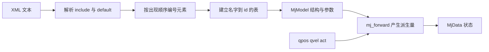

# MJCF模型结构与加载

MJCF 是 MuJoCo 的模型描述格式，用若干 XML 段描述一个多体系统。编译之后得到两个对象：MjModel 存放不随时间变化的结构与参数，MjData 存放每一时刻的状态。理解这两个对象的边界，是读懂后面所有物理参数的前提。

每个 XML 段编译后落到 MjModel 的哪个部分，是后面读任何字段都要先回答的问题；元素顺序、名字与地址这三套坐标如何区分，决定按名取字段会不会取错。项目在 Go1 上实测的九个维度数字，以及从场景 XML 到 `mjx.put_model` 的四步加载链里哪些参数被覆盖，都能用来验证这两条。

> 主体模型是 `models/go1/go1_mjx_position.xml`，场景入口是 `models/go1/scene_mjx_position.xml`，运行时加载在 `envs/go1_walk.py`。

## 1. MJCF 的段与它们编译成什么

| MJCF 段 | 编译后落到 | 本项目用途 |
| --- | --- | --- |
| `compiler` | 编译期选项，不进入运行时字段 | 角度单位、mesh 目录、autolimits |
| `option` | `model.opt` | 接触锥、impratio |
| `default` | 无独立字段，编译时展开到各元素 | 关节与执行器的公共参数 |
| `asset` | `mesh_*` / `mat_*` / `tex_*` / `hfield_*` | STL、材质、地形高度场 |
| `worldbody` | `body_*` / `geom_*` / `site_*` / `jnt_*` | 运动学树与碰撞体 |
| `actuator` | `actuator_*` | 12 个位置伺服 |
| `sensor` | `sensor_*` | RL 观测来源 |
| `keyframe` | `key_*` | home 出生姿态 |

结构与动态的分界是 `mj_forward`。XML 只决定 MjModel 的常数；qpos、qvel、act 属于 MjData，仿真步进时变化。编译过程按固定顺序完成：解析 include、展开 default、按出现顺序编号 body/joint/geom/actuator/sensor、建立名字到 id 的表。编号顺序在运行时可见，改动 XML 中元素的先后会直接改变下标。



## 2. 元素顺序、名字与地址三套坐标

同一个元素在 MuJoCo 里有三种被引用的方式，混用是最常见的下标错位来源：

| 名称 | 含义 | 取值方式 |
| --- | --- | --- |
| 元素顺序 id | 编译时按出现顺序分配 | `model.geom_bodyid[gid]` 这类数组 |
| 名字 | XML 里的 `name` 属性 | `model.geom("FR").id` |
| 地址 | 该元素在拼接数组中的偏移 | `model.sensor_adr[sid]` |

顺序 id 是数组下标，用于批量访问；名字是查找键，运行时用 `geom(name)`、`site(name)`、`body(name)` 查回 id；地址只对拼接型字段有意义，例如 `sensordata` 与 `qpos`。运行时按名字取 id，例如 `model.site("imu").id` 与 `model.body("trunk").id`，这样重排 XML 不会静默改错对象。

三者的关系可以这样概括：名字是稳定的接口，id 与地址都是编译产物。凡是把 id 或地址写进代码的地方，改 XML 顺序都要重新核对。

## 3. body 树与 qpos 的 7+12 布局

`worldbody` 是树的根，`body` 按父子嵌套定义。子 body 的 `pos`/`quat` 是相对父体坐标系的位姿，关节只增加该 body 相对父体的自由度。Go1 的树是四层深度，四条腿结构相同：

```mermaid
flowchart TD
  W["worldbody"] --> T["trunk (pos 0 0 0.445)"]
  T --> FH["FR_hip"] --> FT["FR_thigh"] --> FC["FR_calf"]
  T --> LH["FL_hip"] --> LT["FL_thigh"] --> LC["FL_calf"]
  T --> RH["RR_hip"] --> RT["RR_thigh"] --> RC["RR_calf"]
  T --> XH["RL_hip"] --> XT["RL_thigh"] --> XC["RL_calf"]
````

trunk 上的 `freejoint` 让基座有 6 个自由度，编译成 qpos 的 7 个分量（3 位移 + 4 单位四元数 w x y z）与 qvel 的 6 个分量（3 线速度 + 3 角速度）。12 个铰链关节按声明顺序追加到 qpos[7:19]：

$$qpos = \begin{bmatrix} p_x & p_y & p_z & q_w & q_x & q_y & q_z & \theta_1 & \dots & \theta_{12} \end{bmatrix}^{T}$$

关节顺序与四条腿的分段：

| 切片 | 腿 | 关节顺序 |
| --- | --- | --- |
| qpos[7:10] | FR | hip / thigh / calf |
| qpos[10:13] | FL | hip / thigh / calf |
| qpos[13:16] | RR | hip / thigh / calf |
| qpos[16:19] | RL | hip / thigh / calf |

四元数用 4 个分量表达 3 个旋转自由度，所以位置态比速度态多一个分量：$nq = 19$、$nv = 18$，两者差 1 正好来自基座旋转的四元数冗余。这一条差值在观测切片与 reset 里都要记住，否则速度切片会越界。

## 4. 编译后实测的九个维度

用 `mujoco.MjModel.from_xml_path` 编译本场景后实测：$nq=19$、$nv=18$、$nu=12$、$njnt=13$、$nbody=14$、$nsite=6$、$nsensor=14$、$nkey=1$。关节类型数组是 `[0, 3, 3, ...]`，0 为 free joint，3 为 hinge。

| 字段 | 值 | 来源 |
| --- | --- | --- |
| `nq` | 19 | free joint 7 + 12 铰链 |
| `nv` | 18 | free joint 6 + 12 铰链 |
| `nu` | 12 | actuator 段 12 个 `position` |
| `njnt` | 13 | 1 free + 12 hinge |
| `nbody` | 14 | world 之外的 13 个 body |
| `nsite` | 6 | head、imu 与四个足端 |
| `nsensor` | 14 | 见场景装配一篇的分类 |
| `nkey` | 1 | home |

这些维度由编译结果决定，不能全部从 XML 逐行读出。`nq` 与 `nv` 由关节类型决定，`nu` 由 actuator 段的行数决定，`nbody` 由 body 嵌套层数决定。核对维度比逐行读 XML 更快地发现结构性改动。

## 5. 从场景 XML 到 put_model 的四步加载链

加载链分四步：选场景、收集资产、编译、转 MJX。

```mermaid
sequenceDiagram
  autonumber
  participant E as Go1Walk.__init__
  participant M as mujoco
  participant X as mjx
  E->>E: 选 scene_mjx_position 或 scene_mjx_terrain
  E->>E: update_assets 收集 xml 与 assets 目录
  E->>M: MjModel.from_xml_path(xml_path)
  M-->>E: MjModel
  E->>E: 覆盖 opt.timestep / ccd_iterations / iterations
  E->>X: mjx.put_model(model, impl)
  X-->>E: mjx.Model（JAX 数组）
````

资产先收集再编译的原因在 `envs/go1_walk.py`：`update_assets` 把主体 XML 与 `assets/` 下的 STL 一起放进字典，MJX 在 JIT 内重建模型时需要同一份资产，而不是回读本机路径。字典存进 `self._model_assets`，供后续 viewer 与重放使用。

场景选择在 `envs/go1_walk.py`：`TERRAIN_XML_PATH if terrain else XML_PATH`。两个场景的差异只在地面与外观，机器人定义来自同一份主体文件。

| 位置 | 内容 | 与原理的对应 |
| --- | --- | --- |
| `envs/go1_walk.py` | `TERRAIN_XML_PATH if terrain else XML_PATH` | 场景选择 |
| `envs/go1_walk.py` | `update_assets(...)` 打包 XML 与 assets | 供 MJX 在 JIT 内解析资源 |
| `envs/go1_walk.py` | `MjModel.from_xml_path`、`opt.timestep`、`ccd_iterations` | XML 到 MjModel，再覆盖选项 |
| `envs/go1_walk.py` | `mjx.put_model(..., impl=...)` | MjModel 到 MJX 模型 |
| `envs/go1_walk.py` | `keyframe("home").qpos` 与 `qpos[7:]` | home 姿态与关节默认值 |
| `envs/go1_walk.py` | `body("trunk")` / `site(name)` / `geom(name)` | 名字到 id |
| `envs/go1_walk.py` | `xml_path`、`action_size`、`mj_model`、`mjx_model` 访问器 | 对外暴露编译产物 |
| `envs/go1_walk.py` | `action_size` 返回 `mjx_model.nu` | 12，来自 actuator 段数量 |
| `envs/go1_walk.py` | reset 末尾调用 `mj_forward` | 一次性算出派生量 |

## 6. XML 写死结构，运行期覆盖参数

XML 里能写死的是结构，不是全部运行参数。`models/go1/go1_mjx_position.xml` 只写了 `cone="elliptic" impratio="100"`，timestep 与求解器迭代次数都在加载后覆盖：

| 参数 | XML | 运行时 | 原因 |
| --- | --- | --- | --- |
| `timestep` | 未写（默认 0.002） | `envs/go1_walk.py` 赋 `sim_dt` | 训练与查看器共用配置 |
| `ccd_iterations` | 未写 | `envs/go1_walk.py` 赋 20 | 高速足端撞击的连续碰撞检测 |
| `iterations` | 未写 | `envs/go1_walk.py` 赋 2 或 20 | 软/硬接触两套物理 |

`mj_forward` 在 reset 末尾调用（`envs/go1_walk.py`），把 keyframe 的 qpos 一次性算出 site_xpos、sensordata 等派生量。派生量属于 MjData，不写回 MjModel。

这套分工带来一个固定顺序：改结构要重编模型，改运行参数不用。排查"改了 XML 没反应"时，先确认改的是结构还是被覆盖的参数。

## 7. keyframe 是出生姿态的单一来源

| 位置 | 内容 | 与原理的对应 |
| --- | --- | --- |
| `models/go1/go1_mjx_position.xml` | `<body name="trunk" pos="0 0 0.445" childclass="go1">` | 树根下唯一的浮动基座 |
| `models/go1/go1_mjx_position.xml` | trunk 质量 5.204 kg 与三项 diaginertia | `body_subtreemass` 的组成 |
| `models/go1/go1_mjx_position.xml` | `<freejoint/>` | qpos[0:7] 与 qvel[0:6] 的来源 |
| `models/go1/go1_mjx_position.xml,117,124` | FR_hip / FR_thigh / FR_calf 的 pos | 相对位姿链，决定腿长关系 |
| `models/go1/go1_mjx_position.xml,110,131` | site `head`、`imu` 与四个足端 site | 观测、接触、可视化的坐标点 |
| `models/go1/go1_mjx_position.xml` | home keyframe 的 qpos 19 项与 ctrl 12 项 | 出生姿态，不写在 body 的 pos 里 |

reset 读同一份 keyframe（`envs/go1_walk.py`）。因此 trunk 的 `pos="0 0 0.445"` 只在编译期作为默认 qpos；实际出生点由 keyframe 的 $z=0.35$ 加地形高度决定，平地自由沉降后稳定在约 0.277 m（`docs/experiment-log.md` 记录了 0.2760 m 的实测）。`envs/go1_getup.py` 用 `mj_model.jnt_range[1:]` 取 12 个铰链的限位，跳过第 0 个 free joint，正是依赖上面这套编号约定。

## 8. 结构与加载相关的故障现象

| 现象 | 原因 | 对应位置 |
| --- | --- | --- |
| 把 body 的 `pos` 当成运行时 qpos | 改了 XML 的 z，reset 结果不变 | `envs/go1_walk.py` 覆盖 qpos |
| 按固定下标取关节 | 改腿顺序后 qpos 切片错位 | `envs/go1_getup.py` 注释标明第 0 项是 free joint |
| 混淆同名 site 与 geom | 足端 site 与足端 geom 都叫 FR | `models/go1/go1_mjx_position.xml` |
| 场景未 include 主体 | `body("trunk")` 直接报错 | `scene_mjx_position.xml` |
| 在 XML 里改 timestep | 运行时无效 | `envs/go1_walk.py` 代码赋值覆盖 |
| 用 `nsite` 当足端数量 | 足端 site 是 4 个，另有 imu 与 head | `models/go1/go1_mjx_position.xml,110,131` 共 6 个 |
| 只复制主体 XML 不复制 assets | 编译时报找不到 STL | `envs/go1_walk.py` 两个目录都要收集 |
| 把 include 后的路径当成相对当前文件 | 子目录场景找不到模型 | `scene_mjx_terrain.xml` |

## 9. 小结

### 核心概念

1. MJCF 分三类内容：编译期选项、静态结构（body/joint/geom）、运行时接口（actuator/sensor/keyframe）。
2. body 树决定运动学链，freejoint 让 trunk 成为浮动基座，qpos 布局是 7 + 12。
3. 编译后本模型 $nq=19$、$nv=18$、$nu=12$，关节顺序与 actuator 顺序一致。
4. 一切按名字取 id，不按下标；编号顺序由 XML 出现顺序决定。
5. keyframe 是出生姿态的单一来源，body 的 pos 只是编译默认值。
6. 加载链是选场景、收资产、编译、转 MJX 四步，资产字典供 JIT 内重建。

### 设计权衡

| 方案 | 优点 | 代价 |
| --- | --- | --- |
| 单文件包含 worldbody 与场景 | 一处看全 | 换地面要复制整棵 body 树 |
| 主体 XML + scene include | 地面与外观独立替换 | 需要 `update_assets` 同时打包两个文件 |
| 结构写 XML、参数运行期覆盖 | 同一模型跑多套物理 | 实际生效值不在 XML 里，排查要两处看 |

## 10. 练习

基础题

1. 写出编译 `scene_mjx_position.xml` 后的 `nq`、`nv`、`nu`、`njnt`，并说明 $nq$ 与 $nv$ 相差 1 的原因。
2. 说明元素顺序 id、名字与地址三者的区别，并各给出一个使用场景。
3. 解释为什么在 XML 里改 `timestep` 不会生效，实际决定子步时长的是哪两处。

挑战题

4. 把四条腿的声明顺序整体倒过来（RL 在最前），列出需要同步修改的位置，并说明不改会怎样表现。
5. 设计一个只读 `MjModel` 的加载自检脚本，用它判断"某次改动是否真的改变了模型结构"，列出要打印的字段。

## 附：本页引用的路径

| 路径 | 用途 |
| --- | --- |
| `models/go1/go1_mjx_position.xml` | 主体 MJCF |
| `models/go1/scene_mjx_position.xml` | 平地场景 |
| `models/go1/scene_mjx_terrain.xml` | 地形场景 |
| `envs/go1_walk.py` | 加载、reset、step |
| `envs/go1_getup.py` | 复用同一模型的起身环境 |
| `docs/experiment-log.md` | 沉降高度等实测记录 |
| 仓库根 `/home/tc63/mujoco/mjx-go1-getup` | 本项目源码根 |
