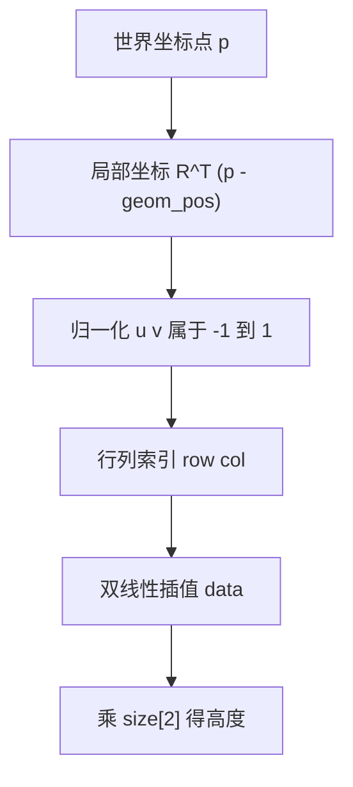

# hfield资产格式与坐标约定

程序化地形在物理引擎里需要一个能表达任意起伏、又能被碰撞检测高效处理的载体。用 box 或 mesh 拼出起伏要生成大量几何体，接触对数量随拼接块数上升；用解析平面只能表达水平地面。高度场（hfield）取中间路线：把地面高度存成一张二维网格，引擎按网格生成三角面片参与碰撞，碰撞的窄相位只需要处理足端附近的格子。

这条路线带来一批格式与坐标上的具体约定：高度值怎么从像素换算、size 的四个参数各表示什么、高度数据在内存里的行列方向与世界坐标如何对应。这些约定出错时地形物理依然合法、训练也不会报错，但布局与采样位置会静默偏离，是这类资产里最难排查的一类问题。

## 高度场为什么适合程序化地形

高度场把地形描述成一张规则网格上的高度值，网格之外的部分由引擎按边界处理。它与 mesh 的区别在于规则性：采样、碰撞与可视化共用同一套索引，不需要为每个地形单独生成拓扑。与拼接几何体相比，高度场的接触对数量只与足端附近的有效格子有关，不随地形总面积增长。

素材仓库选择高度场的直接理由是后端支持：warp 的碰撞驱动实现了 HFIELD 类型并走凸包路径，因此 MJX 用 warp 后端时可以在地形上训练（`mjx-go1-getup/docs/experiment-log.md:1411-1413`）。同一节还给出官方对照做法：playground 的 rough_terrain 也用高度场，示例尺寸是 size 取 10 10 0.05 1.0，高度范围只有 5 cm。本仓库把高度范围放大到 30 cm，是把高度场用在更难的地形上。

另一个理由是渲染与物理的成本可控。素材实测高度场并不比平地慢，离屏渲染的耗时与分辨率无关，n 从 16 到 128 的渲染时间都在 108 ms 量级（`experiment-log.md:1455-1457` 与 `:1473`）。这否定了「地形导致物理变慢」的猜测，地形分辨率可以按精度需求选而不必担心帧率。

## PNG资产的像素与高度关系

高度场资产是一张灰度 PNG，本仓库用 16 位深度。高度值的换算关系写在生成器里（`mjx-go1-getup/sim/gen_terrain.py:288-291`）：

$$
\text{height} = \text{base\_z} + \text{data} \times \text{elevation\_z}, \qquad \text{data} = \frac{\text{pixel}}{65535}
$$

生成时先把高度场归一化到 $[0, 1]$ 再乘以 65535 取整成 uint16（`gen_terrain.py:291-293`）。elevation_z 取当前高度场的最大值，即 $h_{\max} > 0$ 时等于 $h_{\max}$，否则取 1.0 兜底（`gen_terrain.py:290`）。

16 位的意义在量化误差。以本仓库的 $h_{\max} = 0.3$ m 为例，单像素对应的最小高度差是

$$
\frac{0.3}{65535} \approx 4.6 \times 10^{-6} \text{ m}
$$

也就是 4.6 微米，远小于格距与足端半径的量级，可以忽略（`gen_terrain.py:289` 的注释给出的就是这条量化误差估计）。若用 8 位 PNG，同样的高度范围下量化误差会放大到 1.2 毫米，在平滑坡面上会出现可见的台阶。

## size四个参数的语义

hfield 的 size 属性有四个数（`mjx-go1-getup/models/go1/scene_mjx_terrain.xml:67`）：

$$
\text{size} = \text{radius\_x} \quad \text{radius\_y} \quad \text{elevation\_z} \quad \text{base\_z}
$$

前两项是高度场半边长，单位米；高度场覆盖 $2\,\text{radius}_x$ 乘 $2\,\text{radius}_y$ 的范围。第三项是高度缩放，把 PNG 里的归一化像素值映射到米。第四项是几何体的底部基准。

本仓库当前取值为 size 等于 6 6 0.3000 0.0960，对应半边长 6 m、覆盖 12 m 见方、高度缩放 0.3 m、底部基准 0.096 m（`scene_mjx_terrain.xml:67`）。这些值与 terrain.json 的前几项一致（`models/go1/assets/terrain.json:2-6`）。

需要特别区分两个同名但含义不同的 base_z。terrain.json 里的 base_z 是生成器写入的名义地面高度 NOMINAL_Z 等于 0.0（`gen_terrain.py:48-49` 与 `:301`），表示地形在原点处的高度基准；XML 里的 base_z 等于 0.0960，是几何包围盒参数。两者都叫 base_z，读取元数据时不要把 JSON 的值直接搬进 XML。

## base_z不等于零的原因

MuJoCo 不接受 hfield 的 base_z 取零，因此必须给一个正值（`experiment-log.md:1427-1429` 与 `scene_mjx_terrain.xml:56-60`）。它的作用是把几何包围盒撑开，不改变地形形状，形状完全由 PNG 决定。

包围盒的存在影响碰撞检测的粗筛。引擎用包围盒判断某个几何体是否可能与 hfield 相交，盒子太小会让本应参与的接触被排除。素材记录的几何高度范围是

$$
[\text{pos.z}, \; \text{pos.z} + \text{elevation\_z} + \text{base\_z}]
$$

（`scene_mjx_terrain.xml:58-59`）。当前 $0.3 + 0.096 = 0.396$ m，加上 pos.z 等于零后覆盖到 0.396 m，足够容纳 0.3 m 的最高地形与足端的接触半径。

官方 rough_terrain 用 base_z 等于 1.0，把包围盒撑到米级，对只有 5 cm 起伏的地形来说是极大的余量。本仓库把 base_z 压到 0.096 m，是因为地形总高已经到 0.3 m，包围盒按实际需要给即可。

## 坐标约定的转置与翻转

生成器内部的数组按「行是 x、列是 y」的直觉约定构造，而 MuJoCo 读取 hfield PNG 时把数据组织成行列二维数组，其中列沿 +x、行沿 -y，且图像的第 0 行在顶部（`experiment-log.md:1962-1965`）。两套约定之间差一次转置与一次 y 方向翻转。

素材用一个单特征实验把这条关系定死：生成一个只在生成器坐标 $(+1.5, -0.9)$ 有高斯凸起的高度场，存成 PNG 后用引擎射线扫描峰值位置，结果落在世界坐标 $(-0.9, -1.5)$（`experiment-log.md:1944-1965`）。七种候选变换的对照如下（`experiment-log.md:1952-1961`）：

| 候选变换 | 预测落点 | 与实测距离 |
| --- | --- | --- |
| 不变换 | $(+1.5, -0.9)$ | 2.47 |
| 转置 | $(-0.9, +1.5)$ | 3.00 |
| x 翻转 | $(-1.5, -0.9)$ | 0.85 |
| y 翻转 | $(+1.5, +0.9)$ | 3.39 |
| 180 度旋转 | $(-1.5, +0.9)$ | 2.47 |
| 转置加 x 翻转 | $(+0.9, +1.5)$ | 3.50 |
| 转置加 y 翻转 | $(-0.9, -1.5)$ | 0.00 |

只有「转置加 y 翻转」的距离为零。修复写法是在写出前做一次转置与上下翻转（`gen_terrain.py:292-294` 与 `experiment-log.md:1978`）：

$$
\text{arr} = \text{flipud}(h^{\mathsf T})
$$

修完之后生成器坐标与世界坐标一致，设计的「沿 +x 的楼梯」在世界里也沿 +x，探针实测的位置与设计一致（`experiment-log.md:1985-1987`）。元数据里用 axis_convention 字段记录这条约定，便于以后核对（`terrain.json:11`）。

这条修正的价值在于它修的是静默错误：不修时地形依然物理合法、训练不报错，但按设计坐标推理的位置全错，做地形观测时会采到错误位置的高度（`experiment-log.md:1967-1973`）。

## 引擎侧的采样与索引映射

高度场在引擎侧的查询可以用解析方式复现，不必依赖引擎射线。世界点先变换到几何体局部坐标，再映射到行列索引（`experiment-log.md:1634-1640`）：

$$
\text{local} = R^{\mathsf T} (p_{\text{world}} - \text{geom\_pos})
$$

$$
u = \frac{\text{local}_x}{\text{radius}_x} \in [-1, 1], \qquad \text{col} = \frac{u + 1}{2} (n_{\text{col}} - 1)
$$

$$
v = \frac{\text{local}_y}{\text{radius}_y} \in [-1, 1], \qquad \text{row} = \frac{v + 1}{2} (n_{\text{row}} - 1)
$$

$$
\text{height} = \operatorname{bilinear}\left( \text{data}[\text{row}, \text{col}] \right) \times \text{size}_2
$$

这套映射与 warp 的 ray_hfield 实现一致，索引行列互换时误差会从亚毫米涨到 14 mm、最大 51 mm，说明朝向正确而不是碰巧（`experiment-log.md:1642-1646`）。

两条工程结论。第一，引擎射线对 hfield 是可用的，此前「不可靠」的结论源于没有先调用前向计算，导致几何体实时位姿为零、射线在错误坐标系里运算；补上之后 1681 个采样点与解析值的差为 p99 等于 0.35 mm、max 等于 0.89 mm（`experiment-log.md:1603-1615`）。第二，MJX 的 JAX 后端不支持 hfield 碰撞与射线，射线的分发表里没有 HFIELD；只有 warp 后端把 hfield_data 与 hfield_nrow/ncol/size/adr 暴露成 JAX 数组，可以在训练循环里做解析采样（`experiment-log.md:1617-1631`）。

## 小结

### 核心概念

- 高度场用规则网格表达任意起伏，接触对数量只与足端附近的有效格子有关，warp 后端沿凸包路径支持它。
- 高度按 base_z 加 data 乘 elevation_z 换算，16 位 PNG 在 0.3 m 范围内的量化误差约 4.6 微米。
- size 是 radius_x radius_y elevation_z base_z 四个量；base_z 只撑开包围盒、不改变形状，且 MuJoCo 拒绝零值。
- terrain.json 与 XML 里的 base_z 含义不同，前者是名义地面高度 0.0，后者是 0.0960 的几何参数。
- 生成器坐标到引擎坐标需要转置加 y 翻转，由单凸起实验在七种候选中唯一匹配确定。

### 设计权衡

| 选择 | 带来的能力 | 付出的代价 |
| --- | --- | --- |
| 用高度场而非拼接几何体 | 接触对数量与总面积解耦 | 网格规则、分辨率受接触上限约束 |
| 用 16 位 PNG | 量化误差可忽略 | 资产体积与读写略增 |
| base_z 取大 | 包围盒宽松、粗筛不易误排 | 粗筛范围大，无谓的相交测试增多 |
| 修复坐标约定 | 生成器坐标与世界一致 | 多一次转置与翻转 |
| 用解析采样代替引擎射线 | 可 jit、可 vmap | 需要自己核对索引与插值 |

## 练习

### 基础题

1. 写出高度值从像素到米的换算式，并计算 0.3 m 范围内 16 位与 8 位编码的量化误差。
2. 说明 size 四个参数各自的物理含义，以及 base_z 与 pos.z 的关系。
3. 解释为什么生成器坐标到引擎坐标需要转置加 y 翻转。

### 挑战题

4. 用单特征实验的思路设计一套坐标约定验证流程，列出候选变换与判据。
5. 推导解析双线性采样公式，说明行列互换后误差会如何变化，并解释为什么这能证明朝向正确。
6. 分析 base_z 取 0.096 与取 1.0 在接触粗筛上的差别，给出按地形高度选值的依据。

## 附：本页引用的路径

| 路径 | 用途 |
| --- | --- |
| `mjx-go1-getup/sim/gen_terrain.py` | 地形生成器：高度换算与 PNG 写出（:287-294）、元数据（:296-308）、坐标约定注释（:269-282） |
| `mjx-go1-getup/models/go1/scene_mjx_terrain.xml` | 地形场景：hfield 与 geom 定义（:56-67）、约束注释（:1-30） |
| `mjx-go1-getup/models/go1/assets/terrain.json` | 地形元数据：尺寸、高度统计、坐标约定字段 |
| `mjx-go1-getup/docs/experiment-log.md` | 实验记录：地形选型与硬约束（:1409-1439）、hfield 采样（:1601-1646）、坐标轴修正（:1924-2020） |
| `RLcontroller_go1/sim/plot_terrain_heightmap.py` | 用 hfield_data 画高度图并与引擎射线核对的脚本 |
| `~/mujoco` | 素材仓库根，正文中素材路径均相对该根 |
