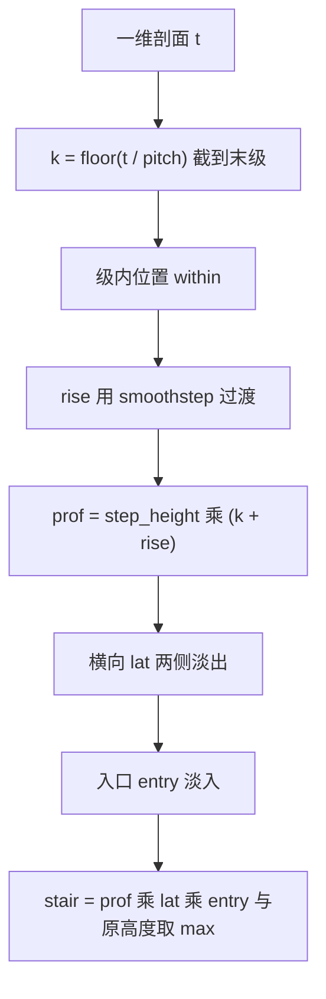

# 程序化地形生成器的构造

第一篇讲的是资产格式与坐标约定，这一篇讲这些资产是怎么算出来的。生成器把三类地形成分叠加到一张网格上：平滑的随机起伏、若干矩形台地、以及带真实爬升的阶梯。三类成分的叠加顺序与边界处理决定了最终地形的可走性，也决定了会不会出现垂直墙、累积超高与重叠陡壁。

生成器的另一个要求是确定性。训练进程与可视化进程各自加载同一份高度场资产，只有生成结果逐位一致，才能保证「看到的」与「训练的」是同一个地形（`mjx-go1-getup/sim/gen_terrain.py:13`）。确定性来自固定种子的随机数发生器与纯函数的叠加流程。

## 生成器的输入输出与确定性

生成器的入口是 make_terrain，输入分辨率、半边长、起伏幅度、滤波尺度、台阶高度、随机种子与阶梯参数，输出高度场数组与台地中心列表（`gen_terrain.py:175-178` 与 `:263`）。随机性只来自一处（`gen_terrain.py:195`）：

$$
\text{rng} = \text{np.random.default\_rng}(\text{seed})
$$

其余步骤都是确定性的数组运算。seed 的默认值是 0（`gen_terrain.py:372`），因此默认档每次生成的结果完全相同；换种子会改变起伏形状与台地布局，但不会改变阶梯的位置，阶梯位置由 ext 与固定比例给出（见后文）。

高度场的值域是 $[0, \text{step\_height} \times \text{stair\_steps}]$（`gen_terrain.py:179`）。只向上抬升是有意设计：平地基准必须与原平面地板等效，若地形在原点处为负值，reset 时机器人会穿地或悬空（`gen_terrain.py:6-9`）。

## 平滑随机起伏的实现

随机起伏由白噪声经高斯滤波得到，再做幅度归一化（`gen_terrain.py:52-61`）：

$$
w \sim \mathcal{N}(0, 1), \qquad s = \text{gaussian\_filter}(w, \sigma, \text{mode}=\text{wrap})
$$

$$
h = \frac{s}{\max |s|} \times \text{amp}
$$

归一化这一步的作用是把滤波尺度与幅度解耦。高斯滤波会降低信号的标准差与峰值，若直接乘幅度，同一个 amp 在不同 sigma 下会产生不同的实际起伏高度；除以最大绝对值之后，起伏的峰值幅度恒等于 amp，sigma 只负责控制空间尺度（`gen_terrain.py:57-61` 的注释写明了这一点）。

边界用环绕模式而不是镜像或补零。地形边缘之外没有机器人活动，边缘的处理方式主要影响视觉，用环绕可以避免边缘出现被滤波削平的人工痕迹（按实现选择，素材注释未展开理由）。

滤波尺度 sigma 的单位是格数而不是米。这一点在换分辨率时必须换算，否则起伏的物理尺度会变（`gen_terrain.py:181-182`）：

> n 取 384 配 sigma 取 6 与 n 取 128 配 sigma 取 2 才是同一物理尺度

命令行帮助里也重复了这条提醒（`gen_terrain.py:353-355`）。实际后果是：把 n 提高到 256 而不改 sigma，起伏的物理波长减半，地形看起来更碎。

起伏只保留正向（`gen_terrain.py:197-199`）：

$$
h = \max(\text{base}, 0)
$$

负值被截断，地形因此只有上凸没有下凹。这与「平地基准等效」的约束一致，代价是起伏的均值偏高，terrain.json 里 h_mean 等于 0.0346 m，就是一个非零均值（`models/go1/assets/terrain.json:9`）。

## 矩形台地与缓坡

台地由矩形区域抬升实现。参数用米给，函数内部换算到网格坐标（`gen_terrain.py:64-77`）：

$$
X, Y = \text{meshgrid}(x_s, y_s), \qquad \text{inside} = (x_0 \le X \le x_1) \wedge (y_0 \le Y \le y_1)
$$

直接抬升会在边界形成垂直墙。生成器用有符号距离与 smoothstep 做缓坡（`gen_terrain.py:82-92`）：

$$
d = \sqrt{\max(x_0 - X, X - x_1, 0)^2 + \max(y_0 - Y, Y - y_1, 0)^2}
$$

$$
t = \text{smoothstep}\left(\text{clip}\left(1 - \frac{d}{w}, 0, 1\right)\right), \qquad h \mathrel{+}= \text{height} \times t
$$

其中 $w$ 等于缓坡格数乘格距。smoothstep 的形式是 $t^2 (3 - 2t)$，保证斜率在两端为零、中间平滑过渡（`gen_terrain.py:90`）。

台地生成时缓坡格数取 4（`gen_terrain.py:245-246`），即缓坡宽度为四个格子。$n = 128$、格距 9.4 cm 时缓坡约 38 cm，坡度平缓。台地高度取 0.7 到 1.0 倍台阶高度之间的随机值（`gen_terrain.py:244`），使台地高度参差而不是等高。

## 阶梯剖面的三处修正

阶梯是这份生成器里迭代最多的部分，函数注释记录了三处修正（`gen_terrain.py:112-121`）：

| 修正 | 旧实现的问题 | 实测后果 |
| --- | --- | --- |
| 真爬升剖面 | 对三段矩形各加同样的台阶高度，三段并排 | 等高长平台，不爬升 |
| 绝对高度取 max | 沿用矩形台地的累加语义，每级额外吃到上一级抬升 | 5 级乘 6 cm 累积到 0.571 m，坡度 75 度 |
| 侧壁长度由总高反算 | 用踏步面长度当淡出长度 | 用 18.8 cm 得 58 度陡壁，实测 64 度；用 94 cm 超过半宽、中心升不到顶，实测 0.119 m |

修正后的剖面是逐级爬升（`gen_terrain.py:154-160`）：

$$
k = \min\left(\left\lfloor \frac{t}{\text{pitch}} \right\rfloor, \text{stair\_steps} - 1\right)
$$

$$
\text{rise} = \text{smoothstep}\left(\text{clip}\left(\frac{t - k \cdot \text{pitch} - (\text{pitch} - \text{ramp\_len})}{\text{ramp\_len}}, 0, 1\right)\right)
$$

$$
\text{prof} = \text{step\_height} \times (k + \text{rise})
$$

第 $k$ 级平台的绝对高度是 $k$ 乘台阶高度，末级之后不再升。缓坡段长度由格数与格距决定，踏步面进深必须大于缓坡长度，否则相邻坡面叠加成陡壁（`gen_terrain.py:204-205` 与 `:363-364`）。

侧壁淡出长度按目标侧坡角反算，并且补偿 smoothstep 的中段最大斜率为 1.5（`gen_terrain.py:132-136`）：

$$
\text{side\_len} = \frac{1.5 \times \text{total\_h}}{\tan(\text{side\_deg})}
$$

不补偿时目标 25 度会实测成 34.7 度。函数还会在宽度不足以容纳两侧淡出时自动加宽，而不是报错让使用者手工调参（`gen_terrain.py:137-145`）。

## 原点压平与reset一致性

原点必须压到零并向外平滑过渡，否则 reset 把机器人放在 home 位姿时会与地形冲突（`gen_terrain.py:6-9` 与 `:95-105`）。实现是用径向权重乘整个高度场：

$$
r = \sqrt{X^2 + Y^2}, \qquad t = \text{smoothstep}\left(\text{clip}\left(\frac{r - \text{radius}}{\text{blend}}, 0, 1\right)\right), \qquad h \leftarrow h \times t
$$

半径以内权重为零，完全压平；半径到半径加过渡带之间平滑升到 1。当前参数是半径 0.5 m、过渡带 0.9 m（`gen_terrain.py:260-261`），比旧版 0.7 与 1.2 更小；注释说明旧参数把周围 1.9 m 全部抹平，地形感被削掉，新参数只保留 reset 必需的落地区。

压平也解释了 XML 里 pos.z 取零就能对齐的原因：生成器保证原点高度为零，reset 正落在原点，因此原点被抹平后几何体的零位与平地一致（`scene_mjx_terrain.xml:75-78`）。若以后去掉压平，pos.z 必须重新标定。

## 生成顺序与互斥约束

三类成分的叠加顺序影响最终坡度。生成器先确定阶梯占地，再生成台地并排除这些矩形，最后叠加阶梯（`gen_terrain.py:201-256`）。注释记录了这个顺序的原因：台地与楼梯重叠时，台地的矩形缓坡会叠在台阶侧壁上，实测最大坡度冲到 64 度（`gen_terrain.py:202-203`）。

台地放置用拒绝采样，最多尝试 400 次（`gen_terrain.py:228-247`）。三条拒绝规则：

| 规则 | 阈值 | 目的 |
| --- | --- | --- |
| 距原点距离 | 小于 1.6 m | 不压在原点平地区 |
| 与阶梯占地 | 外扩 0.6 m | 给缓坡留余量 |
| 台地间距 | 两轴均小于 2.2 m | 避免叠加成高墙 |

阶梯本体用绝对高度剖面与原高度取 max（`gen_terrain.py:249-256`），因此台地与阶梯即使靠近也不会累加。阶梯的摆放位置由 ext 的固定比例给出，沿 +x 一条、沿 +y 一条（`gen_terrain.py:216-218`）：第一条起点在 x 等于 0.05 倍 ext、y 等于 -0.80 倍 ext 处，第二条起点在 x 等于 -0.80 倍 ext、y 等于 0.05 倍 ext 处。

## 命令行参数与统计输出

命令行参数按成分分组（`gen_terrain.py:344-375`）：

| 参数 | 默认值 | 作用 |
| --- | --- | --- |
| 分辨率 n | 128 | 网格分辨率，注释警告不要太高 |
| 半边长 ext | 6.0 | 地形 12 m 见方 |
| 起伏幅度 bump_amp | 0.05 | 起伏峰值幅度，旧默认 0.02 |
| 滤波尺度 sigma | 2.0 | 高斯滤波尺度，单位格数 |
| 台阶高 step_height | 0.06 | 单级台阶高，旧默认 0.04 |
| 台地数 n_steps | 6 | 等高台地数量 |
| 阶梯级数 stair_steps | 5 | 阶梯级数，旧实现 3 段等高不爬升 |
| 阶梯条数 n_staircases | 2 | 阶梯条数 |
| 每级进深 stair_pitch | 0.55 | 必须大于缓坡长度 |
| 踏步面缓坡 stair_ramp | 2 | 2 格约 18.8 cm、17.7 度 |
| 压平半径与过渡带 | 0.5 与 0.9 | 原点压平参数 |
| 种子 seed | 0 | 随机种子 |
| 只统计不写文件 | 关 | dry_run 开关 |

生成完成后打印四项统计（`gen_terrain.py:385-401`）：格距、起伏与台阶参数、高度最小值与最大值与均值、原点高度、最大坡度。原点高度带一条硬判据

$$
h(0, 0) \approx 0
$$

不满足就说明 reset 落地会不一致（`gen_terrain.py:394-395`）。最大坡度由相邻格差除以格距算得，并同时打印足端半径 2.3 cm 与格距的对比（`gen_terrain.py:396-401`）：格距远大于足端半径时，足端近似落在单个格子的高度上，采样误差小。

## 小结

### 核心概念

- 生成器只用一处随机源，默认种子 0，其余步骤确定，保证训练与可视化加载同一地形。
- 平滑起伏用高斯滤波白噪声再按最大绝对值归一化，使幅度与滤波尺度解耦；sigma 的单位是格数，换 n 必须按比例调。
- 台地用矩形掩码加有符号距离与 smoothstep 缓坡，缓坡宽度四个格子。
- 阶梯用绝对高度剖面 k 加 rise 并对原高度取 max，侧壁长度由总高与目标坡度反算且补偿 smoothstep 的 1.5 倍峰值斜率。
- 原点半径 0.5 m、过渡带 0.9 m 压平，保证原点高度为零；生成顺序把阶梯占地先行排除，避免叠加成 64 度陡壁。

### 设计权衡

| 选择 | 带来的能力 | 付出的代价 |
| --- | --- | --- |
| 只保留正向起伏 | 平地基准等效 | 高度均值非零 |
| 幅度归一化 | 幅度与尺度解耦 | 峰值固定，分布形状受滤波影响 |
| 用 smoothstep 缓坡 | 无垂直墙、可走 | 中段斜率 1.5 倍需补偿 |
| 阶梯取绝对高度 | 不会累积超高 | 需要按总高反算侧壁长度 |
| 原点压平 | reset 落地一致 | 原点附近地形感被削弱 |

## 练习

### 基础题

1. 说明起伏幅度归一化为什么能让 sigma 只控制尺度，并给出不归一化时的后果。
2. 写出矩形台地缓坡的 smoothstep 表达式，说明缓坡宽度的计算方式。
3. 解释阶梯剖面为什么不能用矩形台地的累加语义，给出累积超高的估算。

### 挑战题

4. 推导侧壁淡出长度的公式，说明 1.5 倍补偿的来源，并计算总高 0.3 m、目标 30 度时的侧壁长度。
5. 设计一条新的阶梯摆放规则，使两条阶梯不占据对称象限，并分析对台地放置成功率的影响。
6. 把分辨率从 128 改到 384，列出需要同步调整的参数与资产尺寸，说明会触发哪些引擎限制。

## 附：本页引用的路径

| 路径 | 用途 |
| --- | --- |
| `mjx-go1-getup/sim/gen_terrain.py` | 地形生成器：模块约束（:1-49）、起伏（:52-61）、台地（:64-92）、原点压平（:95-105）、阶梯（:108-171）、组合（:175-263）、保存与同步（:266-339）、命令行与统计（:342-422） |
| `mjx-go1-getup/models/go1/assets/terrain.json` | 默认档参数与高度统计 |
| `mjx-go1-getup/models/go1/scene_mjx_terrain.xml` | 场景约束与 pos.z 对齐说明（:1-30、:56-86） |
| `RLcontroller_go1/sim/gen_terrain.py` | 同一生成器在另一工作区的副本（426 行，内容一致） |
| `~/mujoco` | 素材仓库根，正文中素材路径均相对该根 |
