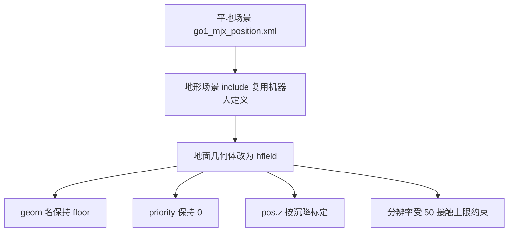

# 地形场景装配与接触约束

有了高度场资产，还要把它装进一个合法的场景，并保证接触语义与平地场景一致。地形场景的写法很轻：包含平地场景、给地面换个几何类型、加一点视觉元素。工作量集中在四条不能动的约束上：几何体名字、接触优先级、位置标定与分辨率上限。任何一条改动都会从「地形看起来正常」变成「训练结果崩坏」，而且大多不会报错。

素材仓库把这些约束直接写在场景文件头与几何体注释里（`mjx-go1-getup/models/go1/scene_mjx_terrain.xml`）。

## 场景文件的结构与包含关系

地形场景通过包含复用平地场景（`scene_mjx_terrain.xml`）：

$$
\text{<include file="go1\_mjx\_position.xml"/>}
$$

平地场景提供机器人模型、关节、执行器、传感器与默认类设置；地形场景只替换地面几何体并追加视觉设置。这样做的收益是两份场景的机器人定义不可能漂移：改机器人只需改平地场景，地形场景自动跟上。

地形场景自身包含四块内容。统计范围用于查看器的自动缩放（`scene_mjx_terrain.xml`）。视觉块提供天空与地面纹理。资产块定义纹理、材质与高度场。世界体块放一盏方向光与地面几何体。

素材的场景头注释写有「加 rocky 贴图材质（纯视觉）」（`scene_mjx_terrain.xml`），但资产块里实际定义的材质名是 groundplane，用的是内置棋盘纹理，没有名为 rocky 的材质。这是一处注释与实现的偏差，读这份文件时应按资产块为准。

## floor几何体名字的绑定约束

地面几何体必须继续叫 floor（`scene_mjx_terrain.xml`）。理由是平地场景的传感器段里有四个足端接触传感器，它们的 geom2 参数都写死为 floor：

$$
\{\text{FR}, \text{FL}, \text{RR}, \text{RL}\}\_\text{floor\_found}
$$

把地形几何体改名会让四个足端接触信号全部断开，依赖它们的 feet_air_time、feet_slip 与相关奖励随之失效（`experiment-log.md` 的硬约束表把它列为第一条）。这类错误不会让仿真报错，只是奖励项恒为零或恒为某个值，训练会朝错误方向收敛。

改名之外，把地面拆成多块几何体同样会破坏这组传感器。地形只能用单个 hfield 表达，这一点在选型阶段就确定。

## priority为0的接触语义

MuJoCo 判定两个几何体接触参数用哪一侧的规则有两条：两侧 priority 不同时取较高的一方；两侧相同且非零时取两者的最大值（`scene_mjx_terrain.xml`）。平地场景里地面的 priority 是默认值 0、足端几何体是 1，因此足端一侧的参数生效：condim 等于 6、摩擦系数 0.6、硬接触的 solimp 设置，这套语义是策略训练的基础。

地形几何体如果把 priority 写成 1，两侧同级，摩擦、condim 与 solimp 会全部改变。素材记录了实测结果：condim 变成 3、摩擦变成 1.0，足端抓地被改，策略崩坏（`scene_mjx_terrain.xml`）。这条改动看起来只是「优先级一致」，实际是把接触模型换了一套。

当前场景的地面定义没有显式写 priority，取默认的 0（`scene_mjx_terrain.xml`），与平地场景一致。文件里唯一显式给出的接触参数是摩擦，取 1.0 0.02 0.01，滑移方向的两个系数是低值，用于表达地面的各向异性。

## pos.z的标定方法

高度场的几何高度范围是（`scene_mjx_terrain.xml`）：

$$
[\text{pos.z}, \; \text{pos.z} + \text{elevation\_z} + \text{base\_z}]
$$

pos.z 决定地形整体抬高多少。它不能从 elevation_z 推导，只能标定：扫描 pos.z 的值，使地形场景下 home keyframe 的沉降高度与平地场景一致（`scene_mjx_terrain.xml` 与 `experiment-log.md`）。

素材给出的标定流程是物理沉降比对，而不是用引擎射线量高度。早期版本认为射线对 hfield 不可靠、得到自相矛盾的结果（0.502 与 0.600 与全未命中），因此改用「全零高度场」把接触模型的差异单独分离出来：hfield 的三角面片接触与平面解析接触在同样位姿下的接触数是 28 对 4（`experiment-log.md`）。这条早期结论后来被修正：射线本身是可用的，之前失败是因为没有先调用前向计算（`experiment-log.md`，详见第一篇）。引用这段历史时要区分两个版本的结论。

当前的实测结果是 pos.z 取 0 即可对齐，原因是生成器把原点压平、reset 正落在原点（`scene_mjx_terrain.xml`）。素材里出现过两组标定数字：一档记录为沉降 0.2760 m 对平地 0.2756 m、差 0.4 mm（`experiment-log.md`），另一处写平地基准 0.2777 m、差 0.2 mm（`scene_mjx_terrain.xml` 与 `RLcontroller_go1/sim/probe_terrain_recalib.py`）。两处来自不同时期与不同地形的测量，量级一致但数值不同，引用时按各自上下文取用。

## 分辨率与接触上限

MuJoCo 对每个几何体与高度场的组合最多生成 50 个接触（`scene_mjx_terrain.xml` 与 `experiment-log.md`）。超过上限时引擎静默截断并打印 height field collision overflow 警告，被丢弃的接触会让机器人在局部区域穿透或打滑。

上限与格距直接相关：格距越小，足端一次覆盖的格子越多，参与碰撞的三角棱柱越多。每格含两个三角棱柱，每个都要跑一次凸碰撞，因此局部棱柱数超过 50 就溢出。素材的实测是 n 取 384、格距 3.1 cm 时持续溢出，n 取 128、格距 9.4 cm 时正常（`experiment-log.md`）。坡度统计也支持这个选择：大于 30 度的格子从 813 个降到 49 个，占比 0.033%。

窄相位并非遍历整张高度场。warp 的实现用支撑函数算出紧包围盒，只遍历机器人覆盖的几十个格子（`experiment-log.md`），因此地形不会因为总面积大而变慢。素材的物理基准显示地形 9.5 ms 每步、平地 10.9 ms 每步，地形反而略快（`experiment-log.md`）。

需要标注一处素材内部的不一致：物理基准脚本的文件头写「HFIELD 走通用凸碰撞而 PLANE 走解析碰撞，这就是地形卡顿的根因」（`RLcontroller_go1/sim/bench_terrain.py`），而实验记录的结论是地形不比平地慢，查看器卡顿的根因是 llvmpipe 占满 CPU、饿死 JAX 分发线程（`experiment-log.md`）。两处说法冲突，正文按有数据支撑的实验记录取用。

## elevation_z的自动回写

更换地形后高度范围会变，XML 里 hfield 的第三项必须同步，否则高度缩放错误、地形整体被压扁或拉高。这一步由生成器自动完成（`gen_terrain.py`）：用正则匹配 hfield 标签的 size 属性，把前两项写成 ext、第三项写成新的 elevation_z、第四项保持原值（`gen_terrain.py`），匹配失败时打印警告并提示手工核对。

自动回写只覆盖 elevation_z，不改 pos.z 与 base_z。这两项仍需人工检查，原因是它们与接触模型耦合：pos.z 影响落地高度，base_z 影响包围盒。生成器在保存后立刻调用回写并打印结果（`gen_terrain.py`），形成「生成资产、同步缩放、复测位置」三步流程。

## warp与JAX后端的支持差异

同一份 MJCF 在两种 MJX 后端上的能力不同。warp 后端的碰撞驱动实现了高度场并沿凸包路径处理，因此可以在地形上训练（`experiment-log.md`）。JAX 后端直接抛出未实现错误：

$$
\text{NotImplementedError: collisions not implemented}
$$

这就是本项目必须用 warp 后端的原因（`experiment-log.md`）。射线也有同样的差别：MJX 的射线的分发表里只有平面、球、胶囊、椭球、盒子与网格六类，没有高度场，官方明确表示不计划支持（`experiment-log.md`）。

warp 后端把高度场数据暴露成 JAX 数组，包括数据本体与行列数、尺寸、地址，全部可以用闭包捕获。因此在训练循环里做地形高度采样不需要引擎射线，直接按第一篇的解析双线性公式实现即可，并且完全可 jit（`RLcontroller_go1/sim/probe_terrain_scan_jax.py`）。这条路径是地形观测（height scan）能进训练循环的前提。

## 小结

### 核心概念

- 地形场景通过 include 复用平地场景，只替换地面几何体，避免两份机器人定义漂移。
- 地面几何体必须保持名字 floor，否则四个足端接触传感器断开、相关奖励失效。
- priority 必须保持 0，与平地一致时足端参数生效；写成 1 会把 condim 与摩擦换成另一套值。
- pos.z 不能推导，只能用沉降高度标定；当前 pos.z 取 0 能对齐，依赖生成器的原点压平。
- 每个几何体与高度场最多 50 个接触，格距过小会溢出；elevation_z 由生成器自动回写，pos.z 与 base_z 仍需人工复测。

### 设计权衡

| 选择 | 带来的能力 | 付出的代价 |
| --- | --- | --- |
| 用 include 复用平地场景 | 机器人定义单点维护 | 地形差异都集中在一处，改动需谨慎 |
| 保持名字 floor | 足端传感器与奖励可用 | 命名自由度受限 |
| priority 取 0 | 接触语义与平地一致 | 地面参数无法覆盖足端参数 |
| 格距取大（n=128） | 不触发接触溢出 | 地形细节分辨率下降 |
| 用 warp 后端 | 支持高度场碰撞与数据暴露 | 绑定后端，JAX 后端不可用 |

## 练习

### 基础题

1. 说明地形场景 include 平地场景的好处，以及地形场景自身需要覆盖哪些块。
2. 解释 priority 的两条判定规则，并说明地面写成 1 时接触参数会变成什么。
3. 计算 n 取 128、ext 取 6 时的格距，并说明它为什么能避开接触溢出。

### 挑战题

4. 设计一套换地形后的复测流程，列出需要重新标定的量与判据。
5. 说明为什么每个几何体与高度场最多 50 个接触，分析格距与局部棱柱数的关系。
6. 比较 warp 后端解析采样与引擎射线两条地形高度获取路径，给出在训练循环中的取舍。

## 附：本页引用的路径

| 路径 | 用途 |
| --- | --- |
| `mjx-go1-getup/models/go1/scene_mjx_terrain.xml` | 地形场景：约束注释、资产与 hfield、地面几何体 |
| `mjx-go1-getup/sim/gen_terrain.py` | 生成器：自动回写 size、调用与提示 |
| `mjx-go1-getup/docs/experiment-log.md` | 实验记录：硬约束表、物理代价与卡顿根因、后端支持 |
| `RLcontroller_go1/sim/bench_terrain.py` | 地形与平地的物理基准脚本（文件头说法与实验记录冲突，已标注） |
| `RLcontroller_go1/sim/probe_terrain_recalib.py` | 换地形后的耦合点重标定脚本（脚本开头列出四项必查） |
| `RLcontroller_go1/sim/probe_terrain_scan_jax.py` | 纯 JAX 解析高度采样器（脚本开头说明动机） |
| `~/mujoco` | 素材仓库根，正文中素材路径均相对该根 |
