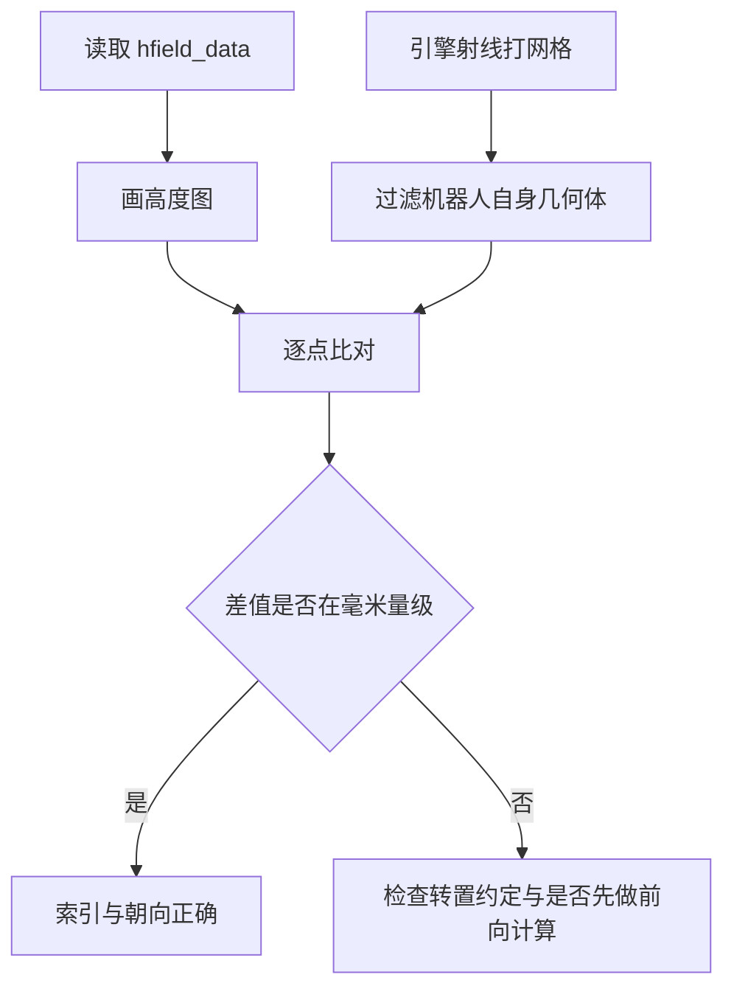
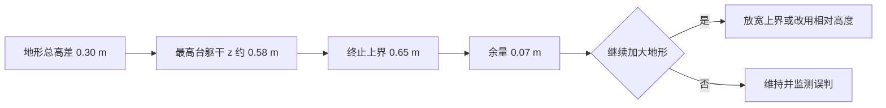

# 地形校验与耦合点复核

换地形之后最容易出问题的往往是与地形耦合的那些量，而不是地形本身：机器人落地高度、终止判据、足端高度奖励、接触数量。这些量在平地场景里有固定取值，地形抬升之后它们不再成立，但代码不会报错，只会让训练慢慢跑偏。素材仓库的做法是为每个耦合点配一个探针脚本，把「改地形」变成「跑一组固定检查」。

素材明确标注为未修的问题不影响地形本身的物理合法性，但会直接影响训练目标，动手训练之前必须先处理。

## 生成器的自检输出

生成器在写文件之前打印一组统计（`mjx-go1-getup/sim/gen_terrain.py`）：网格分辨率与格距、起伏幅度与滤波尺度、台阶高度与台地数、阶梯条数与级数、种子、高度最小值与最大值与均值、原点高度、最大坡度。

其中两条是硬判据。第一条是原点高度必须约等于零（`gen_terrain.py`）：

$$
h(0, 0) \approx 0
$$

不满足时 reset 的落地高度会与平地不一致，机器人会穿地或悬空。第二条是最大坡度与足端半径的对比（`gen_terrain.py`）：坡度由相邻格差除以格距算得，脚本同时打印足端半径 2.3 cm 与格距。格距远大于足端半径时足端近似落在单个格子上，采样误差小；两者接近时需要关注足端跨格造成的接触抖动。

自检输出可以用 dry_run 开关只打印不写文件（`gen_terrain.py`），调参阶段用它快速预览地形统计而不覆盖现有资产。

## 四类校验脚本的分工

素材仓库为地形准备了一组探针脚本，分布在两个工作区。按用途分类如下：

| 脚本 | 行数 | 职责 |
| --- | --- | --- |
| probe_terrain_recalib | 192 | 换地形后的耦合点重标定，覆盖 pos.z、终止阈值、接触溢出、奖励耦合四项 |
| probe_terrain_robust | 154 | 物理健壮性：是否 NaN、是否接触溢出、平地策略在新地形上的基线表现 |
| probe_terrain_layout | 89 | 只用引擎射线打网格调查实际布局，不依赖任何索引假设 |
| plot_terrain_heightmap | 100 | 直接用高度场数据画高度图，并与引擎射线逐点核对 |
| probe_terrain_scan_jax | 168 | 纯 JAX 解析高度采样器，验证并敲定行列朝向 |
| bench_terrain | 94 | 高度场与平地的单步物理耗时基准 |

这组脚本覆盖了「位置对齐、数值稳定、布局正确、采样正确、性能可接受」五个方面。它们是脚本而非测试框架，需要手工执行并读输出；脚本路径与用途在实验记录的地形一节开头集中列出（`experiment-log.md`）。

## 高度图可视化与逐点核对

高度场数据可以直接读出并画图，不需要引擎渲染。核对方式是把数据画出的高度与引擎射线扫描的高度逐点比对，差值来自两种求值的差异：数据画图用双线性插值，射线用三角面片求交（`experiment-log.md`）。

素材给出的对照样本如下（`experiment-log.md`）：

| 位置 | 射线高度 | 数据高度 | 差值 |
| --- | --- | --- | --- |
| 点 (1.5, -3.6) | 0.1186 | 0.1200 | 0.0014 |
| 点 (-4.0, 4.4) | 0.3000 | 0.3000 | 0.0000 |
| 点 (3.0, -3.6) | 0.2819 | 0.2800 | 0.0019 |
| 点 (-4.0, 5.5) | 0.3000 | 0.3000 | 0.0000 |
| 点 (5.0, 1.0) | 0.0055 | 0.0094 | 0.0039 |

差值都不超过 4 毫米，且最高点处完全一致。核对时有一个操作要点：射线打在原点会命中机器人自身，必须按几何体编号过滤，否则会得到看起来像「高度算错」的结果（`experiment-log.md`）。

## 足端高度奖励与地形的耦合

足端高度奖励用足端的世界 z 与一个固定目标比较，目标是 0.08 m（`scene_mjx_terrain.xml`）。平地场景下这个设计成立：地面高度为零，足端抬高到 0.08 m 就是抬腿。地形最高抬到 0.30 m 之后，站在高处的足端世界 z 本来就超过 0.08 m，拖地惩罚几乎归零。

素材给出的量化影响是：高度大于等于 0.08 m 的部分占地形高度范围的 73%，在这些区域策略可以拖地而不受罚，于是会学到「在高处拖地」（`scene_mjx_terrain.xml`）。这属于奖励定义问题，与泛化能力无关，地形越大越严重。修法在实验记录里给出：把足端高度改为相对足下地形高度的量，而不是世界绝对 z（`scene_mjx_terrain.xml` 指向实验记录第十六节）。重标定脚本把这一项列为四项必查之一，并注明训练前必须处理（`RLcontroller_go1/sim/probe_terrain_recalib.py`）。

同类耦合还包括落脚点检测与滑移判据：这些判据若也使用世界 z 或平地假设，都需要随地形改动复核。素材只明确标注了足端高度这一项，其余按通用做法处理。

## 终止阈值随地形抬升的余量

终止判据里的躯干高度区间是 0.22 到 0.65 m，取的是躯干绝对 z（`scene_mjx_terrain.xml`）。地形总高差 0.30 m 时，站在最高台上的躯干 z 约为 0.58 m，距上界只剩 0.07 m。继续加大地形就必须放宽上界或改用相对足底平面的高度，否则「爬高」会被终止判据误判为「摔倒」（`scene_mjx_terrain.xml`）。

重标定脚本把这条列为第二项必查，并给出误判机理：站在 30 cm 台阶顶时躯干上浮约 0.30 m，逼近甚至越界，于是爬高被当作摔倒（`RLcontroller_go1/sim/probe_terrain_recalib.py`）。这条余量只有 0.07 m，是全套耦合点里最紧张的一项。

## 接触溢出与约束预算的排查

高度场每个几何体对最多生成 50 个接触，超过会截断并打印警告（`scene_mjx_terrain.xml`）。排查方式是看仿真的接触计数：当前地形的接触数峰值是 11，而约束上限设为 256，因此没有溢出（`scene_mjx_terrain.xml`）。接触数峰值随地形坡度与高差上升，改地形后需要重新观察。

接触溢出与约束预算是两个相关但不同的量：接触对数量受 50 的上限约束，总约束数受 njmax 约束。素材记录了约束溢出（nefc overflow）的后果：越界写入会破坏广义加速度与传感器数据，进而让奖励变成 NaN、参数爆炸（`experiment-log.md`）。同一份记录里统计过全程零次溢出与零次 NaN 是数值稳定的判据（`experiment-log.md`）。

排查顺序建议先看接触数峰值是否逼近 50，再看总约束数是否逼近 njmax，最后确认 NaN 护栏是否在持续触发。稳健性探针脚本把「是否 NaN」与「是否接触溢出」列在前两项，并把平地策略在新地形上的表现作为基线（`RLcontroller_go1/sim/probe_terrain_robust.py`）。

## 已知未修问题与素材冲突

素材里明确标注为未修或有冲突的问题如下：

| 问题 | 位置 | 影响 |
| --- | --- | --- |
| 足端高度奖励用世界 z 对固定 0.08 m 结算 | `scene_mjx_terrain.xml` | 高处拖地不罚，训练前必须处理 |
| 终止阈值余量仅 0.07 m | `scene_mjx_terrain.xml` | 继续加大地形会误判爬高为摔倒 |
| 场景头注释称有 rocky 贴图材质 | `scene_mjx_terrain.xml` | 资产块实际只有棋盘材质 groundplane |
| 基准脚本文档称地形是卡顿根因 | `RLcontroller_go1/sim/bench_terrain.py` | 与实验记录的地形不比平地慢结论冲突 |
| 标定数值出现两组 | `experiment-log.md` 与 `scene_mjx_terrain.xml` | 0.2760 对 0.2777 的平地基准不同 |

这五条里前两条影响训练，必须处理；后三条属于文档与记录的一致性问题，读到时应按有实测数据的一方取用，并在改动时顺手订正注释。按任务约定，凡素材没有给出实现的处置（例如落脚点检测是否也依赖地形高度）都按通用做法处理，正文会明确标注。

## 小结

### 核心概念

- 生成器自检包含原点高度约等于零与最大坡度对比两条硬判据，可用 dry_run 预览。
- 校验脚本覆盖位置对齐、数值稳定、布局正确、采样正确与性能五个方面，需要手工执行读输出。
- 高度图与引擎射线逐点核对的差值在 4 毫米以内，来自双线性插值与三角面片求交的差异。
- 足端高度奖励用世界 z 对固定 0.08 m 结算，地形抬高后在高处失效，必须改为相对足下地形高度。
- 终止阈值的躯干绝对 z 上界余量仅 0.07 m；接触数峰值 11 相对上限 256 有充足余量，nefc 溢出会破坏奖励。

### 设计权衡

| 选择 | 带来的能力 | 付出的代价 |
| --- | --- | --- |
| 为每个耦合点配探针 | 改地形后可复核 | 需要手工执行并读输出 |
| 用绝对高度做奖励与终止 | 实现简单、与平地一致 | 地形抬升后语义失效 |
| 用相对足下高度 | 与地形无关的语义 | 需要在线采样地形高度 |
| 格距取大 | 避开接触溢出 | 地形细节减少 |
| 保留已知问题的注释 | 后来者可追溯 | 文档与实现存在已知偏差 |

## 练习

### 基础题

1. 列出生成器自检的两条硬判据，并说明不满足时的后果。
2. 说明高度图与引擎射线核对时差值来源，以及过滤机器人自身几何体的必要性。
3. 解释足端高度奖励在地形抬升后为什么失效，给出量化依据。

### 挑战题

4. 设计一套换地形后的完整检查清单，按必查项与可选分档，并给出每项的判据与预期输出。
5. 把足端高度奖励改为相对足下地形高度，给出在线采样位置与实现成本估算。
6. 分析终止阈值余量只剩 0.07 m 时的风险，设计一种用相对足底平面高度替代绝对 z 的方案。

## 附：本页引用的路径

| 路径 | 用途 |
| --- | --- |
| `mjx-go1-getup/sim/gen_terrain.py` | 生成器自检输出与 dry_run |
| `mjx-go1-getup/models/go1/scene_mjx_terrain.xml` | 耦合点与已知问题注释 |
| `mjx-go1-getup/docs/experiment-log.md` | 实验记录：脚本清单、物理与卡顿、溢出后果、采样核对 |
| `RLcontroller_go1/sim/probe_terrain_recalib.py` | 重标定脚本（脚本开头列出四项必查） |
| `RLcontroller_go1/sim/probe_terrain_robust.py` | 稳健性脚本（脚本开头列出必查项） |
| `RLcontroller_go1/sim/probe_terrain_layout.py` | 引擎射线布局探针 |
| `RLcontroller_go1/sim/plot_terrain_heightmap.py` | 高度图绘制与核对 |
| `~/mujoco` | 素材仓库根，正文中素材路径均相对该根 |
