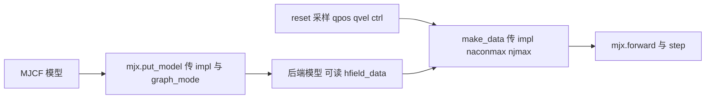
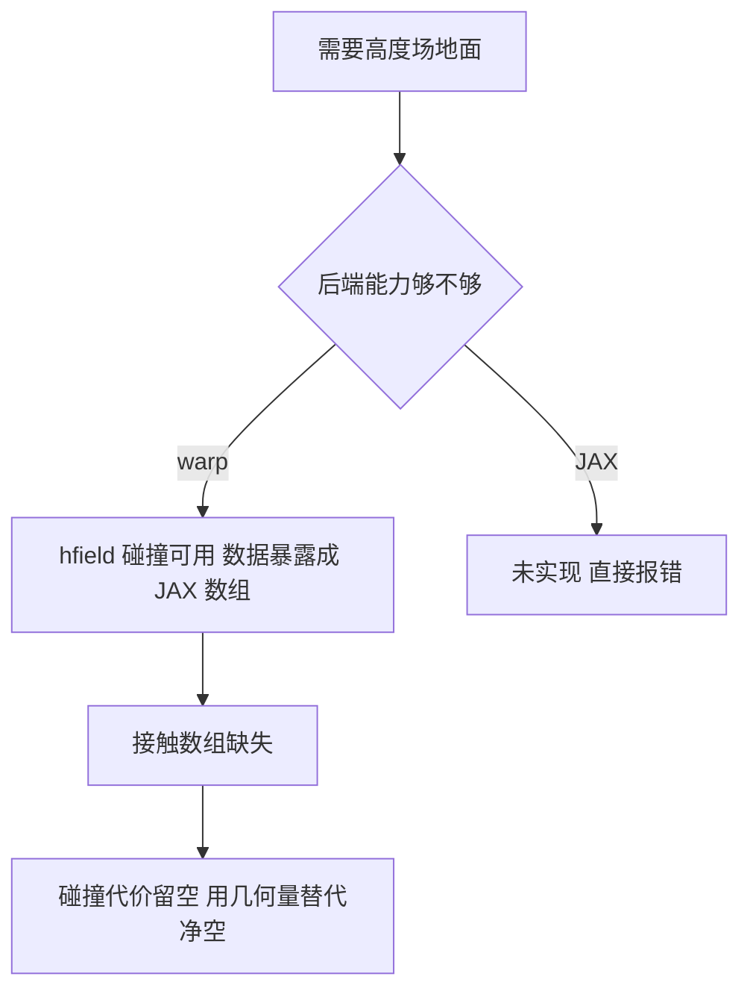

# warp后端的选择与数据接口

MJX 有两条执行路径。一条是纯 JAX 实现，仿真逻辑写成 JAX 算子，靠 jit 与 vmap 跑在 GPU 上；另一条是 warp 后端，仿真内核用 NVIDIA warp 编写，通过 FFI 从 JAX 调用。同一个 MJCF 模型在两条路径上的能力并不相同，这一点在平地训练时不太明显，一旦把机器人放到程序化地形上就会立刻暴露。

这个项目的地形是高度场，而纯 JAX 后端不支持高度场碰撞，会直接抛出未实现错误。后端的选择在这一步就被锁死：必须用 warp。选定之后，模型加载、数据构造、求解器参数与可用字段都跟着换了一套约定。

## 后端选择：为什么必须用 warp

环境的配置里写死了后端（`envs/go1_walk.py:319` 附近）：

$$
\text{impl} = \text{"warp"}
$$

这条配置的注释解释了原因：高度场碰撞在纯 JAX 后端没有实现，只有 warp 的碰撞驱动支持 HFIELD 类型，并且把高度场数据暴露成 JAX 数组，供训练循环做解析采样。项目在实验记录里记录了确认过程：把模型转成 warp 后端后，模型对象上能看到高度场数据、行列数、尺寸与地址等字段，而 JAX 后端在建模型阶段就会报未实现（`mjx-go1-getup/docs/experiment-log.md:1626-1631`）。

后端选择还影响观测脚本能拿到什么。warp 后端的 Data 对象没有接触数组字段，碰撞代价函数是空实现。选后端时的取舍是：要么接受 warp 的字段缺失，在需要接触信息时换用别的量（例如几何体最低点高度）；要么放弃高度场地形。项目选择了前者（`envs/go1_walk.py:1520-1600` 附近的注释）。

## 模型与数据的构造路径

环境初始化分两步。第一步把 CPU 侧的模型转换成后端模型（`envs/go1_walk.py:440-447`）：

$$
\text{mjx.put\_model}(\text{mj\_model}, \; \text{impl}, \; \text{graph\_mode})
$$

第二步在每个 episode 重置时构造数据对象（`envs/go1_walk.py:835-845`）：

$$
\text{mjx\_env.make\_data}(\text{model}, \; qpos, qvel, ctrl, \text{impl}, \text{naconmax}, \text{njmax})
$$

两个容量参数都在第二步传入，并且都以字符串形式传后端的名称（`envs/go1_walk.py:840`）。数据构造的签名里同时出现 impl 与两个容量上限，说明容量是数据侧的属性而不是模型侧的属性，换环境数量时需要重新构造数据。

构造数据时传给 make_data 的后端字符串来自后端模型自身（«envs/go1_walk.py:840»）：

$
\text{impl} = \text{model.impl.value}
$

从模型反向读回而不是直接复制配置，好处是配置与模型不可能出现不一致。若直接写配置里的字符串，一旦 put_model 因为条件判断落回默认后端，数据侧仍会按配置构造，两边的后端就不一致了。这类不一致在建数据时会报错或产生难以定位的行为差异，用模型自身的取值可以避免。

graph_mode 只在 warp 后端下有意义，环境在传入前做了一个条件判断：只有 impl 是 warp 且配置里给了非空值时，才去取枚举成员并传给 put_model（`envs/go1_walk.py:440-447`）。这样默认配置下走 MJX 自己的默认行为，不会因为传了空值而出错。

## 求解器与接触模型配置

warp 后端下的求解器参数有独立的默认值。配置里的迭代次数设为 2，注释写明这是 warp 后端软接触收敛的实测值（`envs/go1_walk.py:76` 附近）。软接触是 MJX 迭代求解器下的默认选择，因为硬接触在迭代次数不足时不容易收敛。

硬接触在项目里也被启用过，配置为足端硬接触关闭软接触，并单独给出硬接触的迭代次数与线搜索次数（`envs/go1_walk.py:77-84`）。注释记录了诊断结论：迭代 20 与 100 的沉降高度、残差与随机动作结果逐位一致，因此取 20 可以省下两到三倍时间。

软接触另有线搜索次数的配置，硬接触也有自己的线搜索次数（«envs/go1_walk.py:76-84»）。迭代次数在 warp 里是内核循环的展开次数，直接决定每步耗时，因此这两组参数不能照搬 CPU 求解器的经验值，需要按后端实测确定。项目对硬接触的做法是先用较大的迭代次数确认结果收敛到与参考实现一致，再把次数压到结果不再变化的下界。

足端几何体的接触参数在初始化时被逐点覆写：四个足端几何体的 solimp 被设为同一组值，condim 设为 3（`envs/go1_walk.py:433-437`）。这解释了地形场景里为什么必须保持地面 priority 为 0：地面与足端不同级时，生效的是足端一侧的 condim 与摩擦设置，这套参数就是策略训练时的接触语义。

## warp后端缺失的字段与替代做法

warp 后端的 Data 对象没有接触数组，也没有外力数组。项目在两处依赖接触信息的奖励与观测上遇到了这个问题，并给出了替代做法。

第一处是碰撞代价：函数体是空实现，权重也设为 0（`envs/go1_walk.py:1562` 附近）。原因写得直接：warp 后端的数据里没有接触数组，无法按接触力复刻这项惩罚。

第二处是地形净空。项目需要「身体最低点相对脚下地面的高度」，做法是不读接触数组，而是求世界系最低点再减去该点脚下的地形高度（`envs/go1_walk.py:500-510` 附近）。地形高度用解析双线性采样得到，因此整条链路可以留在 jit 里。

这两处替代做法的共同点是把接触信息换成几何量。接触数组给出的是求解结果，几何量给出的是位姿关系，二者在站立与摔倒的判别上足够用，但无法表达接触力的大小。需要接触力的奖励项在这个后端下只能放弃或改写。

数据构造完成后立刻调用一次前向计算把派生的量填好，并把时间归零（«envs/go1_walk.py:848-852»）。参考实现没有单独的沉降段，重置即开始，初始瞬态交给策略自己处理；这是针对 12 kg 量级机器人的选择，更大质量的平台需要单独的沉降步骤。

warp 求解器在极端自碰撞下可能发散，环境里有 NaN 护栏，把非有限值回填成有限值并终止该 episode（«envs/go1_walk.py:934» 附近）。护栏是兜底而不是解决方案：如果它每步都在触发，说明物理已经崩了，需要回到容量参数与接触设置上排查。项目把「全程零次溢出与零次 NaN」作为数值稳定的判据。

## 与JAX后端的能力对照

| 能力 | warp 后端 | JAX 后端 |
| --- | --- | --- |
| 高度场碰撞 | 支持，走凸包路径 | 未实现，建模型即报错 |
| 高度场数据暴露 | 暴露成 JAX 数组，可解析采样 | 不可用 |
| 引擎射线打高度场 | 支持（引擎侧实现完整） | 射线的分发表里没有 HFIELD |
| 接触数组与外力 | 数据对象里没有 | 未核对 |
| CUDA graph 捕获 | 支持，有五种模式 | 不支持该配置 |
| 本项目用途 | 训练与观测 | 未使用 |

表里最后一行的未使用是按仓库现状描述，不代表 JAX 后端不可用，它在平地上的走路任务里是另一条可选路径（按 MJX 手册，本仓库未采用该路径做地形训练）。

纯 JAX 后端并非没有用武之地。平地场景不需要高度场碰撞，也不需要在训练循环里采样地形高度，此时两条路径的能力差就只剩下字段与性能，选择取决于训练规模与已有脚本的兼容性。项目的地形训练一旦启用就锁定 warp，而平地阶段的走路任务在哪个后端上跑对结论没有影响（按 MJX 手册，本仓库的平地训练默认配置同样指向 warp）。

## 小结

### 核心概念

- 高度场碰撞只在 warp 后端实现，纯 JAX 后端建模型即报未实现，因此地形训练锁定 warp。
- 模型与数据分两步构造：put_model 接收 impl 与 graph_mode，make_data 接收 impl、naconmax 与 njmax。
- warp 默认用软接触与 2 次迭代，硬接触迭代 20 次与 100 次结果逐位一致。
- 足端几何体的 solimp 与 condim 在初始化时被覆写，这决定了地面 priority 必须保持 0。
- warp 后端的数据对象没有接触数组与外力，碰撞代价留空，地形净空改用最低点减地形高度的几何做法。

### 设计权衡

| 选择 | 带来的能力 | 付出的代价 |
| --- | --- | --- |
| 用 warp 后端 | 高度场碰撞与数据暴露 | 绑定后端，字段少于完整实现 |
| 用软接触 | 迭代求解器下容易收敛 | 与 CPU 硬接触语义不同 |
| 硬接触配 20 次迭代 | 物理对齐参考实现且省时 | 需要单独诊断验证 |
| 用几何量替代接触 | 可留在 jit 内 | 无法表达接触力大小 |
| 容量参数随环境数传 | 显存可控 | 换环境数要重构数据 |

## 练习

### 基础题

1. 说明为什么这个项目的地形训练必须用 warp 后端，JAX 后端会在哪一步失败。
2. 写出模型与数据的构造调用，指出两个容量参数在哪一步传入。
3. 解释足端 condim 被覆写与地面 priority 保持 0 之间的关系。

### 挑战题

4. 设计一种在 warp 后端下估算足端接触力的替代方案，说明与真实接触力的偏差来源。
5. 比较软接触与硬接触在站立稳定性上的差别，给出你的迭代次数选择与验证方法。
6. 分析两个容量参数不随环境数调整时会出现的问题，给出按环境数计算容量的公式。

## 附：本页引用的路径

| 路径 | 用途 |
| --- | --- |
| `mjx-go1-getup/envs/go1_walk.py` | 环境配置：后端与容量（:319、:76-96）、模型构造（:440-447）、数据构造（:835-845）、足端接触参数（:433-437）、缺失字段的替代做法（:500-510、:1520-1600） |
| `mjx-go1-getup/docs/experiment-log.md` | 后端能力对照与高度场数据暴露（:1601-1646） |
| `mjx-go1-getup/models/go1/scene_mjx_terrain.xml` | 地面几何体与 priority 约束 |
| `~/mujoco` | 素材仓库根，正文中素材路径均相对该根 |
