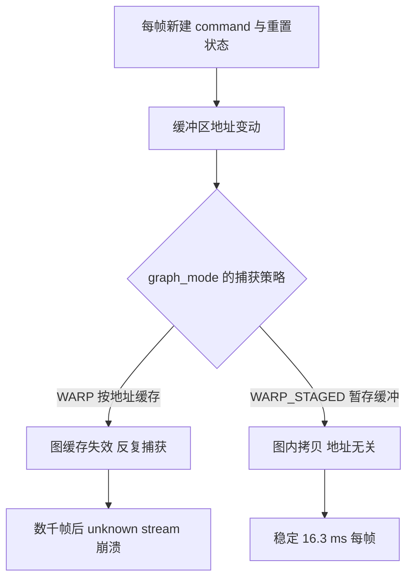

# CUDA graph与graph_mode

把仿真跑在 GPU 上时，每一步都要向 GPU 提交一串内核，提交本身的开销会累积成可观的固定成本。CUDA graph 把这一串内核录制下来，之后按同样的顺序重放，省掉重复的提交与调度。MJX 在 warp 后端下自动做了这件事，但录制与重放有一个前提：参与计算的显存地址在重放时保持不变。

训练脚本满足这个前提，交互式查看器不满足。查看器的循环里每帧新建指令数组，按一次重置键就换一整套状态，地址一直在变。地址一变，录下来的图就用不上，引擎只能重新录制，反复录制最终会撞上流对象失效而崩溃。这一段是项目里排查成本最高的性能问题之一。

## CUDA graph缓存的是什么

MJX 在 warp 后端下把仿真内核包成 CUDA graph，配置字段 graph_mode 决定捕获策略，默认值是 WARP（`envs/go1_walk.py:320-339` 附近的注释）。默认模式的语义在 warp 的 JAX FFI 文档里写得很清楚：

> capture the graph and replay it for matching buffer addresses

也就是录制一次、遇到地址匹配的缓冲区就直接重放。重放的前提是地址不变，这正是训练与观测两条路径表现不同的根源。

项目的文件头记录过这项优化的收益：训练步时从 25.9 ms 降到 14.8 ms（`envs/go1_walk.py:336-339` 附近）。这个数量级说明图缓存对训练吞吐有决定性影响。

## 训练侧为什么安全

训练循环里状态数组是复用的，并且用 jit 的 donate 语义把输入缓冲区交出去复用（`envs/go1_walk.py:336-338` 附近）：

$$
\text{jax.jit}(\text{donate\_argnums} = 0)
$$

固定地址加上稳定的调用序列，图缓存每次都能命中。项目在实验记录里把这条列为训练侧不受影响的依据，并特别强调不能为了查看器去改训练配置（`experiment-log.md:3976-3990`）。

代价是 donate 语义下循环里复用的固定数组会被 JAX 判定为已删除，需要使用方每帧重建或者干脆不捐赠（`RLcontroller_go1_moreinformation/观测器脚本撰写指南.md:100-107`）。查看器选择每帧重建三维指令数组，开销可以忽略，这个选择反而保证了地址会变、必须换模式。

## 观测循环里的地址变动

查看器的主循环有两处会改变缓冲区地址（`experiment-log.md:3979-3985`）：

| 来源 | 频率 | 后果 |
| --- | --- | --- |
| 每帧新建 command 数组并写入 info | 每帧 | 图缓存失效，重新捕获 |
| 按重置键或摔倒触发重置 | 每几百帧 | 整套状态换地址，重新捕获 |

地址反复变动会让引擎反复录制。录到一定次数后流对象失效，报出的错误是 warp 捕获开始阶段的运行时错误，项目实测崩在第 2125 帧（`experiment-log.md:3985-3989`）。这类崩溃的特点是跑几千帧才出现，短时间试跑看不出来。

## 五种graph_mode的实测对比

项目用一个模拟查看器循环的探针脚本做了对照，循环模式与真实查看器一致：每帧新建 command、每 300 帧重置一次，各跑 3000 帧（`experiment-log.md:3991-4002`）：

| graph_mode | 步时 | 结果 |
| --- | --- | --- |
| NONE | 139.0 ms/帧 | 不崩但慢 |
| JAX | 预热即崩 | 无法建子图节点 |
| WARP（原默认） | 185.5 ms/帧 | 探针下不崩，真实查看器几千帧后崩 |
| WARP_STAGED | 16.3 ms/帧 | 不崩 |
| WARP_STAGED_EX | 57.3 ms/帧 | 不崩 |

WARP_STAGED 的机制是引入一块暂存缓冲区，把数据在图内用一次拷贝搬进去，因此图本身不依赖外部缓冲区的固定地址，专为地址会变的场景设计。它比默认模式快约十一倍，同时解决了崩溃（`experiment-log.md:4000-4004`）。

这份对照表也说明了探针跑不崩不等于真实场景不崩：WARP 在探针里 3000 帧没有崩，在真实窗口里崩了。项目在总结里把这条教训写成「代理指标与真实场景不一致时以真实场景为准」（`experiment-log.md:4090-4100` 附近）。

## 配置字段与调用路径

修复方式是在环境配置里加一个 graph_mode 字段，默认留空表示沿用 MJX 默认，训练行为不变；查看器显式传 WARP_STAGED（`envs/go1_walk.py:339` 与 `experiment-log.md:4004-4005`）。环境初始化时按需把字符串转成枚举成员（`envs/go1_walk.py:440-447`）：

$$
\text{getattr}(\text{GraphMode}, \; \text{配置值})
$$

命令行入口也各自暴露了这个参数：训练脚本、评估脚本与查看器脚本都有 graph_mode 选项，默认值与用途不同（`train/train_getup.py:137`、`sim/eval_getup.py:66`、`sim/view_go1.py:256`）。查看器另有几处把它固定在 WARP_STAGED 并打印出来（`sim/watch_v20_fast.py:318-324`、`sim/eval_stairs.py:53`）。

项目从两次回归里总结出一条交付检查：写完观测脚本后逐个 grep 关键配置，因为真实发生过「文档写了、代码没写」的情况，表现就是每帧重新捕获加几千帧后崩溃（`docs/viewer-guide.md:110-120` 附近）。

## 一进程两环境的相互干扰

与地址缓存同源的另一类问题是同一进程里建多个环境。对照实验时如果一个进程先后建两个环境，后一个环境的 step 会命中前一个录制的图，现象是地形里机器人完全不动或者平地里莫名翻身，而且同一段代码换个进程跑就正常（`观测器脚本撰写指南.md:463-471`）。

这类问题的判断成本很高，因为症状看起来像物理或策略问题。规避规则很直接：一个进程只建一个环境，做 A/B 对照用两个进程。项目为此单独写了一个在独立进程里追踪物理量的脚本。

## 预热与首帧暂态

换用 WARP_STAGED 之后还有一段与图无关的暂态。查看器刚开窗口时，编译、首次捕获与驱动初始化都挤在前几十帧里，实测早期一帧可以到 373 ms，稍后自行降到 14.9 ms（`experiment-log.md:4160-4176` 附近）。

做法是在打开窗口之前把主循环的同一段调用序列先跑一遍，让编译与首帧开销在还没有窗口时结清（`experiment-log.md:4170-4176`）。项目实测预热 150 帧后，窗口出现的第一条日志就是约 28 fps，到第 100 帧升到 50 fps，不再出现几百毫秒的段。预热必须走同一个帧函数，否则编译的是另一条调用路径。

同一批实验还测出策略前向 jit 与 eager 的差别：jit 稳定省下约 11 ms 每帧，且与冷热状态无关（`experiment-log.md:4145-4160` 附近的对照表）。交互式循环里每个按帧调用的 JAX 计算都应该 jit，这条与 graph_mode 是两件独立的事，不能互相替代。

## 小结

### 核心概念

- MJX 在 warp 后端把仿真内核包成 CUDA graph，默认模式按缓冲区地址匹配来重放录制的图。
- 训练循环地址稳定，图缓存命中，是 25.9 ms 降到 14.8 ms 的主要来源。
- 观测循环每帧新建指令数组并在重置时换状态，地址反复变动，默认模式会反复捕获并在数千帧后崩溃。
- WARP_STAGED 用暂存缓冲区加图内拷贝，地址无关，实测 16.3 ms 每帧且不崩，是查看器的正确选择。
- 同一进程建两个环境会按地址命中对方的图，表现为物理异常；规则是一进程一环境，预热要放在开窗口之前。

### 设计权衡

| 选择 | 带来的能力 | 付出的代价 |
| --- | --- | --- |
| 训练保持默认 WARP | 图缓存命中、吞吐最高 | 依赖地址稳定的调用方式 |
| 查看器用 WARP_STAGED | 地址变动下稳定且快 | 多一次图内拷贝 |
| 配置里留空表示默认 | 两种用途共用一份环境代码 | 依赖调用方记得显式设置 |
| 开窗口前预热 | 首帧即接近稳态 | 启动时间增加 |
| 一进程一环境 | 避免图串味 | 对照实验要起两个进程 |

## 练习

### 基础题

1. 说明 CUDA graph 重放的前提，以及训练与观测在这一点上的差别。
2. 列出五种 graph_mode 的实测步时与结果，指出查看器应该用哪一种。
3. 解释为什么一个进程只应该建一个环境。

### 挑战题

4. 设计一种在不改变训练配置的前提下让查看器稳定运行的做法，说明每一步的收益与代价。
5. 分析探针不崩但真实窗口崩的原因，设计一个更能代表真实循环的探针。
6. 说明预热为什么必须在打开窗口之前、且必须走同一个帧函数。

## 附：本页引用的路径

| 路径 | 用途 |
| --- | --- |
| `mjx-go1-getup/envs/go1_walk.py` | graph_mode 字段与实测对照注释（:320-339）、枚举转换与模型构造（:440-447） |
| `mjx-go1-getup/docs/experiment-log.md` | 崩溃根因与五种模式实测（:3976-4005）、帧率定位（:4010-4030）、策略 jit 对照（:4145-4160）、预热（:4160-4176） |
| `mjx-go1-getup/docs/viewer-guide.md` | graph_mode 一节与交付检查清单（:84-120、:423-450） |
| `RLcontroller_go1_moreinformation/观测器脚本撰写指南.md` | 每帧耗时构成（:16-38）、graph_mode 一节（:72-107）、一进程两环境（:463-471） |
| `mjx-go1-getup/train/train_getup.py`、`sim/eval_getup.py`、`sim/view_go1.py` | 各命令行入口的 graph_mode 参数 |
| `~/mujoco` | 素材仓库根，正文中素材路径均相对该根 |
