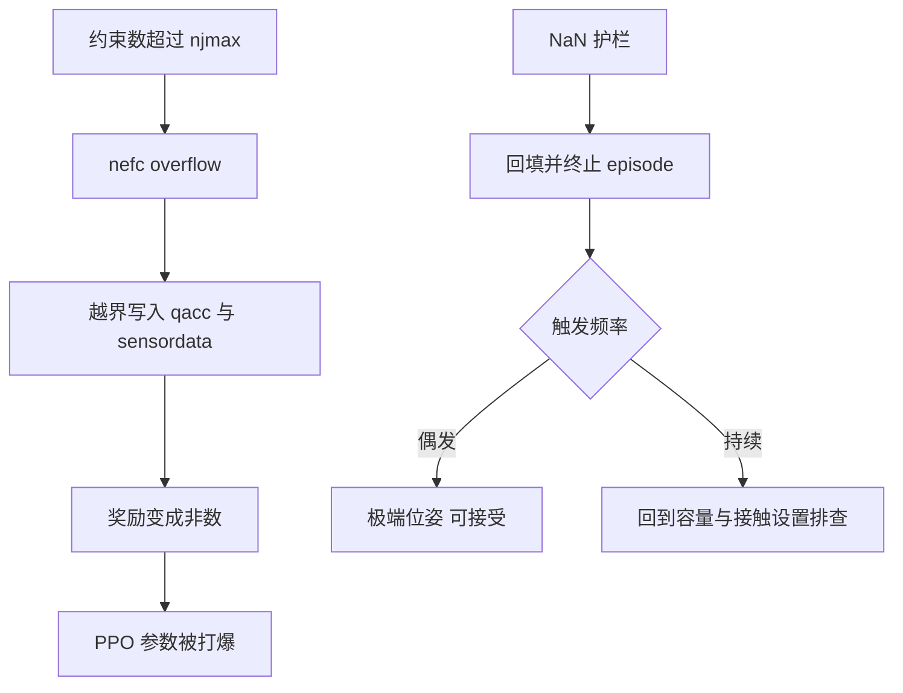
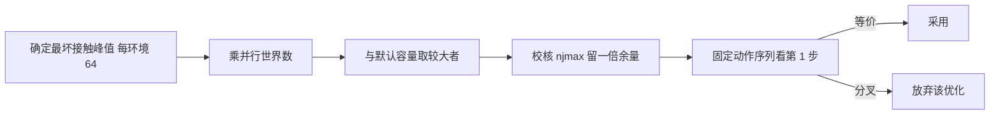

# 容量参数与数值边界

GPU 批量仿真要在编译期确定数组大小，因此接触与约束的存储必须预留容量。容量给少了，超出部分被截断或越界写入；给多了，显存与带宽被白白占用。MJX 把这件事拆成两个参数：一个管接触槽，一个管约束数。两个参数都不随仿真进程自动增长，改环境数量或改地形都必须重新核对。

这套容量语义在 warp 后端下还有一处容易误读的地方：接触槽是所有并行世界共享的一池，而不是每个世界各占一份。按「每环境多少接触」去估算容量会把总量算错一个数量级，轻则在环境数变大时越界，重则让奖励变成非数、训练参数被打爆。以下按两个参数各自的语义、实测峰值与选择方法展开。

## 两个容量参数的分工

两个参数在构造数据时一起传入（`envs/go1_walk.py:835-845`）：

| 参数 | 管什么 | 越界的后果 |
| --- | --- | --- |
| naconmax | 接触槽总数 | 接触被截断，物理行为改变 |
| njmax | 约束数上限 | nefc overflow，越界写入破坏状态 |

naconmax 的单位是接触个数，njmax 的单位是标量约束行数。同一对几何体产生的接触会展开成多行约束，因此 njmax 通常比 naconmax 小得多。两者不是同一量的两种写法，改地形时都要单独检查。

默认值写在环境配置里：naconmax 取 8 乘 8192，njmax 取 256（`envs/go1_walk.py:85-96`）。配置注释把这两条的选择依据都写下来了，下文分别展开。

## naconmax是全体world共享的

配置注释直接引用了依赖库的类型定义：naconmax 是全体 world 共享的最大接触数，并且库的输入输出层有一条断言（`envs/go1_walk.py:85-88`）：

$$
\text{naconmax} \ge \text{ncon} \times \text{nworld}
$$

默认值 8 乘 8192 等于 65536，意思是当并行世界数是 8192 时，每个世界平均只有 8 个接触槽。注释里还给了对照：playground 的 Go1 例子用的是 4 乘 8192。把这两个数并列，是想说明 8 已经是偏保守的取值，继续调大主要是在买余量而不是买速度。

实测的峰值说明了余量有多大。在 768 环境的配置下，走路的接触数峰值是 2369 个，起身躺地时是 3700 个，都是全局量（`envs/go1_walk.py:88-91`）。换算成每世界约 4.8 个接触，相对 65536 的容量在 768 环境下有大约 85 个每世界的余量。

容量调大在速度上没有收益。项目实测把 65536 调到 32768 或 49152，步时没有差异，只是省内存与带宽（`envs/go1_walk.py:91-92` 与 `experiment-log.md:4176-4182`）。这条结论把容量选择变成了纯粹的显存问题。

库层的那条断言是硬性的：容量小于模型在给定世界数下的接触数上限时，构造数据阶段就会失败，而不是在运行中静默丢接触。因此容量不足有两种表现，一种是断言失败看得见，另一种是断言通过但实际接触数超过预留，后者只会在某些位姿下出现，表现为偶发的物理异常。

单环境观测脚本的处境比较特殊：并行世界数是一，默认容量远远用不完，但也不必改小。观测脚本的原则是复现训练物理，容量属于物理的一部分，改它会改变求解顺序。观测脚本因此沿用训练侧的默认容量，宁可多占显存也不冒改变动力学的风险。

## 接触峰值的实测口径

接触峰值随任务变化很大，不能用一个任务的数据去配另一个任务。项目里差别最大的一组是走路与起身：走路峰值 2369，起身躺地峰值 3700，而起身姿势池脚本的注释给出了更细的数字——躺地时每个环境约 33 个接触（`sim/make_getup_posepool.py:37-38`）。

这个 33 与前面的 4.8 并不矛盾：4.8 是全局峰值除以环境数的平均值，33 是躺地瞬间单个环境的局部峰值。容量要按最坏情况配，因此姿势池脚本按 64 个每环境预留，并且取 8 乘 8192 与 64 乘环境数中的较大者（`sim/make_getup_posepool.py:50`）：

$$
\text{naconmax} = \max(8 \times 8192, \; 64 \times \text{envs})
$$

这个写法同时满足了大批量与小批量两种情形：环境数少时用默认容量，环境数多时按每环境 64 个接触放大。项目诊断脚本也把两个容量都做成命令行参数，便于扫描（`sim/probe_nefc.py:30-46`）。

## njmax与nefc溢出

njmax 的默认值从 64 提到 256，原因是硬接触加上摔倒在地时的自碰撞会让约束数超过 64（`envs/go1_walk.py:93-96`）。溢出的表现是越界写入，而不是警告后丢弃：广义加速度与传感器数据被写坏，奖励随之变成非数，PPO 的参数被打爆。项目把这一条列为早期几次训练崩溃的共同根因之一。

实验记录里对这条错误的解释做过单独澄清：把 nefc overflow 当成「只是警告、warp 会丢弃溢出约束」是错的，实际会写坏状态（`experiment-log.md:407` 附近）。这条记录与「全程零次 nefc overflow、零次 NaN」的稳定性判据互相呼应（`experiment-log.md:35` 与 `:311`）。

容量配好之后仍要留护栏。环境里有 NaN 护栏，把非有限值回填并终止该 episode（`envs/go1_walk.py:934` 附近）。护栏触发频率是诊断信号：偶尔触发说明遇到了极端位姿，持续触发说明容量或接触设置已经不够。

## 容量变更为什么改变物理

容量看起来只影响存储，实际上会改变计算结果。项目测过一次看起来白捡的优化：把 naconmax 从 65536 降到 2048、1024、512，单环境步时从 14.94 ms 降到 12.28 ms，省了 18%（`experiment-log.md:4160-4182`）。

用固定动作序列跑 500 步对比轨迹后，这个优化被否决：

| naconmax | 与默认的最大偏差 | 第 1 步偏差 |
| --- | --- | --- |
| 2048 | 8.88e-01 | 1.67e-03 |
| 1024 | 4.23e-01 | 未给出 |
| 512 | 5.19e-01 | 7.81e-03 |

关键在第 1 步就已经分叉，偏差量级远超单精度浮点的舍入误差，随后被混沌放大到半米。机理是接触数组的容量改变了求解器内部的求和与排序顺序，物理不再等价（`experiment-log.md:4176-4182`）。

判据因此定为看第 1 步：后期差异可能来自混沌放大，不能当作证据。这条经验对所有容量与缓冲区相关的优化都适用——要省资源，先证明物理等价。

## 按环境数选容量

综合以上实测，容量选择可以按四步做。先确定任务的最坏接触峰值，起身躺地取每环境 64 个接触；再乘以并行世界数得到总量，并与默认容量取较大者；然后按约束行数的峰值校核 njmax，留出至少一倍余量；最后用固定动作序列对比第 1 步，确认物理等价。

按这条流程，地形训练时还要额外考虑高度场带来的接触增长。地形让足端在坡面上更容易同时接触多个格子，接触数峰值会上升，项目在新地形下的接触数峰值是 11，相对 njmax 的 256 仍有充足余量（`models/go1/scene_mjx_terrain.xml:44-46`）。

## 小结

### 核心概念

- naconmax 管接触槽总数、njmax 管约束行数，两者都在构造数据时传入，越界后果不同。
- naconmax 是全体 world 共享的一池，约束条件是最坏接触数乘以并行世界数，默认值 8 乘 8192。
- 实测接触峰值在 768 环境下走路 2369、起身躺地 3700，按每环境 64 个接触预留可以覆盖躺地情形。
- njmax 从 64 提到 256，因为硬接触加倒地自碰撞会超过 64，溢出会越界写入并让奖励变成非数。
- 调小 naconmax 可以省时间但会改变物理，第 1 步就分叉，必须在固定动作序列下验证等价。

### 设计权衡

| 选择 | 带来的能力 | 付出的代价 |
| --- | --- | --- |
| 容量按最坏峰值预留 | 不截断、不越界 | 显存占用偏高 |
| 容量取默认的较大者 | 大批量小批量都安全 | 小批量时容量偏大 |
| 调小容量 | 显存与带宽下降 | 物理可能不再等价 |
| 提高 njmax | 约束不溢出 | 每步求解开销上升 |
| 保留 NaN 护栏 | 崩溃可恢复并留下信号 | 需要人工判读触发频率 |

## 练习

### 基础题

1. 说明 naconmax 与 njmax 各自管什么，以及越界时的后果差别。
2. 用每环境 64 个接触的规则计算 1024 个并行环境需要的 naconmax，并与默认值比较。
3. 解释为什么容量改变会让物理不再等价，判据为什么看第 1 步。

### 挑战题

4. 设计一份容量选择表，覆盖走路、起身、地形三类任务与两档环境数。
5. 用固定动作序列设计一套物理等价校验流程，给出判据与阈值来源。
6. 分析 njmax 从 256 继续提高的收益与代价，给出按接触峰值推算 njmax 的方法。

## 附：本页引用的路径

| 路径 | 用途 |
| --- | --- |
| `mjx-go1-getup/envs/go1_walk.py` | naconmax 与 njmax 的默认值及注释（:85-96）、数据构造（:835-845）、NaN 护栏（:934） |
| `mjx-go1-getup/docs/experiment-log.md` | nefc 溢出的澄清（:407）、稳定性判据（:35、:311）、被否决的容量优化（:4160-4182） |
| `mjx-go1-getup/sim/make_getup_posepool.py` | 躺地时每环境接触数与容量公式（:37-50） |
| `mjx-go1-getup/sim/probe_nefc.py` | 两个容量的扫描诊断入口（:30-46） |
| `mjx-go1-getup/models/go1/scene_mjx_terrain.xml` | 地形下的接触数峰值与约束余量（:44-46） |
| `~/mujoco` | 素材仓库根，正文中素材路径均相对该根 |
