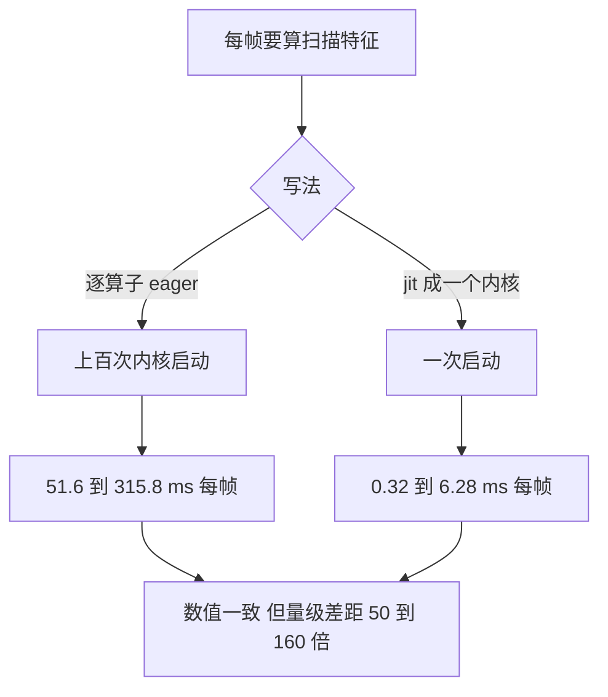
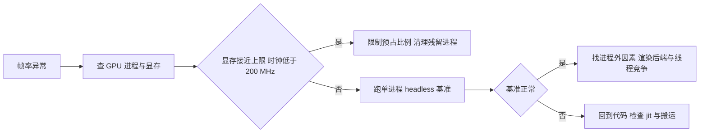

# 性能排查与观测脚本口径

训练跑在无人值守的批处理里，观测脚本却是交互式的：它要一边推物理、一边把状态搬回 CPU 画图、一边响应按键。这套流程里每一步都可能成为瓶颈，而症状又高度相似：帧率低、步时高。项目在这个环节吃过几次误判的亏，包括把显存打满读成物理变慢、把未 jit 的绘图计算当成地形开销。

排查的关键是先建立一个能出数的基准，再按进程外、指标本身、代码的顺序找原因。以下给出每帧耗时的构成、几处已经被实测确认的修复、以及一张症状对照表。表里的数字都来自素材的实测记录，机器与配置不同时数值会变，但量级和判别顺序可以照搬。

## 每帧耗时构成

观测脚本每帧的执行顺序与耗时大致如下（`RLcontroller_go1_moreinformation/观测器脚本撰写指南.md`）：

| 步骤 | 耗时 | 说明 |
| --- | --- | --- |
| 组指令 | 约 0 ms | 但会改变缓冲区地址，牵动图缓存 |
| 策略前向 | eager 11.0 ms / jit 0.08 ms | 差距来自 Python 侧调度开销 |
| 物理一步 | 13 到 15 ms | WARP_STAGED 下的稳态值 |
| 搬 qpos 与 qvel 回 CPU | 0.2 ms | 搬整个 Data 时变成 1.13 ms |
| CPU 前向灌入可视化 | 0.2 ms | — |
| 自绘扫描点 | 3.5 ms | 必须 jit 成一个内核 |
| 交给渲染线程 | 2.4 ms | 只是数据交接，绘制不在这里 |
| 节流 | 补足到控制周期 | 无条件 sleep 会白等 |

优化前实测 373 ms 每帧、约 3 fps，优化后 19.5 ms 每帧、约 50 fps。差值几乎全部来自策略前向、物理步与扫描计算三处，与地形或物理本身无关。

这张表里有两项与前一单元讲的图缓存直接相关：组指令会改地址，因此查看器必须用 WARP_STAGED；节流是补足到控制周期而不是固定 sleep，慢帧不应该再叠加等待。

## 按帧调用的JAX计算必须jit

扫描点计算是差距最大的一项。项目对两种写法做了 A/B 测试，各测两轮（`experiment-log.md`）：

| 写法 | 每帧耗时（两轮） |
| --- | --- |
| 逐算子 eager | 51.6 ms / 315.8 ms |
| jit 成一个内核 | 0.32 ms / 6.28 ms |

两轮比值落在 50 到 160 倍之间，绝对值随机器状态波动，关键是量级差异。两种写法的数值结果一致，最大差小于 5e-07，说明快的写法没有牺牲正确性。

原因在启动次数。eager 写法每帧要在 Python 侧按顺序发起一百多个小内核，每个都有启动开销与同步；jit 合并成一个内核后只有一次启动。交互式循环里没有批处理的摊销，这类固定开销会按帧数累加。

修复方式是把采样点位置、地面高度与高度特征合成一个函数并加 jit，然后在预热阶段先调用一次让编译结清（`experiment-log.md`）。策略前向同理，jit 后稳定省下约 11 ms 每帧（`experiment-log.md`）。

## 数据搬运与同步的最小化

从 GPU 取数据回 CPU 时，只搬渲染需要的量。项目对比过两种做法：用通用接口把整个 Data 对象搬回来，与只搬 qpos 与 qvel 两个数组（`观测器脚本撰写指南.md`）：

| 搬运内容 | 耗时 |
| --- | --- |
| 整个 Data（含 65536 个接触槽的数组） | 1.13 ms |
| 只搬 qpos 与 qvel | 0.02 ms |

差五十倍以上。Data 对象里包含按容量上限分配的接触数组，搬它是为几十个字节的有效数据付出整块传输。这条与前一单元的容量语义呼应：容量给大是为了物理正确，代价必须用最小搬运来抵消。

同步的时机也要注意。计时点应放在数据已经落到 CPU 之后，否则测到的是异步发起的耗时。项目在性能日志里把搬运、同步与扫描分开计时，就是为了在症状出现时能指出哪一段异常。

## 显存预占与假慢

有一类慢与代码无关。XLA 默认会预占约 75% 的显存，在 8 GiB 卡上单进程就要约 6 GiB。一旦出现第二个 GPU 进程（上一个查看器没关、并发的训练或评估），显存被打满，GPU 无法保持高频，单步从 15 ms 涨到 300 到 550 ms（`观测器脚本撰写指南.md`）：

| 场景 | 显存 | 时钟 | 帧耗时 | 帧率 |
| --- | --- | --- | --- | --- |
| 单进程 | 未打满 | 1500 MHz 以上 | 15.7 ms | 63.7 fps |
| 双进程默认预占 | 7674 / 8192 MiB | 180 MHz | 306.9 / 32.4 ms | 3.3 / 30.8 fps |
| 双进程限制预占 | 未打满 | 正常 | 27.1 / 27.1 ms | 36.9 / 36.9 fps |

中间那行还有一个误导性：两个进程通常只有一个被饿死，另一个仍有 30 fps，因此症状是「我这个查看器莫名其妙只有 3 fps」，而不是两个都慢。修复是在导入 jax 之前限制预占比例，查看器取 0.25，评估与诊断脚本取 0.3 到 0.55，训练侧取 0.80（`观测器脚本撰写指南.md`）。

判别的指纹有两个：显存使用接近上限，以及 GPU 的时钟掉到 200 MHz 以下。看到这两个信号就应该先查进程，而不是读代码。WSL 里的负载均值看不出异常，必须用显存与时钟查询。

## 渲染后端与CPU抢核

渲染侧的慢另有来源。查看器日志里的 render 一项只有 2 点几毫秒，那是数据交接的耗时，实际绘制在查看器自己的线程里，不在这段计时内（`experiment-log.md`）。

在无独立显卡直通的 WSL 环境里，渲染会落到软件光栅化实现上，占满 CPU 并抢走 JAX 的调度线程。项目实测离屏渲染与地形分辨率无关，n 从 16 到 128 都是约 108 ms，平地也一样，因此渲染慢不能用高度场来解释（`experiment-log.md`）。可用的对策是给渲染指定硬件驱动路径，或限制软件渲染使用的线程数。

判别顺序是先确认 GPU 没有别的进程在抢，再看指标本身是否代表目标场景，最后才怀疑代码。项目在这条顺序上踩过两次：先怀疑图模式，补上 WARP_STAGED 后反而更慢，因为真因仍在；又怀疑地形让物理变重，实测地形 9.5 ms 比平地 10.9 ms 还快（`experiment-log.md`）。

## 排查顺序与症状对照

项目把常见症状与首选怀疑对象整理成一张表（`观测器脚本撰写指南.md`）：

| 症状 | 首选怀疑 |
| --- | --- |
| 步时几百毫秒但 render 只有 2 ms | 显存打满或 CPU 抢核 |
| 步时 300 到 550 ms 且分项都正常 | 显存打满，残留进程加 XLA 预占 |
| GPU 时钟低于 200 MHz 或显存接近上限 | 同上 |
| 跑几千帧后崩 unknown stream | graph_mode 应设 WARP_STAGED |
| 早期帧慢、之后自行恢复 | 窗口暂态，用预热消除 |
| 帧率低但各项分项都不高 | 节流逻辑无条件 sleep |
| 观测形状不符 | 环境开关与训练不一致 |
| 改小缓冲区后变快但行为变了 | 物理不再等价，弃用 |

最后两行分别对应观测脚本必须与训练同档、以及任何省资源的改动都要先证明物理等价。项目为此给观测脚本留了一份交付清单，逐项包括策略前向是否 jit、图模式是否设置、预占比例是否限制、按帧计算是否合成一个内核、是否只搬必要数据、维度是否断言一致（`观测器脚本撰写指南.md`）。

## 小结

### 核心概念

- 观测脚本每帧的耗时集中在策略前向、物理步与按帧计算三处，优化前 373 ms、优化后 19.5 ms。
- 按帧调用的 JAX 计算必须 jit 成一个内核，eager 写法要发起上百次内核启动，慢 50 到 160 倍而结果一致。
- 从 GPU 搬数据只搬 qpos 与 qvel，搬整个 Data 会慢五十倍以上。
- XLA 默认预占约 75% 显存，第二个 GPU 进程会让单步涨到 300 到 550 ms，指纹是显存接近上限且时钟低于 200 MHz。
- render 计时只是数据交接，软件渲染占 CPU 会抢走 JAX 调度线程；排查顺序是先查进程、再查指标、最后查代码。

### 设计权衡

| 选择 | 带来的能力 | 付出的代价 |
| --- | --- | --- |
| 按帧计算全部 jit | 内核启动次数降到一次 | 需要预热并管理编译 |
| 限制显存预占 | 多进程并发不再塌方 | 单进程可用显存变小 |
| 只搬必要数据 | 搬运耗时降五十倍 | 需要明确列出渲染所需字段 |
| 用硬件渲染路径 | 不抢 CPU 核 | 依赖驱动与平台支持 |
| 保留分项计时 | 症状可定位到具体步骤 | 日志与代码略增 |

## 练习

### 基础题

1. 列出观测脚本每帧的主要步骤与耗时，指出优化前后差异来自哪几步。
2. 说明按帧计算 jit 与 eager 的耗时差距与原因，以及结果是否一致。
3. 描述显存打满的两个判断指纹与对应的修复方式。

### 挑战题

4. 为一个新的观测脚本设计性能日志格式，要求能在症状出现时定位到进程外因素。
5. 设计一套单进程 headless 基准，说明它包含哪些步骤以及如何用它隔离进程内因素。
6. 分析软件渲染抢核的作用机理，给出两种缓解方案与各自的验证方法。

## 附：本页引用的路径

| 路径 | 用途 |
| --- | --- |
| `RLcontroller_go1_moreinformation/观测器脚本撰写指南.md` | 每帧耗时构成、jit 与搬运、显存预占、交付清单与症状表 |
| `mjx-go1-getup/docs/experiment-log.md` | 扫描计算 A/B、策略 jit 对照、渲染与地形代价 |
| `mjx-go1-getup/docs/viewer-guide.md` | 显存预占与排查顺序 |
| `mjx-go1-getup/envs/go1_walk.py` | 容量与后端配置 |
| `~/mujoco` | 素材仓库根，正文中素材路径均相对该根 |
