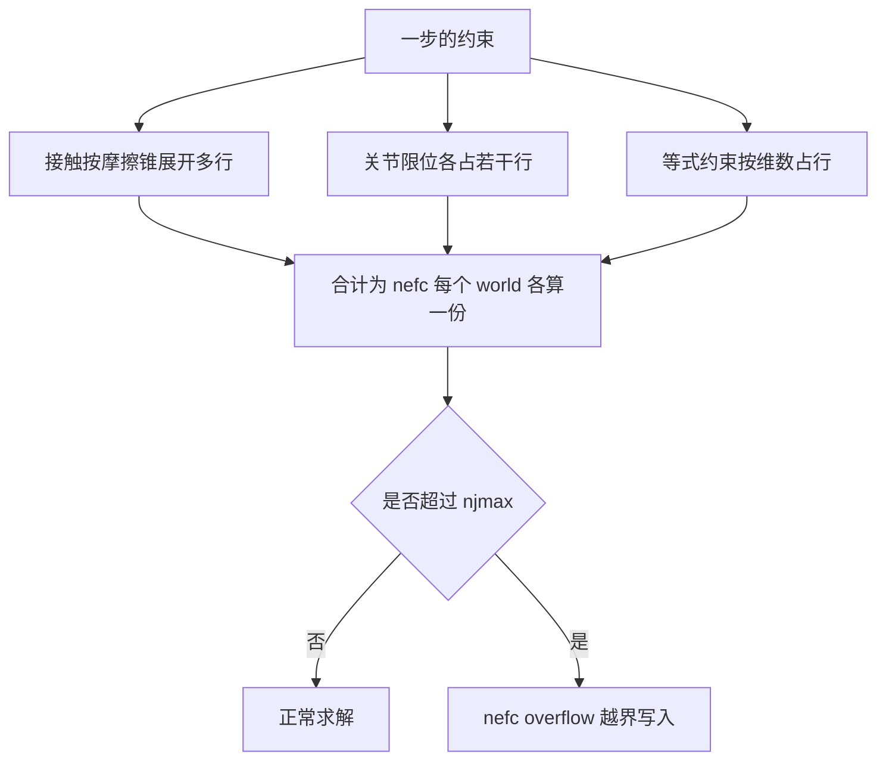
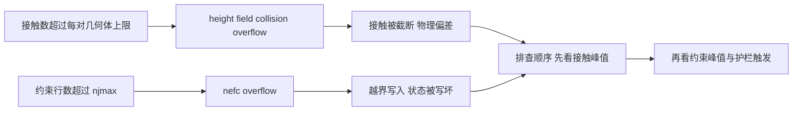

# 约束行数与njmax

训练跑了几百万步之后突然爆出非数，参数一夜间变成 NaN，回看日志只有一行告警：约束数超过上限。这类崩溃不来自奖励设计也不来自超参，而是求解器的一元一次不等式系统装不下当前位姿产生的约束。项目在 v5、v7、v9 三个版本上都撞过同一堵墙，直到把预算从 64 提到 256 并补齐护栏才稳定下来。

要理解这堵墙在哪里，需要先知道约束行数由什么组成、上限是按整个世界算还是按所有并行世界一起算、以及为什么摔倒这个动作会让行数暴涨。这些问题清楚了，容量该给多少就是一个可以估算的量，而不是反复试出来的数。

## 约束行数是什么

物理引擎把接触、关节限位与等式约束统一写成一组线性互补条件，求解器每一步要解的就是这组条件。每个接触按摩擦锥展开成若干行，每个关节限位贡献一行或几行，等式约束按其维数贡献行数（按 MuJoCo 手册的约束模型，本仓库未逐行核对引擎实现）。

约束行数的总量在引擎里叫做 nefc。它和接触个数不是一回事：一个接触可以展开成多行，因此 nefc 通常大于接触数。项目里两个参数分别设了预算，接触数由 naconmax 管，约束行数由 njmax 管（`envs/go1_walk.py:85-96`）。

行数随位姿变化。悬空站立时只有足端接触，行数低；四肢同时着地、躯干压在地面上时，接触数与每接触的行数同时上升。这正是摔倒动作的特点，也是后面几篇反复出现的场景。

## njmax是每个world的上限

一个容易搞错的点是两个容量参数的计数范围不同。接触槽是全体并行世界共享的一池，而约束行数上限是按每个世界分别计算的（`sim/probe_nefc.py:1-10` 与 `sim/probe_handover.py:209-215`）：

| 参数 | 计数范围 | 默认值 | 语义 |
| --- | --- | --- | --- |
| naconmax | 全体 world 共享 | 8 乘 8192 | 所有世界加起来的接触槽 |
| njmax | 每个 world | 256 | 单个世界一步内允许的约束行数 |

这个差别决定了两个参数的估算方式。naconmax 要按并行世界数放大，njmax 不用：给 768 个并行世界训练时，每个世界的约束行数上限都是 256，而不是把 256 平均分给 768 个世界。项目在探针脚本的文件头专门加粗写了这一条（`sim/probe_nefc.py:4`）。

按错范围估算的后果不对称。把 njmax 当成共享池会严重高估预算，以为 256 够用而实际每个世界都很紧张；把 naconmax 当成每世界容量则会低估总量，在并行世界数变大时越界。

## 64为什么不够

走路任务的默认预算最初是 64。这个数在平地走路的大部分时间里够用：四足交替支撑，接触数不多，约束行数离 64 有富余。问题出现在摔倒。

摔倒在地时躯干、大腿、小腿互相挤压，自碰撞约束随之暴涨；硬接触又把每个接触的行数抬高。项目记录的告警信息是引擎直接给出建议值（`experiment-log.md:187-193`）：

$$
\text{nefc overflow} - \text{please increase njmax to } 66 / 69 / 72
$$

从 66 到 72 的建议值说明超出量并不大，但已经足够触发越界写入。项目在 v3 的长测里就见过这条告警（建议值 67 与 68），当时判断为不影响站立测试而搁置，事后确认这个判断是错的（`experiment-log.md:302-306`）。

v10 把预算提到 256，并把这一步用到的所有字段一起回填、奖励再套一层有限性检查，5.14M 步全程零次溢出（`experiment-log.md:197-199` 与 `:311`）。提到 256 而不是 128，是因为起身任务比走路更密集，预留的余量要覆盖躺地姿态。

## 溢出告警的形态

溢出不是静默的，引擎会打印一行告警并给出建议的 njmax。但它的严重性容易被低估：告警之后求解结果里有一部分写入超出了预留的数组范围，被写到相邻字段上（`experiment-log.md:404-408`）。

项目把两种常见的错误理解并列记了下来（`experiment-log.md:405-408`）：

| 错误判断 | 实际情况 |
| --- | --- |
| 溢出只是警告，warp 会丢弃溢出约束，无碍 | 会写坏广义加速度与传感器数据，奖励变成非数，参数被打爆 |
| njmax 取 64 够用 | 摔倒自碰撞需要超过 64，提到 256 后零告警 |
| v5 的非数是因为缺少观测归一化 | v10 不归一化、5.14M 步无 NaN，真因是溢出加护栏不全 |

溢出出现的时机带有随机性。项目在 v6 与 v7 两轮同配置长测里，一个 7.9M 步没有出现非数，另一个 6.29M 步出现了非数，差异来自摔倒姿态的随机分布（«experiment-log.md:306-310»）。短测漏掉这类问题很正常，容量必须按最坏姿态而不是按某一次长测的结果来配。

告警的建议值只反映当下这一步的超限量，不能当作长期容量。它出现一次就说明最坏情况已经越过预算，容量应当按任务的最坏姿态估算而不是按告警建议值加一点。

## 与接触上限的分工

两个容量参数要一起核对，但排查顺序不同。接触数超过 50 个每几何体对的上限时，引擎截断接触并打印另一条告警；约束行数超过 njmax 时是越界写入。前者丢的是接触，后者毁的是状态（`models/go1/scene_mjx_terrain.xml:18-22` 与 `experiment-log.md:187-193`）。

项目在不同环境上给了不同的预算，可以看出一套惯例：走路 256，起身相关工具 768，地形上的起身待办提到 2048（`envs/go1_walk.py:93-96`、`sim/make_getup_posepool.py:49`、`envs/go1_getup_residual.py:75`、`experiment-log.md:6495-6505`）。

| 环境 | njmax | 依据 |
| --- | --- | --- |
| 走路 | 256 | 摔倒自碰撞峰值超过 64 |
| 起身工具 | 768 | 躺地姿态约束更密集 |
| 地形上的起身 | 待提到 2048 | 单 world 实测约 1300 |
| 对照配置 | 250 | 某一轮对比实验的取值 |

探针脚本刻意用随机动作而不是训练策略来跑，目的是让姿态分布更宽、更容易覆盖到最坏情况（«sim/probe_nefc.py:18-25»）。容量核对要按这种宽分布来做，策略跑出来的狭窄分布只能说明常见情况下够用。

「待提到」与「实测约 1300」这两项在最后一篇展开，那里还有一个反直觉的结论：预算不足会造成裁剪，但并不是训练发散的原因。

## 小结

### 核心概念

- nefc 是一步内约束行数总量，由接触按摩擦锥展开的行、关节限位行与等式约束行组成，通常大于接触个数。
- njmax 是每个 world 的约束行数上限，naconmax 是全体 world 共享的接触槽，两者计数范围不同。
- 走路预算最初是 64，摔倒自碰撞会越过它，引擎告警给出的建议值是 66 到 72。
- 溢出的后果是越界写入而非丢弃约束，会写坏广义加速度与传感器数据，让奖励变成非数。
- 项目按任务给预算：走路 256、起身工具 768、地形上的起身待办 2048，接触上限与约束上限要分开核对。

### 设计权衡

| 选择 | 带来的能力 | 付出的代价 |
| --- | --- | --- |
| 提高 njmax | 约束不溢出、状态可信 | 每步求解的存储与计算上升 |
| 按最坏姿态估算预算 | 摔倒时不触发告警 | 平时存在闲置余量 |
| 按告警建议值加余量 | 改动最小 | 下一次姿态更极端时仍会溢出 |
| 把 njmax 当共享池估算 | 显得预算充足 | 估算严重偏离实际 |
| 接触与约束分开核对 | 定位到具体哪一类溢出 | 需要两套观测口径 |

## 练习

### 基础题

1. 说明 nefc 由哪些项组成，以及它与接触个数的关系。
2. 对比 njmax 与 naconmax 的计数范围，说明按错范围估算会有什么后果。
3. 复述溢出告警的形态，并说明为什么它不能当作长期容量依据。

### 挑战题

4. 为一个新的四足起身任务估算 njmax，写出从最坏姿态到预算的推导过程。
5. 分析为什么接触溢出与约束溢出的排查顺序要先接触后约束。
6. 设计一组实验，验证把 njmax 从 256 提到 768 是否只在摔倒姿态下产生差异。

## 附：本页引用的路径

| 路径 | 用途 |
| --- | --- |
| `mjx-go1-getup/envs/go1_walk.py` | 两个容量参数的定义与注释（:85-96） |
| `mjx-go1-getup/sim/probe_nefc.py` | njmax 每 world 语义与探针用法（:1-46） |
| `mjx-go1-getup/sim/probe_handover.py` | per-world 上限的说明与可配置 njmax（:209-228） |
| `mjx-go1-getup/docs/experiment-log.md` | 根因 5（:185-199）、4.3 节（:302-311）、错误判断（:404-408） |
| `mjx-go1-getup/sim/make_getup_posepool.py`、`envs/go1_getup_residual.py` | 起身相关环境的 njmax 取值 |
| `mjx-go1-getup/models/go1/scene_mjx_terrain.xml` | 接触上限与地形接触峰值 |
| `~/mujoco` | 素材仓库根，正文中素材路径均相对该根 |
