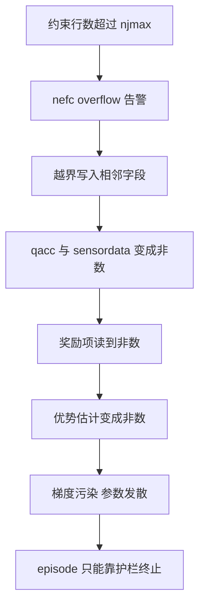
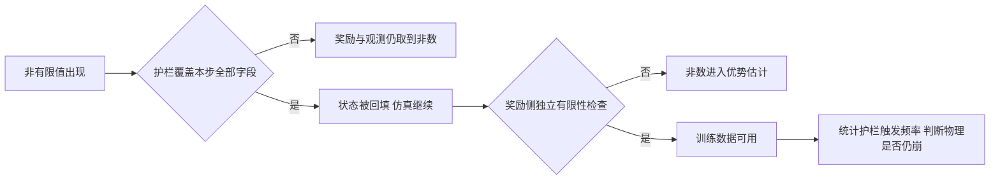

# 溢出为什么会写坏状态

约束预算不足的后果比告警文本严重得多。引擎打印一行建议值之后继续往下算，但这一步的部分写入已经落到预留数组之外，被写到相邻的字段上。这些字段里包含广义加速度与传感器数据。它们既是奖励的输入，也是观测的输入，于是错误从求解器内部一路传到优势估计，最后把网络参数打爆。

这条链路上每一环都可以单独加护栏，但护栏只覆盖自己知道的那几个字段。项目第一次加护栏时只回填了位置与速度，遗漏了奖励与观测实际读取的另外几个字段，于是非数照样从奖励进入训练，崩溃照旧。漏掉的是广义加速度与传感器数据这两类数组，它们既进观测也进奖励，只回填位置与速度挡不住非数进入优势估计。

## 越界写入的连锁

从溢出到参数被打爆的路径可以拆成四段（`envs/go1_walk.py:93-96` 与 `experiment-log.md:187-199`）：

| 阶段 | 发生了什么 |
| --- | --- |
| 求解 | 约束行数超过 njmax，引擎打印告警 |
| 写入 | 超出预留范围的写入落到相邻字段 |
| 状态 | 广义加速度与传感器数据变成非数 |
| 训练 | 奖励读到非数，优势变成非数，参数发散 |

关键在第三段：广义加速度与传感器数据不是内部临时量，它们会被奖励函数与观测拼装读取。奖励里凡是依赖接触力、执行器力或传感器读数的项都会取到非数，观测里的位姿矩阵与执行器力同样如此。项目在根因分析里把这一段写得很具体（`experiment-log.md:193-199`）。

一旦非数进了奖励，后续的广义优势估计、价值目标与梯度会全部被污染。这一步的污染无法靠裁剪挽救，因为裁剪只改变数值大小而不改变有限性。参数被打爆之后，后续所有步的输入都是非数，episode 只能靠护栏终止。

容量不能在运行期增长，这是溢出的结构性原因。warp 后端的数组大小在编译期确定，njmax 决定了约束相关数组的维度；某一时刻的约束数超过这个维度时，引擎没有临时扩容的办法，只能按已分配的布局继续写。因此溢出必须靠事前估算避免，不能当成可以延后处理的告警。

这也解释了为什么告警建议值只差几个就足以造成崩溃。越界写入的距离不需要很大，只要越过一个字段的边界，相邻字段的值就被覆盖，而这个字段可能正是奖励要读的量。

## 护栏只回填两个字段为什么不够

v8 版本加过一层护栏，做法是把非有限的位置与速度回填成有限值。这两个字段是最直观的，因为它们直接出现在状态里。但奖励与观测读取的字段不止这两个（`experiment-log.md:195-197`）：

| 使用方 | 读取的字段 |
| --- | --- |
| 奖励 | 广义加速度、执行器力、传感器数据 |
| 观测 | 位姿矩阵、执行器力 |
| 状态 | 位置、速度 |

只回填位置与速度，等于只堵住了状态这一条路；奖励与观测仍然会取到被写坏的字段。项目在根因记录里把这条写成护栏没挡住，非数从奖励进优势估计，参数被打爆（`experiment-log.md:195-199`）。

正确的覆盖范围是这一步用到的所有字段。这句话听起来宽泛，实际做法是在护栏处把数据对象里被本步读取过的字段全部列出，逐个检查有限性并回填。v10 的修复就是按这个口径做的（`experiment-log.md:197-199`）。

## 奖励侧的兜底

即使护栏覆盖完整，奖励侧还应该独立检查一次有限性。理由有两个：护栏与奖励的字段清单可能再次漂移，而奖励是唯一会把数值送进梯度的地方。项目在 v10 的修复里加的这一层兜底，就是把奖励再套一次有限性判断（`experiment-log.md:197-199`）。

这层兜底与 NaN 护栏的分工不同。护栏负责让仿真继续跑下去，奖励兜底负责让训练数据保持可用；两者都不能替代容量本身。如果护栏持续触发，说明物理已经在崩，继续训练只会积累更多被污染的样本。

环境里的 NaN 护栏在数据发散时做有限值回填并终止该 episode（`envs/go1_walk.py:934` 附近）。把它当兜底的前提是触发频率足够低，因此长测里要单独统计触发次数。

## 三个版本的长测对照

项目用同一套判定标准对比过三个版本（`experiment-log.md:306-311`）：

| 版本 | 配置要点 | 训练步数 | 结果 |
| --- | --- | --- | --- |
| v6 | 硬接触加观测归一化，njmax 仍偏小 | 7.9M | 无非数 |
| v7 | 同 v6 并修正终止判据 | 6.29M | 出现非数 |
| v10 | 硬接触、不归一化、njmax 256、全字段护栏 | 5.14M | 无非数、零溢出 |

v6 与 v7 配置几乎相同、结论相反，说明非数的出现与具体摔倒姿态有关，随机性很大。归一化在这一组对照里既不是必要条件也不是充分条件，此前把非数归因于缺少归一化的判断因此被推翻（`experiment-log.md:404-406`）。

v10 的结果给出确定的结论：把预算提到 256 并补齐护栏之后，5.14M 步全程零次溢出、零非数（`experiment-log.md:311`）。同一份记录里 v10 的效果还有一组任务侧数字：评估奖励从 0.56 升到 2094，episode 长度从 23.9 步升到 733.5 步，30 秒直行速度保持 0.492 且不摔（`experiment-log.md:219`）。这些改善与消除非数是同一件事的两面。

## 修复后的验收口径

验收要在训练规模下做。约束上限是按每个 world 计的，理论上不会因为并行世界变多而更容易溢出，但并行世界变多会扩大姿态分布的覆盖范围，更早遇到最坏姿态。单环境跑几万步没有告警，不能推出 768 环境训练也安全。

判据里的非数统计要按字段分开：位置、速度、广义加速度与奖励各自计数。合并成一个总数会掩盖是哪条链路先出问题，而修复的优先级取决于出问题的字段。

修复是否到位可以用三条判据核对（`experiment-log.md:35` 与 `:311`）：

$$
\text{溢出次数} = 0, \qquad \text{非有限值个数} = 0, \qquad \text{评估指标不再出现整段归零}
$$

第一条与第二条要在长测里统计，而不是跑几百步看一眼。第三条用评估曲线判断：如果奖励仍会整段变成常数或零，说明还有非数从别的路径进入训练。

统计口径要归一化到 world 与帧。项目在地形上的记录用的是「719 次告警 / 384k world-帧」，这个比值才能跨环境数比较；直接数告警条数会因为并行世界数与运行时长不同而失去可比性（«experiment-log.md:6415-6420»）。

同一份记录里还区分了告警次数与实际崩坏：告警说明预算被越过，是否导致非数取决于越界写入落到了哪个字段。排查时两个量都要看，只看告警会高估严重性，只看非数会漏掉已经发生的裁剪。

## 小结

### 核心概念

- 溢出的连锁是告警、越界写入、状态非数、奖励非数、优势非数、参数发散四段。
- 广义加速度与传感器数据会被奖励与观测读取，只回填位置与速度挡不住非数。
- 护栏要覆盖本步用到的所有字段，奖励侧还要独立做一次有限性兜底。
- v6 与 v7 同配置结论相反，说明非数触发与摔倒姿态随机性有关，归一化既非必要也非充分。
- v10 把 njmax 提到 256 并补齐护栏后 5.14M 步零溢出零非数，评估奖励与 episode 长度同时改善。

### 设计权衡

| 选择 | 带来的能力 | 付出的代价 |
| --- | --- | --- |
| 全字段护栏 | 非数不残留 | 代码需要跟随字段变化维护 |
| 奖励侧独立兜底 | 训练数据可用 | 多一次判断开销 |
| 只回填位置与速度 | 改动最小 | 非数仍从奖励进入训练 |
| 长测统计溢出与非数 | 判据可信 | 需要数天级训练时间 |
| 靠护栏继续训练 | 不必中断 | 物理已崩时只积累污染样本 |

## 练习

### 基础题

1. 画出从溢出到参数发散的链路，指出奖励在其中的位置。
2. 列出奖励与观测读取的字段，说明只回填位置与速度为什么不够。
3. 解释 v6 与 v7 结论相反说明了什么。

### 挑战题

4. 设计一份护栏字段清单的维护方式，避免字段变化时漏项。
5. 用评估曲线判断是否仍有非数进入训练，给出三条判据与阈值。
6. 分析护栏触发频率与物理稳定性之间的关系，给出可接受范围的确定方法。

## 附：本页引用的路径

| 路径 | 用途 |
| --- | --- |
| `mjx-go1-getup/docs/experiment-log.md` | 根因 5 与非数链路（:187-199）、4.3 节长测对照（:302-311）、错误判断（:404-408）、v10 效果（:219） |
| `mjx-go1-getup/envs/go1_walk.py` | njmax 注释（:93-96）、NaN 护栏（:934） |
| `mjx-go1-getup/sim/probe_nefc.py` | 逐字段非有限值统计口径 |
| `~/mujoco` | 素材仓库根，正文中素材路径均相对该根 |
