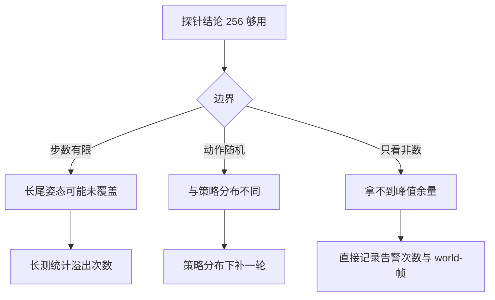

# 取证探针与训练规模余量

当训练出现退化的最优行为时，第一反应往往是奖励设计有问题。但还有一类可能：某些动作会制造大量接触，而接触会消耗约束预算，预算不足时状态被写坏，episode 被护栏提前终止，策略于是学会回避这类动作。项目怀疑起身任务里「把腿收起来用力」正是这种动作，如果假设成立，策略会退化成趴平不动。

验证这个假设需要一个专门的探针：在训练规模的并行世界数下，用宽分布的动作跑足够多的步，直接数非有限值。这类探针的价值在于把「某段日志里出现过告警」变成「在什么规模下、多少次里出现过几次」，结论才能拿去决定是否要改容量。

## 探针要回答的问题

探针脚本的文件头把假设写成了完整的因果链（`sim/probe_nefc.py:1-9`）：

| 环节 | 假设内容 |
| --- | --- |
| 动作 | 起身时收腿用力是接触最密集的动作 |
| 预算 | njmax 取 256 仍可能被这种姿态越过 |
| 后果 | 溢出导致非数，episode 被护栏终止 |
| 策略 | PPO 学会避免制造接触，退化成趴平 |

四个环节里前三个都可以在探针里测，最后一个由退化的行为本身说明。项目把这条假设列为成功率长期为零的候选真因之一，与奖励方向、动作裁剪等假设并列。

探针的设计目标因此是尽量覆盖最坏姿态，而不是复现训练。它用随机动作而不是策略输出，用最激进的初始姿态分布，都是为了把接触密度推高（`sim/probe_nefc.py:18-25` 与 `:36-42`）。

## 探针的构造与规模

探针的默认规模与训练档一致（`sim/probe_nefc.py:26-42`）：

| 参数 | 默认值 | 作用 |
| --- | --- | --- |
| njmax | 256 | 待验证的约束预算 |
| naconmax | 8 乘 8192 | 与训练一致的接触容量 |
| envs | 768 | 训练档的并行世界数 |
| steps | 300 | 每轮的步数 |
| action_std | 0.8 | 随机动作的幅度 |
| 初始姿态 | 难度、朝向随机与掉落概率全开 | 覆盖摔倒姿态 |

配置里把难度、朝向随机化与掉落概率都设成 1，意思是重置时直接把机器人放到随机姿态与随机朝向，不经过站立阶段（`sim/probe_nefc.py:37-41`）。这样开局就接近最坏情况，比从站立开始再摔倒更快覆盖躺地姿态。

实现上重置与步进都用 jit 加 vmap 并行到 768 个世界，动作由随机数生成（`sim/probe_nefc.py:47-53`）。脚本还预留了加载策略的入口，用于对照策略分布下的结果，默认不加载。

## 逐字段的计数口径

判断函数检查四个量（`sim/probe_nefc.py:55-60`）：

$$
\text{qpos}, \; \text{qvel}, \; \text{qacc}, \; \text{reward}
$$

前三项逐世界求和判断是否含非有限值，奖励单独用有限性判断。脚本同时统计三种量：每个世界在整个 300 步里是否出现过非数的累计标志、每一步有多少世界出现非数、以及 done 的累计次数（`sim/probe_nefc.py:62-88`）。

这三层计数回答不同的问题。累计标志回答「有多少世界曾经出问题」，衡量影响面；每步计数回答「问题集中在哪些步」，用于定位姿态；done 计数回答「护栏是否在兜底」，如果 done 次数与总轮数同量级，说明大部分 episode 都是被终止的而不是跑完的。

输出分两种粒度：每 50 步打印一次中间状态，结束时打印每个字段出现过非数的世界数与占比、非有限的环境步总数与占比（`sim/probe_nefc.py:83-96`）。

## 结果与解读

在 768 个世界、每个 300 步、随机动作幅度 0.8 的配置下，结果是（`docs/experiment-log.md:5734-5740`）：

$$
\text{nefc overflow} = 0, \qquad \text{非有限 qpos/qvel/qacc/reward} = 0
$$

总样本量是 768 乘 300 等于 230400 个环境步。项目据此下的结论是：njmax 取 256 在训练规模下够用，但余量很小，新环境一律给 768（`experiment-log.md:5738-5740`）。

「余量很小」这句判断的依据来自同项目其他脚本的取值：起身相关的工具把预算设成 768，也就是 256 的三倍，而这个倍数按躺地姿态的经验值留出，并非按实测峰值算出来的（«sim/make_getup_posepool.py:49» 与 «sim/probe_standability.py:88»）。探针没有给出峰值，因此这条判断只能算保守估计。

探针自身还有一处运行配置需要记录：它在导入 jax 之前把显存预占比例设成 0.45（«sim/probe_nefc.py:14-15»）。这与观测脚本常用的 0.25、训练侧的 0.80 都不同，原因是它在同一张卡上要跑 768 个世界又不能占满显存，属于按用例取值。

这条结论同时否决了前面的假设：既然 300 步宽分布下没有出现非数，那么「起身成功率长期为零」不能用 njmax 溢出解释，需要回到奖励方向与动作裁剪上找原因。项目在同一节里用另一条探针确认奖励方向本身是对的（`experiment-log.md:5740-5743`）。

## 余量的边界

这份结果有三条边界需要说明，否则容易被当成「256 在所有情况下都够」。

第一条是步数。300 步乘以随机重置的宽分布提供了不少独立样本，但它仍然是一次有限抽样；溢出是随机事件，长测里出现过就意味着分布的长尾没有覆盖到（`experiment-log.md:302-306`）。

第二条是动作来源。随机动作的分布宽但在关节空间里没有方向性，策略输出会集中在某些协同模式上，接触分布不同。探针因此只能回答「随机探索下够不够」，不能直接回答「训练到后期的策略下够不够」。

第三条是观测方式。脚本通过非有限值间接判断溢出，没有直接读取约束行数，因此无法给出「峰值离上限还有多少」这个更有用的信息。项目在地形上用另一种方式补上了这个量（见最后一篇），把告警次数与 world-帧数一起记录（`experiment-log.md:6415-6420`）。

另外记一处素材自身的不一致：脚本文件名是 probe_nefc.py，而文件头第一行写的是 probe_getup_nefc.py（`sim/probe_nefc.py:2`）。引用时以实际路径为准。

## 小结

### 核心概念

- 探针要验证的假设是起身收腿用力的动作越过 njmax，导致非数、episode 被终止、策略退化成趴平。
- 探针用 768 个并行世界、300 步、动作幅度 0.8 的随机动作，初始姿态全开随机化以覆盖躺地姿态。
- 计数分三层：每个世界是否出现过非数、每步有多少世界出现非数、done 累计次数。
- 实测 230400 个环境步内零溢出零非数，结论是 256 在训练规模下够用但余量小，新环境给 768。
- 结论的边界包括步数有限、动作分布与策略分布不同、以及只通过非数间接判断溢出。

### 设计权衡

| 选择 | 带来的能力 | 付出的代价 |
| --- | --- | --- |
| 用随机动作而非策略 | 姿态覆盖更宽 | 与真实训练分布有偏差 |
| 重置直接给随机姿态 | 更快进入最坏情况 | 省略了站立阶段的信息 |
| 逐字段分开计数 | 能定位先出问题的链路 | 输出与判读成本上升 |
| 只看非数不看行数 | 实现简单 | 拿不到峰值余量 |
| 按规模归一化 | 结果可跨配置比较 | 需要记录总样本量 |

## 练习

### 基础题

1. 写出探针要验证的假设链，指出哪一环可以在探针里测。
2. 列出探针的默认规模与参数，说明为什么初始姿态全部随机化。
3. 说明三层计数分别回答什么问题。

### 挑战题

4. 为探针增加直接读取约束行数的能力，给出实现思路与需要修改的接口。
5. 设计一轮策略分布下的对照实验，说明如何排除动作分布带来的偏差。
6. 分析余量很小的情形下应该提高容量还是调整任务设计，给出你的判据。

## 附：本页引用的路径

| 路径 | 用途 |
| --- | --- |
| `mjx-go1-getup/sim/probe_nefc.py` | 探针文件头假设（:1-9）、参数与配置（:26-42）、计数实现（:47-96） |
| `mjx-go1-getup/docs/experiment-log.md` | 探针结果与结论（:5734-5743）、告警历史与随机性（:302-306）、地形告警归一化（:6415-6420） |
| `mjx-go1-getup/envs/go1_walk.py` | 训练侧的 njmax 与 NaN 护栏（:93-96、:934） |
| `~/mujoco` | 素材仓库根，正文中素材路径均相对该根 |
