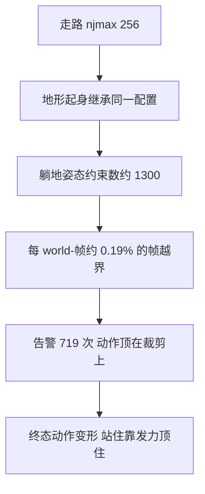
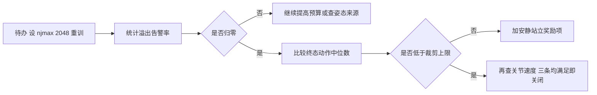

# 地形与起身任务下的约束暴涨

约束预算的取值来自具体任务的最坏姿态，换任务就要重新核对。走路任务给 256 是够的，起身任务给 256 就偏紧，地形上的起身更是把约束数推到另一个量级。项目在地形上做起身实验时，一边看到动作顶在裁剪上限上，一边看到溢出告警刷屏，两条现象都指向同一个方向：预算不足会让策略的行为变形。

但预算不足与训练发散是两件事，项目用一组对照把它们分开了。把 njmax 从 256 提到 2048，端到端的发散曲线逐点一致，说明溢出不参与发散；受影响的是终态动作的质量。这条区分决定了修复的优先级：先修发散，再把预算提上去做质量提升。

## 起身为什么比走路更密集

接触密度决定约束行数。走路时四足交替支撑，任一时刻的接触集中在少数几个足端；起身时四肢、躯干与地面同时接触，躺地姿态下每个环境约有 33 个接触（`sim/make_getup_posepool.py:37-38`）。接触按摩擦锥展开成多行约束，基数上升会直接传导到约束行数。

项目为起身相关环境留的预算因此比走路高：姿势池脚本设成 768，可站立性探针设成 768，起身残差环境也设成 768，而走路是 256（`sim/make_getup_posepool.py:49`、`sim/probe_standability.py:88`、`envs/go1_getup_residual.py:75`、`envs/go1_walk.py:93-96`）。768 是 256 的三倍，对应躺地姿态下约三倍的接触基数。

768 这个数按接触密度的比例留出，并没有从行数实测反推：躺地接触数约为走路峰值的数倍，预算同比放大一个档位。这种按比例留余量的做法比实测便宜，但余量的真实性要靠探针确认。

约束行数与接触数的换算比例取决于接触的摩擦维度。软接触与硬接触展开的行数不同，足端与躯干几何体的 condim 也不同，因此同样的接触数在不同配置下行数可以差出一截。按接触数估算预算时要把这个比例一并考虑。

地形把这件事再推高一层。坡面上足端可以同时接触多个格子，摔倒时躯干与四肢的接触面更大，约束行数进一步上升。项目在高度场地形上做起身实验时，单 world 实测约束数达到约 1300（`experiment-log.md:6415-6420`）。

## 地形摔倒时实测的约束数

地形上的记录给了两个可比较的数字（`experiment-log.md:6415-6420` 与 `:6495-6505`）：

| 指标 | 数值 |
| --- | --- |
| 单 world 实测约束数 | 约 1300 |
| 溢出告警次数 | 719 次 |
| 统计窗口 | 384k world-帧 |

换算成每 world-帧的告警率约为 0.19%。这个比例看起来不高，但它说明最坏姿态稳定地越过了 256 的预算：只要姿态分布里包含躺地，就有千分之几的帧落在预算之外。

更要紧的是预算的来源。地形上做起身的那个环境继承了走路环境的配置，njmax 保持 256，没有按起身任务重新设置（`experiment-log.md:6416-6420`）。项目在排除项一节里把这条写成隐患：实测需要约 1300，而配置给的是 256，其他起身工具都已经给了 768。

## 预算不足造成裁剪

约束溢出会写坏状态，而预算紧张还有另一种更隐蔽的影响：动作顶在裁剪边界上。项目的诊断发现起身策略在终态时动作中位数的绝对值等于裁剪上限 8.0，也就是「站住」这个行为是靠持续发力顶住实现的，而不是靠安静的站立姿态（`experiment-log.md:6500-6505`）。

这条现象与预算的关系是间接的：接触越密集，姿态越依赖用力顶住，动作越容易顶到裁剪。修复方向因此分两条，一条是把预算提上去重训，看终态动作是否不再顶裁剪；另一条是在奖励里加站立时动作要小、关节速度要小的项，让成功判据变成安静站立（`experiment-log.md:6500-6505`）。

| 修复方向 | 目标 | 验证方式 |
| --- | --- | --- |
| 提高 njmax 重训 | 不再因预算丢约束 | 溢出告警归零，终态动作脱离裁剪 |
| 奖励加安静站立项 | 站姿不靠发力维持 | 动作中位数与关节速度下降 |

两条互补：前者保证物理不被截断，后者保证策略学到的是安静的静止站姿。

## njmax不是发散的原因

项目在做交还实验时顺手排除了一项怀疑：约束预算是否参与训练发散。用同一套数据对比 njmax 取 256 与 2048 的端到端发散曲线，两条曲线逐点一致，速度范数都从 14 增长到 108（`experiment-log.md:6415-6416`）。

$$
\text{njmax} = 256 \quad \text{与} \quad \text{njmax} = 2048 \; \text{的发散曲线一致}
$$

这条对照的价值在于把两个问题分开。发散与预算无关，说明它另有来源；预算不足确实存在，但它影响的是动作质量与接触完整性，不是数值稳定性。如果混在一起改，会把预算调大之后发现发散依旧，浪费一轮训练。

判断一项改动是否影响数值稳定性，可以套用同一套方法：固定其余变量，比较两条曲线是否逐点一致。逐点一致就说明这项改动不参与该问题。

## 待办与验证方法

项目把这条留成明确的待办：给起身环境设 njmax 等于 2048 重训一版，看终态动作是否不再顶裁剪（`experiment-log.md:6495-6505`）。这条待办与「修抽搐」的解耦写在同一条记录里，说明它是质量提升而不是缺陷修复。

验证方法按三步做。第一步在重训配置里把预算设为 2048，保持其余参数不变；第二步统计溢出告警次数与 world-帧的比值，确认归零；第三步比较终态动作的中位数绝对值与关节速度，确认脱离裁剪（`experiment-log.md:6495-6505`）。

$$
\text{告警率} \to 0, \qquad \text{终态动作中位数} < \text{裁剪上限}, \qquad \text{关节速度下降}
$$

三条同时满足才算这条待办关闭。

判据里的动作中位数要看绝对值的分布，平均值不适合用作依据。动作顶在裁剪上时中位数是一个可比的稳定量，平均值会被少数未顶到上限的关节拉低。

同一条待办还要写明失败后的分支：如果提预算重训之后终态动作仍然顶在裁剪上，说明发力站姿来自奖励而不是预算，接下来要做的是奖励项改造，而不是继续提高 njmax。动作顶在裁剪上时中位数本身就是一个可比的稳定量，平均值会被少数未顶到上限的关节拉低；项目记录的 median 绝对值等于 8.0 就是这种口径（«experiment-log.md:6500-6502»）。只满足第一条说明物理不再被截断，但策略仍可能靠发力顶住；只满足后两条说明行为变好，但仍有无谓的溢出。

三条判据的取证方式都在既有脚本里：溢出告警从训练日志统计，终态动作与关节速度从评估脚本的输出里取。项目已经把这些量写在诊断结论里，接入监控只需要定时解析同一批日志（«experiment-log.md:6495-6505»）。

这条待办还要配一个监控项才能长期有效。预算调大之后不会再有告警，如果没有监控，将来换地形或改接触参数时会重新回到越界状态而没人发现。可行的做法是在训练日志里定期统计告警次数与 world-帧的比值，并在它离开零之后中止训练。

预算从 256 提到 2048 的代价主要是存储与每次求解的固定开销。约束数组按上限分配，8 倍的维度意味着这部分的显存与带宽明显上升；在 768 个并行世界下，这笔开销是否可接受要按显存余量判断，而不是默认越高越好。

## 小结

### 核心概念

- 接触密度决定约束行数：走路用 256，起身相关环境用 768，对应躺地约 33 个接触每环境。
- 高度场地形上摔倒时单 world 约束数约 1300，而地形起身环境继承了走路的 256，告警率约 0.19% 每 world-帧。
- 预算紧张的表现之一是动作顶在裁剪上限：终态动作中位数绝对值等于 8.0，站住靠发力顶住。
- njmax 取 256 与 2048 的发散曲线逐点一致，说明预算不参与训练发散，两个问题要分开处理。
- 待办是给起身环境设 2048 重训，判据是告警率归零、终态动作脱离裁剪、关节速度下降三条。

### 设计权衡

| 选择 | 带来的能力 | 付出的代价 |
| --- | --- | --- |
| 按任务设预算 | 不同任务都不被截断 | 需要逐任务核对，容易漏 |
| 沿用走路预算 | 改动最小 | 起身与地形下长期越界 |
| 提预算重训 | 物理完整、动作可能变好 | 一轮训练成本与配置改动 |
| 加安静站立奖励 | 学到真静止站姿 | 奖励项增加、需要调权重 |
| 先分清发散与裁剪 | 避免无效调参 | 需要做对照实验 |

## 练习

### 基础题

1. 说明起身任务比走路任务约束更密集的原因，并给出两档预算的具体取值。
2. 计算地形起身场景下告警率的分母与分子，说明这个比值的意义。
3. 解释为什么 njmax 不参与训练发散，以及这个结论是怎么得到的。

### 挑战题

4. 为一个新的地形起身任务估算 njmax，写出从接触基数到约束行数的推导。
5. 设计一组实验区分「预算不足导致的动作裁剪」与「奖励设计导致的发力站姿」。
6. 把告警率作为监控指标接入训练日志，给出采集方式与告警阈值。

## 附：本页引用的路径

| 路径 | 用途 |
| --- | --- |
| `mjx-go1-getup/docs/experiment-log.md` | 地形约束实测与待办（:6415-6420、:6495-6505）、根因 5（:185-199） |
| `mjx-go1-getup/sim/make_getup_posepool.py` | 躺地接触数与起身预算 768（:37-50） |
| `mjx-go1-getup/sim/probe_standability.py`、`envs/go1_getup_residual.py` | 其他起身环境的预算取值 |
| `mjx-go1-getup/envs/go1_walk.py` | 走路预算 256（:93-96） |
| `mjx-go1-getup/models/go1/scene_mjx_terrain.xml` | 地形场景与接触上限 |
| `~/mujoco` | 素材仓库根，正文中素材路径均相对该根 |
