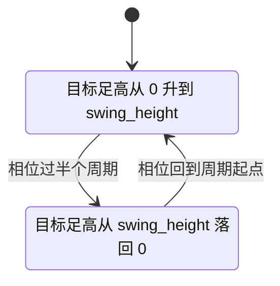
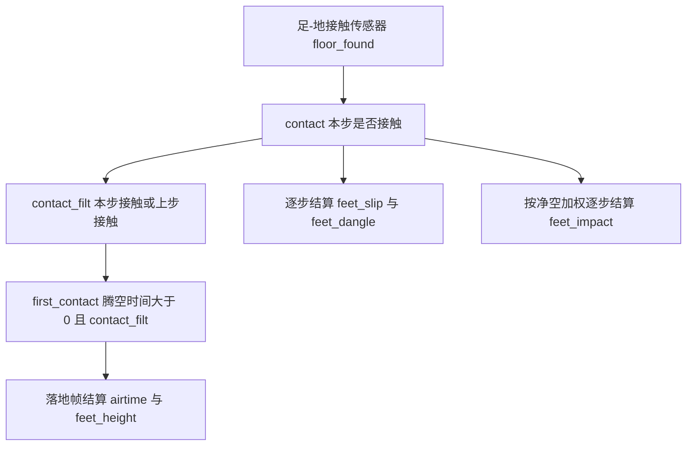

# trot 步态参数与相位引导

trot 是对角步态：对角的两条腿同相，相邻的两条腿反相。按 `FEET = [FR, FL, RR, RL]` 的顺序，目标相位取 $[0, \pi, \pi, 0]$，即 FR 与 RL 同相，FL 与 RR 与之相差 $\pi$。

步态参数与足端奖励项是这一页的主体。它们的关键分歧不在参数取值，而在两件事：目标足高是相位的函数还是世界高度的函数，以及每一项在落地帧结算还是每步结算。前者决定地形上惩罚是否被削平，后者决定策略能否靠"不落地"绕开考核。

> 本页对象是 mjx-go1-getup 走路任务的步态参数与足端奖励项，实现在 `envs/go1_walk.py` 的参数区与 `envs/go1_walk.py` 的足端函数。奖励的组合与下限口径见同单元第 2 篇。

## 1. trot 的目标相位表

| 足 | 目标相位 | 对角伙伴 | 支撑相大致时段 |
| --- | --- | --- | --- |
| FR | 0 | RL | 前半个周期 |
| FL | $\pi$ | RR | 后半个周期 |
| RR | $\pi$ | FL | 后半个周期 |
| RL | 0 | FR | 前半个周期 |

步态由相位变量驱动，相位随时间循环，奖励按"当前相位下足端应有的高度"给分。相位本身进入观测，否则策略看不到自己处在周期哪一段，无法预测随时变的目标。

| 参数 | 默认值 | 含义 |
| --- | --- | --- |
| `gait_freq` | 1.8 Hz | 步频，由实测主周期 0.52 到 0.56 s 反推 |
| `gait_phase_sigma` | 0.02 | 相位奖励的容差，越小越挑 |
| `gait_swing_height` | 0.15 m | 目标抬脚高度，同时是摆动相足高轨迹峰值 |
| `air_time_threshold` | 1.0 s | 腾空奖励的免罚阈值，训练开关会覆盖 |
| `air_time_max` | 无穷大 | 单次腾空的封顶 |
| `air_time_limit` | 0.8 s | 单足连续悬空上限，超过逐步扣分 |
| `impact_vel_limit` | 0.5 m/s | 落地冲击的免罚下界 |
| `impact_height` | 0.09 m | 接近地面的过渡高度 |
| `cmd_threshold` | 0.1 m/s | 指令低于它时腾空类项全部关闭 |

步频 1.8 Hz 由实测的步态主周期反推，并非照抄参考仓库的数值：周期 0.52 到 0.56 s 对应 1.79 到 1.92 Hz，取 1.8 Hz 落在实测区间内。

## 2. 相位推进与步频缩放

相位每个控制步推进一次，速率由步频与 $dt$ 决定，然后归一化到 $[-\pi,\pi)$：

$$\phi_i \leftarrow \mathrm{wrap}\!\left(\phi_i + 2\pi f\,dt + \pi\right) - \pi,\qquad f = 1.8\ \text{Hz}$$

相位推进的代码在 `envs/go1_walk.py`。步频可选随指令速度缩放，此时 $f$ 按 $|v^{cmd}|$ 线性缩放并设下限 0.6 Hz，避免站着不动时还在踏步；默认关闭（`envs/go1_walk.py`）。

缩放开关的必要性来自固定步频的副作用：指令为零时相位仍以 1.8 Hz 推进，策略看到的是"该踏步"的观测，而奖励里腾空类项又被指令门限关掉，两套信号冲突。开缩放后相位本身也停下来，观测与奖励一致。



## 3. 目标足高：三次贝塞尔与净空

目标足高是相位的函数。先把相位折到 $[0,1)$：

$$x = \frac{\phi + \pi}{2\pi},\qquad b(t) = t^3 + 3t^2(1-t)$$

$$rz(\phi) = \begin{cases} h \cdot b(2x), & x \le 0.5 \\ h \cdot \left(1 - b(2x-1)\right), & x > 0.5 \end{cases}$$

$h$ 取 `gait_swing_height`。`_get_rz` 的实现与上游 `gait.py:get_rz` 逐行对应（`envs/go1_walk.py`）。三次贝塞尔 $b$ 两端导数为 0，足端在抬离与落地瞬间速度平滑，避免了目标轨迹本身给落地冲击项制造尖峰。

相位奖励是四足误差平方和的指数：

$$r_{\text{phase}} = \exp\!\left(-\frac{\sum_f \left(z_f - rz(\phi_f)\right)^2}{\sigma_p}\right),\qquad \sigma_p = 0.02$$

$z_f$ 是足端离地净空，不是绝对世界高度。地形上地面高度非零，若用绝对高度，目标轨迹 $rz$ 必须跟着地形变，而 $rz$ 只由相位决定，两者无法调和（`envs/go1_walk.py` 的说明）。`envs/go1_walk.py` 记录了另一处同类修正：拖地惩罚也曾用绝对足端 z，在地形上被削平，反而鼓励高处拖地。

## 4. 相位奖励的区分度靠什么撑起

相位奖励的区分度靠 $\sigma_p$ 与 $h$ 共同撑起。原配方取 $\sigma_p=0.1$、$h=0.08$，理想 trot 与四足贴地不动的得分只差 0.04，奖励面几乎平，训练反而退化成贴地。收紧到 $\sigma_p=0.02$、$h=0.15$ 后的实测：

| 行为 | 相位奖励 |
| --- | --- |
| 理想 trot | 1.0000 |
| 四足全贴地 | 0.3371 |
| 四足全悬空 | 0.1880 |

最好与最差之间约 0.66，策略才有可学的梯度方向（`envs/go1_walk.py` 的实测记录）。改这两个参数时必须一起改：只收紧容差而不抬高目标高度，误差的平方项仍在同一量级，区分度不会明显变化。

这也解释了 `train/train_go1.py` 的联动：抬脚高度的奖励权重与相位奖励的目标高度必须一致，否则两项互相撕扯，谁都满足不了。

## 5. 足端项的两种结算时机

足端时序项分成两类：落地帧结算的，和每一步都结算的。这个区别决定了策略能不能靠"不落地"躲开惩罚。

| 项 | 结算时机 | 依赖状态 |
| --- | --- | --- |
| 腾空奖励 `feet_airtime` | 落地帧 | 累计腾空时间 |
| 抬脚高度 `feet_height` | 落地帧 | 摆动相平均净空 |
| 滑移 `feet_slip` | 每步 | 当前接触掩码 |
| 悬空 `feet_dangle` | 每步 | 当前腾空时间 |
| 落地冲击 `feet_impact` | 每步 | 净空与足端速度 |



腾空时间每步加 $dt$，落地帧结算：

$$r_{\text{air}} = \left[\sum_f \left(\min(t_f^{\text{air}}, t_{\max}) - t_{\text{th}}\right) c_f\right] \cdot \mathbb{1}\!\left(|v^{cmd}_{xy}| > 0.1\right)$$

$c_f$ 是首次接触掩码。阈值 $t_{\text{th}}$ 取 1.0 s 时，正常摆动 0.2 到 0.4 s 落地这一项是倒扣；改成 0.2 s 并封顶 0.5 s 后才变成正向激励（`envs/go1_walk.py`）。`envs/go1_walk.py` 是这批参数的默认值区。

## 6. 滑移、悬空与落地冲击

接触相滑移取足端世界系水平速度平方和：

$$c_{\text{slip}} = \sum_f \|v_f^{xy}\|^2 \, c_f \cdot \mathbb{1}\!\left(|v^{cmd}_{xy}| > 0.1\right)$$

支撑脚不打滑时该值为 0，贴地滑行时约等于躯干速度的平方（`envs/go1_walk.py`）。

抬脚高度项取整个摆动相净空的均值与目标之比，落地帧结算：

$$c_{\text{height}} = \sum_f \left(\frac{\bar z_f}{z^{\text{target}}} - 1\right)^2 c_f$$

用整段均值而非峰值，是为了让高频点地绕不开考核（`envs/go1_walk.py`）。

悬空惩罚按超出上限的量逐步累计并封顶：

$$c_{\text{dangle}} = \sum_f \mathrm{clip}\!\left(t_f^{\text{air}} - 0.8,\, 0,\, 2\right) \cdot (1 - c_f)$$

封顶 2.0 s 是为了避免长悬空把总奖励压到 0（`envs/go1_walk.py`）。若只在落地帧结算，永不落地的腿完全免罚，所以它必须每步结算（`envs/go1_walk.py`）。

落地冲击项按足端向下速度超过阈值的部分平方，并乘一个随净空线性衰减的权重：

$$c_{\text{impact}} = \sum_f \mathrm{clip}(-v_{f,z} - 0.5,\, 0)^2 \cdot \mathrm{clip}\!\left(1 - \frac{d_f}{0.09},\, 0,\, 1\right)$$

$d_f$ 是足端净空。离地越高权重越小，高处的下落速度不算砸地（`envs/go1_walk.py`）。

## 7. 镜像对称为什么要先平均再平方

对称项对六个带符号的镜像偏差做滑动平均，再平方求和：

$$m = \left[\,h_F^{sum},\, h_R^{sum},\, \theta_{FR}-\theta_{FL},\, \theta_{RR}-\theta_{RL},\, \kappa_{FR}-\kappa_{FL},\, \kappa_{RR}-\kappa_{RL}\right]$$

其中 $h$ 是髋外摆、$\theta$ 是大腿、$\kappa$ 是膝，$h_F^{sum}$ 指前腿两侧髋角之和。EMA 步长 $\beta=0.01$，时间常数 100 步约等于 3.6 个步态周期。代价取 $\min(\|\bar m\|^2, 2.0)$，权重 $-0.4$（`envs/go1_walk.py`）。

顺序很关键：必须对带符号偏差求平均后再平方。trot 的左右腿反相，瞬时镜像差恒非零，若先平方再平均，得到的是步态振幅的平方，会把 trot 压平。实测量级：旧策略 EMA 约 1.19，对称那代约 0.045（`envs/go1_walk.py`、`docs/experiment-log.md`）。`envs/go1_walk.py` 是逐足状态与对称项的初始化区。

## 8. 相位初值与观测编码

相位初值取 $[0,\pi,\pi,0]$ 再加一个随机的整体偏移，避免策略只对齐 episode 开头那一小段：

```python
"gait_phase": self._trot_phase0 + jax.random.uniform(
    rng, (), minval=0.0, maxval=2 * jp.pi),
```

对应 `envs/go1_walk.py`，`_trot_phase0` 定义在 `envs/go1_walk.py`。相位编码成 cos/sin 后进 actor 与 critic 观测（`envs/go1_walk.py`）。

随机整体偏移的作用是让策略不能依赖固定的初始相位，必须学会从任意相位接手。cos/sin 编码的作用是消除 $\pm\pi$ 处的不连续：若直接把相位值送进观测，$\pi$ 与 $-\pi$ 表示同一状态却数值相反。

## 9. 评估环境的开关组合

当前走路策略的评估环境把上述开关全部打开，可从 `sim/eval_walk.py` 读出：地形、高度扫描、机体系指令、滑移 $-0.5$、抬脚高度 $-1.0$、悬空 $-0.5$、腾空阈值 0.2 s 封顶 0.5 s、站高 $-200$、落地冲击 $-2.0$，以及 91 维策略才加的相位奖励 2.0。

评估环境与训练环境的开关组合必须一致。训练时开相位奖励而评估时不开，两者评的不是同一个任务；反过来评估开了训练没开，策略会按训练时的奖励面行动而评估按另一套打分。

## 10. 常见错误

| 现象 | 原因 | 对应位置 |
| --- | --- | --- |
| 相位奖励恒为 0，目标足高不可预测 | 相位不进观测 | `envs/go1_walk.py` |
| 两项互相撕扯，谁都满足不了 | 抬脚目标与摆动高度不一致 | `train/train_go1.py` |
| 奖励面几乎平，策略退化成贴地 | 相位容差沿用 0.1 | `envs/go1_walk.py` |
| 地形上拖地惩罚被削平，反而鼓励高处拖地 | 用绝对世界高度算净空 | `envs/go1_walk.py` |
| 正常摆动落地净倒扣，策略不敢抬腿 | 腾空阈值留在 1.0 s | `envs/go1_walk.py` |
| 永不落地的腿完全免罚 | 悬空惩罚只在落地帧结算 | `envs/go1_walk.py` |
| 罚的是步态振幅，trot 被压平 | 对称项对平方值做平均 | `envs/go1_walk.py` |

## 11. 小结

### 核心概念

- trot 的目标相位是 $[0,\pi,\pi,0]$，对角同相、相邻反相。
- 相位随时间以步频 1.8 Hz 推进，目标足高由三次贝塞尔给出，相位必须进观测。
- 相位奖励的容差与抬脚高度共同决定奖励面是否有区分度。
- 足端项分落地帧结算与逐步结算，逐步结算才能堵住"不落地"的绕行。
- 镜像对称必须对带符号偏差先平均再平方，否则会对抗步态本身。
- 净空相对足下地形计算，不能用绝对世界高度。

### 设计权衡

| 取法 | 采用处 | 代价 |
| --- | --- | --- |
| 固定步频 | 默认 | 站着不动也踏步，需要速度缩放开关 |
| 相位奖励用净空 | 地形训练 | 需要每步采样足下地形高度 |
| 抬脚高度按摆动相均值 | 默认开相位时 | 结算更晚，需要累计状态 |
| 对称项用 EMA | v23 | 引入一个时间常数参数，需要标定 |

## 12. 练习

基础题

1. 写出 trot 四条腿的目标相位，并说明哪两条腿同相。
2. 写出 $rz(\phi)$ 的分段表达式，说明三次贝塞尔在两端的导数为什么重要。
3. 列出五类足端项的结算时机，并指出哪一项若放在落地帧结算会被策略绕过。

挑战题

4. 相位奖励取 $\sigma_p=0.02$、$h=0.15$，重算三种行为（理想 trot、四足贴地、四足悬空）的得分，并说明 $\sigma_p$ 单独调小而不改 $h$ 会怎样。
5. 对称项若改写成"先平方再平均"，推导它会退化成什么量，并说明为什么这会压平 trot。

## 附：本页引用的路径

| 路径 | 用途 |
| --- | --- |
| mjx-go1-getup/ | 仓库根目录，文中相对路径均相对它；公开地址 https://github.com/TC635807/mjx-go1-getup |
| `envs/go1_walk.py` | 步态参数、相位推进、足端与对称奖励 |
| `train/train_go1.py` | 步态开关与抬脚高度的联动 |
| `sim/eval_walk.py` | 评估环境的开关组合 |
| `docs/experiment-log.md` | 相位奖励区分度与对称性的实测 |
| `mujoco_playground/_src/gait.py` | get_rz 与 GAIT_PHASES 的上游实现 |
