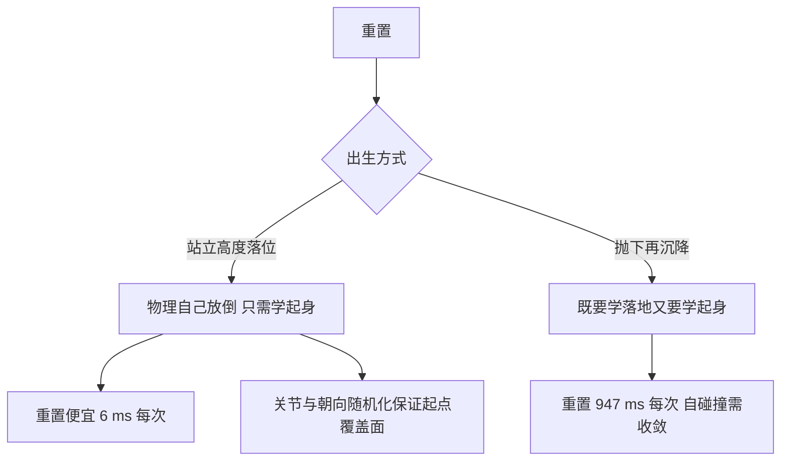

# 起身任务的定义与起点设计

四足机器人摔倒之后需要自己站起来，才能继续执行任务。这件事对人来说理所当然，对强化学习却是一个长期不收敛的难题：项目用纯 PPO 从零训练 25M 步以上，成功率一直是零；用关键帧示范做行为克隆只能到 5.1%；关键帧状态机本身也只有 20% 到 28%。把成功率做到 77% 以上的关键是重写后的第二版环境，它改变最大的地方是起点设计，而不是网络结构或训练步数。

起点决定了任务有多难发现。如果一开始就把机器人以任意姿态扔到半空再让它摔到地上，策略要同时学会「怎么落地」和「怎么站起来」两件事；如果直接把它放在站立高度、只把关节和朝向打乱，物理自己会把它放倒，策略只需要专注一件事。公开工作的配方几乎都选了后者，本单元讲的就是这套配方在项目里的落地。

## 起身任务要解决什么

任务的形式化定义很短：把机器人从任意摔倒姿态恢复到默认站立姿态，并保持住。姿态用根四元数描述，站立姿态用躯干离地高度与躯干朝上的方向描述。项目里这两条判据都有明确阈值，后面的篇章会展开。

难题出在中间过程。摔倒后机器人可能仰卧、俯卧、侧躺，四肢的相对关系完全打乱，同一套关节指令在不同起始姿态下效果完全不同。策略要学的是一段有相位的动作序列：先翻身、再收腿、再撑起、最后站住，而每一段的成功都依赖前一段的结果。

基线的三个数字需要并列看才有意义：纯 PPO 从零 25M 步以上成功率仍为零，关键帧状态机自身 20.1% 到 28.1%，行为克隆单独训练只能到 5.1%（«docs/getup-recipes.md» 转引项目实验记录）。状态机比学习策略强，说明动作本身可行；克隆只有它的四分之一，说明分布漂移是主要损耗。

项目早期走过一条弯路：用关键帧状态机生成示范，再让策略模仿或在其上做残差修正。实验记录里的结论是这条路的先验是混沌的：有效扰动只要 ±0.09 rad 就能让状态机成功率从 29.3% 掉到 10.9%（`docs/getup-recipes.md` 转引项目实验记录结论）。在这个基础上加噪声的强化学习只会学到退化行为。

## 出生姿态的两种设计

公开实现里的出生方式分成两类，难度差别很大（`docs/getup-recipes.md` 与 ）：

| 出生方式 | 做法 | 代表实现 | 难度 |
| --- | --- | --- | --- |
| 站立高度落位 | z 取站立高度，关节与朝向随机 | get-up-isaaclab、官方 Go1Getup 的 40% 情形 | 低 |
| 抛下再沉降 | z 取 0.5 m 抛下，等物理沉降 | 官方配置的 60% 情形、关键帧示范采集 | 高 |

抛下的额外代价不只是难度。沉降要在物理里跑几百步才能让自碰撞收敛，项目实测每次重置的耗时在开沉降时是 947 ms，关掉沉降之后降到 6 ms（`docs/getup-recipes.md`）。在需要几千万步训练的场景里，这个差距直接决定一轮训练能不能跑完。

第二版环境选择了站立高度落位，配置里出生高度取相对地面的 0.35 m，平面位置在正负 2 m 内均匀采样，关节在硬限位内采样，朝向用归一化正态四元数均匀随机（`envs/go1_getup_v2.py` 与 ）。落地后机器人自己倒下，策略从倒地状态开始学起身。



下面是这段出生逻辑的源码（省略了参数读取）：

```python
# mjx-go1-getup/envs/go1_getup_v2.py（节选）
def _spawn(self, rng):
    """站立高度直接落位 + 随机关节/朝向（get-up-isaaclab::_reset_idx）。"""
    rng, kxy, kq, kj = jax.random.split(rng, 4)
    xy = jax.random.uniform(kxy, (2,), minval=-self._spawn_xy, maxval=self._spawn_xy)
    h0 = self.terrain_height(xy[None, :])[0] if self._hfield_ok else jp.zeros(())
    quat = jax.random.normal(kq, (4,))
    quat = quat / (jp.linalg.norm(quat) + 1e-6)      # 归一化成合法四元数
    joints_r = jax.random.uniform(kj, (NU,), minval=self._lowers, maxval=self._uppers)
    a = jp.float32(self._config.getup2.joint_alpha)
    joints = (1.0 - a) * self._default_pose + a * joints_r
    qpos = jp.concatenate([xy, (h0 + self._spawn_h)[None], quat, joints])
    qvel = jp.zeros(self.mjx_model.nv)
    return qpos, qvel, joints
```

`jax.random.split` 把一个随机键拆成互不相关的多个键，让同一次重置里的每个随机量各有随机源，避免彼此相关；`joint_alpha` 就是关节难度系数，取 1.0 时在全限位内均匀采样，取小值则向默认姿态收拢。

## 姿态池与关节难度课程

站立高度落位解决了「学两件事」的问题，但起点分布仍然偏窄：物理自己倒下的姿态集中在少数几种，仰卧与侧躺的比例不足。公开工作的对策是预生成姿态池，把大量已沉降的姿态存成文件，重置时直接取样（`docs/getup-recipes.md` 转引 HumanUP 的 20K 姿态数据集做法）。

项目里对应的工具是姿态池脚本（`sim/make_getup_posepool.py`）。它按躺地姿态采样并检查接触数，为起身环境预留容量，产出的结果可以作为初始状态文件给训练使用。这条路线的额外好处是绕开了并行重置的显存问题：项目实测在同一步里做多次重置会让 warp 的内存池崩溃，改用取样文件之后不再触发（`docs/getup-recipes.md`）。

姿态池的采样过程还要顺带核对容量。躺地姿态下每个环境的接触数约为 33 个，而接触槽是全体世界共享的，因此姿态池脚本按每环境 64 个接触预留容量，取默认容量与放大值中的较大者（«sim/make_getup_posepool.py»）。这项核对属于容量选择的一部分，本仓库的容量单元里展开。

另一个更轻的课程轴是关节随机化的强度。第二版配置里有一个关节难度系数，取值 1.0 表示完全随机（公开配方原样），取小值则把关节角往默认姿态收（`envs/go1_getup_v2.py`）：

$$
\text{joints} = (1 - \alpha) \cdot \text{default} + \alpha \cdot U(\text{limit})
$$

这个系数配合续训参数可以做出多阶段课程：先用小 α 在接近站立的姿态上把起身动作学会，再逐步放大 α 到全随机。HumanUP 的两阶段结构正是这个思路，第一阶段在规范姿态上发现动作，第二阶段才放开初始分布（`docs/getup-recipes.md`）。

## 观测与动作口径的连带影响

起点设计之外，第二版还有两处结构性改动，都与调度器有关。第一处是观测从单帧 91 维变成 42 维乘 5 帧历史，共 210 维（`envs/go1_getup_v2.py`）。历史帧让策略能看到关节速度的变化趋势与自己的上一步动作，这对时序性很强的起身动作是必要的。

代价是观测维度不再与走路策略一致。项目的查看器里有一个按观测形状合并策略的调度器，起身策略与走路策略共用一套观测是它成立的前提；改用历史帧之后这个前提不成立，查看器必须为起身单独维护一段历史缓冲（`envs/go1_getup_v2.py` 与 `docs/status.md`）。

第二处是动作语义。第二版把动作锚在名义站立姿态上而不是加在当前关节角上，这一条是公开配方里被反复强调的结构差异，下一节专门展开。

## 起点参数速查

第二版的起点与相关时长参数集中在一个配置块里，几个关键值如下（«envs/go1_getup_v2.py»）：

| 参数 | 取值 | 依据 |
| --- | --- | --- |
| 出生高度 | 相对地面 0.35 m | 站立高度直接落位，不抛 |
| 平面范围 | 正负 2 m | 覆盖足部落点差异 |
| 关节随机化 | 硬限位内均匀采样 | 起点姿态全覆盖 |
| 关节难度系数 | 默认 1.0 | 可按课程调小 |
| 朝向 | 归一化正态四元数 | 任意朝向等概率 |
| 观测历史 | 5 帧 | 给策略速度趋势信息 |
| episode 长度 | 400 步 | 8 秒，留出学"站住"的时间 |
| 成功保持步数 | 25 步 | 连续满足判据才算成功 |

episode 长度从 300 步提到 400 步是有实测依据的：在 300 步的设置下，策略在末态接近站立的比例是 30.5%，但能连续保持 25 步的只有 1.6%，说明到站时间太晚、没有余量学站住；延长到 8 秒之后把这段时间留出来（«envs/go1_getup_v2.py»）。

起点高度取 0.35 m 而不是 0.5 m，也是同一个思路的延伸：从站立高度落位比从半空抛下更容易，而随机关节与朝向仍然保证起点分布的宽度。难度靠课程逐步放开，而不是靠加高度堆出来。

## 与走路任务的关系

起身策略不是孤立运行的。机器人摔倒由查看器里的调度器检测，起身完成后要把控制权交还走路策略，交还瞬间的动作连续性直接影响成功率。项目的实测显示，交还时做动作混合会让摔倒率从 7.9% 上升到 38.3%，因此默认关闭混合（`docs/status.md`）。

训练规模上要有心理准备。公开工作的四足起身做到收敛需要 1e8 到 1e9 步量级，而项目的单卡吞吐在 3700 到 5500 步每秒之间，2e7 步约 1.5 小时、5e7 步约 4 小时、1e8 步约 8 小时（«docs/getup-recipes.md»）。按公开配方改完之后如果仍需要 1e8 步，正确的结论是接受跑一晚上，而不是跑 6e6 步就宣判方法无效。

这套调度与交还的判据、去抖与冷却参数在另外的单元里展开，这里只写到起身策略自身的边界为止：它负责从倒地姿态到站住，站住之后如何交班由调度逻辑决定。


## 小结

### 核心概念

- 起身任务要把任意摔倒姿态恢复到默认站立姿态并保持住，难点在中间动作序列的相位依赖。
- 出生姿态有两种设计：站立高度落位让物理自己放倒，抛下再沉降同时要求策略学落地，后者重置耗时 947 ms 对 6 ms。
- 第二版出生高度取相对地面 0.35 m，关节在硬限位内随机，朝向均匀随机，平面位置正负 2 m。
- 姿态池把已沉降姿态存成文件供重置取样，关节难度系数 α 可以做从规范姿态到全随机的课程。
- 观测改为 42 维乘 5 帧历史后不再与走路策略同形，查看器必须为起身单独维护历史缓冲。

### 设计权衡

| 选择 | 带来的能力 | 付出的代价 |
| --- | --- | --- |
| 站立高度落位 | 任务更容易发现、重置便宜 | 起点分布偏窄，需课程补足 |
| 抛下再沉降 | 起点覆盖宽 | 重置昂贵、任务更难 |
| 预生成姿态池 | 覆盖宽且重置便宜 | 需要离线生成与存储 |
| 关节难度系数课程 | 从易到难、可分阶段续训 | 需要多轮训练与参数管理 |
| 观测带历史帧 | 策略可见速度趋势 | 打破与走路策略同形的前提 |

## 练习

### 基础题

1. 说明起身任务的形式化定义，以及难点为什么在中间动作序列。
2. 对比两种出生姿态的设计，写出各自的重置耗时与难度差别。
3. 解释关节难度系数 α 的作用与课程用法。

### 挑战题

4. 设计一套两阶段课程的具体参数，说明每阶段的 α 与续训方式。
5. 分析姿态池方法为什么能同时解决起点分布与重置显存两个问题。
6. 讨论观测带历史帧与策略调度合并之间的取舍，给出你的方案。

## 附：本页引用的路径

| 路径 | 用途 |
| --- | --- |
| `mjx-go1-getup/envs/go1_getup_v2.py` | 出生与课程配置、出生实现与重置、观测历史 |
| `mjx-go1-getup/docs/getup-recipes.md` | 公开配方对照与出生方式、姿态池与重置代价、两阶段课程 |
| `mjx-go1-getup/docs/status.md` | 第二版成功率与调度器口径、交还实测 |
| `mjx-go1-getup/sim/make_getup_posepool.py` | 姿态池生成工具 |
| `~/mujoco` | 素材仓库根，正文中素材路径均相对该根；外部实现的数字经素材调研笔记转引 |
