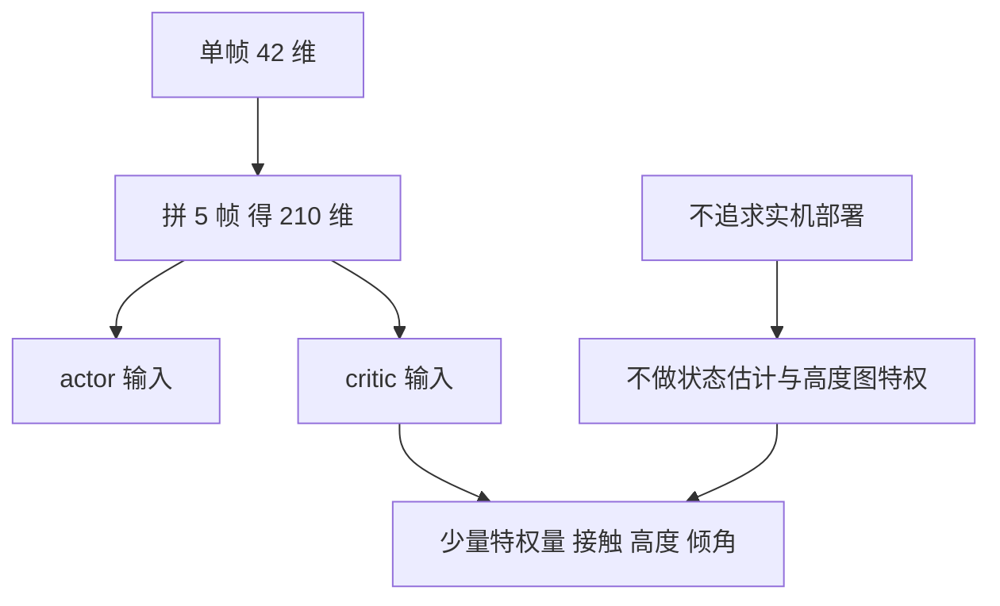

# 动作与观测的结构选择

起身策略学不会的时候，人们容易去调学习率、网络宽度或训练步数。项目对照公开实现之后发现，最大的差异其实在接口层：动作是怎么定义的，观测里有没有历史。这两项决定了策略面对的是一个什么样的优化问题，也决定了一样的算法和预算能不能学到动作。

接口层的差别可以概括为两点。旧版本的动作是「在当前关节角上加一个增量」，目标关节角可以漂到任何位置；公开配方的动作是「在名义站立姿态上叠加一个有限的偏移」，可达范围被限制在名义姿态附近。前者要求策略从零学关节角本身，后者只要求它学偏离站姿多少，学习负担完全不同。

## 动作语义的两种写法

两种动作语义在代码里只差一行，难度却差一个档（`envs/go1_getup_v2.py`）：

| 写法 | 公式 | 可达范围 | 代表实现 |
| --- | --- | --- | --- |
| 增量式 | 目标等于当前关节角加 0.5 乘动作 | 无界，可漂到任意位置 | 项目第一版、官方 playground 的走路任务 |
| 锚定式 | 目标等于名义站姿加 0.5 乘裁剪后的动作 | 名义站姿正负 1.5 rad | 公开的起身配方 |

第二版选了锚定式，动作先裁剪到正负 3.0，再经过一阶低通滤波，最后乘 0.5 加到默认姿态上（`envs/go1_getup_v2.py` 与 ）：

$$
a = \text{clip}(a, \pm 3.0), \qquad a_f = 0.8 a + 0.2 a_{prev}, \qquad \text{target} = \text{default} + 0.5 a_f
$$

滤波系数 0.8 让相邻两步的目标关节角不会突变，等效于给动作加了一层平滑。可达范围只有正负 1.5 rad，这个范围足以完成起身，但不足以让关节漂到限位之外的怪异姿态。

需要留意一点：官方 playground 在走路任务上试过更接近增量语义的动作空间，结论是不如「加到当前关节配置上」好用（`docs/getup-recipes.md` 转引官方环境文档）。这条经验说明动作语义没有普适最优解，要按任务的动作是否有明确的参考姿态来选：走路有周期性的名义步态，起身有明确的目标站姿，两种任务都适合锚定式。


这段动作处理在源码里是连续的几行：

```python
# mjx-go1-getup/envs/go1_getup_v2.py（节选）
a = jp.clip(action, -self._clip_a, self._clip_a)                    # 先裁剪到正负 3.0
a_f = self._alpha * a + (1.0 - self._alpha) * info["prev_a_filt"]   # 一阶低通
info["last_raw_act"] = a
target = self._default_pose + self._act_scale * a_f                # 锚定到默认姿态
state = super().step(state, target)                                # 绝对关节目标
```

一阶低通就是指数滑动平均：`alpha=0.8` 表示新动作占八成、上一步占两成，用来抹平逐帧抖动。锚定式与增量式的差别只在倒数第二行——增量式会写成「当前关节角 + 修正量」，于是同一个动作值在不同起始姿态下含义不同。

## 有效探索噪声怎么算

探索噪声由两个参数共同决定。策略输出的是带噪声的动作均值，噪声的标准差参数乘上动作缩放系数，才是实际作用到关节目标上的幅度（`docs/getup-recipes.md`）。

| 来源 | 噪声初值 | 动作缩放 | 有效每步噪声 |
| --- | --- | --- | --- |
| brax PPO 默认 | 1.0 | 未指定 | 由任务给出 |
| HoST 人形起身 | 0.8 | 1.0 | 0.8 |
| 官方 Go1Getup | 1.0 | 0.5 | 0.5 rad 约 28.6 度 |
| 官方 Franka 精细操作 | 1.0 | 0.04 | 0.04 |

0.5 rad 每步是 playground 全套任务里最大的一档。这个幅度让策略在早期能快速探索大的姿态变化，但在微调阶段会破坏已经学好的动作。噪声标准差在训练中是可学习参数，它的初值只影响早期探索的幅度，因此从零训练与微调应该用不同的初值（`docs/getup-recipes.md`）。

项目还记录了另一处与微调相关的失效：参数恢复不恢复优化器状态，Adam 的动量会从零重建。在微调时这会表现为第一次更新就把策略推歪，因此微调要用更小的学习率（`docs/getup-recipes.md` 转引项目实验记录）。

项目针对微调阶段给过一组建议值：噪声初值取 0.3、动作缩放从 0.5 降到 0.25，把有效噪声压到 0.075，同时把学习率降到 1e-5（«docs/getup-recipes.md» 的建议稿，尚未执行）。这组值在本项目里三次微调都退化了，因此它只能作为把噪声变量固定住的配套措施，不能单独指望它解决问题。

噪声的分布类型也影响行为。项目用的正态分布不过 tanh 压缩，输出均值可以直接落在行程端点上，这对需要瞬间发力的起身关键动作是必要的；代价是动作可能超出合理范围，因此外层必须保留裁剪（`docs/getup-recipes.md`）。

## 观测的单帧与历史

第二版的单帧观测由五部分组成，共 42 维（`envs/go1_getup_v2.py` 与 ）：

| 组成部分 | 维数 | 作用 |
| --- | --- | --- |
| 机体角速度 | 3 | 判断翻转趋势 |
| 投影重力方向 | 3 | 判断躯干朝向 |
| 关节角减默认姿态 | 12 | 相对站姿的偏差 |
| 关节速度 | 12 | 判断是否还在动 |
| 上一步原始动作 | 12 | 让策略知道自己刚做了什么 |

单帧 42 维，取 5 帧拼成 210 维作为 actor 输入。历史窗口的作用是把关节速度的变化趋势暴露出来：单帧速度只能说明此刻在动，多帧才能说明是加速还是减速，而起身的相位判断依赖这个信息。

对照公开配方可以看到同样的选择：isaaclab 用 42 维乘 5 帧共 210 维，HoST 用 76 维乘 6 帧共 456 维（`docs/getup-recipes.md` 与 ）。多个独立实现都上历史帧，说明这不是可选项。

单帧与历史的拼装写在两个函数里：

```python
# mjx-go1-getup/envs/go1_getup_v2.py（节选）
def _frame(self, data, info) -> jax.Array:
    """单帧 42 维（get-up-isaaclab 的 actor obs 单帧，顺序一致）。"""
    return jp.concatenate([
        self.get_gyro(data),                  # 3  角速度（机体系）
        self.get_gravity(data),               # 3  投影重力（机体系）
        data.qpos[7:] - self._default_pose,   # 12 关节位置相对默认姿态
        data.qvel[6:],                        # 12 关节速度
        raw,                                  # 12 上一步原始动作
    ])
```

`concatenate` 把五段拼成固定长度的一帧；历史帧则是在 `_get_obs` 里维护一个滚动缓冲，把最近几帧按时间顺序堆叠后拉平（`hist.reshape(-1)`），单帧 42 维因此变成 42×5=210 维。

## 非对称 actor-critic

观测分两套：actor 只看策略实际能拿到的量，critic 额外看特权量。官方 Go1Getup 的 critic 用特权观测键，isaaclab 的特权量包括 PD 增益、足端接触、高度误差与地形倾角（`docs/getup-recipes.md`）。

项目第二版的策略是：critic 只用观测加上少量特权量，不做状态估计模块，也不做高度图特权。这一取舍来自目标定位，项目不追求实机部署，因此不需要把仿真特权量替换成可估量（`envs/go1_getup_v2.py`）。代价是策略上限受观测限制，收益是整条链路简单、易复现。

需要说明的是，非对称结构本身不解决起身难题。公开的起身工作里有实现用、也有实现不用，起作用的是动作锚定、宽奖励与课程这几条（`docs/getup-recipes.md`）。



## 接口改动与调度器的冲突

观测带历史帧会给工程链路带来一个副作用。项目的查看器按观测形状把策略合并到一套调度流程里，走路策略是单帧的 91 维，起身策略改成 210 维之后两者不再同形，调度器无法共用一段观测装配代码（`envs/go1_getup_v2.py`）。

解决方案是让起身策略自带历史缓冲，查看器在起身模式下单独维护这段缓冲并按帧推进（`docs/status.md`）。代价是查看器多一条分支，收益是不必为了迁就调度器退回单帧观测。

$$
\text{单帧 42 维} \times 5 \; \text{帧历史} = 210 \; \text{维}, \qquad 91 \; \text{维单帧走路观测与它不同形}
$$

第二版的基线还把观测噪声与动作噪声都关掉了，先拿到一个干净基线再谈域随机化（«envs/go1_getup_v2.py»）。这也意味着观测维度的改动在这条基线上没有噪声预算的干扰，后续加域随机化时再单独评估。

这类接口冲突在项目里出现过多次：一项为任务效果做的正确改动，会打破为工程简洁做的既有约定。处理原则是优先保留对任务效果必要的部分，再在工程侧加分支适配，而不是反过来削掉观测。

## 小结

### 核心概念

- 动作有两种语义：增量式把目标加在当前关节角上、可达范围无界；锚定式把偏移加在名义站姿上、范围是正负 1.5 rad。
- 第二版动作先裁剪到正负 3.0，再一阶低通滤波，系数 0.8 让相邻步骤的目标不会突变。
- 有效探索噪声等于噪声标准差初值乘动作缩放，官方起身配置是 1.0 乘 0.5 等于 0.5 rad，是 playground 里最大的一档。
- 观测从单帧 42 维拼成 5 帧 210 维，历史窗口提供关节速度趋势；critic 额外看少量特权量，不做状态估计。
- 210 维观测不再与走路策略同形，查看器必须为起身单独维护历史缓冲。

### 设计权衡

| 选择 | 带来的能力 | 付出的代价 |
| --- | --- | --- |
| 动作锚定加有界裁剪 | 只学偏离站姿的量 | 可达范围受限，需要确认够用 |
| 一阶低通滤波 | 目标平滑、动作连续 | 引入一步延迟 |
| 观测带 5 帧历史 | 速度趋势可见 | 观测维度不再与走路同形 |
| critic 用少量特权量 | 链路简单可复现 | 策略上限受观测限制 |
| 不做状态估计模块 | 不需要特权量替换 | 放弃面向实机的迁移能力 |

## 练习

### 基础题

1. 写出两种动作语义的公式与可达范围，说明锚定式为什么更容易学。
2. 计算官方起身配置的有效探索噪声，并解释为什么它比精细操作任务大一个数量级。
3. 列出单帧观测的五个组成部分与历史帧数，说明历史带来的信息。

### 挑战题

4. 为起身任务设计一套微调用的噪声与学习率组合，说明与从零训练的差别。
5. 分析观测带历史帧与调度器合并的冲突，给出两种可行的工程解法。
6. 讨论在追求实机部署时非对称结构需要做哪些调整。

## 附：本页引用的路径

| 路径 | 用途 |
| --- | --- |
| `mjx-go1-getup/envs/go1_getup_v2.py` | 动作锚定与低通、观测构成、目标定位 |
| `mjx-go1-getup/docs/getup-recipes.md` | 动作语义对照、观测历史、有效噪声、非对称结构的定位 |
| `mjx-go1-getup/docs/status.md` | 查看器的起身模式与历史缓冲 |
| `~/mujoco` | 素材仓库根，正文中素材路径均相对该根；外部实现的数字经素材调研笔记转引 |
