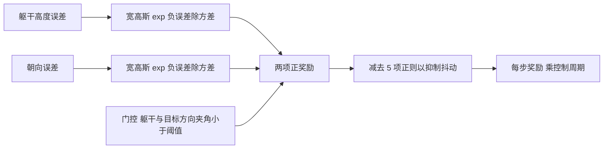
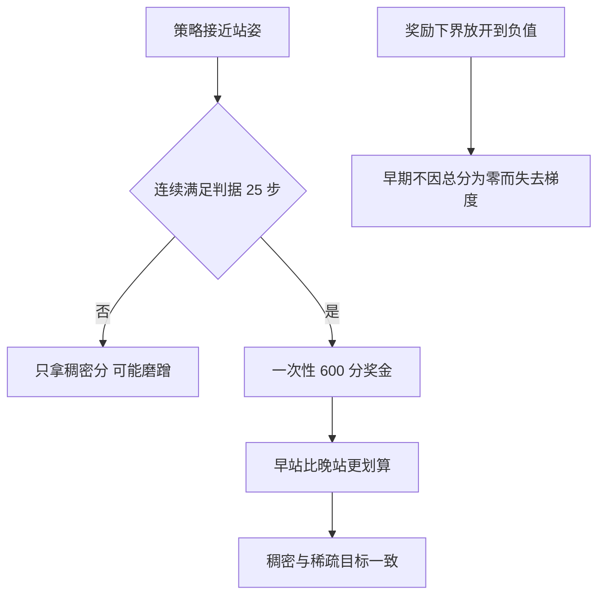

# 奖励设计与退化吸引子

起身任务的奖励如果写得像走路，策略会找到一条捷径：保持趴着不动，靠几个容易拿到的项把分数堆上去。这属于奖励面本身的退化最优解，不是策略在作弊。项目实测过最典型的一例：一轮训练拿到每回合 468 分，而站立的分数上限是 529，看起来已经接近满分，可是成功率仍然是零。

分数与目标脱节的原因有两个。一个是奖励由很多窄项叠成，每一项单独都容易拿分；另一个是奖励里最重的朝向项算错了参考方向，导致「把躯干顶到某个角度」比「站直」更划算。后来的版本把奖励压成两个宽高斯，并把朝向基准改成与判据一致的方向，配合成功终止与稀疏奖金，成功率才从零变成可用。

## 从九项窄峰到两个宽高斯

两版的奖励结构对比如下（`docs/getup-recipes.md:150-156` 与 `envs/go1_getup_v2.py:105-116`）：

| 版本 | 结构 | 形状 | 问题 |
| --- | --- | --- | --- |
| 第一版 | 9 项加权和加一个稀疏奖金 | 高斯很窄，宽度 0.05 | 存在台阶与可套利点 |
| 第二版 | 2 个宽高斯加 5 个正则项 | 高斯宽度 0.316 | 结构简单、无窄门 |

窄高斯的含义是只有非常接近目标才有分数，稍远就归零。这种形状在早期探索阶段几乎没有梯度，策略收不到「往目标方向走」的信号；反过来，一旦进入窄峰，分数很高，于是策略会优先守住那个姿态而不是继续完成动作。

第二版的两个正项都是宽高斯（`envs/go1_getup_v2.py:342-344`）：

$$
\text{track\_orientation} = \exp(-\text{ori\_err} / 0.1), \qquad \text{track\_height} = \exp(-h\_err / 0.1)
$$

分母 0.1 是方差而不是标准差，因此高斯宽度约为 0.316。高度误差以米为单位，0.316 m 的宽度意味着躯干高度差三四十厘米仍然有不小的分数，探索全程都能拿到梯度。朝向误差同样用这个宽度，对应约 0.316 rad 的角度容差。

## 两个已实测坏掉的奖励项

第一版有两个奖励项的实测值与设计意图严重不符（`docs/getup-recipes.md:243-255`）：

| 奖励项 | 设计意图 | 实测表现 | 后果 |
| --- | --- | --- | --- |
| 朝向项 | 躯干竖直时拿满权重 | 站立时只有 0.887 除以 3.0 | 顶到某个角度就能套利约 2.1 分每步 |
| 站立静止项 | 站着不动拿高分 | 站立时只有 0.0003，上限 0.5 | 该项几乎不起作用 |

朝向项的问题出在参考方向的算法上。项目用它计算重力投影，即便机器人竖直，算出来的方向也与世界竖直方向相差约 46 度，于是「真竖直」只能拿到约三分之一的分数，而把躯干歪到某个中间角度反而更接近算法的输出。策略于是学会了顶住这个角度，而不是站直。

站立静止项的问题出在输入。该项想惩罚大幅度的控制量，但拿到的是绝对控制目标，数值在 0.8 到 1.5 rad 之间，指数项因此恒接近于零。要让这项起作用，必须传入归一化后的策略动作而不是绝对目标（`docs/getup-recipes.md:245-250`）。

这两个例子说明一件事：奖励项的实测值必须单独核对，不能只看公式。两个项都在公式上看起来合理，实测却分别给出了错误的最优方向和几乎恒为零的输出。

## 朝向基准取世界竖直还是局部法向

朝向误差要有一个参考方向。公开的四足配方用局部地形法向，理由是四足站在坡上躯干本来就随坡倾斜，用世界竖直做基准在坡度较大时期望值不可达（`envs/go1_getup_v2.py:16-24`）。

项目的评估判据用的是世界竖直投影，也就是躯干与竖直方向的夹角余弦。两个基准不一致会制造假失败：用地形法向训练出来的策略，末态竖直投影中位数是 0.963，对应约 13.7 度倾斜，92% 的样本落在高度带内，姿态上其实已经站起来了，但世界竖直判据要求大于 0.99 也就是 8.1 度以内，算出来的成功率是零（`envs/go1_getup_v2.py:89-94`）。

第二版因此把基准做成可切换的配置项，默认取世界竖直，与判据和查看器保持一致；保留局部法向选项用于复现公开配方（`envs/go1_getup_v2.py:89-94`）。这条取舍的教训是：奖励的参考系必须与评估的参考系一致，否则训练目标与验收目标会分道扬镳。

局部法向的计算方式是取当前位置高度的梯度，把切平面法向归一化（`envs/go1_getup_v2.py:159-168`）：

$$
n = \text{normalize}([-g_x, -g_y, 1])
$$

梯度用前后各 0.05 m 的高度差估计。这个采样器复用高度场的解析双线性采样，因此整条计算可以留在 jit 内。

## 门控与足髋距离项

宽高斯之外还有两个设计细节。第一个是门控：只有当躯干与目标方向的夹角小于 28.6 度时，高度项才给分（`envs/go1_getup_v2.py:17-24` 与 `:344`）。门控的作用是避免策略在躺地时也拿到高度分，把「已经翻正」与「还躺着」区分开。

$$
\text{gate} = \text{dot}(u_{body}, n) > \cos(28.6^\circ)
$$

第二个是足髋距离项，鼓励足端落在髋关节正下方，权重 1.5（`envs/go1_getup_v2.py:109` 与 `:346-360`）。这一项有一个容易写错的地方：参考点必须是髋体而不是躯干原点。髋在躯干坐标系里的横向偏移是 0.1881 m、纵向约 0.047 m，如果拿躯干原点当参考，这一项会把「足落在髋下」错判成「足要收到躯干中线」，项目在前几版里正是这样写错并导致动作变形的（`envs/go1_getup_v2.py:151-157`）。

「足落在髋下」这个目标还有一个小的外张偏置 0.095 m，让四足略微外张而不是并拢，与真实站立姿态一致（`envs/go1_getup_v2.py:96-99`）。

## 成功奖金与判据对齐

奖励面还有一个结构性问题：稠密项让策略可以在接近站姿的位置一直待着拿分，而不去触发成功判据。项目实测过「末态接近站立 30.5% 但连续保持 25 步只有 1.6%」的分布，说明到站太晚、站不稳（`envs/go1_getup_v2.py:70-77`）。

对策是把成功本身写进奖励。第二版在连续满足站姿判据 25 步的那一步给出一次 600 分奖金，并把 episode 长度从 300 步延长到 400 步（`envs/go1_getup_v2.py:70-77` 与 `:277-284`）：

$$
\text{奖励} = \text{稠密项} + 600 \times [\text{连续站住 25 步}]
$$

600 分约等于 400 步站立能拿到的稠密分，因此「早站起来」比「晚站起来」更划算，策略有动力尽早完成动作而不是磨蹭到回合结束。

公开工作里同样的思路有不同实现：有的把「连续站立 100 步」直接写成终止条件，有的单独分出一组描述「站起来之后应该保持站立」的奖励并用额外的价值网络优化（`docs/getup-recipes.md:290-300`）。共同点是让奖励与成功判据指向同一个目标。

还有一条容易忽略的配置：奖励下界必须放开。第二版把奖励裁剪下界设成负一百万，原因是如果总分被裁剪到零为下界，早期策略全部拿零分，策略梯度就没有信号（`envs/go1_getup_v2.py:64-66`）。

## 小结

### 核心概念

- 第一版用九项窄峰奖励，策略能拿到 468 分而成功率仍为零，说明分数与目标脱节。
- 第二版把正项压成两个宽高斯，方差 0.1 对应宽度 0.316，探索全程都有梯度。
- 实测坏掉的两项是朝向项与站立静止项：前者站立只有 0.887 除以 3.0，后者只有 0.0003，都被策略套利或忽略。
- 朝向基准必须与评估判据一致，地形法向训练出的策略在世界竖直判据下成功率假零。
- 成功奖金 600 分写在连续站住 25 步的那一步，配合放开奖励下界，让稠密信号与成功目标指向同一处。

### 设计权衡

| 选择 | 带来的能力 | 付出的代价 |
| --- | --- | --- |
| 两个宽高斯 | 全程有梯度、无窄门 | 精度依赖其他项与奖金 |
| 朝向基准取世界竖直 | 与评估判据一致 | 坡面上期望值不可达 |
| 朝向基准取局部法向 | 坡面自洽 | 与竖直判据不一致产生假失败 |
| 加成功奖金 | 抑制磨蹭、目标明确 | 需要标定奖金量级 |
| 放开奖励下界 | 早期保留梯度 | 负奖励需要额外的稳定性保障 |

## 练习

### 基础题

1. 对比两版奖励的结构，说明窄高斯为什么不利于早期探索。
2. 解释朝向项与站立静止项各自的实测问题与修法。
3. 说明门控与足髋距离项的作用，指出足髋距离项的参考点为什么必须是髋体。

### 挑战题

4. 为一个新的起身任务设计奖励，要求包含门控、宽高斯与成功奖金并说明标定方式。
5. 分析假失败现象的产生条件，设计一套让奖励基准与评估基准保持一致的检查流程。
6. 讨论成功奖金量级的确定方法，给出过大与过小各自的后果。

## 附：本页引用的路径

| 路径 | 用途 |
| --- | --- |
| `mjx-go1-getup/envs/go1_getup_v2.py` | 奖励结构与权重（:105-116）、宽高斯与门控（:342-344）、足髋项与参考点（:109、:151-157、:346-360）、朝向基准切换（:89-94）、成功奖金与回合长度（:70-77、:277-284）、奖励下界（:64-66） |
| `mjx-go1-getup/docs/getup-recipes.md` | 两版奖励对照（:150-156）、坏掉的奖励项与改法（:243-255）、成功终止与分组奖励（:290-300） |
| `mjx-go1-getup/envs/go1_getup.py` | 第一版奖励项与判据 |
| `~/mujoco` | 素材仓库根，正文中素材路径均相对该根；外部实现的数字经素材调研笔记转引 |
