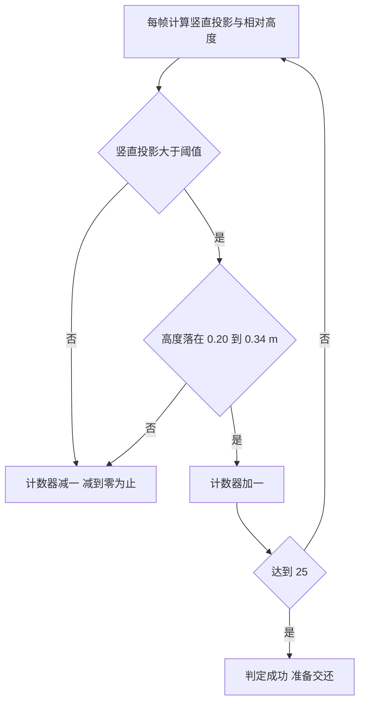
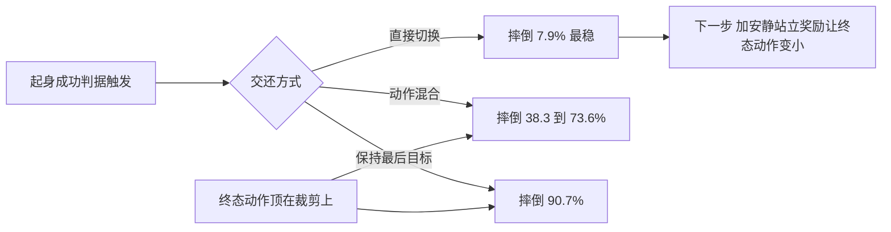

# 成功判据与交还口径

起身策略训完之后，评估它的唯一标准是成功率，而成功率对判据的每一个常数都敏感。同一个策略，判据取竖直投影大于 0.99 还是大于 0.95，结果可以从零跳到七成；保持步数要求严格归零还是允许容错，结果又能差四个百分点。项目的记录里专门写了一句提醒：差一个数就得出完全不同的结论。

判据的另一半是交还。机器人站起来之后控制权要交给走路策略，交还瞬间的动作如何处理，直接决定它会不会立刻又摔倒。项目在这里做过一组十项对照，结论与直觉相反：加平滑混合会让摔倒率成倍上升，默认应当关闭。

## 站立判据的竖直投影

判据的核心量是躯干朝上的方向在世界坐标系里的竖直投影，由根部四元数直接算出（`docs/status.md`）：

$$
\text{up\_z} = 1 - 2(q_y^2 + q_z^2)
$$

这个量等于躯干倾角的余弦。取值为 1 表示完全竖直，取 0 表示侧躺。用它做判据的好处是不需要三角函数，一次乘法就能算出来，方便在查看器里逐帧计算。

阈值的选择决定成败，对照表如下（`docs/status.md`）：

| up_z | 倾角 | 含义 |
| --- | --- | --- |
| 1.00 | 0 度 | 完全竖直 |
| 0.999 | 约 2.6 度 | 实测成功时的中位数 |
| 0.99 | 8.1 度 | 旧硬编码判据，这台机器基本做不到 |
| 0.95 | 18.2 度 | 当前默认口径 |
| 0.93 | 21.6 度 | 更宽的备选 |
| 0.30 | 72.5 度 | 查看器的摔倒阈值 |
| 0.00 | 90 度 | 侧躺 |

实测显示，成功时高度带内最好的竖直投影中位数是 0.999，严格满足 0.99 的要求；但只有 77% 的样本能连续保持 25 帧。这说明判据的瓶颈是「连续」，不是姿态本身（`docs/status.md`）。

## 连续保持与容错计数

成功判据由两部分组成：竖直投影大于 0.95，且躯干相对正下方地面的高度落在 0.20 到 0.34 m 之间。两者同时满足时保持计数器加一，达到 25 就算成功（`docs/status.md`）。

旧版的做法是任何一帧不满足就把计数器清零。实测在 128 个真实摔倒样本上，严格版成功率 77.3%，容错版是 81.2%，到站时间从 5.71 秒降到 4.89 秒（`docs/status.md`）。

容错的做法是不满足时减一、减到零为止（`docs/status.md`）：

$$
\text{如果满足}: \; n \mathrel{+}= 1, \qquad \text{否则}: \; n = \max(n - 1, 0)
$$

这个改动成立的原因很直接：失败样本里有 26 个（共 29 个失败）属于「其实已经站进高度带，中间掉出 1 到 2 帧就归零」。这类失败属于判据太脆，而不是策略没站起来。容错计数把单帧抖动从失败里排除，同时保留了对没站住的惩罚。

「连续 25 帧」这个要求本身不能去掉，因为单帧满足可能是摔倒过程中的瞬态。连续帧数与去抖的思想一致，查看器里的摔倒检测也用连续帧计数（`docs/status.md`）。



训练侧与查看器用的是同一套几何量，只是阈值不同：

```python
# mjx-go1-getup/envs/go1_getup_v2.py（节选）
state.metrics["getup/up_z"] = 1.0 - 2.0 * (q[4] ** 2 + q[5] ** 2)
stand = ((cos_t > self._gate_cos) & (jp.abs(z_rel - self._des_bh) < 0.08))
```

`up_z = 1 - 2(x² + y²)` 是四元数换算竖直投影的常用恒等式，等价于躯干轴与竖直方向夹角的余弦，所以「大于 0.95」可以直接读成「倾角小于约 18°」，「大于 0.99」则是 8° 左右。把判据写成余弦而不是角度，好处是省掉反三角函数、在 JAX 里也更容易向量化。

## 失败形态的分类

把失败样本按形态分类，可以看出判据参数该往哪调（`docs/status.md`）：

| 失败形态 | 数量特征 | 含义 |
| --- | --- | --- |
| 已进高度带但中途掉帧 | 29 个失败里 26 个 | 判据太脆，用容错计数解决 |
| 姿态达标但高度不够 | 少量 | 起身动作没完成 |
| 高度达标但姿态倾斜 | 少量 | 对应朝向基准不一致的问题 |

第一类占绝大多数，说明当时的瓶颈不在策略能力，而在判据的严格程度。第二、三类对应真实的能力缺口，前者要改奖励的高度项，后者要统一奖励与判据的朝向基准。

还有一个与判据相关的现象：用地形法向作为奖励朝向基准训出来的策略，末态竖直投影中位数是 0.963，落在高度带内的比例高达 92%，但世界竖直判据要求大于 0.99，于是成功率被算成零（`envs/go1_getup_v2.py`）。这种假失败只能通过统一参考系来消除，调判据阈值只是掩盖问题。

## 交还瞬间的动作处理

起身成功之后，控制权要交还给走路策略。这里有三个可选口径：直接切换、在一段时间内把两个策略的动作做加权混合、以及暂时保持起身策略的最后目标（`docs/status.md`）。

项目用 227 个起身终态、每个跑 500 帧做了十组对照，关键结果如下（`docs/status.md`）：

| 方案 | 摔倒比例 | 末态站住比例 |
| --- | --- | --- |
| 不混合，直接切换 | 7.9% | 85.9% |
| 走路策略原生基线（对照） | 8.4% | 92.1% |
| 混合系数 10 | 38.3% | 59.5% |
| 混合系数 30 | 73.6% | 35.2% |
| 一直保持起身最后目标 | 90.7% | 0.0% |

直接切换的摔倒率 7.9% 甚至略低于走路策略自身的基线 8.4%，而任何形式的混合都让摔倒率成倍上升。原因是起身「站住」那一帧的动作是顶在裁剪上限上的发力状态，动作中位数的绝对值等于 8.0，也就是裁剪值，目标关节角与关节实际位置相差约 2.7 rad（`docs/status.md`）。

从这样一个极端发力状态开始做混合，前 10 或 30 帧相当于按这个目标去驱动关节，结果是把机器人推倒。这条结论纠正了项目上一轮的默认设置：混合系数曾被默认成 10，实测加重了抽搐，现在默认是 0（`docs/status.md`）。

$$
\text{终态动作中位数} = 8.0 = \text{裁剪上限}, \qquad \text{目标与关节实际差} \approx 2.7 \; \text{rad}
$$

这也解释了一个更深的问题：策略的「站住」是靠持续发力顶住的，而不是安静的静止站姿。要提高交还余量，需要让终态动作变小，这属于奖励项改造的范围（`docs/status.md`）。

## 判据与奖励的一致性检查

把以上几条放在一起，可以总结出一条检查:奖励里的目标姿态与评估判据必须用同一个参考系、同一个阈值口径。

| 检查项 | 不一致的后果 |
| --- | --- |
| 朝向参考系 | 地形法向训练、世界竖直评估，成功率假零 |
| 高度基准 | 奖励用相对地面高度、判据用绝对高度，坡面上全错 |
| 连续步数 | 奖励给稠密分、判据要求连续，策略磨蹭不触发 |
| 动作裁剪 | 终态顶在裁剪上，交还时混合会推倒机器人 |

项目在这四项上都吃过亏，因此每次改判据都要回头核对奖励的同一项，反之亦然。



## 小结

### 核心概念

- 站立判据用竖直投影 up_z 等于 1 减两倍的横滚俯仰平方项，取值等于躯干倾角余弦。
- 阈值 0.99 对应 8.1 度，这台机器基本做不到；当前默认口径是 0.95 对应 18.2 度。
- 成功判据要求竖直投影大于 0.95 且相对高度落在 0.20 到 0.34 m，连续保持 25 帧。
- 容错计数把不满足改为减一，成功率从 77.3% 升到 81.2%，到站时间从 5.71 秒降到 4.89 秒。
- 交还时直接切换最稳（摔倒 7.9%），任何混合都让摔倒率成倍上升，原因是终态动作顶在裁剪上限。

### 设计权衡

| 选择 | 带来的能力 | 付出的代价 |
| --- | --- | --- |
| 竖直投影阈值取 0.95 | 成功率可用 | 允许 18 度倾斜 |
| 连续保持 25 帧 | 排除瞬态误判 | 单帧抖动可能造成失败 |
| 容错计数减一 | 抗单帧抖动 | 需要额外状态项 |
| 交还直接切换 | 摔倒率最低 | 依赖终态动作不极端 |
| 保留混合选项 | 便于对照实验 | 默认值必须写死为 0 |

## 练习

### 基础题

1. 写出竖直投影的公式并说明它与倾角的关系。
2. 对比严格计数与容错计数的实测差别，说明失败样本的主要形态。
3. 复述交还五组对照的结果，解释为什么混合会加重摔倒。

### 挑战题

4. 设计一套判据参数标定流程，要求同时给出阈值、连续步数与容错幅度的依据。
5. 分析终态动作顶在裁剪上的成因，设计一项能降低终态动作幅度的奖励改造。
6. 为奖励与判据的一致性检查写一份清单，覆盖参考系、基准、步数与裁剪四项。

## 附：本页引用的路径

| 路径 | 用途 |
| --- | --- |
| `mjx-go1-getup/docs/status.md` | 站立阈值表与实测、摔倒判据、成功判据与容错计数、交还对照、待办 |
| `mjx-go1-getup/envs/go1_getup_v2.py` | 朝向基准切换与假失败记录、成功奖金与保持步数 |
| `mjx-go1-getup/docs/getup-recipes.md` | 成功终止与判据对齐 |
| `mjx-go1-getup/sim/eval_getup.py` | 评估入口与判据参数 |
| `~/mujoco` | 素材仓库根，正文中素材路径均相对该根；外部实现的数字经素材调研笔记转引 |
