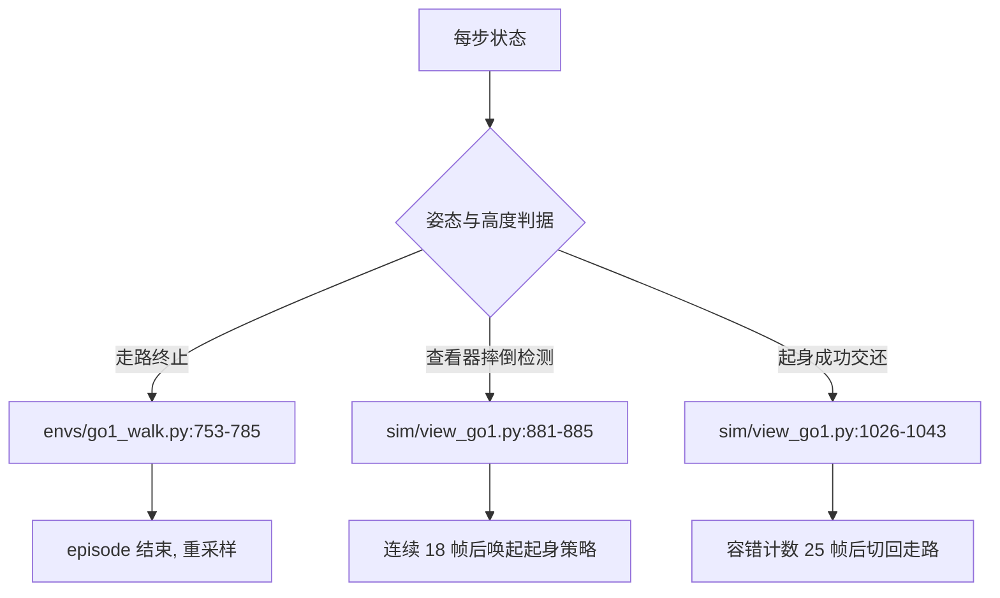
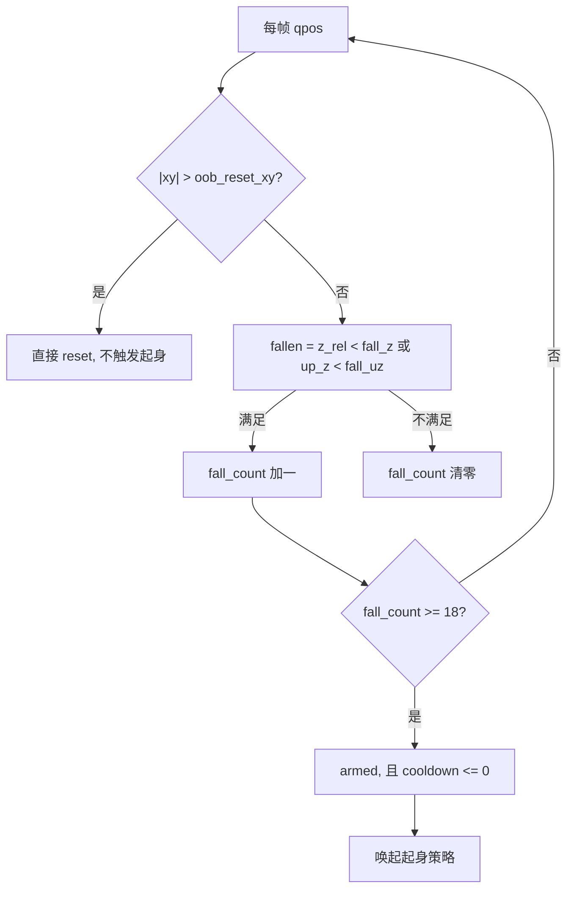
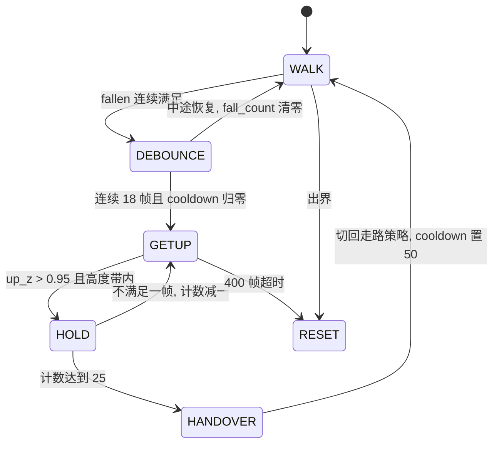

# 摔倒判据的三层口径

同一台 Go1 在三个环节里各自回答一次「是否摔倒、是否站住」：走路训练用它终止 episode，查看器用它决定是否唤起起身策略，起身阶段用它判断能不能交还给走路策略。三套判据都建立在两个量上，躯干 up 轴在世界 $z$ 方向的投影 $up_z$，以及躯干相对其正下方地面的高度 $z_{rel}$，但阈值、去抖方式与计数方式各不相同。

口径混用会造成量级差异。同一批 256 个 world、同样的起身策略，竖直度阈值取 $up_z>0.99$ 时「站起身成功」只有 1.6%，取 $up_z>0.95$ 时是 82.0%（`docs/experiment-log.md:6179-6182`）；交还计数从「严格连续 25 帧」改成「容错」后，从走路真摔倒姿态起身的成功率由 77.3% 升到 81.2%，到站时间由 5.71 s 降到 4.89 s（`docs/status.md:109-111`）。

## 走路终止判据比的是四元数分量

`envs/go1_walk.py:753-785` 的 `_is_healthy` 复刻参考仓库语义，由三件事合成：状态有限、相对高度落在区间内、四元数分量小于阈值。区间与阈值来自配置（`envs/go1_walk.py:306-308`）：

```python
    healthy_z_range=(0.22, 0.65),
    healthy_roll_range=10.0,   # deg
    healthy_pitch_range=10.0,  # deg
```

判定代码在 `envs/go1_walk.py:780-782`：

```python
    rad = jp.deg2rad(jp.float32(self._config.healthy_roll_range))
    healthy &= (jp.abs(q[1]) < rad) & (jp.abs(q[2]) < rad)
```

这里的 `q` 是归一化后的 `qpos[3:7]`，因此 `q[1]`、`q[2]` 是四元数的 $x$、$y$ 分量，不能当欧拉角读。四元数 $x\approx\sin(\mathrm{roll}/2)$、$y\approx\sin(\mathrm{pitch}/2)$，10° 的分量门限对应约 $\pm20°$ 的欧拉倾角，比字面宽一倍（`envs/go1_walk.py:760-763` 的注释写明了这一点）。

高度项在 v19 之后改成了相对地形。`envs/go1_walk.py:775-779` 先用双线性采样取躯干正下方的地形高度作 `z_ref`，再算 `z_rel = qpos[2] - z_ref`。原版直接用绝对 $z$，在总高差 0.30 m 的地形上，站在最高台阶（$z\approx0.58$）已贴近上界 0.65，随机出生到台顶会出生即终止（`envs/go1_walk.py:770-774`）。

| 项 | 取值 | 语义 |
| --- | --- | --- |
| 有限性 | `jp.isfinite` 全真 | 挡住 NaN 发散 |
| 相对高度 | $(0.22, 0.65)$ m | 站直约 0.277 m，躺地约 0.13 m |
| `healthy_roll_range` | 10.0 | 四元数 $x$ 分量阈值，等效 $|\mathrm{roll}|<20°$ |
| `healthy_pitch_range` | 10.0 | 四元数 $y$ 分量阈值，等效 $|\mathrm{pitch}|<20°$ |
| 终止 | `_is_healthy` 取反 | `envs/go1_walk.py:785` |



## 两个起身环境都关掉了姿态终止

起身任务的起点就是躺着，走路的姿态判据会把每一步都判死。两个起身环境的 `_is_healthy` 只留护栏，不给姿态与高度下限之外的任何约束。

单任务版在 `envs/go1_getup.py:140-151`：

```python
    finite = jp.isfinite(data.qpos).all() & jp.isfinite(data.qvel).all()
    gu = self._config.getup
    z_rel = data.qpos[2] - self._z_ref(data)
    in_bounds = jp.all(jp.abs(data.qpos[:2]) < gu.out_of_bounds_xy)
    return finite & in_bounds & (z_rel > gu.min_z_rel)
```

配置是 `out_of_bounds_xy=6.2`（hfield 半边长 6 m）与 `min_z_rel=-0.35`（`envs/go1_getup.py:90-91`）。文件头把原因写得很直接：走路那份判据在 $|\mathrm{roll}|,|\mathrm{pitch}|>17.5°$ 或相对高度不在 $(0.22,0.65)$ 时终止，起身任务全程都在这个区域外，不关掉就是「episode 秒死、奖励恒 0」（`envs/go1_getup.py:25-27`）。

公开配方版在 `envs/go1_getup_v2.py:181-190` 用同构的写法，护栏值不同：

```python
    finite = jp.isfinite(data.qpos).all() & jp.isfinite(data.qvel).all()
    in_bounds = jp.all(jp.abs(data.qpos[:2]) < self._oob)
    z_rel = data.qpos[2] - self._z_ref(data)
    return finite & in_bounds & (z_rel > self._min_zr)
```

它对应 `out_of_bounds_xy=5.8` 与 `min_z_rel=-0.30`（`envs/go1_getup_v2.py:96-97`），docstring 明确写了三条护栏的用途：NaN、跑出 hfield、陷进地里（`envs/go1_getup_v2.py:183-185`）。

| 环境 | 出界限 | 相对高度下限 | 姿态终止 | 依据 |
| --- | --- | --- | --- | --- |
| `envs/go1_getup.py` | 6.2 m | -0.35 m | 无 | `envs/go1_getup.py:90-91`, `:150-151` |
| `envs/go1_getup_v2.py` | 5.8 m | -0.30 m | 无 | `envs/go1_getup_v2.py:96-97`, `:188-190` |

## 摔倒检测的 up_z 定义与两个阈值

查看器每帧算一次摔倒判据，实现在 `sim/view_go1.py:881-885`：

```python
    upz_now = gk.up_z_from_quat(q_now[3:7])
    z_rel_now = z_rel_of(q_now)
    fallen = (z_rel_now < args.fall_z) or (upz_now < args.fall_uz)
    fall_count[0] = fall_count[0] + 1 if fallen else 0
    armed = fall_count[0] >= args.fall_debounce
```

两个量的权威定义在 `sim/getup_keyframe.py`。`up_z_from_quat` 取的是躯干 up 轴在世界 $z$ 方向的投影（`sim/getup_keyframe.py:111-114`）：

```python
    """躯干 up 轴在世界 z 的投影 (= R[2,2])。1=站正, 0=侧躺, -1=仰卧。"""
    w, x, y, z = [float(v) for v in quat]
    return 1.0 - 2.0 * (x * x + y * y)
```

离线探针在 `sim/probe_handover.py:66-67` 抄了同一个式子，写法是直接取 `qpos[4]`、`qpos[5]`，也就是四元数的 $x$、$y$ 分量。这里有一处命名需要留意：`docs/status.md:64` 把公式写成 $1-2(q_y^2+q_z^2)$，分量名写成了 $q_y$、$q_z$，与实现里的 $x$、$y$（`qpos[4]`、`qpos[5]`）不符。以代码为准，否则容易误以为要看四元数 $z$ 分量。

$up_z$ 与倾角的换算关系如下（`docs/status.md:66-72`）：

| $up_z$ | 倾角 | 含义 |
| --- | --- | --- |
| 1.00 | 0° | 完全竖直 |
| 0.99 | 8.1° | 旧硬编码判据，学习型策略基本做不到 |
| 0.95 | 18.2° | 当前默认口径（查看器 `--getup_up_th`、评估 `--up_th`） |
| 0.93 | 21.6° | 更宽 |
| 0.45 | 63° | 旧「摔倒」阈值，已废弃 |
| 0.30 | 72.5° | 当前摔倒阈值 |
| 0.00 | 90° | 侧躺 |

摔倒检测的三个默认值分散在参数表里：`--fall_uz 0.30`（`sim/view_go1.py:298`）、`--fall_z 0.16`（`sim/view_go1.py:281`）、`--fall_debounce 18`（`sim/view_go1.py:295`），冷却 `--getup_cooldown 50`（`sim/view_go1.py:356`）。0.16 m 的依据是站直约 0.277 m、躺地约 0.13 m（`docs/status.md:92`）。



## 去抖与冷却把踉跄和真摔倒分开

单帧判据在走路时会误触发。旧参数是 `--fall_uz 0.45`（倾角 63°）配 `--fall_debounce 8`（0.16 s），一次深度踉跄就能连续满足 8 帧；日志里三次误触发的 $up_z$ 分别是 +0.30、+0.21、+0.13，而躯干离地还有 0.20~0.25 m，属于"歪着但还站着"（`docs/experiment-log.md:6223-6225`）。

修法是把两个阈值同时收紧，并把冷却拉长（`docs/experiment-log.md:6227-6231`）：

| 参数 | 旧值 | 新值 | 依据 |
| --- | --- | --- | --- |
| `--fall_uz` | 0.45（63°） | 0.30（72.5°） | `sim/view_go1.py:298` |
| `--fall_debounce` | 8 帧（0.16 s） | 18 帧（0.36 s） | `sim/view_go1.py:295` |
| `--getup_cooldown` | 25 帧（0.5 s） | 50 帧（1.0 s） | `sim/view_go1.py:356` |

去抖成立的前提是踉跄与摔倒的时间尺度不同：踉跄只在一两帧内满足条件，真摔倒会一直满足。离线探针把同一套逻辑写成了 `fall_stats`（`sim/probe_handover.py:94-107`），其中 `bad = (Z < fall_z) | (U < fall_uz)`，计数器在任意一帧恢复时清零，超过 `deb` 帧才记一次摔倒。查看器与探针共用 `--fall_uz`、`--fall_z`、`--fall_debounce` 三个默认值（`sim/probe_handover.py:975-980`），这样离线数字才能直接对标现场。

## 交还判据是第三套口径

起身阶段能不能切回走路，由另一套判据决定（`sim/view_go1.py:1026-1043`）：

```python
    ok = ((upz > args.getup_up_th)
          and (args.getup_zlo <= zr <= args.getup_zhi))
    if ok:
        getup_hold_cnt[0] += 1
    else:
        getup_hold_cnt[0] = max(getup_hold_cnt[0] - 1, 0)
    if getup_hold_cnt[0] >= args.getup_hold:
```

参数是 `--getup_up_th 0.95`（`sim/view_go1.py:341-344`）、`--getup_zlo 0.20` 与 `--getup_zhi 0.34`（`sim/view_go1.py:347-349`）、`--getup_hold 25`（`sim/view_go1.py:351`）。25 帧按 `ctrl_dt=0.02` s 是 0.5 s（`sim/eval_getup.py:54-56`）。

只看 $up_z$ 不够。起身过程中会经过完全直立的中间姿态，关键帧方案在 P3a 阶段实测 $up_z=1.0000$ 而离地只有 5.9 cm（`sim/view_go1.py:1021-1023` 引用的实测），所以交还判据一定要带高度带。

计数方式是这一套口径里最容易忽略的部分。旧版任何一帧不满足就归零，等于要求严格连续 25 帧；新版满足 +1、不满足 -1 但不归零（`sim/view_go1.py:1034-1040`）。两种计数在 128 个真摔倒样本上的差距是 77.3% 与 81.2%，到站时间 5.71 s 与 4.89 s，26/29 个失败样本属于"已经站进高度带、中间掉出一两帧就归零"（`docs/experiment-log.md:6473-6485`）。



## 三层口径的对照

把三套判据并排放，差别集中在阈值、计数方式与用途三处：

| 层 | 实现位置 | 竖直度 | 高度 | 计数 | 用途 |
| --- | --- | --- | --- | --- | --- |
| 走路终止 | `envs/go1_walk.py:753-785` | 四元数 $x,y$ 分量 < 10°（等效 $\pm20°$） | $z_{rel}\in(0.22,0.65)$ | 单帧 | 终止 episode |
| 查看器摔倒检测 | `sim/view_go1.py:881-889` | $up_z<0.30$ | $z_{rel}<0.16$ | 连续 18 帧，冷却 50 帧 | 唤起起身策略 |
| 起身成功交还 | `sim/view_go1.py:1026-1043` | $up_z>0.95$ | $z_{rel}\in[0.20,0.34]$ | 容错计数 25 帧 | 切回走路策略 |
| 训练侧 metrics | `envs/go1_getup_v2.py:274-284` | $\cos\theta>\cos(28.6°)$ | $|z_{rel}-0.28|<0.08$ | 连续 25 步 | 一次性奖金，不终止 |

两处衔接需要单独说明。

交还发生在倾角约 13° 的姿态上，227 个起身终态的 $up_z$ 中位是 0.975（`docs/experiment-log.md:6365-6371`），落在走路终止带（等效 $\pm20°$）以内，所以交还后不会被立刻判成摔倒。这条在无显示器的环境下没有现场确认，需要在查看器里观察交还后的连续行走。

离线探针另有一处配置覆盖。`sim/probe_handover.py:222-223` 把 `healthy_roll_range` 与 `healthy_pitch_range` 都设成 17.5，按四元数分量语义等效 $\pm35°$。`docs/experiment-log.md:6188` 把它按字面写成"$|\mathrm{roll}|,|\mathrm{pitch}|<17.5$ 度"，与代码语义差一倍。以代码为准：17.5 是分量阈值，等效欧拉角是 35°。

训练侧那套判据只写进 `state.metrics` 并驱动一次性奖金（`envs/go1_getup_v2.py:277-284`），与查看器口径的差异是有意的：查看器要求 $up_z>0.95$ 且高度带窄，训练侧用 $28.6°$ 门控加 $\pm0.08$ m 的宽高度带，避免在训练时就出现窄判据的稀疏梯度。

## 常见误读与边界情况

| 误读 | 后果 | 依据 |
| --- | --- | --- |
| 把 `healthy_roll_range=10.0` 当成欧拉 10° | 低估可用倾角，误以为走路的容错比实际窄一半 | `envs/go1_walk.py:760-763` |
| 用绝对 $z$ 代替相对地形高度 | 高台出生即终止，阈值与地形幅度耦合 | `envs/go1_walk.py:770-774` |
| 摔倒检测用单帧判据 | 深度踉跄误触发起身 | `docs/experiment-log.md:6223-6225` |
| 交还只看 $up_z$，不带高度带 | 起身中途的直立姿态被当成"站住" | `sim/view_go1.py:1021-1023` |
| 把训练 metrics 当交付判据 | 与查看器口径不同，成功率对不上 | `envs/go1_getup_v2.py:274-276` |
| 出界后仍走摔倒检测 | 界外自由落体也满足 $fallen$，在半空唤起起身 | `sim/view_go1.py:864-878` |

## 小结

### 核心概念

* $up_z$ 是躯干 up 轴在世界 $z$ 方向的投影，等于倾角的余弦，定义在 `sim/getup_keyframe.py:111-114`。
* 走路终止用的是四元数 $x$、$y$ 分量阈值 10°，等效欧拉 $\pm20°$，高度判据相对地形（`envs/go1_walk.py:780-782`、`:775-779`）。
* 两个起身环境只保留 NaN、出界与相对高度下限三条护栏，不做姿态终止（`envs/go1_getup.py:150-151`、`envs/go1_getup_v2.py:188-190`）。
* 查看器摔倒检测是 $up_z<0.30$ 或 $z_{rel}<0.16$，连续 18 帧后武装，冷却 50 帧（`sim/view_go1.py:881-889`）。
* 起身成功交还是 $up_z>0.95$ 且 $z_{rel}\in[0.20,0.34]$，容错计数到 25 帧（`sim/view_go1.py:1026-1043`）。
* 判据必须与奖励同向：奖励侧的硬门会造成梯度悬崖，实测成功率因此停在 0（`envs/go1_getup.py:252-268`）。

### 设计权衡

| 选择 | 收益 | 代价 |
| --- | --- | --- |
| 走路终止用四元数分量而不是欧拉角 | 与参考仓库逐行一致，不引入三角函数 | 阈值语义比字面宽一倍，需要注释说明 |
| 起身环境关掉姿态终止 | 躺地起步的 episode 不会被秒杀 | 训练侧失去姿态约束，只能靠奖励塑形 |
| 摔倒检测用连续帧计数 | 把踉跄与真摔倒分开 | 真摔倒要等 0.36 s 才触发，起步略晚 |
| 交还计数容错不归零 | 成功率 77.3% 到 81.2%，到站时间缩短 0.8 s | 允许中间短暂掉出高度带，判据略宽 |
| 交还带高度带而不是只看倾角 | 排除起身中途的直立中间态 | 多一个需要标定的区间 |

## 练习

### 基础题

1. 写出 $up_z$ 与倾角 $\theta$ 的换算关系，并算出 $up_z=0.95$、$0.30$ 分别对应多少度。
2. 说明 `healthy_roll_range=10.0` 为什么等效欧拉 $\pm20°$，以及把它改成直接比较欧拉角需要动哪几行代码。
3. 摔倒检测为什么要同时对高度与倾角做判定，只用倾角会漏掉哪种姿态。

### 挑战题

4. 把交还判据的容错计数改成"最近 30 帧内至少 20 帧满足"，写出需要修改的函数与变量，并说明用 `sim/probe_handover.py --stage realfall` 的哪个输出指标判断改动是否有效。
5. 若把 `--fall_uz` 从 0.30 放宽到 0.45，预测误触发率的变化方向，并设计一组对照实验验证；说明要固定哪些参数才能与 `docs/status.md:117-125` 的数字对比。

## 附：本页引用的路径

| 路径 | 用途 |
| --- | --- |
| mjx-go1-getup/ | 仓库根目录，文中相对路径均相对它 |
| `envs/go1_walk.py` | 走路终止判据、相对地形高度与阈值配置 |
| `envs/go1_getup.py` | 单任务起身环境的三条护栏 |
| `envs/go1_getup_v2.py` | 公开配方版起身环境的护栏、站住 metrics 与成功奖金 |
| `sim/view_go1.py` | 查看器里的摔倒检测、起身调度与交还判据 |
| `sim/getup_keyframe.py` | $up_z$ 的权威定义与关键帧状态机 |
| `sim/probe_handover.py` | 离线复刻摔倒检测与交还流程的探针 |
| `sim/eval_getup.py` | 起身评估的竖直度阈值与连续步数口径 |
| `docs/status.md` | 三层判据的当前默认值与实测数字 |
| `docs/experiment-log.md` | §29.24 到 §29.28 的判据校准现场记录 |
