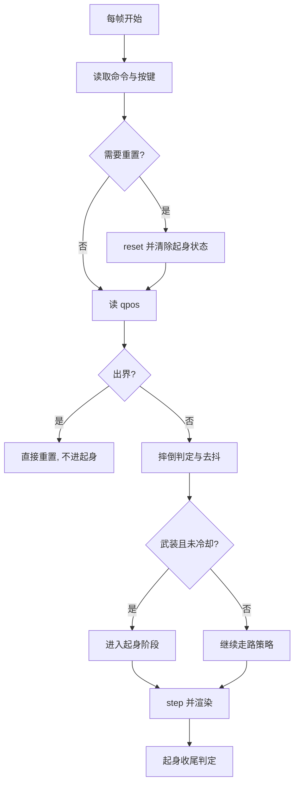
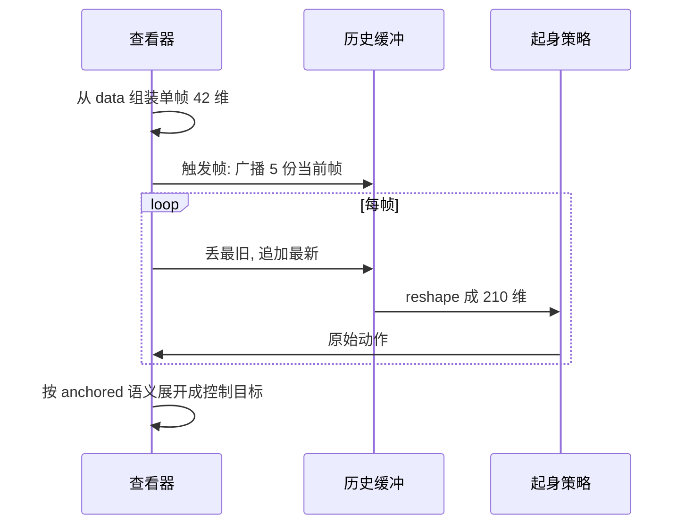

查看器不是“跑策略画画面”那么简单，它同时是一个状态机：判断机器人有没有倒、决定要不要唤起起身策略、起身期间怎么喂观测、站住之后怎么交还走路策略。这套调度逻辑全部写在 `sim/view_go1.py` 的主循环里，没有单独的模块。

它需要单独拆开来看，是因为调度器里的每个量都对应一次实测教训：去抖帧数对应误触发，出界分流对应半空挥腿，容错计数对应“看着站起来了却报失败”，交还混合对应的则是被数据否掉的一版修复。

## 调度器的状态变量

进入主循环之前，查看器先把调度器需要的全部状态装进几个单元素列表（用列表是为了在闭包里可变），共十一个（`sim/view_go1.py:802-820`）：

| 变量 | 含义 |
| --- | --- |
| `getup_active` | 当前是否处于起身阶段 |
| `fall_count` | 摔倒判据连续满足的帧数（去抖） |
| `cooldown` | 交还或超时后的冷却剩余帧数 |
| `getup_hold_cnt` | 起身后“站住”计数（判交还） |
| `getup_hist` | 最近 5 帧的历史观测缓冲，空表示待重建 |
| `getup_a_prev` | 低通滤波状态，触发时清零 |
| `getup_raw_prev` | 上一帧原始动作，触发时清零 |
| `getup_best` / `getup_best_ok` | 本次起身到过的最大 `up_z` 与高度带内的最大值 |
| `last_getup_act` | 起身最后一帧的控制目标，交还混合用 |
| `handover_from` / `handover_left` | 交还混合的起点与剩余帧数 |
| `oob_seen` | 出界提示只打印一次 |

历史缓冲那一组只在 `--getup_obs history` 下有意义，其余情况保持空值（`sim/view_go1.py:805-811`）。

## 一帧之内的处理顺序

顺序在循环体里是固定的（`sim/view_go1.py:853-1065`）：更新命令、处理手动重置、读当前位姿、出界判定、摔倒判定与触发、按阶段选择动作、步进物理、搬运渲染需要的数据、最后做起身收尾判定。

“最后做收尾”这一点很关键：交还判定用的是步进之后的 `qpos`（`:1024-1027`），因此它反映的是这一帧执行后的真实姿态，而不是上一帧的观测。把收尾判定放到 `step` 之前会引入一帧延迟，在计数型判据里会累积成偏差。

## 摔倒判定与去抖

判定只用两个量：躯干离正下方地面的相对高度 `z_{rel}` 与世界竖直投影 `up_z`，任一越界就算“倒下”（`sim/view_go1.py:881-884`）。连续满足帧数累加，不满足就归零（`:884`）。

默认阈值是 `--fall_z 0.16`、`--fall_uz 0.30`、`--fall_debounce 18`（`:281-298`）。18 帧按 0.02 秒的控制周期折算等于 0.36 秒，这个长度的作用是让深踉跄与真摔倒分开：单帧判据会在一次踉跄时误触发，而真摔倒会一直满足。

## 出界为什么不走起身

出界判定独立于摔倒判定，而且排在最前面（`sim/view_go1.py:864-878`）。地形半边长 6.0 米，界外没有地面，掉出去之后 `|qvel|` 每帧增加约 0.196（等于重力乘控制周期），几十秒后相对高度会到负两千米量级。

如果让这种状态走摔倒判据，机器人会在半空中被判定为倒，然后起身策略在半空挥腿——这正是抽搐的一个来源，而且要等 400 帧超时才重置。所以出界直接重置，并把冷却时间设满（`:871-875`）。

## 触发时清零的三样东西

进入起身阶段时清掉三样：历史观测缓冲、低通状态与上一帧原始动作（`sim/view_go1.py:895-897`）。这三样都是时序相关量，保留旧值等于把上一段轨迹的信息混进新一段。

`getup_hist = None` 表达的是“下一帧用五份当前帧重建”，与训练环境的 reset 行为同义（`:943-947`）。清零时机放在触发分支里，而不是每帧检查，是为了让重建只发生一次。

## 起身动作的三种语义

调度器支持三种动作语义，由 `--getup_action` 选择（`sim/view_go1.py:956-978`）：

| 语义 | 变换 | 对应训练环境 |
| --- | --- | --- |
| `anchored` | 裁剪、低通、再按 `default_pose + scale × a_f` 展开 | `envs/go1_getup_v2.py` |
| `incremental` | 在当前位置上叠加 `a × scale` | `envs/go1_getup.py` |
| `absolute` | 策略输出即控制目标 | 旧接口 |

三者不能混用：用错语义，同样的策略输出会被放大或缩小一个量级，表现就是“站着不动”或“乱挥”。

`residual` 是第四种模式，它同时在关键帧方案与学习策略上采样，把残差加在关键帧控制上（`:928-937`）。它与历史观测不兼容，启动时会直接报错退出（`:405-408`）。

## 历史观测缓冲的组装

`--getup_obs history` 下，查询器自己维护缓冲：每帧生成一帧 42 维特征，丢最旧、把最新追加在末尾，再拉平成 210 维喂给策略（`sim/view_go1.py:939-954`）。

缓冲的排列顺序必须与训练环境一致，否则策略看到的“时间方向”是反的。训练环境的做法是把单帧广播成五份作为初值，查看器照搬了这一点（`:943-947`）。

## 交还判据与冷却

交还要求两个条件同时成立并保持若干帧：竖直度超过 `--getup_up_th`，且相对高度落在 `[--getup_zlo, --getup_zhi]` 区间内。默认是 `0.95`、`[0.20, 0.34]`、计数门槛 25 帧（`sim/view_go1.py:1026-1043`）。

计数是容错的：满足加一，不满足减一但不归零（`:1039-1042`）。交还或超时后进入冷却 `--getup_cooldown` 帧，防止刚交还就又触发（`:1044-1045`）。混合交还默认关闭，只有显式设置帧数时才启用（`:990-993`、`:1055-1057`）。

## 诊断量

`getup_best` 与 `getup_best_ok` 记录本次起身两个“最接近成功”的时刻：前者是不管高度的最大 `up_z`，后者只统计高度在带内时的最大 `up_z`（`sim/view_go1.py:1029-1032`）。失败时打印它们，用来区分“根本没直起来”和“直起来了但高度不对”。

超时分支打印当前 `up_z`、离地高度与这两个最好值（`:1061-1065`）。没有这组诊断时，使用者只能看到“失败”，无法判断差在哪一项。

## 小结

### 核心概念

- 调度器的全部状态装在主循环前的几个可变容器里。
- 一帧顺序是命令、重置、出界、摔倒、动作、步进、收尾。
- 摔倒判定用相对高度与竖直度两个量，连续 18 帧才算武装。
- 出界与摔倒分流，界外直接重置以避免半空起身。
- 触发时清零历史缓冲、低通状态与上一帧原始动作。
- 三种动作语义必须与训练环境一致。
- 交还判据是竖直度加高度带加容错计数，随后进入冷却。

### 设计权衡

| 决策 | 选择 | 收益 | 代价 |
| --- | --- | --- | --- |
| 判据形式 | 连续帧计数 | 过滤踉跄 | 真摔倒晚 0.36 秒触发 |
| 出界处理 | 直接重置 | 不会半空挥腿 | 少一次“挣扎”机会 |
| 动作语义 | 三种可选 | 兼容多版环境 | 选错一个量级差 |
| 交还计数 | 容错不归零 | 成功率提高 | 判据略宽 |
| 混合交还 | 默认关闭 | 避免被推倒 | 交还瞬间目标跳变 |

## 练习

### 基础题

1. 列出一帧之内的处理顺序，并说明收尾判定为什么放在步进之后。
2. 说明 `--fall_debounce 18` 折算成多少秒，以及它的作用。
3. 解释出界为什么不能走摔倒判据去触发起身。

### 挑战题

1. 触发时清零的三样东西，如果漏掉历史缓冲会看到什么现象？写出验证方法。
2. 把交还判据改成“最近 30 帧内至少 20 帧满足”，说明需要改哪几个变量，并用 `sim/probe_handover.py --stage realfall` 的哪个输出判断效果。
3. 设计一组实验，比较 `anchored` 与 `incremental` 两种语义在同一策略文件下的行为差异。

## 附：本页引用的路径

| 路径 | 用途 |
| --- | --- |
| mjx-go1-getup/ | 仓库根目录，文中相对路径均相对它 |
| `sim/view_go1.py` | 调度器状态、每帧顺序、动作语义与交还判据 |
| `envs/go1_getup.py` | `incremental` 语义的训练侧实现 |
| `envs/go1_getup_v2.py` | `anchored` 语义、历史帧数与成功奖金 |
| `sim/probe_handover.py` | 离线复刻调度与交还流程的探针 |
| `docs/status.md` | 判据默认值与实测数字 |
| `docs/experiment-log.md` | §29.24 到 §29.28 的现场记录 |
