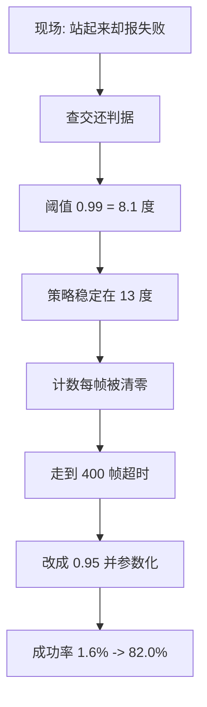
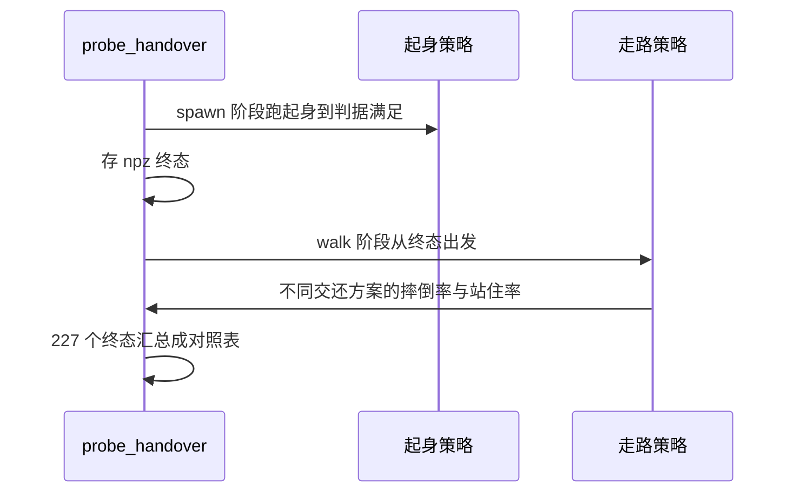

调度器的每个默认值都来自某一轮现场问题的结论。把它们按时间顺序排开，能看到一条清晰的链条：先发现判据永远不满足，接着发现两个阈值都太松，然后用量化探针把交还混合定死，最后在真摔倒分布上验证 82% 这个数字能不能搬进查看器。

这条链条的价值在于复用。以后调整任何一个阈值，都可以对照同一套量法：固定种子、固定环境数、固定判据口径，然后看成功率与到站时间怎么变。

## 交还判据硬编码导致的假失败

第一轮现场的表述是“站立效果很不错，但经常站立成功了却提示没成功”（`docs/experiment-log.md`）。根因在交还判据被写死成 `up_z > 0.99` 且高度带 `[0.24, 0.32]`（）。

而实测里学习到的策略稳定站在约 13 度倾角上，末态 `up_z` 中位数是 0.963（）。阈值 0.99 对应 8.1 度，策略根本做不到，于是每一帧计数都被清零，直到走到 400 帧超时分支打印失败。

第二处偏差是高度带下界。策略站住时相对高度中位数就在 0.24 附近，十分位约 0.20，所以即使放宽竖直度阈值，仍会有一半的帧因为高度差一点而归零（）。

## 两个阈值的量级差

把两个口径放在一起，差距是数量级的（`docs/experiment-log.md`）：

| 口径 | 站立成功 | 至少站住过一次 | 末态仍站着 | 到站时间 |
| --- | --- | --- | --- | --- |
| 新（`up_z>0.95`，高度 `[0.20,0.34]`） | 82.0% | 95.7% | 58.6% | 2.92 s |
| 旧（`up_z>0.99`，高度 `[0.20,0.34]`） | 1.6% | — | 7.0% | — |

分姿态看新口径：仰卧 80.0%、侧躺 78.4%、俯卧 87.1%、站立出生 94.4%（）。这说明口径放宽之后，效果对起始姿态并不敏感。

`up_z` 与倾角的换算关系是 `up_z = 1 - 2(q_y^2 + q_z^2)`，等于倾角的余弦（`docs/status.md`）。0.99 对应 8.1 度、0.95 对应 18.2 度，两个数在状态文档的对照表里（`docs/status.md`）。



## 误触发的两个来源

第二轮现场同时报了三件事：误触发、交还抽搐、走路变差（`docs/experiment-log.md`）。误触发的结论是摔倒判据两个阈值都太松：旧值 `--fall_uz 0.45` 对应 63 度，一次深度踉跄就能瞬间满足（）。

修法是把竖直度阈值收紧到 0.30（对应 72.5 度），并把去抖帧数从 8 提到 18。状态文档把这条写得很直白：走路时的一次踉跄也能瞬间满足旧阈值，而真摔倒会一直满足（`docs/status.md`）。

“走路变差”那一条的结论是方向搞反了：策略本身没变，看到的是判据与交还污染造成的错觉（`docs/experiment-log.md`）。这一类结论同样重要——它把改动范围限制在查看器里，避免了去动训练侧。

## 用探针把交还过程量化

第三轮的关键动作是写了一个离线探针 `sim/probe_handover.py`，把交还前后的过程从查看器里搬出来（`docs/experiment-log.md`）。探针提供四个阶段：`spawn`、`walk`、`cycle`、`realfall`（`sim/probe_handover.py`）。

`spawn` 从起身环境的训练分布出生，跑到满足判据后把状态存成 npz；`walk` 从这份 npz 出发跑走路策略，用来对照不同交还方案（`sim/probe_handover.py`）。探针与查看器共用同一份走路配置构造函数，其中明确写了 `njmax` 默认 256 是训练与查看器实际使用的值（）。

把过程搬进探针的好处是可控：环境数、步数、指令、判据全部由命令行固定，同一组实验可以反复跑。

一组对照实验的骨架可以短到这样（**示意**）：

```python
# 示意：只改一个变量，其余全部固定
for cfg in (no_blend, blend_10, blend_30, hold_last):
    rate = run(n_episodes=227, frames=150, config=cfg, seed=BASE_SEED)
    print(f"{cfg.name}: 摔倒率 {rate:.1%}")
```

对照实验的说服力来自「其余条件完全固定」：同一批起始状态、同一随机种子、同样的评估帧数，只有配置不同。所以先固定样本集（这里是 227 个起身终态），再换配置跑，才能把差异归因到配置本身。

## 十组对照把交还混合定死

终态诊断发现交还那一帧的动作是顶在裁剪上的发力状态：中位 `|a_f|` 等于 8.0，也就是等于裁剪上限，目标偏离关节实际位置 2.7 弧度（`docs/status.md`）。从这样一个目标开始做线性混合，等于先照着“发力顶住”的姿势驱动若干帧。

227 个起身终态、500 帧的对照结果（`docs/status.md`）：

| 方案 | 摔倒比例 | 末态站住 |
| --- | --- | --- |
| 不混合（当前默认） | 7.9% | 85.9% |
| 走路策略原生基线 | 8.4% | 92.1% |
| 混合 10 帧 | 38.3% | 59.5% |
| 混合 30 帧 | 73.6% | 35.2% |
| 一直保持起身最后目标 | 90.7% | 0.0% |

实验记录里同一组对照给出的数字是混合 10 帧 37.0%、混合 30 帧 73.1%、不混合 6.6%（`docs/experiment-log.md`）；两者相差不到一个百分点，来自样本集不同，结论方向一致。

结论是默认关闭混合，并删掉“把上一帧动作清零”的那处修改：清零等于告诉走路策略“我把十二个关节都命令到了零”，实测摔倒率 8.4%，而保留真值是 6.6%（`docs/status.md`、`docs/experiment-log.md`）。



## 真摔倒分布下的成功率

第四轮要回答的是“82% 能不能搬进查看器”。探针 `spawn` 用的是训练分布（地面以上 0.35 米自由落体加随机关节与朝向），而查看器里是从走路策略真的摔了的姿态开始（`docs/experiment-log.md`）。

`--stage realfall` 的做法分两段：先载入走路策略与起身策略，在查看器同款环境上一直走到摔倒，用连续 18 帧的判据冻结每个世界第一次摔倒的姿态；再从冻结姿态跑起身策略，最多 600 帧（）。

128 个界内真摔倒的结果是：严格连续 25 帧的成功率 77.3%，容错计数下 81.2%，到站时间从 5.71 秒降到 4.89 秒；总最好 `up_z` 均值 0.992、中位数 1.000，高度带内的最好值均值 0.974、中位数 0.999（`docs/experiment-log.md`）。

训练分布 88.7% 与真摔倒 77.3% 之间差 11 个百分点，属于分布差，但不改变量级判断（）。

## 失败形态的三种归类

同一批样本的失败分成三类（`docs/experiment-log.md`）：

| 形态 | 个数 | 含义 |
| --- | --- | --- |
| A 从未直起来 | 1 | 真的没起来 |
| B 直起来但高度不在带内 | 2 | 视觉上像站起来了 |
| C 满足过判据但没连续 25 帧 | 26 | 中间掉出一两帧就归零 |

主要形态是 C，占 26/29。这正是容错计数要解决的问题：满足加一、不满足减一、不归零，让短暂掉出高度带的帧不再抹掉之前的积累。放宽的代价很小，交还后的稳定性与走路原生基线接近（`docs/status.md`）。

## 掉出地形边缘是独立的灾难源

探针第一次跑的时候，128 个世界里 124 个都掉出了地形边缘，只有 4 个是界内摔倒（`docs/experiment-log.md`）。原因是地形半边长 6.0 米而出生范围是正负 5.0 米，最近离边缘只有 1 米；界外没有地面，自由落体几十秒后相对高度到负两千米量级。

在查看器里这条链条的表现是：默认指令下 8 到 16 秒走到边缘，掉出去，摔倒判据满足，触发起身，策略在半空挥腿，400 帧超时后重置。修法是新增 `--oob_reset_xy`（默认 5.8，与起身环境的出界值一致），超过就直接重置（`docs/experiment-log.md`）。

## 小结

### 核心概念

- 交还判据写死成 0.99 会让成功率从 82% 掉到 1.6%。
- 摔倒阈值的两个值都要收紧，去抖从 8 帧提到 18 帧。
- 离线探针把交还过程变成可重复的对照实验。
- 交还终态动作顶在裁剪上，混合会把人推倒，默认关闭。
- 真摔倒分布下的成功率 77.3%，容错计数提升到 81.2%。
- 主要失败形态是计数的连续要求，而不是起不来。
- 掉出地形边缘是独立的灾难源，要用出界判据分流。

### 设计权衡

| 决策 | 选择 | 收益 | 代价 |
| --- | --- | --- | --- |
| 竖直度阈值 | 0.95 | 成功率提升一个量级 | 判据放宽 |
| 去抖帧数 | 18 帧 | 过滤踉跄 | 触发晚 0.36 秒 |
| 交还方式 | 不混合 | 摔倒率接近基线 | 交还瞬间目标跳变 |
| 计数方式 | 容错不归零 | 减少假失败 | 判据略宽 |
| 出界处理 | 直接重置 | 消除半空起身 | 少一次挣扎机会 |

## 练习

### 基础题

1. 说明 `up_z=0.99` 与 `0.95` 各对应多少倾角。
2. 写出探针四个阶段各自的用途。
3. 解释容错计数与严格连续计数在失败形态 C 上的差别。

### 挑战题

1. 设计一轮校准实验，把摔倒阈值从 0.30 调到 0.25，说明要固定哪些参数才能与既有数字对比。
2. 说明为什么真摔倒分布下的成功率比训练分布低 11 个百分点，并给出至少两种缩小差距的办法。
3. 论证交还混合在什么条件下才可能有效，以及需要什么证据才能改默认值。

## 附：本页引用的路径

| 路径 | 用途 |
| --- | --- |
| mjx-go1-getup/ | 仓库根目录，文中相对路径均相对它 |
| `docs/experiment-log.md` | §29.24 到 §29.28 的现场记录与数字 |
| `docs/status.md` | 判据默认值、交还对照表与修复清单 |
| `sim/probe_handover.py` | 四个阶段、配置构造与量法 |
| `sim/view_go1.py` | 被校准的判据实现 |
| `envs/go1_getup_v2.py` | 成功判据与出界护栏 |
