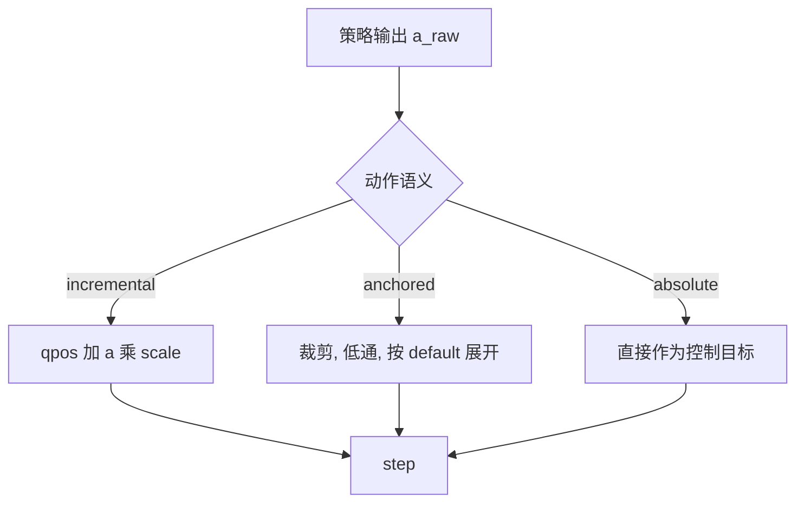
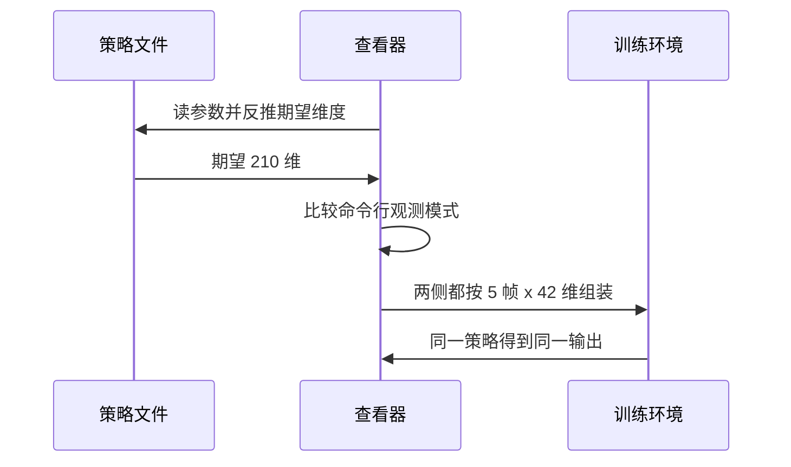

训练时策略看到的环境与查看器里重建的环境是两套代码：训练用 `envs/go1_getup_v2.py`，查看器用 `sim/view_go1.py` 里的调度器逐步复刻。复刻得对不对，取决于几个容易错位的地方——动作从策略输出变成控制目标的那一步、观测的拼法、以及终止条件。

对齐问题不会以“报错”的形式出现，而是以行为差异出现：训练里能站住的策略在查看器里乱挥，或者看起来站着但判据说没站起来。把两边的口径逐项列成表，是把这类问题变成可检查的问题的办法。

## 同一份参数走两套代码

查看器加载起身策略文件后，自己维护状态、自己组装观测、自己把动作展开成控制目标。训练环境则在 `step` 里完成同样三件事。两份实现的唯一纽带是策略文件里的参数，以及两侧共同遵守的变换约定（`sim/view_go1.py:956-978`、`envs/go1_getup_v2.py:259-264`）。

因此每一次改动训练侧的动作或观测，都要在查看器里找到对应行并同步；反过来也一样。判断同步是否完成的办法是同一策略在两边跑出相同的行为。

## 动作语义的三种口径

增量式是最早的口径：控制目标等于当前关节角加动作乘尺度（`envs/go1_getup.py:239-243`）。它的问题是策略输出依赖当前姿态，同一动作在不同姿态下效果不同。

锚定式是公开配方的口径：先裁剪动作，再对裁剪后的动作做低通，最后按默认姿态加尺度展开（`envs/go1_getup_v2.py:259-264`）。它输出的是相对默认姿态的偏移，与当前姿态无关。

绝对式是最简单的一档：策略输出直接作为控制目标。三种口径在查看器里分别对应 `incremental`、`anchored`、`absolute`（`sim/view_go1.py:956-978`）。

| 口径 | 控制目标 | 依赖当前姿态 | 对应环境 |
| --- | --- | --- | --- |
| `incremental` | `qpos + a × scale` | 是 | `envs/go1_getup.py` |
| `anchored` | `default + scale × a_f` | 否 | `envs/go1_getup_v2.py` |
| `absolute` | `a` | 否 | 旧接口 |

## 裁剪上限的两个默认值

锚定式有两个尺度参数：裁剪上限与展开尺度。训练配置里的裁剪默认是 3.0，展开尺度 0.5（`envs/go1_getup_v2.py:83-84`）。查看器的裁剪默认是 8.0，与某次训练实际使用的值一致（`sim/view_go1.py:327-329`、`docs/experiment-log.md:6172-6173`）。

这两个上限差 2.7 倍，用错会让策略的输出被放大或压缩。README 给出的评估命令显式写了 `--getup2_action_clip 8.0`（`README.md:78`），说明这份策略的训练值不是配置默认值。

| 位置 | 参数 | 默认 | 说明 |
| --- | --- | --- | --- |
| 训练配置 | `action_clip` | 3.0 | 环境配置里的值 |
| 查看器 | `--getup_action_clip` | 8.0 | 与训练实际运行值一致 |
| 评估 | `--getup2_action_clip` | 空 | 需要时显式覆盖 |

## 低通与历史动作

锚定式的低通系数在训练配置里是 0.8（`envs/go1_getup_v2.py:85`），查看器对应 `--getup_action_alpha`。两侧的递推式相同：新值等于系数乘当前动作加其余部分乘上一帧滤波值（`envs/go1_getup_v2.py:259-264`、`sim/view_go1.py:962-969`）。

存储的原始动作是裁剪后的值而不是滤波后的值，训练环境把它放进 `info["last_raw_act"]`（`envs/go1_getup_v2.py:263`、`:290`），查看器保存到 `getup_raw_prev`（`sim/view_go1.py:967`）。这一帧原始动作是历史观测的组成部分，存错就会让策略读到与自己上次输出不同的数值。

## 观测维度的 91 与 210

走路策略的观测是 91 维，其中包含 8 维步态相位；起身策略在历史模式下是 210 维，由 5 帧各 42 维拼成（`envs/go1_getup_v2.py:288-302`、`:80`）。两者形状完全不同，不能互换。

查看器为这件事专门做了一次检查：如果加载的起身策略期望历史维度而命令行没开 `--getup_obs history`，启动时给出明确提示而不是只报“维度不符”（`sim/view_go1.py:405-428`）。这条提示来自一次真实排查——当时的报错只说维度不符，使用者不知道要换参数。

## 终止护栏两侧不同

走路环境的健康判定同时看有限性、相对高度区间与四元数分量（`envs/go1_walk.py:753-785`）。起身环境把它简化为三条纯护栏：数值有限、不出界、相对高度不低于阈值，完全不做姿态终止（`envs/go1_getup.py:140-151`、`envs/go1_getup_v2.py:181-190`）。

原因很直接：起身任务的起点就是躺在地上，姿态终止会把起点判死。查看器的调度器里没有这层判定，它只在摔倒后决定是否唤起起身，因此两侧的“终止”语义不同，但不会互相干扰。

## 竖直度判据与局部法向

训练侧的站姿判据可以用世界竖直投影，也可以用法向点乘，由配置开关选择；v2 用世界投影，并额外加了一个门控：躯干与局部法向夹角小于 28.6 度时才给高度与站姿分（`envs/go1_getup_v2.py:92-94`、`:270-276`）。

查看器交还判据用的是世界竖直投影加上相对高度带（`sim/view_go1.py:1024-1027`）。在平地上两者一致，在地形上会有差别：门控按局部法向判断“站得正不正”，世界投影只判断“竖直与否”。这解释了为什么地形场景下的成功率与平地不完全可比。

## 约束预算 256 与约 1300

起身环境继承了走路档的 `njmax=256`（`envs/go1_walk.py:93-96`），而 hfield 地形上摔倒时单个世界实测需要的约束行数约 1300（`docs/status.md:170-174`）。探针的配置构造函数在注释里明确写了这一点，并说明这个量是每个世界独立的上限（`sim/probe_handover.py:209-213`）。

溢出不会直接让训练发散——状态文档记着 256 与 2048 两条曲线一致——但它影响摔倒瞬间的接触精度，进而影响起身起点姿态的分布（`docs/status.md:173-174`）。

## 默认值对照与同步清单

把容易错位的地方收成一张对照表，是这一篇最实用的部分：

| 项目 | 训练侧 | 推理侧 | 风险 |
| --- | --- | --- | --- |
| 动作语义 | `anchored` | `--getup_action` | 选错差一个量级 |
| 裁剪上限 | 3.0 配置默认 | 8.0 查看器默认 | 输出被放大或压缩 |
| 低通系数 | 0.8 | `--getup_action_alpha` | 行为偏软或偏硬 |
| 观测维度 | 210（5×42） | `--getup_obs history` | 维度不符或读到错位 |
| 站住判据 | 门控加世界投影 | 世界投影加高度带 | 地形上成功率不可比 |
| 竖直度阈值 | 训练用指标统计 | 查看器 0.95 | 与评估默认 0.99 不同步 |
| 约束预算 | 256 | 256 | 摔倒接触精度不足 |

最后一行需要留意的是评估脚本的竖直度默认值仍是 0.99，与查看器的 0.95 不同（`sim/eval_getup.py:59-62`）。跑评估时要显式传 `--up_th 0.95` 才能与查看器口径一致，这一点在状态文档里被记为当前默认口径，但代码里的默认值还没有跟上。

## 小结

### 核心概念

- 训练环境与查看器是两套代码，靠参数与变换约定对齐。
- 动作有增量、锚定、绝对三种语义，必须与训练侧一致。
- 裁剪上限的训练默认是 3.0，某次训练实际用 8.0，查看器默认取后者。
- 历史观测由 5 帧各 42 维拼成 210 维，与走路观测 91 维不同形。
- 起身环境不做姿态终止，只保留三条纯护栏。
- 训练侧站姿判据带局部法向门控，地形上与查看器口径不完全可比。
- njmax 256 低于摔倒时约 1300 的约束需求，影响接触精度。

### 设计权衡

| 决策 | 选择 | 收益 | 代价 |
| --- | --- | --- | --- |
| 查看器实现 | 复刻训练变换 | 行为一致 | 每次改动要双边同步 |
| 动作语义 | 三种并存 | 兼容历史版本 | 选错不易察觉 |
| 裁剪取值 | 跟随训练实际值 | 行为不失真 | 与配置默认不同 |
| 终止护栏 | 起身不做姿态终止 | 躺地起步有效 | 训练侧失去姿态约束 |
| 观测提示 | 启动时明确报错 | 少一次排查 | 代码分支更多 |

## 练习

### 基础题

1. 写出锚定式的完整变换式，并指出它与增量式的差别。
2. 说明 91 维与 210 维观测分别由什么组成。
3. 解释起身环境为什么关掉姿态终止。

### 挑战题

1. 给定一次“同一策略在查看器里动作幅度明显偏小”的现象，写出从语义与裁剪两项入手的排查步骤。
2. 设计一组对照实验，验证 njmax 从 256 提到 2048 对起身起点姿态分布的影响。
3. 论证把训练侧配置与查看器默认值集中到一份共享配置的取舍。

## 附：本页引用的路径

| 路径 | 用途 |
| --- | --- |
| mjx-go1-getup/ | 仓库根目录，文中相对路径均相对它 |
| `envs/go1_getup_v2.py` | 锚定式变换、观测帧与站姿判据 |
| `envs/go1_getup.py` | 增量式变换与三条护栏 |
| `envs/go1_walk.py` | 走路健康判定与 njmax 配置 |
| `sim/view_go1.py` | 推理侧的动作语义、历史观测与交还判据 |
| `sim/eval_getup.py` | 评估侧的竖直度与动作裁剪参数 |
| `sim/probe_handover.py` | 配置构造与 njmax 说明 |
| `docs/status.md` | 约束预算与判据默认值 |
| `README.md` | 评估命令中的显式参数 |
