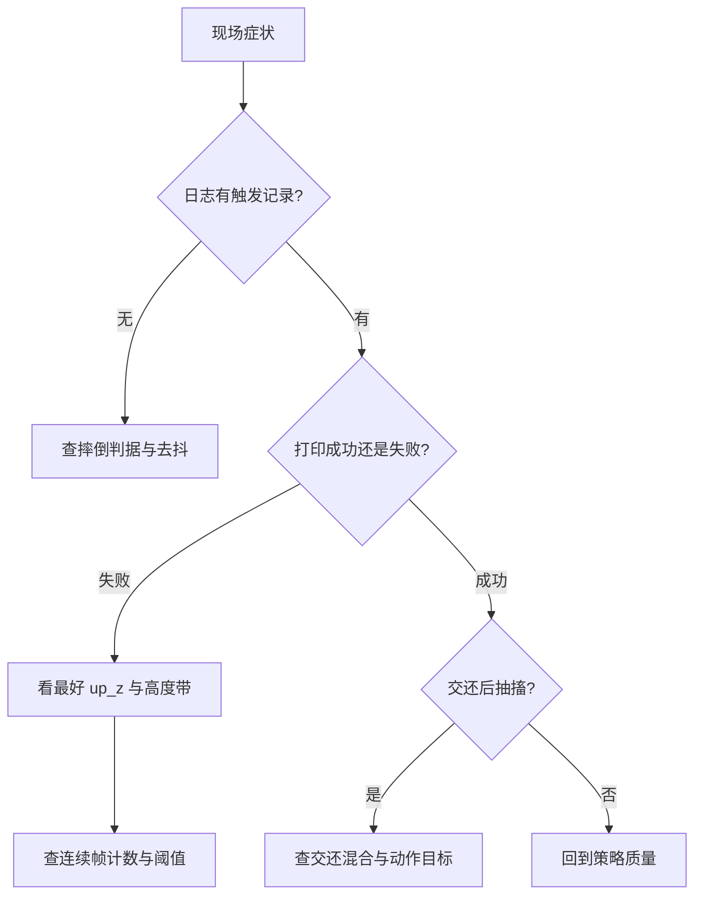
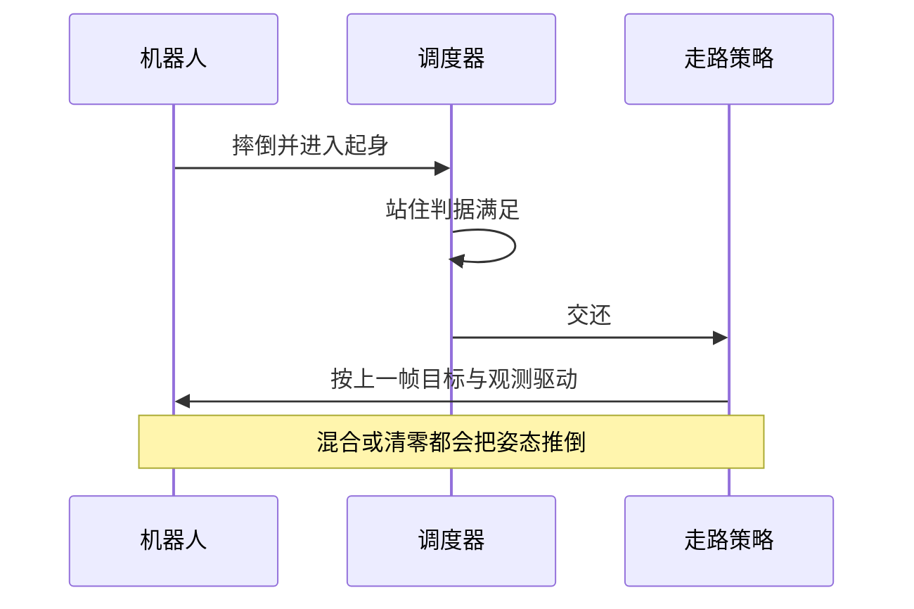

调度器的问题有个共同特征：报错信息很少，症状却很像“策略不行”。误触发看起来像策略乱动，假失败看起来像策略站不起来，抽搐看起来像物理不稳。原因往往在判据层，而不在策略层。

这一篇把已发生的现场问题按症状归类，每类给出它落在哪一层判据、怎么用日志或探针确认、以及改哪里。这样下次遇到同类症状时，可以先跳到对应的一类。

## 从症状回到判据层

拿到一个现场问题，先问三个问题：日志里有没有触发起身的记录？触发时的 `up_z` 与离地高度是多少？起身结束时打印的是“成功”还是“失败超时”？

查看器在触发时会打印当时的竖直度与离地高度，失败时会打印当前值与两个最好值（`sim/view_go1.py`）。这几个数字足以把问题定位到判据层：触发时的竖直度正常却仍然触发，说明摔倒阈值太松；失败时“高度带内最好值”很高，说明问题在连续帧计数。



## 误触发与漏触发

误触发的症状是“还能走路就触发了起身”。原因是摔倒判据的两个阈值太松或者去抖帧数太少：旧口径竖直度 0.45 对应 63 度，一次深度踉跄就能满足，去抖只有 8 帧（`docs/status.md`）。修法是收紧到 0.30 并把去抖提到 18 帧。

漏触发相对少见，症状是摔倒之后长时间没有起身，最后被超时分支重置。要注意默认动作是 `--fall_action getup`，另外两档 `getup_hold` 与 `reset` 会改变“失败之后怎么办”的行为（`sim/view_go1.py`），排查前先确认这一档的设置。

| 症状 | 可能的判据原因 | 确认方式 |
| --- | --- | --- |
| 走得好好就起身 | 竖直度阈值太松或去抖太少 | 看触发时打印的 `up_z` |
| 摔倒后不动 | 动作档位设成 reset 或 getup_hold | 查命令行与日志 |
| 反复触发重置 | 冷却太短 | 看冷却参数与触发间隔 |

## 看着站起来却报失败

这是被报告最多的一类。症状是画面上机器人已经直立，日志仍打印失败并最终重置。判据层的原因是交还判据的三个量之一没满足：竖直度阈值、高度带区间、或连续帧计数（`sim/view_go1.py`）。

第一轮的根因是阈值写死成 0.99，对应 8.1 度，而策略稳定站在约 13 度（`docs/experiment-log.md`）。第二轮剩下的部分在计数方式：失败样本里 26/29 是“站进过高度带，中间掉出一两帧就归零”（）。修法是把计数改成容错，不满足时减一而不是清零。

确认手段是看失败时打印的两个最好值：`getup_best` 高而 `getup_best_ok` 低，说明直起来了但高度不在带内；两个都高却仍失败，说明卡在计数。

## 抽搐的两个来源

抽搐有两个互不相干的来源。第一个是半空挥腿：机器人掉出地形边缘后仍在自由落体，摔倒判据满足并触发起身，策略在半空中挥腿（`docs/experiment-log.md`）。修法是新增出界判据，超过就重置而不进起身（`sim/view_go1.py`）。

第二个是交还污染。曾经把上一帧动作清零并默认开启交还混合，前者等于告诉走路策略“我把十二个关节命令到了零”，后者让走路策略先按起身末态那个顶在裁剪上的目标驱动若干帧（`docs/status.md`）。两项都被实测否定，默认值回退。

| 来源 | 触发时机 | 判据层的修法 |
| --- | --- | --- |
| 半空挥腿 | 出界之后 | 出界直接重置 |
| 交还污染 | 起身转走路的头几十帧 | 不混合、不清零动作 |



## 出界造成的假起身

出界与摔倒的判据形式不同：出界比较 `|xy|` 与阈值，摔倒比较相对高度与竖直度（`sim/view_go1.py`）。两者的优先级也不同——出界排在最前面，一旦成立就重置并跳过摔倒判定。

调这个阈值时要注意它与地形尺寸的关系：地形半边长 6.0 米，默认阈值 5.8 米，也就是在离边缘 0.2 米处就重置（`sim/view_go1.py`、`docs/experiment-log.md`）。把阈值放大到接近 6.0 会让机器人在边缘附近才重置，留给自由落体的时间变多。

## 离线探针的约束

探针 `sim/probe_handover.py` 是验证调度改动的首选工具，但它有自己的约束。第一，`spawn` 阶段必须先 `--dump` 一份终态 npz，`walk` 与 `cycle` 阶段从它出发，跨阶段不传文件就没法对照（`sim/probe_handover.py`）。

第二，`realfall` 阶段必须限制越界世界原地重生，否则整批环境会在十几秒后一起走出地形边缘，测到的全是自由落体（`docs/experiment-log.md`）。第三，探针的配置构造函数固定了 `njmax` 等参数，改这些值要显式传参，否则与查看器不同源（`sim/probe_handover.py`）。

## argparse 里的百分号转义

参数帮助文本里的百分号会被 argparse 当成格式化符号，只写一个会在启动时抛错。源码注释给出了结论：字面百分号要写两遍（`sim/view_go1.py`、`train/train_go1.py`）。

```python
ap.add_argument("--handover_blend", type=int, default=0,
                help="... 摔倒率: 不混合 6.6%% / blend10 37.0%% / blend30 73.1%%")
```

这类问题只在看帮助文本或启动解析时暴露，因此改动帮助字符串之后要跑一次 `--help` 确认退出码为 0（`docs/experiment-log.md`）。

## 冷却时间与重复触发

冷却在三个分支里都会被设满：出界重置之后、摔倒但动作档位是重置时、以及起身交还或超时之后（`sim/view_go1.py`）。默认 50 帧，按控制周期折算等于 1 秒（`docs/status.md`）。

冷却太短的后果是刚交还就再次触发起身，表现为机器人反复躺下又尝试起身；冷却太长的后果是摔倒之后要在地上多等一会。调这个值时最好配合一次 `--stage realfall` 的对照，看触发次数与到站时间怎么变，而不是只凭手感。

| 取值 | 行为 | 风险 |
| --- | --- | --- |
| 20 帧左右 | 交还后很快可再触发 | 可能反复起身 |
| 50 帧（默认） | 一秒内不重复触发 | 无实测问题 |
| 120 帧以上 | 摔倒后等待较久 | 观感变差 |

## 交付前的核对清单

改动调度器或判据之后，按四项核对：跑一次 `--help` 确认参数解析正常；用 `--stage realfall` 跑一轮，对照成功率与到站时间；确认出界阈值与地形尺寸匹配；确认交还混合保持关闭。

四项都过再去看具体行为，避免把参数问题误判成策略问题。

## 小结

### 核心概念

- 调度问题的症状常伪装成策略问题，先定位到判据层。
- 误触发来自阈值与去抖，漏触发先查动作档位。
- 假失败的两种原因：阈值写死与连续帧计数归零。
- 抽搐有两个来源：出界后的半空挥腿与交还污染。
- 出界判据优先于摔倒判据，阈值要与地形尺寸匹配。
- 探针跨阶段依赖 npz，真摔倒阶段要限制越界重生。
- argparse 帮助文本里的百分号要转义。

### 设计权衡

| 决策 | 选择 | 收益 | 代价 |
| --- | --- | --- | --- |
| 触发判据 | 收紧阈值加去抖 | 减少误触发 | 触发晚 0.36 秒 |
| 失败诊断 | 打印最好值 | 定位快 | 多几行输出 |
| 出界优先 | 直接重置 | 消除半空起身 | 少一次挣扎机会 |
| 探针验证 | 离线固定参数 | 可重复对照 | 需要传 npz |

## 练习

### 基础题

1. 列出把现场症状定位到判据层的三个问题。
2. 说明抽搐的两个来源与各自的修法。
3. 解释 argparse 帮助文本里为什么要写两个百分号。

### 挑战题

1. 写一份调试记录模板，覆盖触发值、成功值与失败诊断三组输出。
2. 给定一次“出界后仍触发起身”的报告，说明要检查哪一行代码与哪个参数。
3. 论证把探针的配置构造函数与查看器共享的收益与风险。

## 附：本页引用的路径

| 路径 | 用途 |
| --- | --- |
| mjx-go1-getup/ | 仓库根目录，文中相对路径均相对它 |
| `sim/view_go1.py` | 判据实现、诊断打印、参数帮助与出界分流 |
| `sim/probe_handover.py` | 探针阶段与配置构造 |
| `train/train_go1.py` | 帮助文本百分号转义的另一处 |
| `docs/status.md` | 修复清单与实测数字 |
| `docs/experiment-log.md` | §29.24 到 §29.28 的现场记录 |
