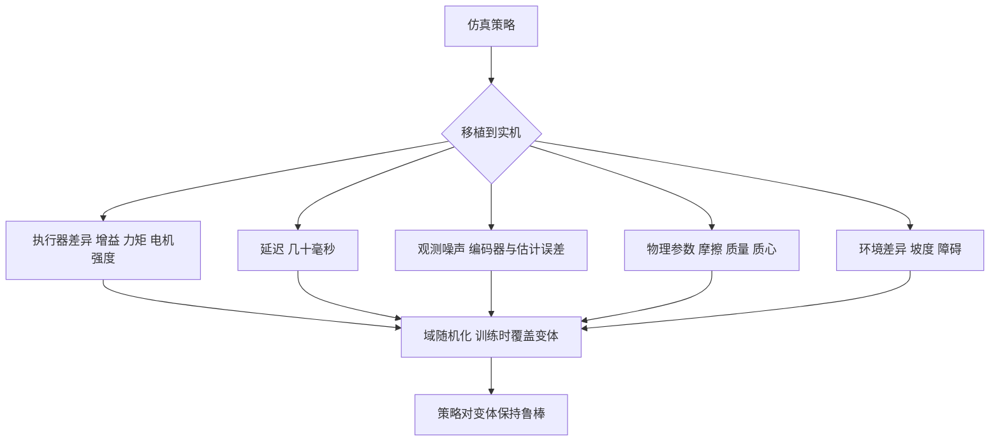

# 从仿真到实机差在哪

一个在仿真里成功率七成的策略，直接放到机器人上往往第一步就摔。原因在于仿真的世界与真实世界在若干处不同，而不是算法错了：关节不是理想的力矩源，指令到达有延迟，传感器读数带噪声，地面摩擦与机器人质量也和建模时不一样。域随机化的做法是在训练时把这些量随机化，让策略见过足够多的「世界变体」，从而对真实世界的那一份差异保持鲁棒。

本项目的定位需要说明清楚：它的目标是把仿真里的起身与走路做对，不追求实机部署。因此域随机化的部分只做到「小幅扰动与传感器噪声」这一层，公开记录里也把更完整的随机化列成待办。差距里哪些是本项目已经处理过的、哪些仍是待办，需要逐项对照开关状态才能分清。

## 差距的五个来源

公开工作的随机化项可以按来源归类，每一类对应一种真实的失配（`docs/getup-recipes.md` 与 ）：

| 来源 | 具体差异 | 公开的随机化范围 |
| --- | --- | --- |
| 执行器 | 增益、力矩上限、电机强度与建模值不同 | 增益乘 0.85 到 1.15，电机强度取 0.9 到 1.1，力矩有比例噪声 |
| 延迟 | 指令与反馈在链路里有几十毫秒延迟 | 控制延迟取 0 到 100 ms，或折算成若干控制步 |
| 观测 | 编码器噪声、姿态估计误差、速度估计误差 | 各通道按量级加均匀噪声 |
| 物理参数 | 摩擦、恢复系数、质量、质心位置 | 摩擦取 0.1 到 1，恢复系数取 0 到 1，质心偏移几十毫米 |
| 环境 | 地面坡度、障碍高度、地形材质 | 坡度从 0 到 45 度，障碍高度逐步加大 |

这五类里，执行器与延迟对四足的影响最直接：位置控制回路的稳定裕度对增益与延迟都敏感，同样的目标关节角在不同增益下会得到不同的实际轨迹。观测噪声影响的是策略的输入分布，物理参数与环境影响的是动力学与接触。

## 本项目的位置

第二版起身环境的文件头明确写了三处「有意差异」：不开动作噪声与观测噪声（先拿干净基线）、没有状态估计模块与高度图特权、高度扫描用的是高度场双线性采样而不是射线投射（`envs/go1_getup_v2.py`）。第一条正是域随机化尚未接入的直接证据。

域随机化不是单独加几条噪声就完事，它与训练规模是配套的：随机化范围越宽，策略需要见过的样本越多。公开工作用几千个并行环境配合上亿步训练，正是为了覆盖这些变体；并行环境数不足时贸然放宽随机化，常见表现是收敛变慢甚至不收敛。本项目的记录里，训练规模与随机化两项缺口是被并列写在一起的。

走路侧的情况不同。走路环境在 v19 之后已经接入了随机出生、周期外力推挤与观测噪声三个开关，默认关闭、由命令行打开（`envs/go1_walk.py`）。因此域随机化在本项目里走路有、起身没有，两边的成熟度不同。

## 随机化与课程的关系

域随机化的范围本身可以当作课程轴。公开工作的做法普遍是先把任务在窄分布上学会，再逐步放大随机化范围（`docs/getup-recipes.md`）。

| 阶段 | 随机化范围 | 目的 |
| --- | --- | --- |
| 发现阶段 | 窄分布、弱正则 | 先学会动作 |
| 泛化阶段 | 放宽姿态与地形 | 覆盖更多起点 |
| 鲁棒阶段 | 加执行器、延迟与观测噪声 | 抵抗真实失配 |

三个阶段的顺序不能颠倒。在动作还没学会时加满随机化，策略拿不到稳定的学习信号；反过来，如果只在窄分布上训练到收敛，再加随机化需要重新学习，前面的算力白花。项目记录里对起身任务给出的正是两阶段配方，第一阶段在规范姿态上发现动作，第二阶段才放开初始分布（`docs/getup-recipes.md`）。

域随机化还有一个容易被忽略的代价：它改变了最优策略。在带噪声的观测下训练出来的策略会学到「如何在噪声里活下来」，而这个最优解在去噪之后反而更差（`docs/experiment-log.md`）。项目在分析关键帧残差退化时发现的就是这类噪声鲁棒性错配，结论是噪声量级必须按真实传感器的规格来定，而不是越大越好。

## 随机化项清单

把公开的随机化项逐条对照本项目的实现状态，可以清楚地看到缺口在哪（`envs/go1_walk.py` 与 `docs/experiment-log.md`）：

| 随机化项 | 本项目状态 | 取值或位置 |
| --- | --- | --- |
| 随机出生位置与朝向 | 已实现（走路） | xy 正负 5 m，yaw 全向，出生速度正负 0.3 |
| 周期外力推挤 | 已实现（走路） | 每 250 步一次，水平速度正负 0.5 m/s |
| 观测噪声 | 已实现（走路） | 线速度 0.05，角速度 0.05，重力 0.02，关节角 0.01，关节速度 0.15 |
| 高度扫描噪声 | 已实现 | 均匀分布半宽 0.02 m，乘缩放后约正负 0.10 |
| 动作噪声 | 未实现（起身） | 第二版明确不开 |
| 执行器增益与力矩随机化 | 未实现 | 公开配方有，本项目无 |
| 摩擦、质量与质心随机化 | 未实现 | 公开配方有，本项目无 |
| 控制延迟随机化 | 未实现 | 公开配方有，本项目无 |

这张表说明缺口的性质：已经有的三项都属于「输入侧扰动」，缺的四项都属于「动力学与执行器侧随机化」。后者的实现难度更高，因为它要求把增益、质量与延迟写成可采样的参数，而当前的模型把这些量写死在场景文件里。

还有一项配套缺口是规模。公开工作的 4096 个并行环境与 98M 到 787M 步量级是本项目 768 环境、204M 步的若干倍，而这个倍数与随机化范围是互相牵制的：随机化越宽，策略需要见过的样本越多，环境数不足时很难收敛（«docs/experiment-log.md»）。

另一条需要记录的边界是评估口径。项目的评估脚本默认关闭推挤与观测噪声，因此现有的所有成功率都是干净条件下的平均表现（`docs/experiment-log.md`）。这意味着即使实现项已经接通，鲁棒性也还没有被度量过。

## 真机验证的位置

以上讨论的前提是有实机可验证。本项目没有实机环节，因此所有与实机相关的结论都只能停在「按公开配方」这一层（按素材调研笔记，本仓库未做真机验证）。

$$
\text{仿真成功率} \Rightarrow \text{待验证}, \qquad \text{实机成功率} = \text{本仓库未做}
$$

项目在文档里对这一点保持诚实：公开工作报了实机结果，本项目只报仿真口径的成功率，并且在总结里把规模与随机化列为未完成的差距（`docs/experiment-log.md`）。

还有一条经验要写进流程：随机化的每一项都要能追溯到来源，是硬件实测、公开配方还是通用做法。来源不清的范围无法判断是否适用于自己的平台，也无法在结论不符时定位是范围问题还是实现问题（按通用做法，本仓库未建立该记录）。

## 小结

### 核心概念

- 仿真与实机的差距来自执行器、延迟、观测、物理参数与环境五个方面。
- 公开工作的随机化范围：增益乘 0.85 到 1.15、控制延迟 0 到 100 ms、摩擦 0.1 到 1、坡度 0 到 45 度。
- 第二版起身环境明确不开动作与观测噪声，是为拿到干净基线，域随机化属于未接入的部分。
- 走路环境已接入随机出生、周期外力推挤与观测噪声，默认关闭由命令行打开，比起身侧成熟。
- 域随机化应当作为课程逐步放开，并且量级按真实传感器规格确定，过大会改变最优策略。

### 设计权衡

| 选择 | 带来的能力 | 付出的代价 |
| --- | --- | --- |
| 先干净基线再加随机化 | 学习信号稳定、结论可归因 | 需要两轮以上的训练 |
| 随机化范围当课程轴 | 从易到难、可控 | 需要阶段管理与续训 |
| 加观测噪声 | 抗传感器误差 | 可能学到噪声下的次优解 |
| 加执行器与延迟随机化 | 最贴近真实链路 | 收敛变慢、需要更多步数 |
| 不做实机验证 | 省去硬件环节 | 所有迁移结论只能引用公开工作 |

## 练习

### 基础题

1. 列出仿真与实机差距的五个来源，各举一个具体例子。
2. 说明本项目走路侧与起身侧在域随机化上的成熟度差别。
3. 解释为什么域随机化要作为课程逐步放开。

### 挑战题

4. 为一个四足起身任务设计三阶段随机化课程，写出每阶段的范围与判据。
5. 分析观测噪声量级过大时会发生什么，给出按传感器规格选量级的方法。
6. 设计一套判断仿真策略是否具备迁移能力的实验，说明没有实机时的替代做法。

## 附：本页引用的路径

| 路径 | 用途 |
| --- | --- |
| `mjx-go1-getup/docs/getup-recipes.md` | 公开工作的随机化范围、两阶段课程、噪声语义 |
| `mjx-go1-getup/envs/go1_getup_v2.py` | 第二版的有意差异与不开噪声 |
| `mjx-go1-getup/envs/go1_walk.py` | 走路侧的三个鲁棒性开关 |
| `mjx-go1-getup/docs/experiment-log.md` | 未完成的域随机化清单、噪声鲁棒性错配 |
| `~/mujoco` | 素材仓库根，正文中素材路径均相对该根；外部实现的数字经素材调研笔记转引 |
