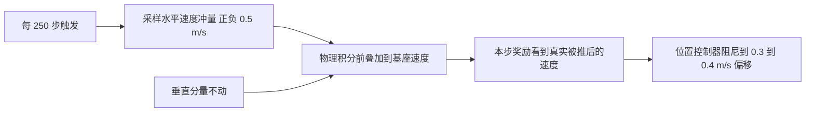
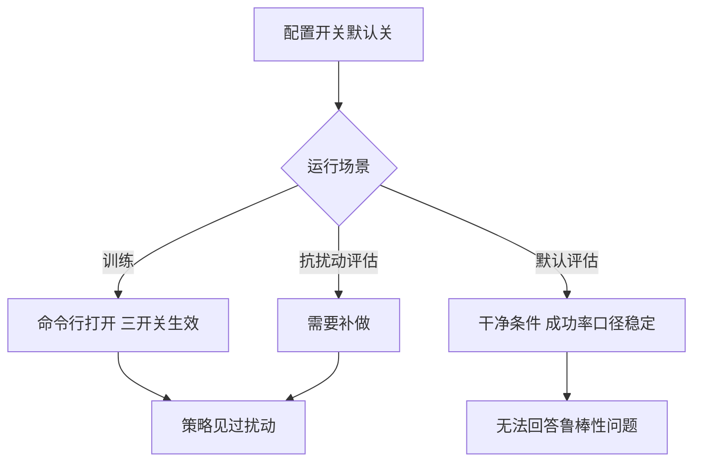

# 扰动与观测噪声的工程实现

域随机化的概念容易讲，落到代码里却要回答一串具体问题：噪声加在哪一步、加在哪个坐标系、量纲是什么、是否只加给 actor、默认开还是关。这些细节决定了随机化是有效的鲁棒性训练，还是给策略喂了一堆无法解释的输入。

本项目走路环境里的实现可以作为一份参考：三个开关都做成配置块、默认关闭、由命令行打开，每一项都注明了参考来源。以下按开关逐个说明取值与注入位置，并解释几个容易写错的地方。

## 三个开关的位置

三个鲁棒性开关都在环境配置里（`envs/go1_walk.py:376-397`）：

| 开关 | 配置名 | 默认 | 作用 |
| --- | --- | --- | --- |
| 随机出生 | random_init | 关（地形训练时自动开） | 出生位置、朝向、速度随机 |
| 外力推挤 | push_config | 关，命令行打开 | 周期性给基座水平速度冲量 |
| 观测噪声 | obs_noise | 关，命令行打开 | 给 actor 的传感器通道加均匀噪声 |

三个开关默认关闭的理由是保持干净基线：训练脚本在需要鲁棒性时再打开，评估脚本默认关掉，这样成功率的口径不会因为噪声而漂移。项目记录里明确写了「推挤与观测噪声默认关，可开；训练时它们是开的」（`docs/experiment-log.md:3691` 附近）。

$$
\text{默认关闭} \Rightarrow \text{干净基线}, \qquad \text{训练时打开} \Rightarrow \text{鲁棒性训练}
$$

## 随机出生的取值

随机出生是地形训练的硬前提。项目记录里的原因很直接：如果出生位置不随机，8192 个环境会全部挤在原点周围半径 0.5 m 的压平区里，永远见不到台阶与楼梯，也就学不会爬梯（`envs/go1_walk.py:377-379` 转引项目实验记录）。

| 参数 | 取值 | 说明 |
| --- | --- | --- |
| 平面范围 | 正负 5 m | 避开正负 6 m 的地形边界 |
| 朝向 | 全向随机 | 与机体系指令自洽 |
| 出生高度 | 地面高度加 0.35 m | 取默认站立关键帧的高度 |
| 出生速度 | 正负 0.3 m/s 与 rad/s | 模拟落地后的残余速度 |

另外在重置时还有一层小幅噪声：关节位置加正负一个尺度参数的均匀噪声，控制目标加同量级的正态噪声（`envs/go1_walk.py:791-800`）。这层噪声的作用是让同一批并行环境不会以完全相同的状态开始，避免梯度估计在初值上重复。

## 外力推挤的注入位置

推挤的实现要点在于注入位置。项目在物理积分之前给基座叠加水平速度，这样本步奖励看到的速度是「真被推了」之后的真实值，物理上自洽（`envs/go1_walk.py:913-928`）。

| 参数 | 取值 | 说明 |
| --- | --- | --- |
| 间隔 | 250 步等于 5 秒 | 周期性施加 |
| 幅度 | 水平速度正负 0.5 m/s | 作为冲量等效速度 |
| 方向 | 仅水平两维 | 不动垂直分量 |

只动水平两维是一个刻意选择。如果在垂直方向伪造速度，垂直速度成本项会被误触发，奖励会对一个物理上不存在的状态做出反应（`envs/go1_walk.py:913-918`）。

实测验证了两个细节：速度跳变恰好落在第 249、250 步与 500、501 步，间隔正确；0.5 m/s 的踢入被位置控制器阻尼到 0.3 到 0.4 m/s 的实际偏移（`docs/experiment-log.md:2222-2226`）。第二条说明「施加的速度冲量」与「实际发生的位移」不是一个量，写判据时要用后者。

## 观测噪声的量级口径

观测噪声的量级不能直接给绝对物理量，而要按「已缩放的观测」量级给出。项目的实现与 legged_gym 的噪声尺度函数同构：每个通道的噪声幅度等于噪声系数乘该通道的缩放系数，采样为均匀分布的正负幅度（`envs/go1_walk.py:1050-1065`）。

| 通道 | 噪声系数 | 缩放系数 | 说明 |
| --- | --- | --- | --- |
| 机体线速度 | 0.05 | 2.0 | 米每秒 |
| 机体角速度 | 0.05 | 0.25 | 弧度每秒 |
| 投影重力 | 0.02 | 无 | 单位向量分量 |
| 关节角 | 0.01 | 1.0 | 弧度 |
| 关节速度 | 0.15 | 0.05 | 弧度每秒 |

按缩放量级给出的好处是噪声与观测的实际有效范围成比例：缩放小的通道绝对噪声也小，不会出现某个通道被噪声淹没的情况。参考来源是同构的公开实现，项目在配置注释里写明了这一条的出处（`envs/go1_walk.py:1050-1058`）。

有两个通道刻意不加噪声：指令与上一步动作。理由是指令是策略自己下的、上一步动作是策略自己输出的，两者都没有传感器误差（`envs/go1_walk.py:1052-1058`）。这一条容易被忽略，把噪声加到自产信号上会让策略学不到正确的动作记忆。

噪声只加给 actor，critic 拿到的是干净观测（`envs/go1_walk.py:1120-1131`）。这样价值函数在无噪信号上估计，策略在带噪信号上决策，符合非对称结构的分工。

## 高度扫描噪声

高度扫描是地形感知的输入，项目对它单独加了一层噪声：均匀分布半宽 0.02 m，乘以特征缩放 5.0 之后相当于正负 0.10 的特征量（`envs/go1_walk.py:355-372` 与 `docs/experiment-log.md:2230-2234`）。

| 项 | 取值 | 作用 |
| --- | --- | --- |
| 噪声半宽 | 0.02 m | 扰动地面高度读数 |
| 特征缩放 | 5.0 | 米制差转特征 |
| 特征量级 | 正负 0.10 | 与关节角、重力特征可比 |
| 适用范围 | 仅 actor | critic 用干净值 |

这项噪声的目的在配置注释里写得很清楚：训练时扰动地面高度，避免策略过拟合精确地形，同时也是迁移到真实地面的关键（`envs/go1_walk.py:367-372`）。公开实现里的对应做法是射线投射漂移，量级更大。

$$
0.02 \; \text{m} \times 5.0 = \pm 0.10 \; \text{特征量}
$$

「0.02 m 听起来很小」是一个量级误判：经过缩放之后它在特征空间里并不小，与关节角特征同量级。判断噪声大小要看它落在哪个空间。

## 开关状态与评估口径

三个开关的默认状态与评估口径之间有一个缺口。评估脚本默认关闭推挤与观测噪声，因此现有全部成功率都是干净地形上的平均表现（`docs/experiment-log.md:4630-4636`）。

| 场景 | 推挤 | 观测噪声 | 结论可用性 |
| --- | --- | --- | --- |
| 训练 | 开 | 开 | 策略见过扰动 |
| 默认评估 | 关 | 关 | 只能说明干净条件下的能力 |
| 抗扰动评估 | 开 | 开 | 需要补做，项目记录列为缺口 |

项目在续训结论文档里明确写了「鲁棒性没有被度量」，并指出要回答「抗扰动更强吗」必须补一个开扰动的评估（`docs/experiment-log.md:4878-4880`）。这条缺口与起身侧的域随机化缺口是两件事：走路是实现过但没测，起身是还没实现。

## 小结

### 核心概念

- 走路环境有三个鲁棒性开关：随机出生、周期外力推挤、观测噪声，默认关闭、命令行打开。
- 随机出生是地形训练的前提，否则 8192 个环境全在原点压平区，永远见不到台阶与楼梯。
- 外力推挤在物理积分前给基座叠加水平速度，只动水平两维，0.5 m/s 的冲量被阻尼到 0.3 到 0.4 m/s 的实际偏移。
- 观测噪声按已缩放观测的量级给出，指令与上一步动作不加噪，噪声只加给 actor。
- 高度扫描噪声半宽 0.02 m 经缩放后是正负 0.10 特征量；评估默认关扰动，鲁棒性尚未被度量。

### 设计权衡

| 选择 | 带来的能力 | 付出的代价 |
| --- | --- | --- |
| 开关默认关闭 | 干净基线、口径稳定 | 容易忘记打开 |
| 出生位置随机 | 覆盖地形、避免聚集 | 地形训练的收敛需要更多样本 |
| 推挤只动水平 | 不误触垂直速度成本 | 不覆盖垂直方向扰动 |
| 噪声按缩放量级 | 各通道比例合理 | 需要与缩放系数同步维护 |
| 噪声只给 actor | 价值估计更准 | 需要两套观测装配 |

## 练习

### 基础题

1. 列出三个鲁棒性开关与各自的默认状态，说明默认关闭的理由。
2. 说明推挤为什么在物理积分之前注入，以及为什么不动垂直分量。
3. 解释观测噪声为什么按已缩放量级给出，并指出哪两个通道不加噪。

### 挑战题

4. 为一个新的地形任务设计随机出生参数，说明平面范围与边界的关系。
5. 设计一套抗扰动评估流程，给出开关组合、样本量与判据。
6. 分析高度扫描噪声量级的选择依据，给出从传感器精度反推噪声系数的方法。

## 附：本页引用的路径

| 路径 | 用途 |
| --- | --- |
| `mjx-go1-getup/envs/go1_walk.py` | 三个开关配置（:376-397）、重置噪声（:791-800）、推挤注入（:913-928）、噪声尺度（:1050-1065）、actor 噪声应用（:1120-1131）、高度扫描噪声（:355-372） |
| `mjx-go1-getup/docs/experiment-log.md` | 鲁棒性三小节与推挤实测（:2217-2234）、开关默认状态（:3691）、鲁棒性未被度量（:4630-4636、:4878-4880）、域随机化缺口（:6125） |
| `~/mujoco` | 素材仓库根，正文中素材路径均相对该根；公开实现的对应做法经素材调研笔记转引 |
