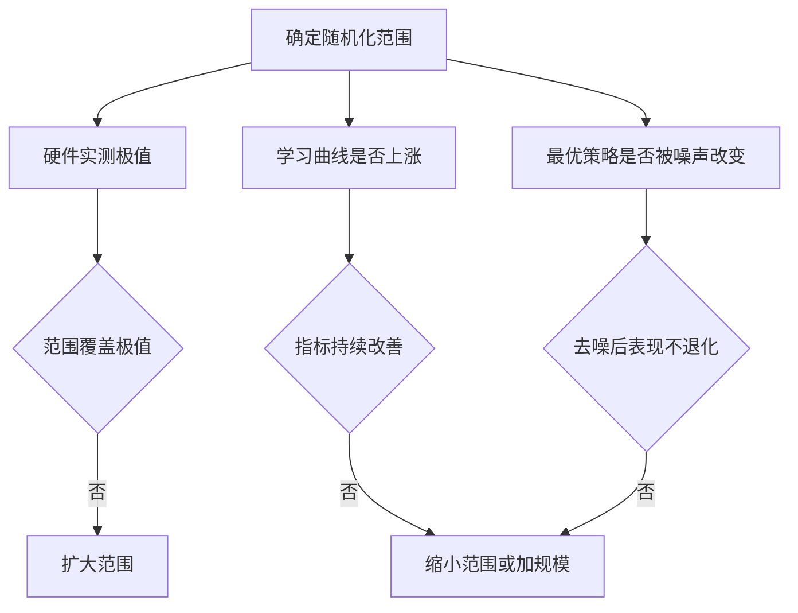
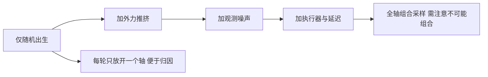

# 域随机化的取值与取舍

随机化的范围该取多少，是域随机化里最需要判断的一项。范围太窄，策略见过的世界变体不足，到了真实机器人上仍然会摔；范围太宽，任务在同一批样本里呈现多种动力学，策略要花更多样本才能学会任何一个，甚至学到过于保守的行为。公开工作给出的值可以作为起点，但每个值背后都有它的硬件与训练规模前提。

这一页把公开工作的随机化取值整理成一张可查的表，再讨论几个敏感项为什么敏感，最后给出有效噪声幅度的算法与范围选择的判据。所有外部数值都来自素材仓库的调研笔记，未直接核对原始论文的表格。

## 公开取值清单

公开的起身与恢复工作给出的随机化范围如下（`docs/getup-recipes.md:110-135` 与 `:150-160` 转引各实现的配置源码）：

| 类别 | 项 | 公开取值 |
| --- | --- | --- |
| 执行器 | PD 增益 | 乘 0.85 到 1.15 |
| 执行器 | 电机强度 | 取 0.9 到 1.1 |
| 执行器 | 力矩 | 加正负 5% 比例噪声 |
| 执行器 | 关节初始偏置与缩放 | 偏置正负 0.1 rad，缩放 0.9 到 1.1 |
| 延迟 | 控制延迟 | 取 0 到 100 ms，或折算到若干控制步 |
| 物理 | 摩擦系数 | 取 0.1 到 1 |
| 物理 | 恢复系数 | 取 0 到 1 |
| 物理 | 质心偏移 | 正负 30 到 50 mm |
| 物理 | 躯干质量 | 4 到 28 kg，或按倍数 0.8 到 1.2 |
| 载荷 | 附加负载 | 正负 2.5 kg |
| 环境 | 地面坡度 | 0 到 45 度 |
| 环境 | 离散障碍 | 高 0.10 到 0.30 m |
| 环境 | 石块与缝隙 | 0.15 到 0.40 m 与 0.10 到 0.30 m |

把这些值直接抄到自己的任务上要谨慎。同一项在不同平台上的合理范围差别很大：人形机器人的躯干质量范围与四足不可比，坡度 45 度对某些机型已经超出可站立范围。取值的前提是知道自己的硬件在这个量上实际有多少变化。

## 执行器与延迟为什么最敏感

在各类随机化项里，执行器与延迟对四足的影响最直接。位置控制回路有稳定裕度，增益变大或延迟变大都会降低相位裕度，同样的目标关节角在不同组合下会得到不同的实际轨迹。

| 项 | 影响路径 | 备注 |
| --- | --- | --- |
| PD 增益 | 改变闭环带宽与阻尼 | 增益乘 0.85 到 1.15 |
| 控制延迟 | 引入相位滞后 | 0 到 100 ms，等效若干控制步 |
| 电机强度 | 改变可用力矩 | 取 0.9 到 1.1 |
| 力矩噪声 | 改变实际出力 | 正负 5% |

这三个量还会互相补偿：延迟变大时，控制器往往会调低增益来维持稳定。因此随机化时把三者独立均匀采样，会覆盖到一些在真实系统里不会同时出现的组合，例如高增益配大延迟。如果知道硬件上它们的相关性，按相关性采样更接近现实（按控制工程通用做法，本仓库未实现相关性采样）。

$$
\text{稳定裕度} = f(\text{增益}, \; \text{延迟}), \qquad \text{独立采样会覆盖不可能的组合}
$$

## 观测噪声与有效动作噪声

观测噪声的范围应当来自传感器指标，而不是凭感觉给。项目的做法是按各通道已缩放后的量级给噪声系数，再乘缩放系数得到绝对幅度（`envs/go1_walk.py:1050-1065`）。这个口径可以反推：如果编码器的角度误差是某个值，那么关节角通道的噪声系数就应当取该值除以关节角的缩放系数。

动作侧的噪声要区分两个概念。策略探索用的噪声标准差与域随机化不是一回事，但两者的效果都经过动作缩放系数放大，因此有效幅度是两个参数的乘积（`docs/getup-recipes.md:283-292`）：

$$
\text{有效噪声} = \text{噪声标准差} \times \text{动作缩放系数}
$$

官方起身任务的配置是 1.0 乘 0.5，等于每步 0.5 rad；精细操作任务是 1.0 乘 0.04，等于 0.04。两者看起来相差十倍以上，但差异主要来自缩放系数而不是噪声标准差。给域随机化定量时必须落到这个乘积上。

## 范围选择的三个判据

范围该取多大，可以用三条判据交叉检查。

第一条是硬件实测。凡是能在自己硬件上测到的量，范围应当覆盖实测的极值再加一点余量；测不到的量可以引用公开范围，但要注明是引用（「按公开配方」）。

第二条是学习曲线。范围放大后如果评估指标长期不涨，说明当前规模支撑不了这个范围，应当缩回来或者增加环境数与步数。项目记录里已经把域随机化与环境规模并列成同一个缺口（`docs/experiment-log.md:6120-6128`）。

第三条是最优策略是否被噪声改变。在过大的观测噪声下，策略会学到在噪声里生存的行为，而这个最优解在去噪后更差（`docs/experiment-log.md:5905-5913`）。因此噪声范围要有上界，超出传感器真实误差的部分只是在惩罚策略。

| 范围 | 表现 | 处理 |
| --- | --- | --- |
| 过窄 | 干净条件好、扰动下崩 | 按硬件实测扩大 |
| 合适 | 两个条件下都可用 | 保持并分轴监控 |
| 过宽 | 长期不涨或学到保守行为 | 缩回、或增加环境数与步数 |

## 分轴施加与组合爆炸

随机化项多了以后，全组合采样会带来组合爆炸：项之间的交互使某些组合在现实中不存在，策略却要为它们准备行为。实践上常用的做法是分轴实验：先单独打开一类随机化，看评估指标的变化，再逐一叠加（按通用做法，本仓库未做分轴实验记录）。

分轴实验的另一个好处是归因。一次性打开全部随机化，若结果变差，无法判断是执行器范围太大、延迟太大还是观测噪声太大。项目在推挤与观测噪声上保留了独立开关，正是为了这种分轴能力（`envs/go1_walk.py:384-397`）。

| 实验 | 打开的开关 | 回答的问题 |
| --- | --- | --- |
| A | 仅随机出生 | 起点分布对成功率的影响 |
| B | A 加外力推挤 | 抗瞬时扰动能力 |
| C | B 加观测噪声 | 抗传感器误差能力 |
| D | 全部加执行器与延迟 | 动力学失配的鲁棒性 |

这类实验的成本主要在训练轮数，因此每次只放开一个轴、用同一套评估口径对比，是最省算力的安排。

## 小结

### 核心概念

- 公开工作的随机化取值覆盖执行器、延迟、物理参数、载荷与环境五类，逐项有具体范围。
- 执行器与延迟最敏感，因为位置控制回路的稳定裕度同时受增益与延迟影响。
- 观测噪声量级应按传感器的实际误差与通道缩放系数反推，而不是凭感觉给。
- 有效探索噪声等于噪声标准差乘动作缩放系数，官方起身任务对应每步 0.5 rad。
- 范围选择用硬件实测、学习曲线与去噪后表现三条判据交叉检查，随机化项分轴施加便于归因。

### 设计权衡

| 选择 | 带来的能力 | 付出的代价 |
| --- | --- | --- |
| 引用公开范围 | 起步快、有出处 | 与自己的硬件不匹配 |
| 按实测极值定范围 | 贴合真实变化 | 需要提前测量硬件 |
| 范围当课程放开 | 学习稳定 | 需要多阶段训练 |
| 分轴施加 | 结果可归因 | 训练轮数成倍增加 |
| 全组合采样 | 覆盖交互 | 覆盖到现实中不存在组合 |

## 练习

### 基础题

1. 列出公开随机化取值中执行器、延迟与环境三类各两项，并写出取值。
2. 解释为什么执行器增益与控制延迟是最敏感的两项。
3. 写出有效噪声的计算式，并比较官方起身与精细操作两个任务的差别。

### 挑战题

4. 为自己的四足平台设计一份随机化取值表，标明每项是实测还是引用。
5. 设计一套分轴实验，说明每轮打开的开关、评估口径与归因方式。
6. 分析范围过宽时会出现哪些表现，给出缩小范围与增加规模之间的选择依据。

## 附：本页引用的路径

| 路径 | 用途 |
| --- | --- |
| `mjx-go1-getup/docs/getup-recipes.md` | 公开随机化取值（:110-135）、有效噪声（:283-292）、两阶段课程（:135-141、:186-192） |
| `mjx-go1-getup/envs/go1_walk.py` | 观测噪声口径（:1050-1065）、推挤与噪声开关（:384-397） |
| `mjx-go1-getup/docs/experiment-log.md` | 域随机化与规模缺口（:6120-6128）、噪声鲁棒性错配（:5905-5913） |
| `~/mujoco` | 素材仓库根，正文中素材路径均相对该根；外部实现的数字经素材调研笔记转引 |
