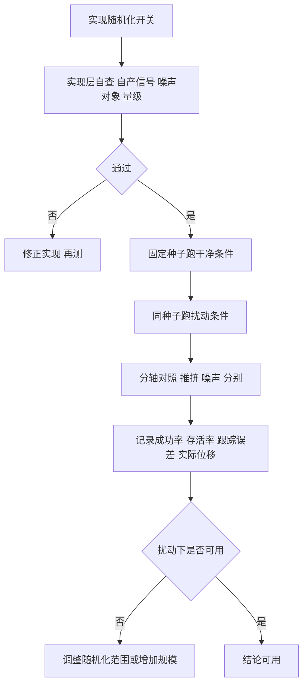
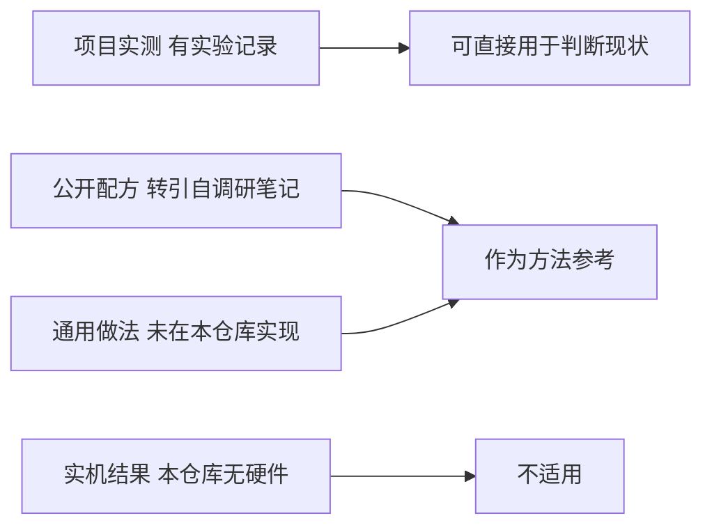

# 鲁棒性评估与验收口径

实现域随机化之后，很容易产生一种错觉：开关打开了，鲁棒性就提高了。实际上开关与结论之间还隔着一层评估：如果评估脚本默认关闭推挤与观测噪声，那么它测出来的一切都只是干净条件下的平均表现，与鲁棒性无关。项目在续训总结里明确写了这一点，并把它列为长期缺口。

这一页把评估口径该记录的量、样本量的注意事项、以及实现层面的自查清单整理出来。最后诚实列出本项目在这条路上的位置：走路侧实现了但未度量，起身侧尚未实现，实机验证不在范围内。

## 现有结论覆盖到哪里

项目的全部成功率与跟踪误差都在干净条件下测得。评估脚本默认关闭推挤与观测噪声，因此这些数字回答的是「没有任何扰动时策略表现如何」（`docs/experiment-log.md`）。

| 结论 | 条件 | 能回答的问题 |
| --- | --- | --- |
| 速度跟踪误差 | 干净地形、无扰动 | 理想条件下的控制精度 |
| 存活率与摔倒率 | 干净地形、无扰动 | 理想条件下的稳定性 |
| 爬台阶比例 | 干净地形、无扰动 | 理想条件下的地形能力 |
| 抗扰动能力 | 未测 | 需要补做 |

项目在同一份记录里点明了缺口：要回答「抗扰动更强吗」，必须补一个开着扰动与噪声的评估（`docs/experiment-log.md`）。这条缺口与域随机化是否实现是两件事，即使实现全部接上，不测仍然等于零信息。

$$
\text{开关打开} \not\Rightarrow \text{鲁棒性已被度量}
$$

## 评估要记录的量

鲁棒性评估的输出不能只有一个成功率。至少要把下面几个量分开记录，才能看出策略是被扰动影响还是被扰动击败（按通用做法的评估设计，本仓库的扰动评估尚未落地）：

| 量 | 定义 | 用途 |
| --- | --- | --- |
| 成功率 | 满足判据的样本比例 | 总体能力 |
| 存活率 | 未摔倒的样本比例 | 稳定性 |
| 跟踪误差 | 速度指令与实际的差 | 扰动下的控制精度 |
| 实际位移 | 推挤引起的真实速度偏移 | 校准施加的扰动量 |
| 恢复时间 | 从扰动到恢复跟踪的时间 | 抗扰动的响应速度 |
| 摔倒率 | 摔倒样本比例 | 与成功率的互补视角 |

「实际位移」这一项容易被漏掉。项目实测施加 0.5 m/s 的速度冲量之后，位置控制器把它阻尼到 0.3 到 0.4 m/s 的实际偏移（`docs/experiment-log.md`）。如果评估只记录施加值而记录实际值，不同控制器配置下的扰动强度会被误判成相同。

## 样本量与对比方法

样本量不足会制造假结论。项目记录里有一条明确的提醒：单点存活率的差异在 256 个样本下大约是一个标准差，不能只看一个数下结论（`docs/experiment-log.md`）。

| 对比方式 | 可行性 | 说明 |
| --- | --- | --- |
| 单次运行比较 | 低 | 差异可能落在噪声内 |
| 多随机种子平均 | 中 | 能压低方差 |
| 同种子开关对照 | 高 | 直接回答扰动带来的变化 |
| 分轴对照 | 高 | 同时给出归因 |

推荐的安排是固定种子做开关对照：同一组种子上分别跑干净与扰动两种条件，比较同一批样本的表现。这样扰动的效果与种子噪声分离，样本量可以小一些。若要做策略之间的比较，则需要多种子平均。

## 实现层面的自查清单

在跑评估之前，先把实现层面的几个常见错误排掉。这些错误会让随机化看起来生效、实际无效（`envs/go1_walk.py` 与 ）：

| 检查项 | 正确的做法 |
| --- | --- |
| 自产信号是否加噪 | 指令与上一步动作不加噪 |
| 噪声给谁 | 给 actor，critic 保持干净 |
| 噪声量级 | 按已缩放观测量级给出，不用绝对物理量 |
| 扰动注入位置 | 物理积分之前，本步奖励看到真实状态 |
| 扰动的垂直分量 | 不动，避免误触垂直速度成本 |
| 开关默认状态 | 训练打开、评估默认关闭，避免口径漂移 |
| 观测维度变化 | 加载器从参数形状推断，不写死维度 |
| 扰动量级核对 | 比较施加值与实际位移 |

最后一项与观测维度一项都来自实际教训：项目在 v19 改动观测维度后，加载器里写死的维度会直接报形状错误，改成从参数形状推断之后才不再逐文件修改（`docs/experiment-log.md`）。这类工程细节不写进清单，下一次改观测仍会踩到。



评估脚本用默认值固定了样本量与步数预算：

```python
# mjx-go1-getup/sim/eval_getup.py（节选）
ap.add_argument("--envs", type=int, default=256)      # 并行环境数 = 样本量
ap.add_argument("--steps", type=int, default=300)     # 每个环境最多跑多少步
ap.add_argument("--seed", type=int, default=0)
ap.add_argument("--check_every", type=int, default=5, ...)  # 每隔几步检查一次判据
```

256 个环境意味着一次评估给出 256 条独立轨迹，成功率的分辨率约为 0.4%；要比较两个策略几个百分点的差距，这个样本量是下限。`--check_every` 只影响判据被检查的频率，不改变物理——把它调大不会让策略更容易成功，但可能漏掉短暂的达标窗口。

## 域随机化的验收清单

把实现与评估合起来，域随机化的验收可以按下面的清单逐项打勾（本清单按素材记录与本仓库现状整理，其中多项尚未实施）：

| 项 | 状态 | 判据 |
| --- | --- | --- |
| 随机关卡实现 | 走路已实现 | 出生位置与朝向覆盖地形 |
| 外力推挤实现 | 走路已实现 | 跳变落在预期步数 |
| 观测噪声实现 | 走路已实现 | 噪声只给 actor |
| 高度扫描噪声 | 已实现 | 按缩放量级给出 |
| 扰动评估 | 未做 | 开关打开后重测一遍 |
| 执行器与延迟随机化 | 未实现 | 增益、延迟按范围采样 |
| 摩擦与质量随机化 | 未实现 | 物理参数按范围采样 |
| 起身侧随机化 | 未实现 | 第二版明确不开 |
| 实机验证 | 未做 | 本仓库无硬件环节 |

一个可以立即执行的下一步是把走路侧的扰动评估补上：开关已经实现，只缺一次开着推挤与噪声的评估。这条能回答项目记录里悬置的问题，成本也最低（`docs/experiment-log.md`）。

$$
\text{最低成本动作} = \text{开着推挤与观测噪声重跑一遍评估}
$$

## 诚实的边界

以上内容里有三类信息需要区分来源。项目自身的实测数字来自实验记录，可以直接引用；公开工作的随机化范围来自素材调研笔记转引，未核对原始论文表格；通用做法部分按工程惯例给出，本仓库未实现或未记录。

| 信息类型 | 本页处理方式 |
| --- | --- |
| 项目实测 | 标注实验记录位置 |
| 公开配方 | 标注调研笔记位置并说明转引 |
| 通用做法 | 标注「按通用做法」 |
| 实机结果 | 标注「本仓库未做」 |

这样标注之后，读者能清楚知道哪些结论可以直接用于判断项目现状，哪些只是方法参考。域随机化的内容尤其容易在转引里丢失前提，因此出处与前提必须跟在数字旁边。



## 小结

### 核心概念

- 现有成功率与跟踪误差都在干净条件下测得，评估脚本默认关闭推挤与观测噪声。
- 开关打开不等于鲁棒性被度量，两者之间还差一轮开着扰动的评估。
- 评估至少记录成功率、存活率、跟踪误差、实际位移、恢复时间与摔倒率六个量。
- 施加的扰动量与实际位移不是一个量，0.5 m/s 的冲量被阻尼到 0.3 到 0.4 m/s。
- 实现层自查覆盖自产信号、噪声对象、噪声量级、注入位置与观测维度推断，验收清单区分已实现与未实施项。

### 设计权衡

| 选择 | 带来的能力 | 付出的代价 |
| --- | --- | --- |
| 评估默认关扰动 | 口径稳定、与训练可比 | 鲁棒性信息缺失 |
| 固定种子开关对照 | 扰动效果与种子噪声分离 | 需要同种子两次运行 |
| 多种子平均 | 结论更稳 | 算力成倍增加 |
| 分轴对照 | 归因清楚 | 训练与评估轮数增加 |
| 明确标注信息类型 | 读者可判断可用性 | 文档写作成本上升 |

## 练习

### 基础题

1. 说明现有成功率能回答与不能回答的问题。
2. 列出鲁棒性评估要记录的六个量，解释实际位移为什么必须记录。
3. 复述实现层自查清单里的三项，说明错误实现会导致什么后果。

### 挑战题

4. 设计一套固定种子的开关对照评估，说明样本量、指标与判据。
5. 为域随机化写一份完整验收清单，区分必须项与可选项，并给出每项的判据。
6. 讨论在只有 256 个样本时如何给出可信的鲁棒性结论，说明统计上的处理方式。

## 附：本页引用的路径

| 路径 | 用途 |
| --- | --- |
| `mjx-go1-getup/docs/experiment-log.md` | 鲁棒性未被度量与单一数据点提醒、推挤实测、加载器维度推断、域随机化缺口 |
| `mjx-go1-getup/envs/go1_walk.py` | 三个开关与参数、观测噪声量级 |
| `mjx-go1-getup/docs/getup-recipes.md` | 公开随机化范围与阶段安排 |
| `~/mujoco` | 素材仓库根，正文中素材路径均相对该根；外部实现的数字经素材调研笔记转引 |
