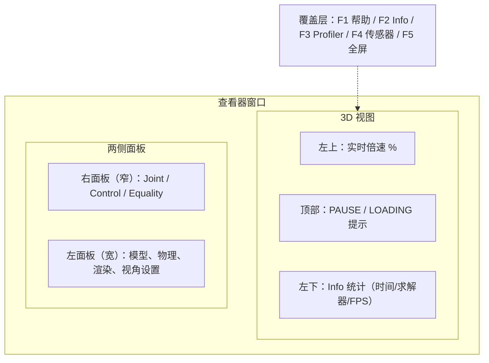
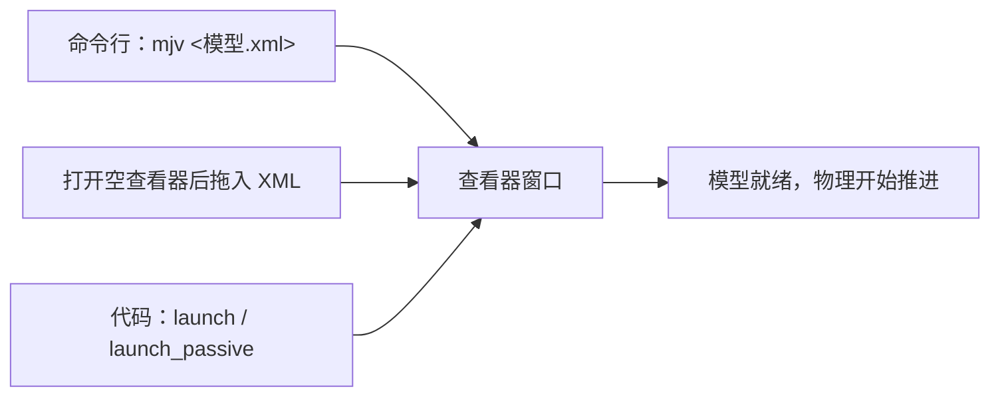

# 查看器窗口与面板布局

`mjv <模型.xml>` 等价于 `python -m mujoco.viewer --mjcf <模型.xml>`，打开的窗口是 MuJoCo 随包提供的交互式查看器：一边用 OpenGL 渲染模型，一边实时推进物理仿真（`MuJoCo查看器指南.md`）。它与官方 `simulate` 程序共用同一套界面，因此界面上的每一项都对应物理引擎里的一个选项。

窗口的空间划分决定了一件事：看状态、改参数、临时隐藏面板分别落在哪块区域，以及模型从哪里进去。至于每个旋钮具体改什么，分别落在左面板与右面板两篇里。

## 窗口的四块区域

界面可以分成 3D 视图、左面板、右面板与覆盖层四块。3D 视图里还叠着三类提示：左上角的实时倍速百分比、顶部的运行提示（`PAUSE` / `LOADING`）以及左下角的 Info 统计（`MuJoCo查看器指南.md`）。



| 区域 | 内容 | 是否改物理 |
| --- | --- | --- |
| 3D 视图 | 模型、相机机位、各种指示器与标签 | 否 |
| 左面板 | File / Option / Simulation / Watch / Physics / Rendering / Visualization / Group enable / Logging | 部分会改 `mjOption` |
| 右面板 | 关节滑条、执行器控制、等式约束开关 | 会改 `qpos` 与 `ctrl` |
| 覆盖层 | 帮助、统计、性能曲线、传感器波形、全屏 | 否 |

## 左面板承载的九组设置

左面板的每一节都可以点标题折叠或展开，九节的职责按使用频率排列如下（`MuJoCo查看器指南.md`）。

| 节 | 管什么 | 典型用法 |
| --- | --- | --- |
| Simulation | 暂停、重置、重载、关键帧、实时倍速、历史回放 | 日常操作的主入口 |
| Physics | 积分器、求解器、步长、重力、风、接触覆盖 | 调参与排查数值问题 |
| Rendering | 机位、名称标签、坐标系、可视化元素与 OpenGL 效果 | 看接触力、调画面开销 |
| Visualization | 头灯、投影方式、观察点与方位角、指示器缩放与颜色 | 视角乱了先点 Align |
| Group enable | 按分组隐藏 geom / site / joint 等元素 | 清掉调试网格 |
| Watch | 自由机位 / 跟踪机位 / 模型自带相机 | 长时间跟随机器人 |
| File | 保存 XML 与 mjb、打印模型与数据、截图、退出 | 导出当前模型 |
| Option | 字体、配色、控件间距、垂直同步 | 只影响查看器本身 |
| Logging | 日志输出到终端或文件、按主题选择记录内容 | 排查启动期问题 |

Physics、Rendering、Visualization 三节的改动会立刻作用到当前会话，但不会写回模型 XML（`MuJoCo查看器指南.md`）。想留下改动要用 File 里的 `Save xml`。

## 右面板与模型结构的关系

右面板的内容直接由模型决定，没有执行器或等式约束的模型就会出现空节（`MuJoCo查看器指南.md`）。

| 节 | 数据来源 | 拖动改的量 |
| --- | --- | --- |
| Joint | 模型里的 slide / hinge 关节 | `qpos` 中该关节的位置 |
| Control | 模型里的每个 actuator | 该执行器的 `ctrl` |
| Equality | 模型 XML 里的每条 `<equality>` | 运行时启用或禁用该约束 |

自由关节与球关节不显示滑条，因为它们的位置不是一个标量；把对应分组在 `Group enable → Joint` 里关掉，滑条也会随之消失（`MuJoCo查看器指南.md`）。控制滑条的范围来自模型定义的 `ctrlrange`，模型里没有执行器时这一节为空（`MuJoCo查看器指南.md`）。

## 面板显隐与全屏

`Tab` 切换右面板，`Shift+Tab` 切换左面板，想看清模型时把两侧都收起来即可（`MuJoCo查看器指南.md`）。另外两个与面板有关的操作容易被忽略：按住面板标题栏右键会显示该面板所有项的快捷键提示，双击标题栏则折叠或展开该面板的全部条目（`MuJoCo查看器指南.md`）。

面板宽度可以拖面板边缘的小竖条调整，数字输入框双击即可修改（`MuJoCo查看器指南.md`）。`F5` 进入全屏，适合录制或演示。

## 覆盖层快捷键与统计栏

窗口顶部一排功能键对应五个覆盖层，其中 F1 是完整操作表的入口（`MuJoCo查看器指南.md`）。

| 键 | 覆盖层 | 内容 |
| --- | --- | --- |
| `F1` | Help | 鼠标与键盘操作总表 |
| `F2` | Info | 左下角统计信息 |
| `F3` | Profiler | 右上角四张曲线：CPU 耗时、规模、求解计数与收敛 |
| `F4` | Sensors | 右下角传感器波形 |
| `F5` | Full screen | 全屏显示 |

暂停状态下顶部会显示 `PAUSE(n)`，表示当前停在历史记录的第 n 个状态，配合方向键可以做单步回放（`MuJoCo查看器指南.md`）。

## 加载模型的三种方式

模型入口有三条：命令行直接给路径、打开空查看器后把 XML 拖进窗口、在代码里调用 `mujoco.viewer.launch` 或 `launch_passive`（`MuJoCo查看器指南.md`）。



本机随包带了 Menagerie 模型库，命令行方式可以直接换模型验证环境是否正常（`MuJoCo查看器指南.md`）：

```bash
mjv models/mujoco_menagerie/unitree_go2/scene.xml          # 宇树 Go2
mjv models/mujoco_menagerie/franka_fr3/scene.xml          # Franka 机械臂
mjv models/mujoco_menagerie/boston_dynamics_spot/scene.xml # Spot
```

代码方式的写法与脚本里的实际用例见 `04-右面板与Info统计的调试用法`，那里有一个完整的被动查看器循环。

## 暂停、倍速与状态提示

空格键在播放与暂停之间切换，`+` / `-` 调整实时倍速，左上角会显示当前百分比；100% 表示 1 秒仿真对应 1 秒实际时间（`MuJoCo查看器指南.md`）。把倍速调低就是慢动作，排查接触瞬间的姿态变化时比逐帧更直观。

`Reset` 把仿真拉回初始状态，`Reload` 重新从文件读模型，`History` 滑条回放最近记录的状态（`MuJoCo查看器指南.md`）。三者用途不同：改姿势用 Reset，改 XML 后用 Reload，看刚才发生了什么用 History。

## 易错点

| 现象 | 原因 | 判据 |
| --- | --- | --- |
| 面板不见了 | 之前按过 `Tab` 或 `Shift+Tab` 把面板收起来了 | 再按一次即可恢复 |
| 拖动 XML 没有反应 | 先把文件拖进窗口而窗口还没打开 | 先执行 `mjv` 打开空查看器 |
| 暂停下改了控制滑条却没变化 | 物理没有推进 | 空格恢复播放后再看 |
| 界面找不到某一节 | 该节依赖模型里没有的元素 | 例如没有 actuator 时 Control 为空 |
| 快捷键与文档对不上 | 版本差异 | 以窗口里的 F1 帮助表为准（`MuJoCo查看器指南.md`） |
| 改了物理参数重启后失效 | 运行时修改不写回 XML | 需要保留就用 File 里的 `Save xml` |

## 小结

### 核心概念

- 查看器把渲染与物理推进放在同一个窗口里，界面参数直接对应 `mjOption` 等结构。
- 左面板管设置，右面板由模型结构生成，覆盖层用于观察与调试。
- 面板可临时隐藏，运行时改动只在当前会话有效。
- 模型有三条入口：命令行、拖拽、代码调用。

### 设计权衡

| 决策 | 选择 | 收益 | 代价 |
| --- | --- | --- | --- |
| 面板布局 | 左右分栏加可折叠 | 参数集中，遮挡可临时消除 | 需要记住显隐快捷键 |
| 参数修改 | 运行时即时生效 | 调参不需要重启 | 不写回文件，容易丢改动 |
| 模型加载 | 路径、拖拽、代码三种 | 覆盖手工与脚本两种场景 | 三种入口的报错信息不同 |
| 状态观察 | 覆盖层按需开启 | 默认画面干净 | 要知道哪个键对应哪层 |

## 练习

### 基础题

1. `mjv` 命令与 `python -m mujoco.viewer --mjcf` 是什么关系？
2. 左面板九节里哪三节的改动会立刻影响物理？
3. 右面板某一节为空，说明模型里缺少什么？

### 挑战题

4. 不看文档，说明如何在不重启查看器的情况下换一个模型文件，并指出哪一步会丢失当前运行时改动。

5. 设计一套演示流程：先用命令行加载一个 Menagerie 模型，再用拖拽方式换模型，最后用 F3 观察物理耗时变化。

6. 说明 `Reset` 与 `Reload` 在「模型文件被改动之后」这一场景下的行为差别。

### 附：本页引用的路径

| 路径 | 用途 |
| --- | --- |
| `MuJoCo查看器指南.md` | 窗口布局、面板分节、快捷键与加载方式（） |
| `models/mujoco_menagerie/` | 本机随包的模型库示例路径（） |
| `RLcontroller_go1/sim/view_go1.py` | 代码方式加载模型的实例（） |

（引用的文件以 /home/tc63/mujoco 为根。）