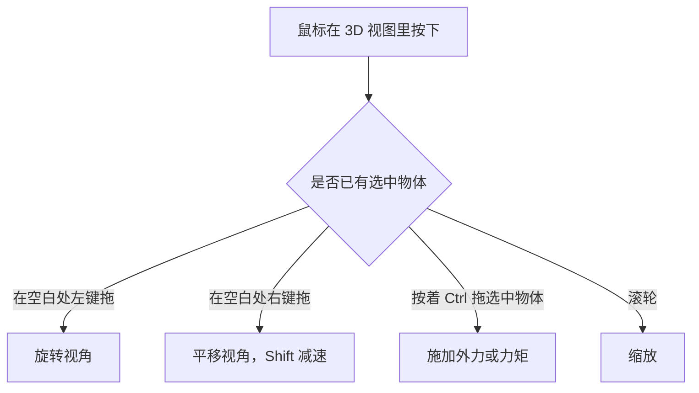
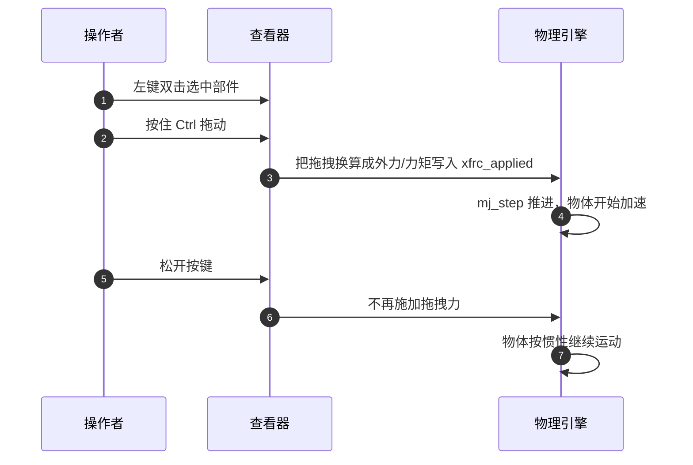
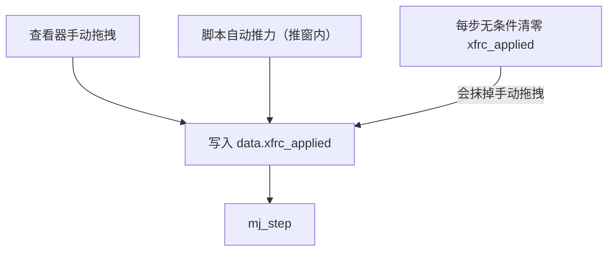

# 鼠标键盘操作与交互施力

查看器里几乎所有的交互都靠鼠标完成，而同一套拖动在三处含义完全不同：在空白处拖动改变视角，对被选中的物体拖动则通过 `Ctrl` 施加外力或力矩，滚轮只是缩放。区分这三种模式，是把查看器当作调试工具而不是播放器的前提。

视角、选中与施力是三类互不相同的操作，把最后一类接到控制器的扰动测试上才能看出它的用途。引用的按键表来自 `MuJoCo查看器指南.md`，实例来自本机的 LQR 平衡脚本。

## 视角操作的三种拖动

| 操作 | 效果 | 说明 |
| --- | --- | --- |
| 左键拖动 | 旋转视角 | 相机绕观察点转动 |
| 右键拖动 | 平移视角 | 按住 `Shift` 会减速，便于精调 |
| 滚轮或中键拖动 | 缩放 | 改变相机与观察点的距离 |
| `Esc` | 恢复自由相机 | 从模型相机或跟踪状态退回 |

视角乱了有两个恢复手段：`Esc` 回到自由相机，或到左面板 Visualization 节点 `Align` 自动框住整个模型（`MuJoCo查看器指南.md`）。



## 选中与施力的完整链路

施加外力必须先选中目标：左键双击某个部件即可选中，`Page Up` 选中它的父级物体（`MuJoCo查看器指南.md`）。选中之后：

| 操作 | 施加的量 | 物理落点 |
| --- | --- | --- |
| `Ctrl` 加左键拖动 | 力矩 | 让被选物体旋转 |
| `Ctrl` 加右键拖动 | 力 | 让被选物体平移 |

松手之后物体按物理规律继续运动，查看器不会持续施加这个力（`MuJoCo查看器指南.md`）。这条性质决定了它适合做「推一下看控制器能不能恢复」的测试，而不是长时间恒力加载。



外力写入的是 `data.xfrc_applied` 这一路，与执行器给出的 `ctrl` 互不覆盖。脚本里要自己写外力时也要走同一个字段，具体见 `LQRbalance/lqr_balance.py`。

## 相机的循环与跟踪

`[` 与 `]` 在模型自带的 `<camera>` 之间循环切换，`Esc` 回到自由相机（`MuJoCo查看器指南.md`）。两个鼠标手势直接给相机换目标：右键双击把相机中心对准某个点，`Ctrl` 加右键双击则让相机持续跟踪该物体（`MuJoCo查看器指南.md`）。

左面板 Watch 与 Rendering 两节里都有 Camera 列表，可以显式选择自由、跟踪或某个模型相机（`MuJoCo查看器指南.md`）。脚本里等价的写法是设置 `cam.type`、`cam.fixedcamid` 与 `cam.trackbodyid`（`MuJoCo查看器指南.md`）。

长距离移动的机器人用跟踪机位比手动拖动省事；想看清地形整体起伏时要主动切到俯瞰视角，脚本里通过 `cam.type = mjCAMERA_FREE` 加固定的 `lookat` 与 `distance` 实现（`mjx-go1-getup/sim/view_go1.py`）。

## 暂停下的单步与历史回放

空格暂停之后，`←` 与 `→` 每次后退或前进一个物理步，配合 `History` 滑条可以回到之前记录的状态（`MuJoCo查看器指南.md`）。顶部显示的 `PAUSE(n)` 就是当前处在历史缓冲的第 n 个状态（`MuJoCo查看器指南.md`）。

这套组合用来定位「机器人在第几步开始失稳」：暂停后向左回退，找到姿态还正常的最后一步，再逐步前进看接触与关节量的变化。倍速调低（连按 `-`）会让这些瞬态更容易观察（`MuJoCo查看器指南.md`）。

## 面板与帮助的按键

与操作直接相关的几个键列在下表，完整表随时可以按 `F1` 在窗口里调出（`MuJoCo查看器指南.md`）。

| 键 | 作用 |
| --- | --- |
| `Space` | 播放 / 暂停 |
| `+` / `-` | 加速 / 减速实时倍速 |
| `←` / `→` | 暂停时后退 / 前进一个物理步 |
| `Tab` / `Shift+Tab` | 隐藏或显示右面板 / 左面板 |
| `[` / `]` | 循环切换模型相机 |
| `F1` 至 `F5` | 帮助 / Info / Profiler / Sensors / 全屏 |

面板标题栏还有两个容易忽略的鼠标操作：右键按住显示该面板所有项的快捷键提示，双击则折叠或展开全部条目（`MuJoCo查看器指南.md`）。

## 用拖拽做控制器扰动测试

本机 LQR 平衡脚本的查看器模式就是围绕拖拽设计的：文档里写明可手动 `Ctrl` 加拖拽施加扰动，观察 LQR 加状态机能否恢复（`LQRbalance/run_lqr_view.py`）。

脚本做了两处针对拖拽的调整（`LQRbalance/lqr_balance.py`）：

```python
with mujoco.viewer.launch_passive(m, d) as v:
    # 加大拖拽力(默认 scale=1 对 45kg 机身太弱)。拖拽: Ctrl+左键。
    v.perturb.scale = 8.0
    while v.is_running():
        ...
```

第一处是把 `v.perturb.scale` 从默认的 1 调到 8。机身质量大时，默认拖拽力在物理上几乎推不动它，表现为「拖了没反应」，这与鼠标没对准或没选中无关（`LQRbalance/lqr_balance.py`）。第二处是不要在每一步无条件清零 `xfrc_applied`：脚本的自动推力只在推窗内写入，其余时间保留查看器手动拖拽施加到机身的外力，否则手动拖拽会被循环清掉（`LQRbalance/lqr_balance.py`）。



## 自动推力与手动拖拽的组合实例

查看器模式下还能叠加周期性自动推力：命令行参数 `--push` 给出间隔秒数，每到一个间隔就横向推一次，默认强度是 150 N（`LQRbalance/run_lqr_view.py`、`lqr_balance.py`）。

```bash
.venv/bin/python run_lqr_view.py            # 只用手动 Ctrl+拖拽施加扰动
.venv/bin/python run_lqr_view.py --push 3   # 每 3 秒自动横向推 150N
```

查看器里的实时循环每轮推进 20 个物理步，再用 `v.sync()` 把状态交给渲染线程，最后按 `timestep × 20` 补足睡眠时间以维持实时（`LQRbalance/lqr_balance.py`）。这一结构在 `04-右面板与Info统计的调试用法` 里展开。

## 易错点

| 现象 | 原因 | 判据 |
| --- | --- | --- |
| 拖了机身没反应 | 未选中目标，或拖拽力度相对质量太小 | 先双击选中，再调 `perturb.scale` |
| 拖动变成了转视角 | 没有按住 `Ctrl` | `Ctrl` 加左键是力矩，加右键是力 |
| 松手后外力继续存在 | 误以为拖拽是持续加载 | 松手即撤，剩下的是惯性 |
| 手动拖拽被脚本清掉 | 循环每步无条件清零 `xfrc_applied` | 检查清零的位置与条件 |
| 找不到模型相机 | 相机列表在 Watch / Rendering 两节 | 用 `[` `]` 循环或在下拉里选 |
| 回退找不到刚才的状态 | History 缓冲长度有限 | 暂停得越早越好，或降低倍速观察 |

## 小结

### 核心概念

- 视角拖动、物体拖动与缩放是三种不同手势，`Ctrl` 决定是否施加外力。
- 外力与力矩写入 `xfrc_applied`，松手即撤，不影响执行器的 `ctrl`。
- 相机可以循环模型机位、居中或持续跟踪某个物体。
- 暂停加单步加 History 回放用于定位失稳发生的时刻。

### 设计权衡

| 决策 | 选择 | 收益 | 代价 |
| --- | --- | --- | --- |
| 施力方式 | 拖拽式瞬时外力 | 直觉，适合测恢复能力 | 不能施加持续载荷 |
| 拖拽强度 | 可调 `perturb.scale` | 大质量模型也能拖动 | 需要按模型规模手动试 |
| 自动推力 | 周期性单次脉冲 | 可复现的扰动节奏 | 强度写在脚本里，改要动代码 |
| 相机 | 自由与跟踪并存 | 既能看局部也能看全局 | 需要知道当前处于哪种模式 |

## 练习

### 基础题

1. 分别说出左键拖动、`Ctrl` 加左键拖动、`Ctrl` 加右键拖动的作用。
2. 施加外力之后松手，物体为什么还会继续运动？
3. 暂停状态下如何前进一个物理步？顶部提示里的 n 是什么？

### 挑战题

4. 模型质量很大，手动拖拽几乎无效果，列出两种处理方式并说明各自的副作用。

5. 写出一段伪代码，让脚本每隔 3 秒施加一次 150 N 的横向推力，同时不干扰查看器里的手动拖拽。

6. 说明为什么持续恒力加载不适合用查看器拖拽完成，并给出脚本层面的替代做法。

### 附：本页引用的路径

| 路径 | 用途 |
| --- | --- |
| `MuJoCo查看器指南.md` | 操作总表、相机、回放与覆盖层（） |
| `LQRbalance/lqr_balance.py` | 被动查看器循环、拖拽力度与外力写入（） |
| `LQRbalance/run_lqr_view.py` | 命令行入口与自动推力参数（） |
| `mjx-go1-getup/sim/view_go1.py` | 脚本设置俯瞰相机（） |

（引用的文件以 /home/tc63/mujoco 为根。）