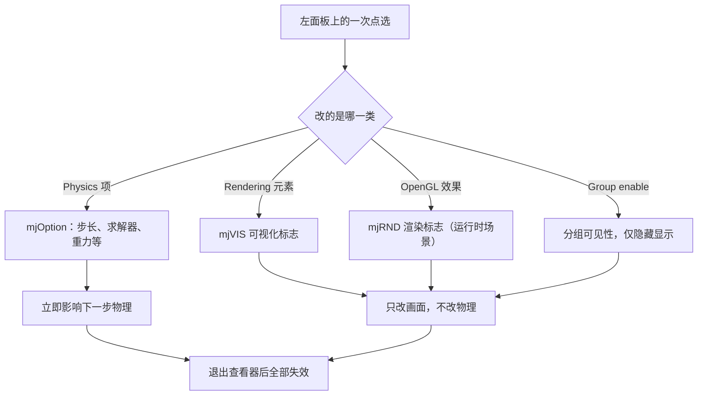
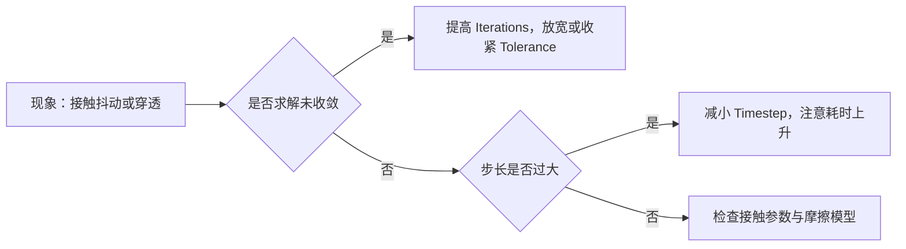

# 左面板的物理与渲染开关

左面板是查看器里信息密度最高的区域：从积分器、步长、重力，到接触点显示、阴影开关、指示器大小，都能在这里点选并立即生效。它同时也是最容易误用的区域，因为这些改动只作用于当前会话，退出即丢。

左面板九节的落点各不相同：Physics 落到 `mjOption`，Rendering 与 Visualization 落到可视化与渲染标志，Group enable 落到分组可见性，File 与 Logging 落到磁盘。每一节末尾给出脚本里的等价写法。

## 运行时修改与写回文件的边界

Physics 一节的每一项都对应物理引擎的 `mjOption`，改动立即生效（`MuJoCo查看器指南.md:112-114`）。这类修改不写回 XML：想保留必须用 File 里的 `Save xml` 导出，重新加载原文件时改动会消失（`MuJoCo查看器指南.md:86`）。



## Physics 里的求解器与步长

求解相关的项决定精度与速度的平衡，第一行就是积分器（`MuJoCo查看器指南.md:115-119`）。

| 项 | 可选值 | 影响 |
| --- | --- | --- |
| `Integrator` | Euler（默认）/ RK4 / implicit / implicitfast | RK4 更准更慢；关节阻尼大时 implicit 系更稳 |
| `Cone` | Pyramidal / Elliptic | 摩擦锥的离散方式 |
| `Jacobian` | Dense / Sparse / Auto | 雅可比矩阵的存储与求解方式 |
| `Solver` | PGS / CG / Newton（默认） | 约束求解器，Newton 通常最快 |
| `Timestep` | 秒 | 改小更准更慢 |
| `Iterations` / `Tolerance` | 整数 / 实数 | 求解器迭代上限与收敛容差 |

`LS Iter`、`LS Tol`、`Noslip Iter/Tol`、`CCD Iter/Tol`、`Sleep Tol`、`SDF Iter/Init` 属于更细的数值开关（`MuJoCo查看器指南.md:122-124`）。排查接触抖动时通常先调 `Iterations` 与 `Tolerance`，而不是把 `Timestep` 一味压小。



## 环境力与接触参数覆盖

环境力一组直接改变外力场：`Gravity` 默认 `0 0 -9.81`，此外还有 `Wind`、`Magnetic`、`Density` 与 `Viscosity`（`MuJoCo查看器指南.md:126-128`）。介质粘度会带来类似水的阻力感，是演示类场景常用的项。

物理参数一组是接触求解的覆盖值：`Imp Ratio`、`Margin`、`Sol Imp`、`Sol Ref`、`Friction`，以及 `Contact Override`（`MuJoCo查看器指南.md:130-133`）。它们覆盖模型里为 geom 定义的值，用来验证「换一组接触参数会怎样」。

最下面两类复选框是运行时开关（`MuJoCo查看器指南.md:135-137`）：

| 开关 | 关掉之后的后果 | 适用场景 |
| --- | --- | --- |
| `Contact` | 全部接触失效，机器人会穿过地面 | 观察纯运动学效果 |
| `Gravity` | 失重 | 验证模型在无重力下的姿态 |
| `Energy` | 不再统计能量，Info 里的 Energy 行消失 | 减少统计开销 |
| `Island` | 不再分岛求解 | 对比求解策略差异 |
| `Sleep` | 不再让静止物体休眠 | 排查休眠导致的「不动」 |
| `Act Group 0-5` | 对应组的执行器全部失效 | 分组调试执行器 |

这些勾选只在当前会话生效，不会写回 XML（`MuJoCo查看器指南.md:135`）。

## Rendering 的可视化元素

Rendering 节的前四项管场景标注：`Camera`（机位）、`Label`（名称标签，可选 Body/Joint/Geom/Site/Contact/Force 等）、`Frame`（坐标轴，调试朝向必用）与 `Copy camera`（把当前机位导出成 `<camera .../>` 文本）（`MuJoCo查看器指南.md:140-145`）。

`Model Elements` 一组对应 `mjVIS` 标志，常用的有（`MuJoCo查看器指南.md:147-151`）：

| 元素 | 显示内容 | 调试用途 |
| --- | --- | --- |
| `Contact point` / `Contact force` | 接触点与红色力箭头 | 看足端是否真的着地 |
| `Contact torque` / `friction` / `split` / `gap` | 扭矩、摩擦、分解、间隙 | 分析接触求解细节 |
| `COM` / `Inertia` | 质心与惯性椭球 | 检查质量分布 |
| `Joint` / `Tendon` / `Actuator` | 关节轴、腱、执行机构 | 对齐自由度方向 |
| `Tree depth` / `Flex layer` | BVH 层级与柔性件层 | 排查碰撞结构 |

脚本里的等价写法是给标志数组赋值，例如把接触点显示打开（`MuJoCo查看器指南.md:239`）：

```python
opt.flags[mujoco.mjtVisFlag.mjVIS_CONTACTPOINT] = 1
```

## OpenGL 效果与画面开销

另一半开关是 `OpenGL Effects`，对应 `mjRND` 渲染标志：`Shadow`、`Fog`、`Haze`、`Reflection`、`Add noise`、`Stereo`、`Wireframe` 等（`MuJoCo查看器指南.md:153-154`）。它们只改画面，不改物理。

画面帧率偏低时有一份现成的关闭顺序：先关阴影与反射，再看是否还需要关闭雾与噪点（`MuJoCo查看器指南.md:154`、`:228`）。本机的查看器脚本就按这个思路提供了画质档位，低档位在打开窗口后一次性关掉场景级的反射、天空盒与阴影（`mjx-go1-getup/sim/view_go1.py:780-784`）：

```python
if args.quality == "low":
    v.user_scn.flags[_flags.mjRND_REFLECTION] = 0
    v.user_scn.flags[_flags.mjRND_SKYBOX] = 0
    v.user_scn.flags[_flags.mjRND_SHADOW] = 0
```

这里有一个容易混淆的边界：反射与天空盒只在运行时场景 `user_scn` 上可改，模型侧没有对应字段，所以这三行必须写在循环之外，设置一次即可（`mjx-go1-getup/sim/view_go1.py:778-779`）。GUI 里对应的位置是 Rendering 的 OpenGL Effects 组，效果等价。

## Visualization 的相机与指示器缩放

这一节管观察方式与标注外观（`MuJoCo查看器指南.md:156-163`）：头灯参数（`Active` / `Ambient` / `Diffuse` / `Specular`）、`Orthographic` 正交投影、`Field of view` 视场角、`Center` / `Azimuth` / `Elevation` 观察参数，以及 `Align` 按钮自动框住整个模型。

`Scale` 组控制各类指示器的大小（力箭头、质心、接触、关节轴、坐标系等），`Color` 组控制它们的颜色（`MuJoCo查看器指南.md:162-163`）。把坐标系放大、把接触力箭头调大，是让画面上的调试信息在整机尺度下仍然可见的常用手段。

## Group enable 与调试网格

MuJoCo 的 geom、site、joint、tendon、actuator、flex、skin 都带 `group 0~5` 的分组号，模型 XML 里常把碰撞体与外观体分到不同组（`MuJoCo查看器指南.md:165-167`）。Group enable 一节就是这些分组的可见性开关。

实际用法是「一次只留一组」：例如关掉碰撞体的分组，只保留视觉 mesh，画面立刻干净；排查足端接触时反过来只留碰撞几何。GUI 里勾选等效于改分组可见性，不影响物理与碰撞计算，被隐藏的 geom 仍然参与接触（按 MuJoCo 的分组语义，可见性与碰撞是两件事）。

## File 与 Logging 的落地位置

File 一节把结果写到磁盘：`Save xml` 导出当前模型（走 `mjModel → mjSpec → 文件`），`Save mjb` 导出二进制模型（加载更快但不可读），`Print model` 与 `Print data` 打印模型结构与当前状态，`Screenshot` 把画面存成启动目录下的 `screenshot.png`（`MuJoCo查看器指南.md:84-91`）。

Logging 一节决定日志去向：`Console` 输出到终端，`File` 写入文件，`Info topics` 按主题选择要记录的内容（`MuJoCo查看器指南.md:169-171`）。启动阶段模型加载失败时，先看这一节是否把错误吞进了文件。

## 易错点

| 现象 | 原因 | 判据 |
| --- | --- | --- |
| 调好的参数重启后没了 | 运行时修改不写回 XML | 需要保留就用 `Save xml` |
| 画面很卡 | 阴影、反射等效果开销大 | 先在 OpenGL Effects 里关掉它们 |
| 改了 OpenGL 效果但物理耗时没变 | 这些标志只影响渲染 | 对照 F3 里的 CPU 与 FPS 两行 |
| 隐藏了碰撞体却仍能撞上 | 可见性与碰撞是两套机制 | 分组只控制显示 |
| 模型加载失败看不到原因 | 日志被写到文件 | 检查 Logging 的 Console / File 选择 |
| 相机方向调乱 | 多次旋转叠加 | 点 Visualization 的 `Align` 恢复 |

## 小结

### 核心概念

- 左面板的改动分成物理、可视化、渲染、可见性四类，只有物理类影响仿真结果。
- Physics 对应 `mjOption`，Rendering 对应 `mjVIS` 与 `mjRND`。
- 运行时修改都不写回 XML，需要保留必须导出。
- 反射与天空盒这类场景级标志只在运行时场景上可改。

### 设计权衡

| 决策 | 选择 | 收益 | 代价 |
| --- | --- | --- | --- |
| 调参方式 | 运行时即时生效 | 试错快，不用反复重启 | 改动易丢 |
| 显示控制 | 可视化与物理分离 | 关掉标注不影响结果 | 需要分清哪些项属于哪一类 |
| 场景效果 | 可逐项关闭 | 能在画质与帧率间取舍 | 需要知道开销排序 |
| 分组可见性 | 独立于碰撞 | 清画面不影响调试结论 | 容易误以为隐藏即禁用 |

## 练习

### 基础题

1. 列出 Physics 一节里至少四个项，并说明各自影响精度还是速度。
2. `Contact point` 显示与 `Shadow` 开关分别改的是哪一类标志？
3. 想把当前调好的模型保存下来，用 File 里的哪一项？

### 挑战题

4. 说明为什么 `v.user_scn.flags` 里的反射与天空盒不能在循环里反复设置，而 `mjVIS` 标志可以。

5. 给出一套排查流程：模型接触抖动，从哪些项开始调，如何判断是求解问题还是步长问题。

6. 把「只显示视觉几何」与「关掉全部接触」两个操作放到一起比较，说明它们对物理的影响差别。

### 附：本页引用的路径

| 路径 | 用途 |
| --- | --- |
| `MuJoCo查看器指南.md` | 左面板九节逐项说明与脚本等价写法（`:79-171`、`:233-243`） |
| `mjx-go1-getup/sim/view_go1.py` | 低画质档关场景级效果（`:778-784`） |
| `MuJoCo查看器指南.md:112-114` | 运行时修改立即生效但不写回 |

（引用的文件以 /home/tc63/mujoco 为根。）