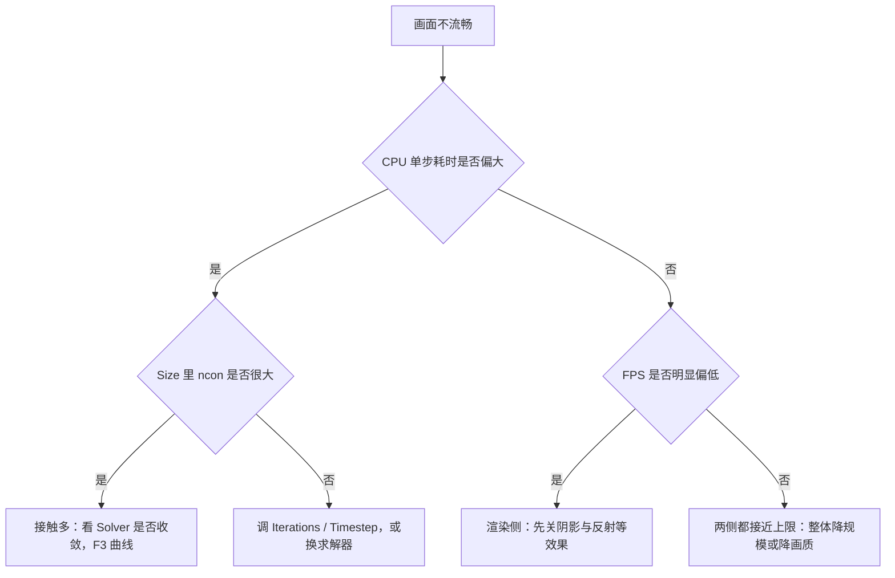
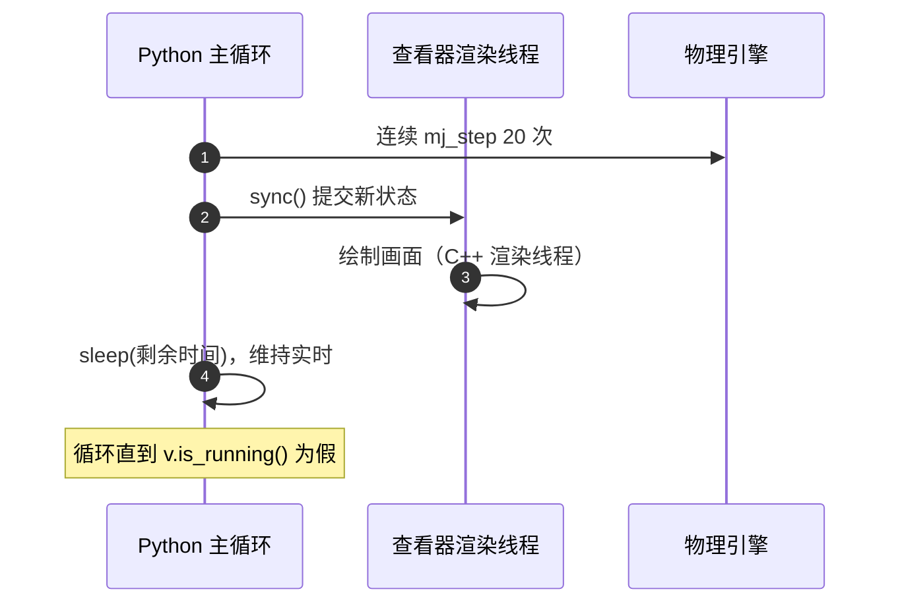

# 右面板与 Info 统计的调试用法

右面板是唯一能直接改状态量的地方：拖动滑条等于直接写 `qpos` 与 `ctrl`，不需要改模型文件。左下的 Info 栏则把当前仿真状态压缩成八行数字，其中物理单步耗时与渲染帧率是两个不同来源的量，分清楚它们才能判断卡顿发生在哪一侧。

右面板三节与状态量的对应、Info 与 F3 的读法，最终指向同一件事：用 `launch_passive` 写自己的查看器。本机脚本里有一段完整的扰动循环可以直接对照。

## Joint 滑条改的是 qpos

模型里每个滑块或铰链关节对应一个滑条，拖动它就是直接设置该关节的 `qpos`（`MuJoCo查看器指南.md:177-180`）。滑条范围分三种情况：

| 关节类型 | 默认范围 | 说明 |
| --- | --- | --- |
| 滑块 slide | ±1 | 模型给限位时以限位为准 |
| 铰链 hinge | ±π | 同上 |
| 自由 free / 球 ball | 无滑条 | 一个标量表达不了它的位置 |

暂停时拖滑条用于摆姿势，播放时拖动会持续生效、松手后按物理规律回弹（`MuJoCo查看器指南.md:179`）。把某个分组在 `Group enable → Joint` 里关掉，对应滑条会消失（`MuJoCo查看器指南.md:180`）。

脚本里的等价写法是直接写地址：`data.qpos[adr] = ...`（`MuJoCo查看器指南.md:238`）。与 GUI 相同，这种写入不会经过执行器，也不受 `ctrlrange` 限制。

## Control 滑条改的是 ctrl

模型里每个执行器对应一个控制滑条，拖动即设置它的控制信号 `ctrl`，范围来自模型定义的 `ctrlrange`；模型里没有执行器时这一节为空（`MuJoCo查看器指南.md:182-186`）。

`Clear all` 一键把所有控制归零，适合在反复试验前回到中立状态（`MuJoCo查看器指南.md:184`）。最常用的组合是「暂停 → 拖控制滑条 → 空格播放」，观察执行器如何驱动机器人（`MuJoCo查看器指南.md:186`）。脚本里对应 `data.ctrl[i] = ...`（`MuJoCo查看器指南.md:237`）。


## Equality 的运行时开关

模型 XML 里定义的每条 `<equality>`（如焊接、连接连体）在右面板占一行复选框，勾选状态决定这条约束在运行时是否生效（`MuJoCo查看器指南.md:188-189`）。解开某条焊接来看机器人自由状态，或者反过来临时加上约束看求解器压力，都靠这一节。

这类开关改的是约束集合，会直接改变 `nefc`，因此 Info 的 `Size` 一行会立刻反映出来。它同样不写回 XML。

## Info 栏字段的读法

按 `F2` 打开左下角统计栏，八个字段各自的含义如下（`MuJoCo查看器指南.md:193-206`）。

| 字段 | 含义 | 主要用途 |
| --- | --- | --- |
| `Time` | 仿真时间（秒） | 与墙钟时间对照实时倍速 |
| `Size` | 约束总数 `nefc`，括号内为接触点数 `ncon` | 判断接触复杂度 |
| `CPU` | 单步物理耗时（毫秒） | 物理侧开销 |
| `Solver` | 求解误差（log10）与实际迭代次数 | 判断是否收敛 |
| `FPS` | 渲染帧率 | 渲染侧开销 |
| `Memory` | `mjData` 内存池使用率 | 排查内存增长 |
| `Energy` | 总能量（需在 Physics 里开启 Energy） | 能量守恒检查 |
| `Islands` | 约束孤岛数 | 观察分岛求解 |

判断卡顿来源的口诀很简单：`CPU` 一行是物理耗时，`FPS` 是渲染帧率（`MuJoCo查看器指南.md:206`）。两者会互相影响，但先看哪一个明显偏大，就能大致定位侧别。



## F3 性能分析器看什么

`F3` 在右上角打开四张曲线：CPU 耗时、规模、求解收敛相关的 Counts 与 Convergence（`MuJoCo查看器指南.md:212`）。它们与 Info 的数字是同一批量的时间序列，用来观察趋势而不是瞬时值。

例如接触抖动时，Counts 曲线会显示迭代次数是否持续贴在上限，Convergence 曲线则显示误差是否在期望范围内收敛（`MuJoCo查看器指南.md:206`、`:212`）。曲线比数字更容易看出「只是某几步超限」还是「一直没收敛」。

## 用 launch_passive 写自己的查看器

命令行 `mjv` 适合手工看模型；要一边跑策略一边看，就要在脚本里用 `mujoco.viewer.launch_passive`，它把窗口交给你的主循环驱动（`MuJoCo查看器指南.md:34`）。本机多个脚本都用这个模式，例如 `mjx-go1-getup/sim/view_go1.py:777` 与 `LQRbalance/lqr_balance.py:310`。

被动查看器的循环骨架是「推进物理 → 同步给渲染 → 按实时节奏睡眠」，`LQRbalance/lqr_balance.py:310-329` 是最完整的例子：

```python
with mujoco.viewer.launch_passive(m, d) as v:
    v.perturb.scale = 8.0
    while v.is_running():
        step_start = time.time()
        ...                       # 控制器与外力写入
        for _ in range(20):
            mujoco.mj_step(m, d)
        v.sync()
        time.sleep(max(0, m.opt.timestep * 20 - (time.time() - step_start)))
```

三个环节各有作用：一轮推进 20 步让物理时间前进一个固定量；`v.sync()` 把状态交给查看器的渲染线程；最后的睡眠按 `timestep × 20` 减去本轮已用时间，把实际节奏拉回实时（`LQRbalance/lqr_balance.py:326-329`）。睡眠用 `max(0, ...)` 保底，物理本身超时也不会叠加等待。



循环之外的设置在窗口打开后执行一次即可，例如低画质档关闭场景级效果、俯瞰模式设置相机（`mjx-go1-getup/sim/view_go1.py:777-796`）。

## 一个带扰动的查看器循环

把前面几节拼起来就是一次完整的扰动测试：脚本线性化模型求出 LQR 增益，打开被动查看器，循环里跑状态机与控制器，同时允许人工拖拽或周期性自动推力施加扰动（`LQRbalance/run_lqr_view.py:19-37`、`lqr_balance.py:313-325`）。

| 环节 | 位置 | 作用 |
| --- | --- | --- |
| 线性化与求增益 | `run_lqr_view.py:27-32` | 得到状态反馈矩阵 |
| 打开查看器 | `lqr_balance.py:310` | 建立窗口与同步句柄 |
| 外力写入 | `lqr_balance.py:319-325` | 自动推力与手动拖拽共用 `xfrc_applied` |
| 推进与同步 | `lqr_balance.py:326-329` | 20 步物理加一次渲染同步 |

关于拖拽力度的调整与 `xfrc_applied` 被循环清零的问题，见 `02-鼠标键盘操作与交互施力`。本机脚本里还有一条与帧率相关的实测记录：窗口刚出现的前约 100 帧明显偏慢，之后稳定在 26 ms 一帧附近，帧计时里看不到渲染线程的开销（`mjx-go1-getup/sim/view_go1.py:755-761`）。这条记录的含义与逐帧耗时拆解有关，放到 `03-逐帧耗时拆解与优化` 里讨论。

## 易错点

| 现象 | 原因 | 判据 |
| --- | --- | --- |
| 拖动 Joint 滑条没有效果 | 关节类型是 free 或 ball | 这类关节不显示滑条 |
| 改了 `ctrl` 但机器人不动 | 该执行器组被 `Act Group` 关闭 | 检查 Physics 里的 Act Group 勾选 |
| 播放时松手后姿势回弹 | 拖滑条是持续写入 qpos | 暂停后摆姿势更稳定 |
| 把 FPS 低当成物理慢 | FPS 反映渲染帧率 | 对照同一屏的 CPU 一行 |
| 忘了关窗口导致进程不退出 | 循环依赖 `v.is_running()` | 关闭窗口或让循环条件失效 |
| 睡眠时间为负导致忙等 | 物理耗时超过预算 | 用 `max(0, ...)` 保底 |

## 小结

### 核心概念

- 右面板的 Joint、Control、Equality 分别改 `qpos`、`ctrl` 与约束启用状态。
- Info 的 CPU 是物理单步耗时，FPS 是渲染帧率，两者要分开看。
- F3 用曲线看趋势，配合 Info 的瞬时值定位抖动与不收敛。
- `launch_passive` 的循环由推进、同步、睡眠三段构成。

### 设计权衡

| 决策 | 选择 | 收益 | 代价 |
| --- | --- | --- | --- |
| 状态修改 | 滑条直接写状态量 | 不需要重载模型 | 不写回文件，易丢 |
| 统计展示 | 瞬时值加曲线 | 兼顾当下与趋势 | 需要分清两类耗时来源 |
| 查看器驱动 | 主循环加 `sync()` | 可与策略、控制器同步 | 渲染与物理共享 CPU |
| 实时节奏 | 睡眠补足预算 | 观感接近实时 | 物理超预算时自动降速 |

## 练习

### 基础题

1. 拖动 Joint 滑条改的是哪个状态量？哪些关节没有滑条？
2. 想把某个执行器的控制量清零，用右面板里的哪一项？
3. Info 里的 CPU 与 FPS 分别来自哪一侧？

### 挑战题

4. 写出一段查看器循环骨架，要求每轮推进 20 个物理步、保持实时节奏，并说明睡眠时间为负时会发生什么。

5. 用 Info 与 F3 设计一套判断流程：区分「接触过多导致物理慢」与「渲染效果导致帧率低」。

6. 说明 `Equality` 开关为什么会立刻改变 Info 的 Size 数值，并给出一个验证步骤。

### 附：本页引用的路径

| 路径 | 用途 |
| --- | --- |
| `MuJoCo查看器指南.md` | 右面板三节、Info 字段、F3 与脚本等价写法（`:175-213`、`:233-243`） |
| `LQRbalance/lqr_balance.py` | 被动查看器循环与扰动写入（`:298-329`） |
| `LQRbalance/run_lqr_view.py` | 查看器入口与增益计算（`:19-37`） |
| `mjx-go1-getup/sim/view_go1.py` | 画质档、俯瞰相机与帧率实测记录（`:755-796`） |

（引用的文件以 /home/tc63/mujoco 为根。）