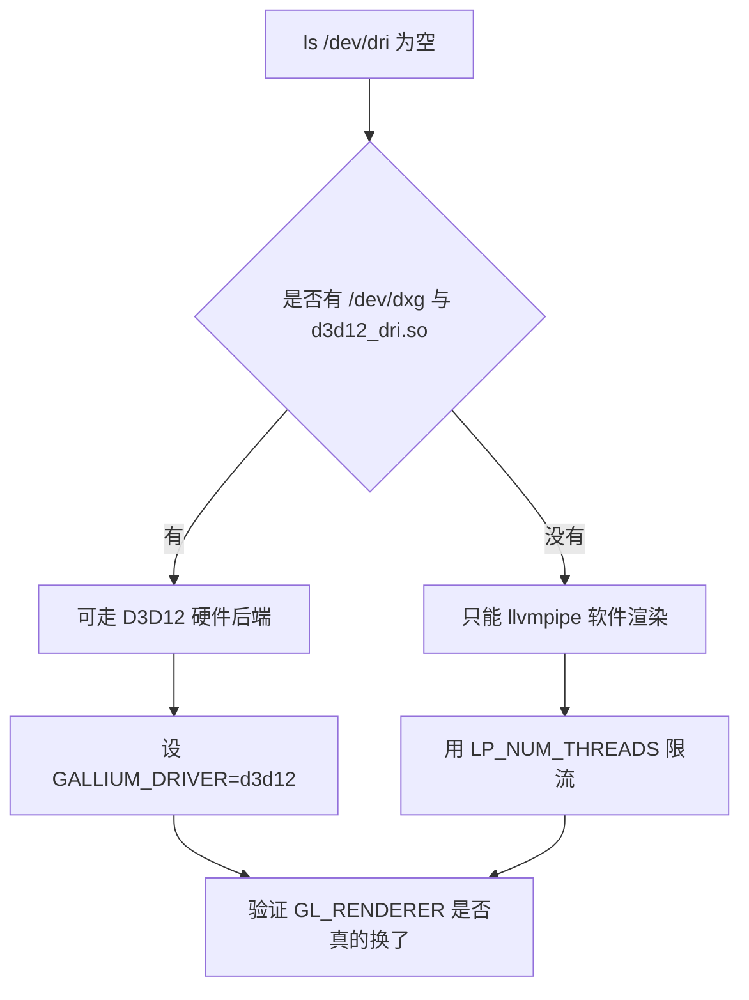
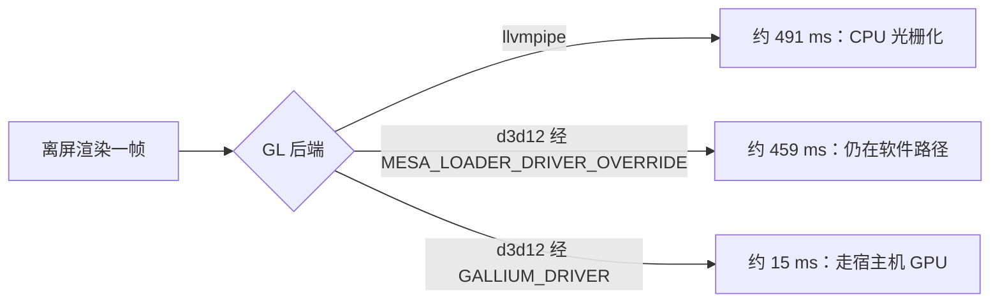
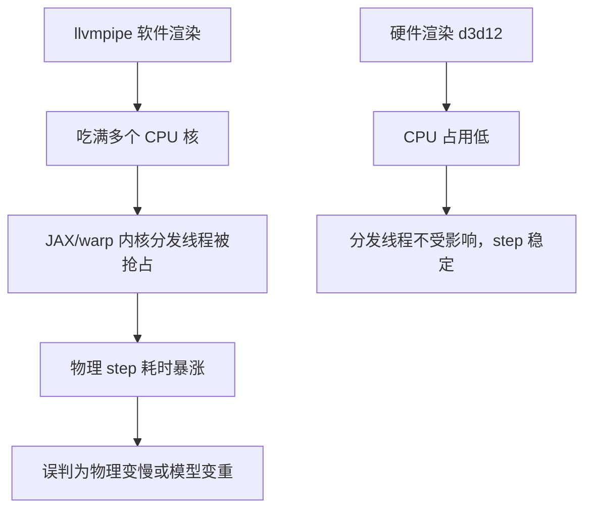

# WSL 下的 GPU 通路

WSL2 里的图形栈有一层容易误判的间接：容器内看不到常规的显卡设备节点，但图形请求可以通过另一条路径交给宿主机的驱动。只看 `ls /dev/dri` 为空就断定只能软件渲染，会让人把精力花在给软件渲染限流上，而不是换一条可用的硬件通路。

本机可用的通路有两条，三种后端配置的实测差距接近两个数量级；硬件渲染之所以关键，是它不只影响画面，还连带影响物理步耗时。数字都来自 `mjx-go1-getup/docs/viewer-guide.md` 的本机实测记录（WSL2 / 16 核 / RTX 5060 Laptop / mujoco 3.12.0）。

## 从 /dev/dri 得到的错误结论

WSL2 下 `ls /dev/dri` 确实是空的，于是很容易顺着推出「只能 llvmpipe 软件渲染」，再去调 `LP_NUM_THREADS` 给软件渲染限流（`viewer-guide.md`）。限流本身不是错，但它只解决了一半：还要先问能不能换一条路。



## 本机的两条通路

本机同时具备 `/dev/dxg` 与 Mesa 的 `d3d12_dri.so`，也就是说能把 OpenGL 调用转成 Direct3D 12 交给宿主机的显卡驱动（`viewer-guide.md`）。这条通路的开关是一个 Gallium 驱动变量，而不是常规的 `MESA_*` 变量。

| 通路 | 依赖 | 结果 |
| --- | --- | --- |
| WSLg 常规路径 | `/dev/dri` 等设备节点 | 本机不可用 |
| D3D12（dxg） | `/dev/dxg` 加 `d3d12_dri.so` | 可用，硬件渲染 |
| llvmpipe | 纯 CPU 的 Mesa 软件光栅化 | 默认回退，可用但很慢 |

另有一处记录提到本机在 WSL 里走 WSLg 的 d3d12 路径时 `MESA_LOADER_DRIVER_OVERRIDE=d3d12` 反而更慢，达到 647 ms（`experiment-log.md`）。这与下一节的实测一致：起作用的变量不是它。

两条通路的开关写法是这样（都是标准环境变量，取自查看器诊断与出图脚本）：

```bash
# 硬件通路（默认）：不设任何后端变量，走 WSL 的 D3D12

# 强制回退到软件渲染，并给光栅化限流：
export GALLIUM_DRIVER=          # 空串 = 强制 llvmpipe
export LP_NUM_THREADS=4         # 限制软件光栅化线程数，把 CPU 留给仿真与策略
```

`GALLIUM_DRIVER` 是 Mesa 的驱动选择变量，把它设成空串等于强制走软件光栅化；`LP_NUM_THREADS` 限制的是软件光栅化本身的线程数——只有在回退到软件渲染时才有意义，硬件通路下设它不起作用。

## 三种后端配置的实测对比

在同样的离屏渲染 640x480 条件下，三种配置的差距接近两个数量级（`viewer-guide.md`）。

| 配置 | 每帧耗时 | 相对默认 |
| --- | --- | --- |
| 默认（llvmpipe） | 491.2 ms | 1x |
| `MESA_LOADER_DRIVER_OVERRIDE=d3d12` | 458.9 ms | 几乎无变化 |
| `GALLIUM_DRIVER=d3d12` | 15.3 ms | 约 32 倍 |

结论有两条：关键变量是 `GALLIUM_DRIVER`；`MESA_LOADER_DRIVER_OVERRIDE` 在本机实测无效（`viewer-guide.md`）。把希望寄托在后者上，会得到「改了没用」的结论。



## 窗口与离屏走的是同一套选择

这条设置不限于离屏渲染：窗口路径（GLFW）下同样生效，并不只是离屏 EGL 才受益（`viewer-guide.md`）。因此查看器、离屏出图脚本、渲染基准脚本应当共用同一套环境变量设置。

| 路径 | 典型入口 | 是否受 `GALLIUM_DRIVER` 影响 |
| --- | --- | --- |
| 窗口 | `mujoco.viewer.launch_passive`、`mjv` | 是 |
| 离屏 | `mujoco.Renderer`、`GLContext` 加 `MjrContext` | 是 |

## 硬件渲染为什么连带影响物理步

换到硬件渲染的价值不只是画面帧率。软件渲染会把十几个 CPU 核吃满，而 JAX 与 warp 的内核分发是在 CPU 侧完成的，两边抢核的直接后果是物理步（`step`）耗时暴涨（`viewer-guide.md`）。走硬件后端之后，软件光栅化不再占 CPU，这条因果链从源头消失。



这一条把渲染后端与逐帧耗时连在一起，具体的耗时拆解见 `03-逐帧耗时拆解与优化`。

## 回退到软件渲染时的限流

回退路径要留：把 `GALLIUM_DRIVER` 设成空串可强制 llvmpipe，此时才需要给软件渲染限流，例如 `LP_NUM_THREADS=4`（`viewer-guide.md`）。实测在策略已经 jit 的前提下，llvmpipe 加限流也能跑到 50 到 61 fps。

本机脚本里能看到这条回退的痕迹：并排出图的脚本在文件开头就设了 `LP_NUM_THREADS=4`（`render_compare.py`）。它的含义是主动限制软件光栅化线程数，把 CPU 留给仿真与策略。

| 场景 | 后端 | 限流参数 |
| --- | --- | --- |
| 有 dxg 通路 | `GALLIUM_DRIVER=d3d12` | 不需要 |
| 强制软件渲染 | `GALLIUM_DRIVER=` 空串 | `LP_NUM_THREADS=4` |

## 诊断脚本怎么看

本机有一个现成的后端诊断脚本，它先打印相关环境变量与设备节点，再测离屏渲染耗时（`diag_render_cost.py`）：

| 输出项 | 用途 |
| --- | --- |
| `LIBGL_ALWAYS_SOFTWARE` / `MESA_LOADER_DRIVER_OVERRIDE` / `GALLIUM_DRIVER` | 确认当前生效的变量 |
| `DISPLAY` / `WAYLAND_DISPLAY` | 判断是否存在图形会话 |
| `/dev/dri 存在` | 设备节点是否可见 |
| 多个分辨率的渲染中位耗时 | 判断是否落在软件渲染的量级 |

离屏渲染的另一种写法是手工建上下文，脚本里对此有一条注释：离屏必须先建 GL 上下文，且 `GLContext` 不是上下文管理器，用完要 `free()` 释放（`render_terrain_preview.py`）。

## 易错点

| 现象 | 原因 | 判据 |
| --- | --- | --- |
| 改 `MESA_LOADER_DRIVER_OVERRIDE` 没效果 | 起作用的变量是 `GALLIUM_DRIVER` | 对照两种设置的渲染耗时 |
| 只看设备节点就下结论 | WSL2 的图形路径不经过 `/dev/dri` | 检查 `/dev/dxg` 与 Mesa 的 d3d12 驱动 |
| 窗口流畅但物理却慢 | 渲染占了 CPU，与内核分发抢核 | 对照 step 与渲染分项的时间 |
| 强制软件渲染后帧率很低 | 未设线程限流 | 加上 `LP_NUM_THREADS=4` 再看 |
| 环境变量设了没生效 | 设置在 `import mujoco` 之后 | 检查脚本里设置的位置 |
| 离屏脚本忘记释放上下文 | `GLContext` 不是上下文管理器 | 用 try/finally 调 `free()` |

## 小结

### 核心概念

- WSL2 的硬件渲染可以不经过 `/dev/dri`，经 `/dev/dxg` 走 D3D12。
- 开关是 `GALLIUM_DRIVER=d3d12`，`MESA_LOADER_DRIVER_OVERRIDE` 实测无效。
- 窗口与离屏共用同一套后端选择。
- 软件渲染占 CPU，会通过抢占内核分发间接拖慢物理步。

### 设计权衡

| 决策 | 选择 | 收益 | 代价 |
| --- | --- | --- | --- |
| 渲染后端 | 默认 d3d12 硬件通路 | 渲染快且不抢 CPU | 依赖 dxg 与 Mesa 驱动存在 |
| 回退方案 | 空值强制 llvmpipe 加限流 | 通路缺失时仍能跑 | 帧率与物理耗时都受影响 |
| 设置方式 | 环境变量在导入前设定 | 两条渲染路径都生效 | 位置写错就静默失效 |
| 验证方式 | 读实际 GL_RENDERER | 不靠猜 | 需要额外建临时上下文 |

## 练习

### 基础题

1. WSL2 下 `ls /dev/dri` 为空能否说明只能软件渲染？为什么？
2. 三种后端配置的实测耗时分别是多少量级？
3. 强制软件渲染时为什么还要设 `LP_NUM_THREADS`？

### 挑战题

4. 说明软件渲染拖慢物理步的完整因果链，并给出一个能区分「渲染抢核」与「物理本身变重」的对照实验。

5. 用 `diag_render_cost.py` 的输出设计一套判定流程，区分硬件与软件后端。

6. 如果目标机器没有 `/dev/dxg`，列出仍然可用的配置组合与各自的取舍。

### 附：本页引用的路径

| 路径 | 用途 |
| --- | --- |
| `mjx-go1-getup/docs/viewer-guide.md` | 后端实测表、抢核链条与回退方式（） |
| `mjx-go1-getup/docs/experiment-log.md` | WSL 渲染路径的历史记录（） |
| `RLcontroller_go1/sim/diag_render_cost.py` | 后端环境变量与渲染耗时诊断（） |
| `RLcontroller_go1/sim/render_terrain_preview.py` | 离屏上下文的手工管理（） |
| `RLcontroller_go1_moreinformation/sim/render_compare.py` | 软件渲染限流的实际设置（） |

（引用的文件以 /home/tc63/mujoco 为根。）