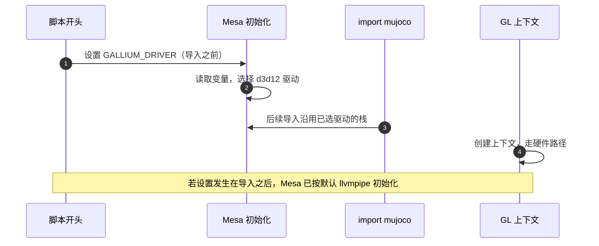
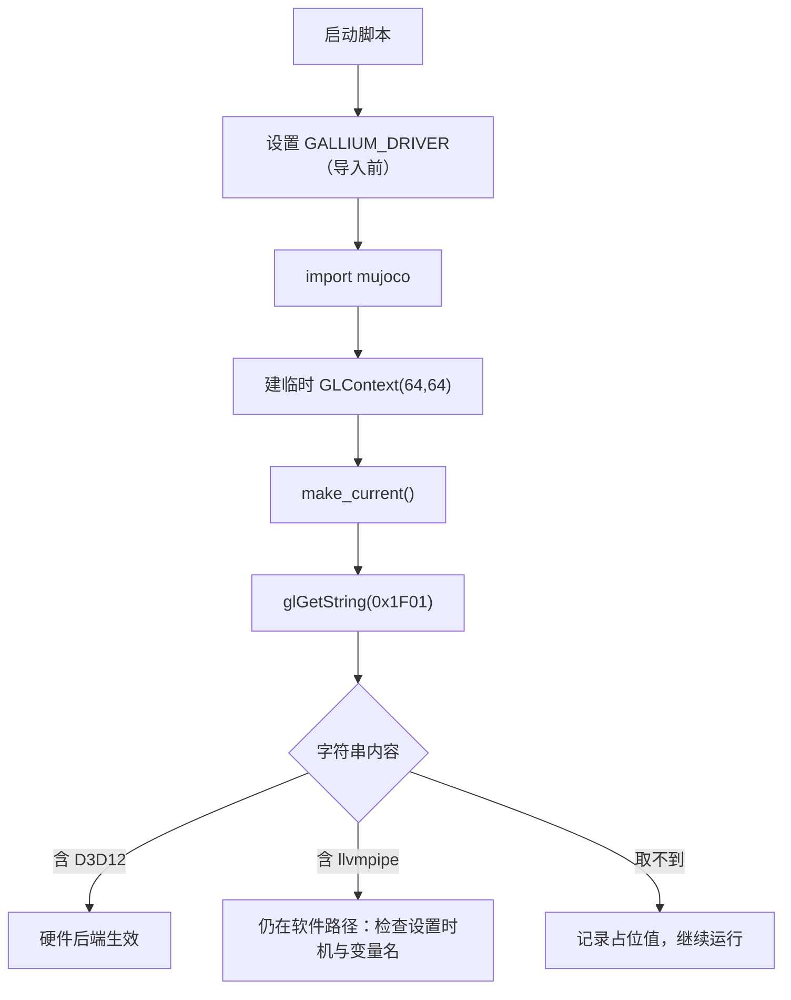

# 后端选择与验证

选定渲染后端只需要一行环境变量，但这一行有两个容易失败的细节：设置时机必须早于导入，以及设置之后怎么确认它生效了。前一个问题会让变量静默失效，后一个问题会让人拿「我以为设了」当结论。

选择与验证要处理四件事：变量写在哪里、为什么用 `setdefault`、如何读出当前渲染器字符串，以及交付前要检查哪些配置项。

## 环境变量必须在导入之前设

Mesa 在初始化图形栈时读取 Gallium 驱动变量，所以设置必须发生在 `import mujoco` 之前（`viewer-guide.md`）：

```python
# 必须在 import mujoco 之前设!
os.environ.setdefault("GALLIUM_DRIVER", "d3d12")   # 用 setdefault, 允许用户覆盖
```

写在导入之后时，Mesa 已经完成初始化，变量对本次进程不再有效，而且通常没有任何报错。这类静默失效在脚本里表现为「配置写了、行为没变」（`viewer-guide.md` 把这种情况记作两次回归的共同形态）。



## setdefault 与强制覆盖的差别

脚本用的是 `setdefault`，含义是「没有值时才填默认值」（`viewer-guide.md`）。这带来两个好处：

| 写法 | 行为 | 适用场景 |
| --- | --- | --- |
| `setdefault("GALLIUM_DRIVER", "d3d12")` | 外部已设则不覆盖 | 默认走硬件，允许临时覆盖 |
| `environ["GALLIUM_DRIVER"] = "d3d12"` | 无条件覆盖 | 确定要强制硬件 |

回退靠的是把变量设成空串：`GALLIUM_DRIVER=` 会强制 llvmpipe 软件渲染，此时才需要 `LP_NUM_THREADS` 限流（`viewer-guide.md`）。如果脚本用无条件赋值，这个回退手段就失效了，所以 `setdefault` 是刻意的选择。

## 另一个变量为什么无效

`MESA_LOADER_DRIVER_OVERRIDE=d3d12` 在本机实测没有效果：同样的离屏 640x480 渲染是 458.9 ms，与默认软件渲染的 491.2 ms 几乎同一量级，而 `GALLIUM_DRIVER=d3d12` 是 15.3 ms（`viewer-guide.md`）。

| 变量 | 实测每帧耗时 | 结论 |
| --- | --- | --- |
| 不设 | 491.2 ms | 软件渲染 |
| `MESA_LOADER_DRIVER_OVERRIDE=d3d12` | 458.9 ms | 无效 |
| `GALLIUM_DRIVER=d3d12` | 15.3 ms | 生效 |

记录里还提到另一处场景：在 WSL 里走 WSLg 的 d3d12 路径时这个变量反而更慢，达到 647 ms（`experiment-log.md`）。两处结论方向一致，关键变量是 `GALLIUM_DRIVER`。

## 用临时上下文读出渲染器字符串

验证不能靠猜，也不该信环境变量本身，而要读当前上下文真实的渲染器字符串。本机脚本里的实现是自建一个临时上下文再查询（`watch_v20_fast.py`）：

```python
def active_gl_renderer():
    ctx = mujoco.GLContext(64, 64)
    ctx.make_current()
    gl = ctypes.CDLL("libGL.so.1")
    gl.glGetString.restype = ctypes.c_char_p
    gl.glGetString.argtypes = [ctypes.c_uint]
    v = gl.glGetString(0x1F01)          # GL_RENDERER
    return v.decode() if v else "(空)"
```

三处细节各有原因：

| 细节 | 原因 |
| --- | --- |
| 自建 `GLContext` 并 `make_current()` | 查看器的上下文在它自己的 C++ 线程里，主线程直接查询会因为没有当前上下文而返回 `None`（曾误报成一个问号） |
| 只查 `GL_RENDERER`（`0x1F01`） | 它是驱动自报的名字，比环境变量更接近事实 |
| 用 try/except 包住并返回占位文本 | 探测失败不应影响主流程 |



## 期望字符串与回退判定

期望看到的是带 D3D12 的驱动名，例如 `D3D12 (AMD Radeon 780M Graphics)`；如果显示 `llvmpipe (LLVM ...)`，说明仍在软件路径（`viewer-guide.md`）。

| 读到的字符串 | 判定 | 下一步 |
| --- | --- | --- |
| 含 `D3D12` 与显卡名 | 硬件路径 | 无需处理 |
| 含 `llvmpipe` | 软件路径 | 检查变量设置位置与名字，再确认 dxg 通路存在 |
| 取不到或为空 | 探测失败 | 不影响运行，用渲染耗时量级辅助判断 |

轻量一点的检查方式是运行后端诊断脚本，它直接打印相关环境变量与设备节点状态（`diag_render_cost.py`）。这与读渲染器字符串互补：前者看配置，后者看事实。

## 交付前的四项检查

交付清单里有一条专门针对这类静默漏项：用 grep 确认四个关键配置都在脚本里（`viewer-guide.md`）。

| 配置项 | 归属 | 缺失后的表现 |
| --- | --- | --- |
| `GALLIUM_DRIVER` | 本单元 | 落到软件渲染，渲染与物理都慢 |
| `LP_NUM_THREADS` | 本单元（回退路径） | 强制软件渲染时占满 CPU |
| `graph_mode` | 逐帧耗时单元 | 每帧重新捕获 CUDA 图，跑几千帧后崩 |
| `XLA_PYTHON_CLIENT_MEM_FRACTION` | 逐帧耗时单元 | 显存被预占满，并发时帧率塌方 |

```bash
grep -n "GALLIUM_DRIVER\|LP_NUM_THREADS" sim/*.py
```

后两项的机理分别在 `03-逐帧耗时拆解与优化` 里展开。这里要强调的是这条清单的教训：本项目两次回归都是「文档写了、代码没有」，所以交付前用 grep 对着代码核实，而不是对着文档确认。

## 易错点

| 现象 | 原因 | 判据 |
| --- | --- | --- |
| 环境变量设了没生效 | 写在 `import mujoco` 之后 | 看设置语句的位置 |
| 脚本内部覆盖了用户的回退设置 | 用了无条件赋值而非 `setdefault` | 检查赋值方式 |
| 相信环境变量而不看实际渲染器 | 变量存在不代表驱动已启用 | 读 `GL_RENDERER` |
| 主线程查询返回空 | 没有当前 GL 上下文 | 自建上下文并 `make_current()` |
| 探测异常导致脚本退出 | 查询未做异常保护 | 加 try/except 返回占位值 |
| 交付时只对文档核清单 | 文档与代码可能不一致 | 用 grep 对代码核 |

## 小结

### 核心概念

- 后端环境变量必须在导入图形库之前设置，否则静默失效。
- `setdefault` 保留用户覆盖能力，空值可用于强制软件渲染。
- 真实结论来自渲染器字符串，而不是环境变量本身。
- 查看器的上下文在渲染线程里，验证要自建临时上下文。

### 设计权衡

| 决策 | 选择 | 收益 | 代价 |
| --- | --- | --- | --- |
| 默认值 | `setdefault` 填 d3d12 | 默认快，回退仍可用 | 需要向使用者说明覆盖方法 |
| 验证方式 | 运行时读驱动字符串 | 结论可靠 | 多一段探测代码 |
| 探测失败 | 返回占位文本继续跑 | 不影响主流程 | 日志里可能出现取不到的值 |
| 交付核对 | grep 关键配置 | 能拦住文档与代码不一致 | 需要维护配置清单 |

## 练习

### 基础题

1. 为什么后端环境变量要写在 `import mujoco` 之前？
2. `setdefault` 与直接赋值在这类配置上有什么差别？
3. 读出 `llvmpipe` 说明当前处于哪条渲染路径？

### 挑战题

4. 写出一个函数：打印当前渲染器字符串，失败时返回占位文本且不抛异常，并说明为什么不能直接在主线程调用 `glGetString`。

5. 设计一个对照实验：同一脚本分别用默认与空值 `GALLIUM_DRIVER` 跑离屏渲染，用耗时与驱动字符串两路证据确认结论。

6. 说明为什么「环境变量已经设置」不能作为「硬件后端已启用」的证据，给出两种补强手段。

### 附：本页引用的路径

| 路径 | 用途 |
| --- | --- |
| `mjx-go1-getup/docs/viewer-guide.md` | 变量设置位置、两种变量对比、验证方式与交付清单（） |
| `mjx-go1-getup/docs/experiment-log.md` | WSL 渲染路径的历史记录（） |
| `mjx-go1-getup/sim/watch_v20_fast.py` | 渲染器字符串探测函数（） |
| `RLcontroller_go1/sim/diag_render_cost.py` | 环境变量与设备节点打印（） |

（引用的文件以 /home/tc63/mujoco 为根。）