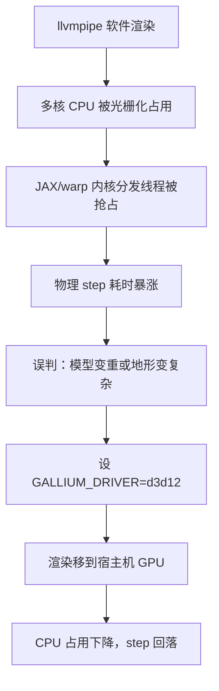
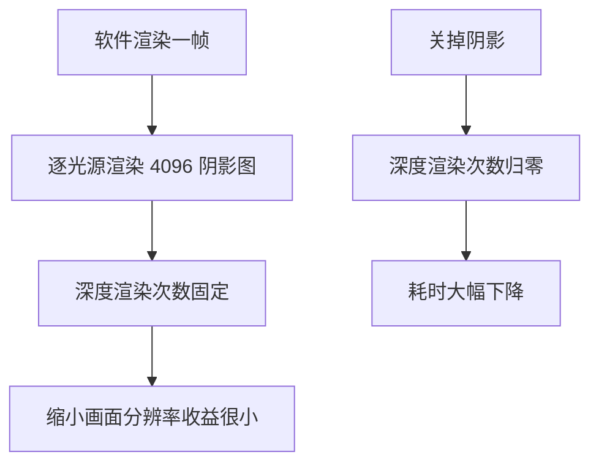

# 渲染与物理抢核

在软件渲染的机器上，渲染和物理争的是同一批 CPU 核：Mesa 的软件光栅化会把多核吃满，而 JAX 与 warp 的内核分发也是在 CPU 侧发起的。两边相遇时，表现为物理步耗时暴涨，很容易被误判成模型变重或算法变慢。

这条因果链能从耗时分项里分辨出来；阴影是软件渲染的主要开销，关闭它有模型级与场景级两处。数字取自 `mjx-go1-getup/docs/viewer-guide.md` 的本机实测（WSL2 / 16 核 / mujoco 3.12.0）。

## 软件渲染占用的是 CPU

软件渲染（llvmpipe）用 CPU 完成光栅化，与常见认知里的「渲染走显卡」相反；硬件后端（本机的 D3D12 通路）则几乎不占 CPU（`viewer-guide.md:176-180`）。这一条差别决定了后面所有现象。

| 后端 | 主要消耗 | 对仿真进程的影响 |
| --- | --- | --- |
| d3d12 硬件 | 宿主机 GPU | CPU 留给仿真与策略 |
| llvmpipe 软件 | 本机多核 CPU | 与内核分发、Python 主循环抢核 |

## 内核分发被抢占的链条

JAX 与 warp 的内核分发在 CPU 侧完成，抢占的后果直接落在物理步上（`viewer-guide.md:178-180`）。完整链条是：软件光栅化吃满多核，分发线程被挤到后面，物理步耗时上升，观察者看到的现象却是「物理变慢」。



软件渲染下并非没有办法：把渲染线程数限住，例如 `LP_NUM_THREADS=4`，实测也能跑到 50 到 61 fps（前提是策略已经 jit），本机并排出图的脚本就设了这个值（`viewer-guide.md:181-182`、`render_compare.py:18`）。限流让出的是 CPU，而不是提升渲染效率。

## 从耗时分项分辨方向

观测脚本的 overlay 里同时打印 fps 与各分项耗时（`viewer-guide.md:367-368`），这正是分辨方向所需的依据。窗口路径里 `v.sync()` 只花约 2.4 ms，GL 绘制发生在查看器的 C++ 渲染线程里，它的 CPU 开销不出现在主循环的帧计时里（`viewer-guide.md:38`、`view_go1.py:756-759`）。

| 现象 | 指向 |
| --- | --- |
| `step` 高，但 `copy`/`sync`/`scan` 都正常 | 渲染抢核或显存问题，见分项与 GPU 状态 |
| `sync` 本身很高 | 主循环与渲染线程的交接被拖住 |
| 所有分项都低但 fps 低 | 节流逻辑问题，不是渲染 |

这里要留意：`step` 高并不只有抢核一个原因，显存被预占同样会让它暴涨到几百毫秒。两者的判别方式不同，显存侧要靠 `nvidia-smi` 看显存与 SM 时钟，具体见 `03-逐帧耗时拆解与优化`。

## 阴影是软件渲染的主要开销

MuJoCo 默认对每个光源渲染一张 `shadowsize=4096` 的阴影图，开销来自逐光源的深度渲染次数，而不是最终画面的分辨率（`viewer-guide.md:196-197`）。这一条解释了后面那个反直觉的实测结果。

本机有一条现成的量测：诊断脚本在 640x480 与 320x240 两个分辨率下测离屏渲染中位耗时（`diag_render_cost.py:49-79`），而记录给出的结论是两个分辨率都在 490 ms 量级（`viewer-guide.md:196-197`）。分辨率降低并不能救软件渲染，因为瓶颈是每帧按光源走的深度渲染次数。



## 两处关闭阴影的位置

阴影可以在两个层级关闭，位置不同、生效时机也不同（`viewer-guide.md:198-205`）。

| 层级 | 写法 | 时机 |
| --- | --- | --- |
| 模型级 | `m.light_castshadow[:] = 0` | 打开窗口之前 |
| 场景级 | `v.user_scn.flags[mjRND_SHADOW] = 0` | 窗口打开后，运行时可改 |

模型级的写法在本机脚本里有直接用例，出图前一次性关掉全部光源阴影（`render_terrain_preview.py:26`）。场景级的写法用在查看器的低画质档，同时关掉反射、天空盒与阴影（`view_go1.py:780-784`）：

```python
if args.quality == "low":
    v.user_scn.flags[_flags.mjRND_REFLECTION] = 0
    v.user_scn.flags[_flags.mjRND_SKYBOX] = 0
    v.user_scn.flags[_flags.mjRND_SHADOW] = 0
```

反射与天空盒只在运行时场景 `user_scn` 上可改，模型侧没有对应字段，所以必须写在循环之外并设置一次（`view_go1.py:778-779`）。阴影两处都能设，模型级更早生效，场景级更灵活。

## 实测渲染耗时的量级

判断当前落在哪条路径，最直接的办法是看一帧渲染的耗时量级：硬件后端约 15 ms，软件后端在 480 ms 以上（`viewer-guide.md:165-169`）。诊断脚本会给出中位数与分位数，并换算成帧率上限（`diag_render_cost.py:49-79`）。

| 观察值 | 后端判定 | 处理方向 |
| --- | --- | --- |
| 十余毫秒一帧 | 硬件路径 | 保留现状，关注物理与策略开销 |
| 数十毫秒一帧 | 硬件路径但画面较重 | 关阴影与反射 |
| 四百毫秒以上一帧 | 软件路径 | 先换后端，再考虑限流 |

## 软件渲染下的可用组合

如果目标机器没有可用的硬件通路，软件渲染仍是可跑的，只是要在配置上做几处让步。下表把可调项与代价列在一起，便于按机器情况取舍。

| 调项 | 作用 | 代价 |
| --- | --- | --- |
| `LP_NUM_THREADS=4` | 限制光栅化线程数，把 CPU 让给仿真 | 渲染上限下降，画面帧率降低 |
| 关闭阴影 | 去掉逐光源深度渲染 | 画面失去阴影提示，观察接触时辨识度下降 |
| 关闭反射与天空盒 | 减少场景级效果开销 | 画面质感下降 |
| 缩小窗口尺寸 | 减少像素量 | 对阴影主导的开销帮助有限 |
| 降低倍速或跳帧渲染 | 让物理与渲染错峰 | 观感不再连续，不适合精细观察 |

这些让步之间不冲突，通常是先关阴影、再限线程数。若策略已经 jit、仿真本身开销不大，软件渲染加限流也能维持可用的交互帧率（`viewer-guide.md:181-182`）。

## 易错点

| 现象 | 原因 | 判据 |
| --- | --- | --- |
| 物理步暴涨却查不到代码问题 | 软件渲染抢占 CPU | 看后端与渲染分项耗时 |
| 把渲染降分辨率却没变化 | 瓶颈是阴影的深度渲染次数 | 关阴影后再测 |
| 设置场景级阴影开关没生效 | 写在了循环里或对象不对 | 确认写在窗口打开后且在循环之外 |
| 以为 `sync` 耗时等于渲染耗时 | GL 绘制在渲染线程 | 对照同步耗时与画面帧率 |
| 把 `step` 高一律归因于渲染 | 显存被预占同样会暴涨 | 用 `nvidia-smi` 看显存与 SM 时钟 |
| 限流参数写在脚本之外 | 缺少统一的环境变量设置 | grep 脚本里的配置项 |

## 小结

### 核心概念

- 软件渲染消耗 CPU，硬件渲染把开销移到宿主机 GPU。
- 内核分发在 CPU 侧，与软件光栅化抢核会让物理步耗时暴涨。
- 阴影开销来自逐光源深度渲染，与画面分辨率关系不大。
- 阴影可在模型级与场景级两处关闭，生效时机不同。

### 设计权衡

| 决策 | 选择 | 收益 | 代价 |
| --- | --- | --- | --- |
| 后端 | 硬件通路优先 | 渲染快且不抢 CPU | 依赖宿主机通路可用 |
| 软件回退 | 限制光栅化线程数 | 保留可用性 | 渲染上限降低 |
| 阴影 | 按需关闭 | 显著降低软件渲染开销 | 画面失去阴影提示 |
| 判断依据 | 耗时分项加后端字符串 | 定位方向明确 | 需要维护分项统计 |

## 练习

### 基础题

1. 软件渲染消耗的是 CPU 还是 GPU？这对仿真进程意味着什么？
2. 阴影开销为什么与画面分辨率关系不大？
3. 模型级与场景级关闭阴影分别写在什么位置？

### 挑战题

4. 设计一个实验，在同一台机器上区分「渲染抢核导致 step 上升」与「物理本身变重」。

5. 说明 `v.sync()` 的耗时为什么不能代表渲染开销，并给出两个能代表它的观察量。

6. 在只能用软件渲染的机器上，列出一套让查看器可用的配置组合，并说明各自的代价。

### 附：本页引用的路径

| 路径 | 用途 |
| --- | --- |
| `mjx-go1-getup/docs/viewer-guide.md` | 抢核链条、阴影开销与耗时分项（`:38`、`:176-205`、`:367-368`） |
| `RLcontroller_go1/sim/diag_render_cost.py` | 多分辨率离屏渲染量测（`:49-79`） |
| `RLcontroller_go1/sim/render_terrain_preview.py` | 模型级关闭阴影（`:26`） |
| `RLcontroller_go1_moreinformation/sim/render_compare.py` | 软件渲染限流设置（`:18`） |
| `mjx-go1-getup/sim/view_go1.py` | 低画质档与渲染线程开销的记录（`:756-784`） |

（引用的文件以 /home/tc63/mujoco 为根。）