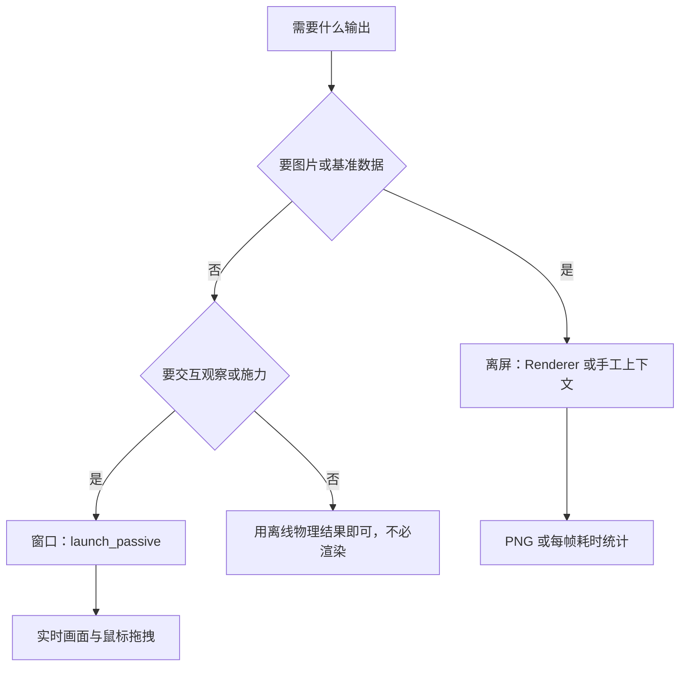
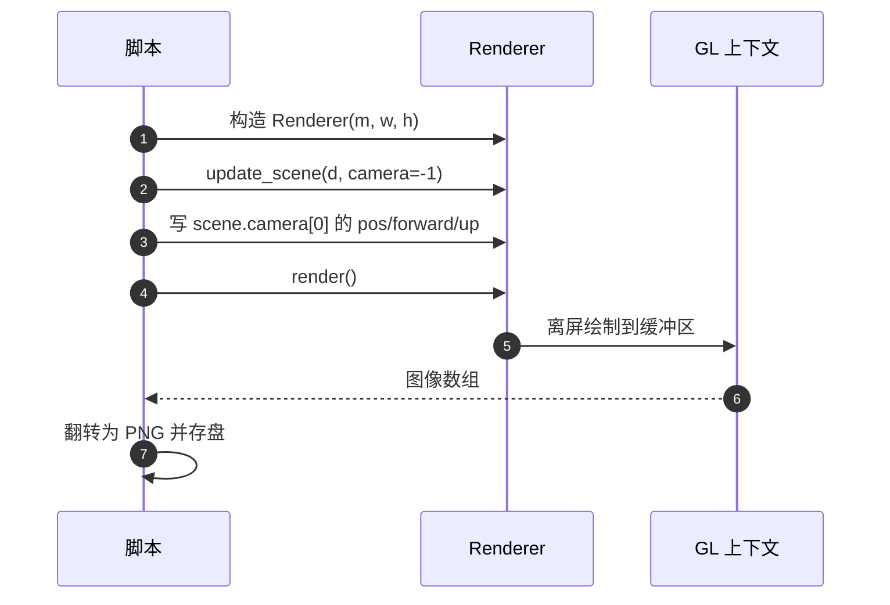

# 离屏渲染与窗口渲染

同一个模型可以走两条完全不同的渲染路径：一条把画面写进内存缓冲区再存成图片，另一条把画面交给窗口并允许交互。两条路径共用同一套后端选择与阴影设置，但在上下文管理、场景所有权与时间计量上差别很大。

两条路径的选择判据取决于用途：要批量出图或做基准就用离屏，要人工观察与施力就用窗口。引用的脚本都在本机 `RLcontroller_go1` 与 `LQRbalance` 下。

## 两条路径的用途

| 路径 | 入口 | 典型用途 | 是否需要图形会话 |
| --- | --- | --- | --- |
| 离屏 | `mujoco.Renderer`、`GLContext` 加 `MjrContext` | 出图、策略对比、性能基准 | 不需要窗口 |
| 窗口 | `mujoco.viewer.launch_passive`、`mjv` | 交互观察、施加扰动、调参 | 需要显示环境 |



## 离屏路径的上下文管理

手工离屏渲染要先建 GL 上下文，再建渲染上下文，最后才更新场景并读像素。本机 `render_terrain_preview.py:36-51` 是最完整的写法：

```python
glctx = mujoco.GLContext(w, h)
glctx.make_current()
try:
    ctx = mujoco.MjrContext(m, mujoco.mjtFontScale.mjFONTSCALE_150)
    mujoco.mjv_updateScene(m, d, opt, None, cam,
                           mujoco.mjtCatBit.mjCAT_ALL, scn)
    mujoco.mjr_render(mujoco.MjrRect(0, 0, w, h), scn, ctx)
    mujoco.mjr_readPixels(buf, None, mujoco.MjrRect(0, 0, w, h), ctx)
finally:
    glctx.free()
```

三处细节要记住（`render_terrain_preview.py:37-51`）：

| 细节 | 原因 |
| --- | --- |
| 必须先建 GL 上下文 | 没有当前上下文时渲染调用无处落脚 |
| `GLContext` 用 try/finally 释放 | 它不是上下文管理器，注释里明确写了用完要 `free()`（`:38-39`） |
| 读出的缓冲区要上下翻转 | OpenGL 的原点在左下角，图像数组的原点在左上角 |

脚本里还留了一条环境判断的注释：WSL 下没有 `/dev/dri` 时走 Mesa 软件渲染（`render_terrain_preview.py:38`）。这与 `01-WSL下的GPU通路` 里讲的通路选择是同一件事。

## Renderer 封装的相机写入

`mujoco.Renderer` 把上下文与场景管理封了起来，出图脚本的写法更短（`render_frames.py:15-36`）：

```python
renderer = mujoco.Renderer(m, 480, 480)

def snap(name, azimuth=90, elevation=-15):
    renderer.update_scene(d, camera=-1)
    cam = renderer.scene.camera[0]
    cam.pos[:] = target + dist * np.array([...])
    cam.forward[:] = fwd
    cam.up[:] = [0, 0, 1]
    img = renderer.render()
    PIL.Image.fromarray(img).save(name)
```

`update_scene` 传入 `camera=-1` 表示使用自由相机，之后可以直接改 `renderer.scene.camera[0]` 的位置与朝向，从而在不改模型文件的前提下固定机位（`render_frames.py:17-32`）。这一步是策略对比出图的关键：多份策略用同一机位、同一视角，画面差异才可比较。



## 窗口路径的同步点

窗口路径由主循环驱动，`v.sync()` 只负责把状态交给查看器的渲染线程，GL 绘制发生在那条线程里，开销不出现在主循环的帧计时中（`viewer-guide.md:38`、`view_go1.py:756-759`）。本机实测 `sync` 约 2.4 ms。

这个分工解释了两种常见的困惑：窗口帧率很高但物理步仍然慢（渲染线程与内核分发抢核），以及主循环耗时加起来不到一帧时间（渲染开销在别处结算）。相关的测量方式见 `03-渲染与物理抢核`。

## 自绘几何的场景归属

窗口路径给查看器一个独立的运行时场景 `v.user_scn`，自绘几何放在这里，由渲染循环与主场景合成（`viewer-guide.md:329-335`）：

```python
v.user_scn.ngeom = 0
for i in range(n_scan):
    mujoco.mjv_initGeom(scn.geoms[n], mjGEOM_SPHERE, size, pos, mat, rgba)
    scn.ngeom += 1
```

离屏路径没有独立场景，如果照抄「先把 `ngeom` 清零」的写法，会把 `mjv_updateScene` 刚放进去的机器人几何一起抹掉，渲染出只有自绘球体而没有机器人的画面（`viewer-guide.md:337-341`）。离屏要对同一个场景追加几何，或者自己维护一个独立场景。

| 路径 | 自绘几何的落点 | 注意 |
| --- | --- | --- |
| 窗口 | `v.user_scn` | 只重置 `user_scn.ngeom`，不要动主场景 |
| 离屏 | 追加到已更新的场景或自建场景 | 不能清空主场景的 `ngeom` |

## 渲染基准怎么测

离屏路径适合做基准测量，因为它把渲染从交互与节流里摘了出来。本机诊断脚本的做法是在同一个上下文里循环调用 `update_scene` 与 `render`，收集中位与分位数耗时并换算成帧率上限（`diag_render_cost.py:49-79`）：

```python
with mujoco.Renderer(m, height=h, width=w) as r:
    r.update_scene(d)
    for _ in range(args.n):
        t0 = time.perf_counter()
        r.update_scene(d)
        r.render()
        ts.append((time.perf_counter() - t0) * 1000)
```

同一脚本会对多个分辨率各测一轮（`:66-79`），用于回答「缩小画面能否救回帧率」。结合阴影开销的机理，小分辨率通常收益很小；把阴影关掉才是主要手段。

## 选择路径的判据

| 需求 | 选择 | 理由 |
| --- | --- | --- |
| 产出图片或对照图 | 离屏 | 机位可控、可批量、可脚本化 |
| 测量渲染开销 | 离屏 | 不受节流与交互影响 |
| 人工观察与施力 | 窗口 | 只有窗口提供鼠标交互 |
| 无显示环境 | 离屏 | 不依赖窗口系统 |

两条路径的环境变量设置应当一致，后端与阴影的选择不分路径（`viewer-guide.md:177`）。

## 易错点

| 现象 | 原因 | 判据 |
| --- | --- | --- |
| 离屏图片上下颠倒 | 未翻转 GL 缓冲区 | 检查是否有 `flipud` 一类处理 |
| 上下文泄漏或二次渲染失败 | 忘记释放 GL 上下文 | 用 try/finally 调 `free()` |
| 离屏图上只有自绘几何没有模型 | 清空了主场景的几何计数 | 检查是否误用 `scn.ngeom = 0` |
| 窗口帧率与主循环耗时不匹配 | 渲染在独立线程结算 | 对照同步耗时与画面帧率 |
| 多份策略出图机位不一致 | 未固定相机参数 | 统一写 `scene.camera[0]` 的位姿 |
| 换了分辨率基准结果没变 | 瓶颈在阴影而非分辨率 | 关阴影后再测 |

## 小结

### 核心概念

- 离屏路径把画面写进缓冲区，窗口路径把画面交给渲染线程并支持交互。
- 离屏手工渲染要自建并释放 GL 上下文，读出的缓冲区需要翻转。
- `Renderer` 封装了上下文管理，相机可通过 `scene.camera[0]` 直接写入。
- 自绘几何在窗口路径属于独立场景，离屏不能照搬清空写法。

### 设计权衡

| 决策 | 选择 | 收益 | 代价 |
| --- | --- | --- | --- |
| 离屏写法 | 手工上下文或 `Renderer` | 前者可控，后者简洁 | 手工写法要自己管释放 |
| 相机控制 | 直接写场景相机 | 多份结果可比较 | 需要自己算位姿 |
| 基准测量 | 离屏循环计时 | 结果干净 | 不代表窗口路径的真实帧率 |
| 自绘几何 | 窗口用独立场景 | 不污染主场景 | 离屏要另写一套 |

## 练习

### 基础题

1. 离屏渲染为什么要在读像素之后翻转图像？
2. `GLContext` 的释放应该写在什么位置？
3. 窗口路径里 `v.sync()` 完成的是什么工作？

### 挑战题

4. 写出一段离屏渲染代码，固定相机位姿并把结果存成 PNG，说明每个清理步骤的必要性。

5. 说明为什么离屏基准测出的耗时不能代表窗口路径的帧率，给出两种补测方式。

6. 把一段窗口路径的自绘几何代码改到离屏路径上，说明需要改动的地方与理由。

### 附：本页引用的路径

| 路径 | 用途 |
| --- | --- |
| `LQRbalance/render_frames.py` | Renderer 与相机写入实例（`:15-36`） |
| `RLcontroller_go1/sim/render_terrain_preview.py` | 手工离屏上下文与释放（`:36-51`） |
| `RLcontroller_go1/sim/diag_render_cost.py` | 离屏基准测量（`:49-79`） |
| `RLcontroller_go1_moreinformation/sim/render_compare.py` | 机位与策略对照出图（`:1-13`、`:18`） |
| `mjx-go1-getup/docs/viewer-guide.md` | 同步点、自绘几何与后端一致性（`:38`、`:177`、`:329-341`） |
| `mjx-go1-getup/sim/view_go1.py` | 渲染线程开销的记录（`:756-759`） |

（引用的文件以 /home/tc63/mujoco 为根。）