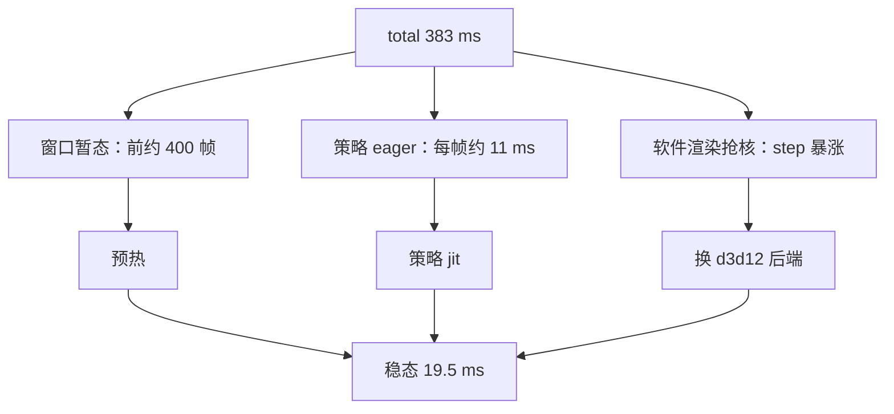

# 每帧耗时预算

观测脚本的一帧不是「物理一步」那么简单：它包含命令组装、策略前向、物理推进、状态搬回 CPU、可选的扫描点计算、交给渲染线程的同步，以及为了维持实时而补足的睡眠。任何一项偏大，画面都会变卡，但它们的原因与修法完全不同。

一帧可以拆成若干可计时的分项，本机一条完整的优化记录把优化前后的账目都留了下来；分项统计怎么打、以及为什么不能用一个数字解释全部现象，都能从这份账目里读出来。数字取自 `mjx-go1-getup/docs/viewer-guide.md` 与 `RLcontroller_go1_moreinformation/实验记录_Go1复现.md` 的本机实测。

## 一帧由哪些部分拼成

观测脚本的每帧构成与初始耗时量级如下（`viewer-guide.md`）：

| 环节 | 内容 | 初始量级 |
| --- | --- | --- |
| ① 组命令 | 组装三维指令数组 | 接近 0，但会改变缓冲区地址 |
| ② 策略前向 | `policy(obs)` | eager 11.0 ms / jit 0.08 ms |
| ③ 物理一步 | `step(state, act)` | 13 到 15 ms（WARP_STAGED） |
| ④ 搬回 CPU | `qpos` / `qvel` | 0.2 ms |
| ⑤ 灌入 CPU 模型 | `mj_forward` 更新 `d_view` | 0.2 ms |
| ⑥ 自绘扫描点 | 采样点位置与特征 | 3.5 ms（前提是已 jit） |
| ⑦ 同步给渲染线程 | `v.sync()` | 2.4 ms |
| ⑧ 节流睡眠 | 补足到目标间隔 | 视预算而定 |


对照实测：优化前 373 ms 一帧（约 3 fps），优化后 19.5 ms 一帧（约 50 fps）；差值几乎全部来自 ② ③ ⑥ 三处，与「物理本身太慢」无关（`viewer-guide.md`）。

## 初始账目：373 ms 的去向

`view_go1.py` 跑 v20 权重时的日志是这份账目的原始记录（`实验记录_Go1复现.md`）：

```text
frame  50: fps=3  step=377.3 copy=0.2 render=2.4 scan=3.5 total=383.4 ms
frame 400: fps=3  step=369.5 copy=0.2 render=2.5 scan=3.6 total=375.8 ms
frame 425: fps=9  step=103.5 ...          <- 自行恢复
frame 450: fps=16 step=55.7  ...
frame 650: fps=1  step=1693.0 ...         <- 又爆
```

记录当时就把现象拆成两个：前约 400 帧的 373 ms 暂态，以及暂态恢复之后稳态仍有 52 ms（`实验记录_Go1复现.md`）。

| 现象 | 来源 | 对应处理 |
| --- | --- | --- |
| 前约 400 帧 step 约 373 ms | 窗口暂态与首帧编译 | 开窗口前预热 |
| 稳态 52 ms 里多出的约 11 ms | 策略前向未 jit | 把策略 jit 成一个 kernel |
| 软件渲染时的额外暴涨 | llvmpipe 占 CPU，与内核分发抢核 | 换硬件渲染后端 |
| 偶尔整帧上千毫秒 | 编译或资源竞争叠加 | 先隔离变量再归因 |

记录里对这三个来源的叠加有一句总结：同一个「慢」可能由多个独立原因叠加，修掉一个不能解释全部（`实验记录_Go1复现.md`）。


## 优化后的账目：19.5 ms

同一台机器上，新脚本 `watch_v20_fast.py` 的日志把稳态账目写得很清楚（`实验记录_Go1复现.md`）：

```text
[GL] 实际渲染器: D3D12 (AMD Radeon 780M Graphics)
[预热] 150 帧 ... [ 13.0s] 预热完成
frame   25: fps=28 step=27.8 ...
frame  100: fps=50 step=13.1 copy=0.2 sync=2.4 scan=3.5 total=19.8 ms
frame 1000: fps=50 step=13.5 ...
frame 3000: fps=52 step=12.7 copy=0.2 sync=2.3 scan=3.4 total=19.2 ms
```

| 分项 | 初始 | 优化后 | 说明 |
| --- | --- | --- | --- |
| step | 373 ms（暂态） | 12.7 到 13.5 ms | 暂态消除后回到物理本身的开销 |
| copy | 0.2 ms | 0.2 ms | 只搬 `qpos`/`qvel`，没有变化 |
| sync | 2.4 ms | 2.3 到 2.4 ms | 只做线程交接，不含 GL 绘制 |
| scan | 3.5 ms | 3.4 到 3.5 ms | 已 jit 的扫描计算 |
| total | 383 ms | 19.2 到 19.8 ms | 稳定 50 fps 以上 |

预热之后的第一行日志（frame 25）已经到 28 fps，到 frame 100 就是 50 fps，没有 373 ms 段（`实验记录_Go1复现.md`）。

## 分项统计怎么打出来

分项统计由观测脚本自己打印，代码里把 `step` 与 `copy` 分开计时并在循环末尾汇总（`mjx-go1-getup/sim/watch_v20_fast.py`）：

```python
t0 = time.perf_counter()
state.info["command"] = jp.asarray(np.array(command, dtype=np.float32))
a = act_jit(state.obs["state"]) if act is None else act
state = step_jit(state, a)
# np.asarray 同时完成设备同步 -> step 的真实耗时在这里结算
qpos = np.asarray(state.data.qpos)
qvel = np.asarray(state.data.qvel)
t_step = (time.perf_counter() - t0) * 1000.0
```

日志与画面 overlay 都同时给出 fps 与各分项（`watch_v20_fast.py`）：

```text
frame {fi}: fps={...} step={...} copy={...} sync={...} scan={...} total={...} ms
```

记录里明确要求 overlay 同时显示 fps 与分项，因为分项是定位瓶颈的唯一依据，只有 fps 无法判断该优化哪一项（`viewer-guide.md`）。

## 同一个慢可能有多个来源

判断顺序建议先排除进程外的干扰，再看指标本身是否代表目标场景，最后才怀疑代码（`viewer-guide.md`）。有一类读数会误导人：脚本曾打印「无窗口稳态 step」，它比窗口内偏高约两倍（24 ms 对 13 ms），据此怀疑「窗口外反而更慢」是错的，那个数字受开窗口前驱动与排队状态影响（`watch_v20_fast.py`）。

| 读数 | 能否作为目标场景判据 | 原因 |
| --- | --- | --- |
| 无窗口循环的 step | 否 | 受开窗前的驱动状态影响，偏高约两倍 |
| 主循环的 fps 与分项 | 是 | 就是实际运行状态 |
| 离屏渲染耗时 | 仅限渲染对比 | 不含窗口与交互 |

## 哪些分项不属于本帧

有两处开销不在主循环的计时里，读账目时要知道它们的存在（`viewer-guide.md`）：

| 项 | 位置 | 影响 |
| --- | --- | --- |
| GL 绘制 | 查看器的 C++ 渲染线程 | 不出现在主循环耗时里，但与内核分发抢 CPU |
| 设备同步的等待 | 第一次 `np.asarray` | 前面的异步派发在这里才结算，计时点必须放在它之后 |

## 易错点

| 现象 | 原因 | 判据 |
| --- | --- | --- |
| 优化一处后仍然慢 | 多个来源叠加 | 逐项隔离，一次只改一个 |
| 拿开窗前的数字下结论 | 该读数偏高且不代表窗口内 | 只看主循环 fps 与分项 |
| 分项总和与帧时间不符 | GL 绘制在渲染线程结算 | 对照同步耗时与画面帧率 |
| 把 step 高一律归为物理重 | 还可能是缓存、抢核或编译 | 看暂态是否存在、后端是哪条路径 |
| 计时点放在 jit 调用之后立刻取时间 | 异步派发尚未结算 | 计时区间要包含 `np.asarray` |
| 只记录 fps | 无法定位瓶颈项 | 同时打印 step/copy/sync/scan |

## 小结

### 核心概念

- 一帧由命令、策略、物理、搬运、扫描、同步与睡眠拼接而成，各分项可独立计时。
- 初始 373 ms 与优化后 19.5 ms 的差值主要来自策略未 jit、窗口暂态与渲染抢核。
- 分项统计是定位瓶颈的依据，只有帧率不足以判断优化方向。
- 无窗口读数与 GL 绘制开销都不属于主循环账面。

### 设计权衡

| 决策 | 选择 | 收益 | 代价 |
| --- | --- | --- | --- |
| 计时粒度 | 拆到 step/copy/sync/scan | 能定位到具体环节 | 每项都要打点与汇总 |
| 判据选择 | 主循环 fps 与分项 | 代表真实运行状态 | 需要运行到稳态再看 |
| 优化顺序 | 先排除进程外因素 | 避免改错地方 | 多一步环境检查 |
| 节流 | 补足到目标间隔 | 慢帧不叠加等待 | 需要正确计算剩余时间 |

## 练习

### 基础题

1. 列出一帧里的六个环节，并指出哪三个是初始耗时的主要来源。
2. 为什么 `step` 的计时点要放在 `np.asarray` 之后？
3. 无窗口循环打印的 step 能用来预测窗口内帧率吗？

### 挑战题

4. 给出一个把 383 ms 拆成可解释分项的步骤清单，并说明每一步用什么证据确认。

5. 设计一份 overlay 字段表，要求任何一项异常都能被单独识别，并说明理由。

6. 说明为什么「优化一处后仍然慢」不等于优化无效，给出一套逐项隔离的实验设计。

### 附：本页引用的路径

| 路径 | 用途 |
| --- | --- |
| `mjx-go1-getup/docs/viewer-guide.md` | 每帧构成表、优化前后对照与判读顺序（） |
| `RLcontroller_go1_moreinformation/实验记录_Go1复现.md` | 373 ms 原始日志、优化后日志与教训（） |
| `mjx-go1-getup/sim/watch_v20_fast.py` | 分项计时实现与日志格式（） |

（引用的文件以 /home/tc63/mujoco 为根。）