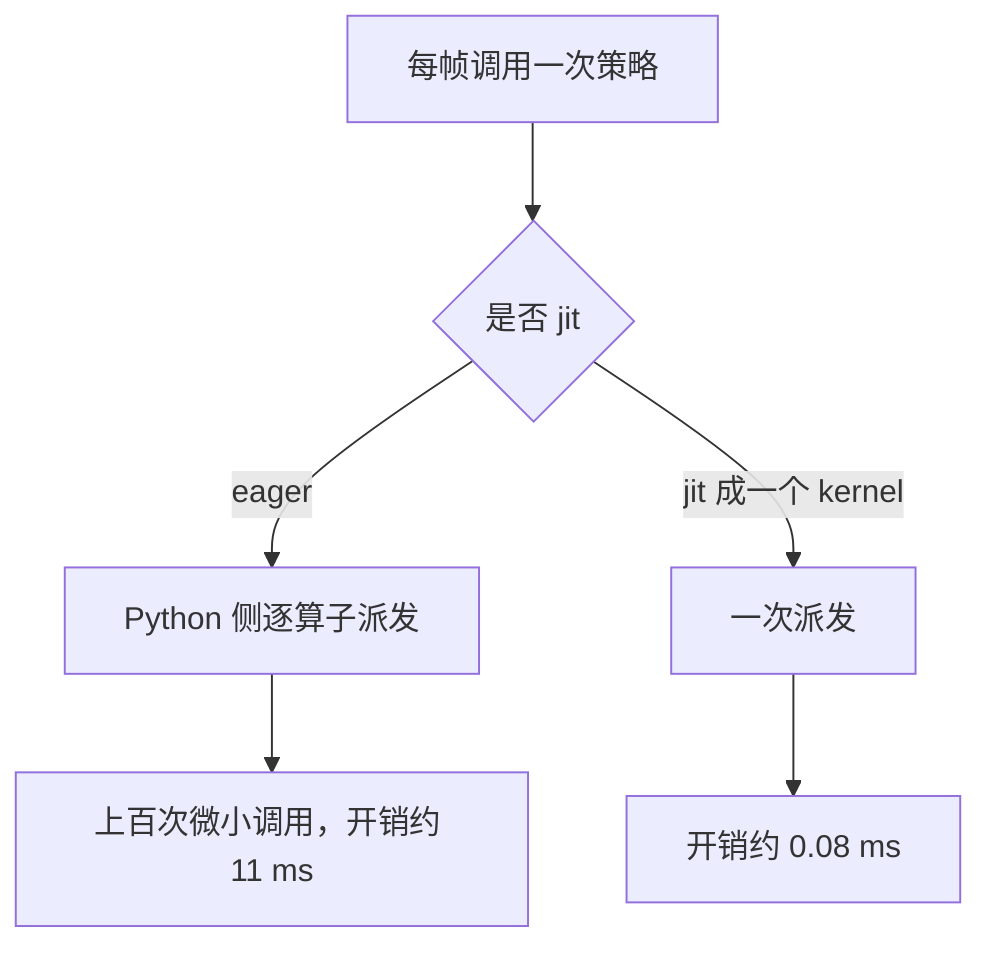
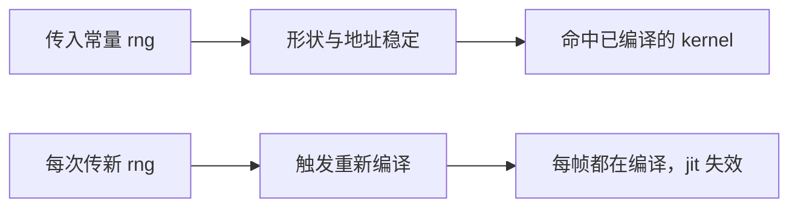

# 策略与扫描计算的 jit 化

训练时策略跑在整体 jit 的大图里，调度开销被摊薄到看不出；观测脚本每帧只调用一次，Python 侧的派发开销就变成了主要成本。小网络尤其明显：计算本身远小于调用它的代价。

策略前向与自绘扫描点两处的实测差距都在十倍以上，归因方法与注意事项也有共性，数字取自 `mjx-go1-getup/docs/viewer-guide.md` 与 `RLcontroller_go1_moreinformation/实验记录_Go1复现.md`。

## 交互循环里的调度开销

观测脚本与训练脚本的根本差别在于批大小与调用方式：训练侧批量大、缓冲区地址稳定、不看画面；观测侧单环境、每帧新建数组、有人盯着画面。同一份代码在两种用法下的最优解不同，这是这一类优化的总纲（`viewer-guide.md:22-24`）。

| 用法 | 调用方式 | 调度开销是否显著 |
| --- | --- | --- |
| 训练 | 整体在 jit 图里，批量推进 | 被摊薄 |
| 观测 | 每帧单次调用 | 显著，可能超过计算本身 |



## 策略前向的实测差距

同一份策略（128×128 网络，观测 91 维）两种写法的耗时如下（`viewer-guide.md:53-70`）：

```python
# eager：小网络的 Python dispatch 开销远大于计算本身
act, _ = policy(state.obs["state"], rng)

# jit 成一个 kernel
act_jit = jax.jit(lambda obs: policy(obs, rng_const)[0])
act = act_jit(state.obs["state"])
```

| 写法 | 耗时 | 差距 |
| --- | --- | --- |
| eager | 10.97 ms | 基准 |
| jit | 0.08 ms | 约 137 倍 |

这条差距容易漏掉的原因也在记录里：训练时策略被 `scan` 或 `vmap` 整体包住，从没暴露过派发开销，只有观测脚本这种每帧单独调用的写法才会遇到（`viewer-guide.md:72-74`）。本机 `watch_v20_fast.py` 的修法是把策略前向单独 jit 成 `act_jit`，主循环只调用它（`mjx-go1-getup/sim/watch_v20_fast.py:453`）。

## 冷热对照排除暂态

只测一次容易把进程早期效应当成真实差距。记录里做了同进程的冷热两轮对照（`实验记录_Go1复现.md:4155-4163`）：

| 变体 | 冷，第一轮 | 热，第二轮 |
| --- | --- | --- |
| 策略 jit | 16.95 ms | 17.06 ms |
| 策略 eager | 28.90 ms | 27.24 ms |
| 策略 jit（再测） | 17.06 ms | 16.94 ms |

两轮都保持约 11 ms 的差距，说明这是写法差异而不是暂态（`实验记录_Go1复现.md:4163`）。对照实验的设计要点是同一进程、同一个输入、交替测量，而不是在不同时间点各测一次。

## jit 时随机数要固定

策略推理是确定性的，随机数可以直接固定成常量（`viewer-guide.md:76-77`）：

```python
act_jit = jax.jit(lambda obs: policy(obs, rng_const)[0])
```

每次传入不同的随机键会让 jit 重新编译，jit 的收益就消失了。本项目策略本身是确定性推理，因此给常量即可（`viewer-guide.md:76-77`）。



## 自绘扫描点的整串 jit

观测脚本常有「按帧算一点东西给可视化用」的需求，本机是 35 个地形采样点的位置、地面高与特征。这一整串必须 jit 成一个 kernel（`viewer-guide.md:120-135`）：

| 写法 | 每帧耗时（两次独立测量） |
| --- | --- |
| eager 逐条 | 51.6 ms / 315.8 ms |
| jit 成一个 kernel | 0.32 ms / 6.28 ms |

差距在 50 到 160 倍之间，数值一致（最大差小于 5e-07）（`viewer-guide.md:130`）。原因是 eager 写法每帧要在 Python 侧按顺序发起上百个微小内核，每个都有启动与同步开销（`viewer-guide.md:131-132`）。

判别方法很简单：观测脚本里凡是「每帧调用一次、返回若干数组给渲染用」的函数，一律加 jit；输入里含非常量结构（例如环境对象）时，把它移出参数列表或用闭包捕获（`viewer-guide.md:134-135`）。本机脚本把扫描计算与绘制分开，绘制走 `draw_scan`，计算侧单独计时并累加到 `scan` 分项（`watch_v20_fast.py:610-614`）。

## 等价性判据用动作

jit 前后必须验证行为一致，但判据不能用状态量。一步物理求解会把 1e-7 的动作差混沌放大：本机实测用 `qpos` 比较时，一步就把差异放大到 2.8 m，看起来像「不一致」（`实验记录_Go1复现.md:4233-4234`、`viewer-guide.md:79-80`）。

| 判据 | 结果 | 是否可用 |
| --- | --- | --- |
| 动作偏差 | 1.19e-06 | 可用（`实验记录_Go1复现.md:4226`） |
| `qpos` 偏差 | 被混沌放大到米级 | 不可用 |

## 易错点

| 现象 | 原因 | 判据 |
| --- | --- | --- |
| 策略前向占了大头 | eager 调用 | 看是否 jit 成单个 kernel |
| jit 之后没有变快 | 随机键每帧变化导致反复编译 | 检查传入的 rng 是否为常量 |
| 自绘计算耗时不稳 | 逐算子 eager 调用 | 整串 jit 后再测 |
| 用状态量判断等价性 | 混沌放大小误差 | 改比动作偏差 |
| 一次测量就下结论 | 进程早期效应干扰 | 同进程冷热两轮对照 |
| 输入里带环境对象 | 结构非常量导致反复编译 | 移出参数列表或用闭包 |

## 小结

### 核心概念

- 观测脚本每帧单次调用，调度开销无法被分摊。
- 策略前向 jit 后从约 11 ms 降到 0.08 ms，冷热两轮都一致。
- jit 要求输入稳定，随机数应固定为常量。
- 按帧调用的可视化计算同样要整串 jit。

### 设计权衡

| 决策 | 选择 | 收益 | 代价 |
| --- | --- | --- | --- |
| 策略调用 | jit 成单 kernel | 每帧省约 11 ms | 需要把 rng 固定 |
| 对照实验 | 同进程冷热两轮 | 结论可靠 | 多花一次运行时间 |
| 扫描计算 | 整串 jit | 差 50 到 160 倍 | 输入不能含非常量结构 |
| 等价判据 | 比动作偏差 | 不受混沌放大干扰 | 需要保存中间动作 |

## 练习

### 基础题

1. 为什么训练脚本没有暴露过策略的派发开销？
2. 策略前向 eager 与 jit 的实测耗时分别是多少？
3. jit 时随机数为什么必须固定？

### 挑战题

4. 设计一个同进程冷热对照实验，用来区分写法差异与进程早期效应。

5. 说明为什么不能用 `qpos` 判断 jit 前后等价，给出一个可用的替代判据与阈值。

6. 把一段逐条调用的扫描计算改成整串 jit，列出输入处理与验证步骤。

### 附：本页引用的路径

| 路径 | 用途 |
| --- | --- |
| `mjx-go1-getup/docs/viewer-guide.md` | 策略与扫描的实测差距、rng 处理与等价判据（`:22-24`、`:53-82`、`:120-135`） |
| `RLcontroller_go1_moreinformation/实验记录_Go1复现.md` | 冷热对照与 jit 等价性数据（`:4145-4164`、`:4226`、`:4233-4234`） |
| `mjx-go1-getup/sim/watch_v20_fast.py` | 策略 jit 与扫描计时的实现（`:453`、`:610-614`） |

（引用的文件以 /home/tc63/mujoco 为根。）