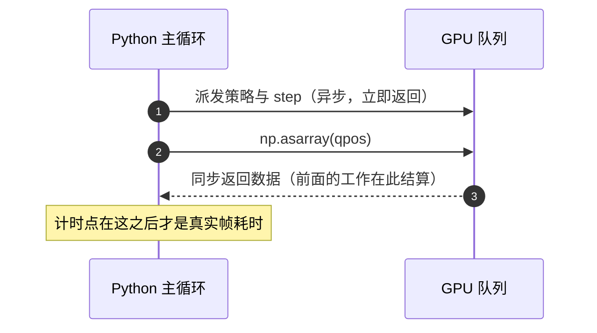
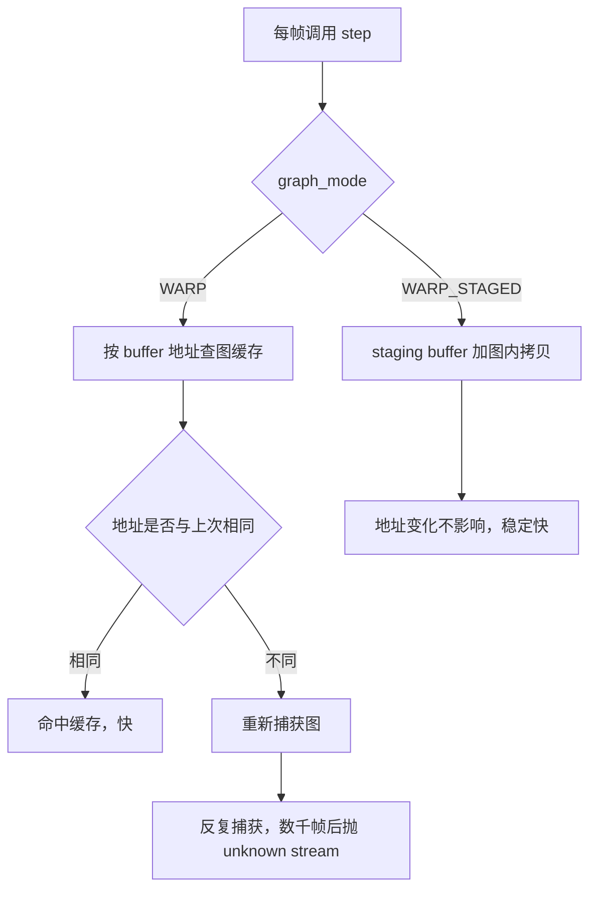

# 数据搬运与图模式

观测脚本有两处与「每帧都做同一件事」相关的成本：把 GPU 上的状态搬回 CPU，以及把重复的计算包成图执行。前者只要挑对字段就能降一个量级，后者则有一个反直觉之处：训练侧最优的图模式在观测侧会反复重建图缓存，跑上几千帧后直接崩。

两处成本的处理方式不同：搬运要挑字段，图模式要跟着地址稳定性来选；地址为什么会变、以及一个进程只建一个环境的约束，决定了选择空间。数字来自 `mjx-go1-getup/docs/viewer-guide.md` 与实验记录。

## 只搬渲染需要的字段

渲染只需要 `qpos` 与 `qvel`，不需要接触数组等巨大字段（`viewer-guide.md:139-151`）：

```python
# 慢: mjx.get_data + mj_copyData 会搬整个 Data (含 naconmax=65536 的接触数组)
# 快: 只搬 qpos/qvel (1.13 ms -> 0.02 ms)
qpos = np.asarray(state.data.qpos)
qvel = np.asarray(state.data.qvel)
d_view.qpos[:] = qpos
d_view.qvel[:] = qvel
mujoco.mj_forward(env.mj_model, d_view)
```

| 搬运方式 | 每帧耗时 | 原因 |
| --- | --- | --- |
| 整个 Data 搬回 | 1.13 ms | 含为 768 环境预留的接触数组 |
| 只搬 `qpos`/`qvel` | 0.02 ms | 两个小数组 |

差别看起来只有 1 ms，但它是「每帧固定成本」的一部分，而且整块搬运还受接触数组容量影响。记录里把这条列为独立优化项，理由是渲染用不到的字段不该参与搬运（`viewer-guide.md:141`）。

## 设备同步点决定计时位置

`np.asarray` 会强制设备同步，也就是说策略与物理的真实耗时直到这一行才结算（`viewer-guide.md:152-154`）。因此计时区间必须包含它，否则测到的是异步派发的速度，而不是帧耗时。



本机脚本的计时写法与此一致：先记录起点，依次完成命令组装、策略、物理与两次搬运，再取结束时间（`mjx-go1-getup/sim/watch_v20_fast.py:451-458`），并在注释里写明同步结算这一点（`:455`）。

## graph_mode 的几种取值

MJX 在 warp 后端下会把内核包成 CUDA 图。默认 `graph_mode=WARP` 的语义是按缓冲区地址缓存图（`viewer-guide.md:84-87`，对应 warp 的 `JaxCallableGraphMode`）。观测循环里的地址不稳定，因此几种取值的表现差别很大（`viewer-guide.md:96-102`）：

| graph_mode | 步时 | 结果 |
| --- | --- | --- |
| NONE | 139.0 ms | 不崩但慢 |
| JAX | 预热即崩 | 报 `CUDA_ERROR_NOT_SUPPORTED` |
| WARP（默认） | 185.5 ms | 探针下不崩，真实窗口跑几千帧后崩 |
| WARP_STAGED | 16.3 ms | 不崩，专为地址会变设计 |
| WARP_STAGED_EX | 57.3 ms | 不崩 |

结论是分工：观测脚本用 `WARP_STAGED`，训练保持默认，因此环境配置里要有 `graph_mode` 字段，让两种用法各取所需，而不是为了观测去改训练配置（`viewer-guide.md:104-105`）。训练侧的对照数据也支持这个分工：`donate_argnums=0` 能把单步从 25.9 ms 降到 14.8 ms，而 `WARP_STAGED` 与 `_EX` 分别只有 17.2 与 41.6 ms（`experiment-log.md:708-710`）。



## 地址变化与图缓存失效

观测循环里有两个动作会改变地址：每帧给 `state.info["command"]` 赋一个新数组，以及按重置键换一个 state（`viewer-guide.md:88-92`）。地址一变，按地址缓存的图就失效，需要重新捕获；反复捕获最终撞上运行时错误：

```text
wp.capture_begin(...) -> RuntimeError: Warp error: unknown stream
```

`WARP_STAGED` 的设计目标正是这种地址会变的场景：它用 staging buffer 加图内拷贝，把地址变化挡在图外（`viewer-guide.md:101`）。

## 捐赠数组与每帧重建

使用 `donate_argnums=0` 时，循环里复用的固定数组会被 jax 判为已删除，报 `Array has been deleted`（`viewer-guide.md:107-108`）。本机脚本的选择是每帧重建那个三维命令数组，并在注释里写明原因（`watch_v20_fast.py:449-452`）：

```python
# 每帧重建 command 数组: step_jit 的 donate_argnums=0 会把 state.info 里的
# 数组合并捐赠, 复用同一数组会被 jax 判为 deleted。(3,) 重建开销可忽略。
state.info["command"] = jp.asarray(np.array(command, dtype=np.float32))
```

重建一个三维数组的开销可以忽略，比为了省这点开销而放弃捐赠更划算。这也是「训练最优不一定适合观测」的一个具体例子。

## 一个进程只建一个环境

环境与进程的对应关系有一条硬约束：一个进程只放一个环境，两个环境同进程会撞上 warp 的 CUDA 图地址缓存（`viewer-guide.md:474-482`）。记录里为此专门写了追踪脚本 `sim/probe_getup_mjx_trace.py`（`viewer-guide.md:481`）。

| 配置 | 后果 |
| --- | --- |
| 一个进程一个环境 | 正常 |
| 一个进程两个环境 | 地址缓存冲突，需要串行化或改图模式 |

交付前建议用 grep 确认每个查看器脚本都设了图模式（`viewer-guide.md:114-116`）：

```bash
grep -n "graph_mode" sim/*.py
```

## 易错点

| 现象 | 原因 | 判据 |
| --- | --- | --- |
| 搬运耗时比预期高 | 搬了整个 Data | 检查是否用了整块拷贝 |
| 计时结果偏小 | 在设备同步之前取时间 | 计时区间要包含 `np.asarray` |
| 跑几千帧后崩在 capture | 默认图模式按地址缓存 | 确认是否用了 `WARP_STAGED` |
| 每帧重建数组被判已删除 | 捐赠了复用的数组 | 每帧重建或关闭捐赠 |
| 两个环境同进程互相拖慢 | 地址缓存冲突 | 拆成两个进程 |
| 文档写了图模式但脚本没有 | 交付时未核对代码 | 用 grep 对代码核 |

## 小结

### 核心概念

- 只搬渲染需要的 `qpos`/`qvel`，整块搬运会带上用不到的接触数组。
- `np.asarray` 触发设备同步，计时点必须放在它之后。
- 观测脚本用 `WARP_STAGED`，训练保持默认图模式。
- 每帧重建命令数组以避免捐赠后的已删除错误。

### 设计权衡

| 决策 | 选择 | 收益 | 代价 |
| --- | --- | --- | --- |
| 搬运范围 | 只搬两个小数组 | 降低每帧固定成本 | 渲染用不到的字段不再可用 |
| 图模式 | 观测用 STAGED，训练用默认 | 两边都稳 | 配置里要有开关字段 |
| 命令数组 | 每帧重建 | 避开捐赠限制 | 每帧一次小分配 |
| 环境数 | 一进程一环境 | 避开地址缓存冲突 | 并发要靠多进程 |

## 练习

### 基础题

1. 渲染需要从 GPU 搬回哪些字段？为什么不应该搬整个 Data？
2. 为什么 `step` 的计时点要放在 `np.asarray` 之后？
3. 观测脚本与训练脚本分别使用哪种图模式？

### 挑战题

4. 说明地址变化为什么会让按地址缓存的图失效，并给出两种应对方式。

5. 解释 `donate_argnums=0` 与每帧重建数组之间的关系，说明为什么重建是合理选择。

6. 设计一个实验，验证两个环境放在同一进程会互相拖慢，并给出排查用的观察量。

### 附：本页引用的路径

| 路径 | 用途 |
| --- | --- |
| `mjx-go1-getup/docs/viewer-guide.md` | 搬运字段、同步点、图模式对比与进程约束（`:84-116`、`:139-154`、`:474-482`） |
| `mjx-go1-getup/docs/experiment-log.md` | 训练侧捐赠与图模式的单步对照（`:708-710`） |
| `mjx-go1-getup/sim/watch_v20_fast.py` | 命令数组重建与计时实现（`:449-458`） |

（引用的文件以 /home/tc63/mujoco 为根。）