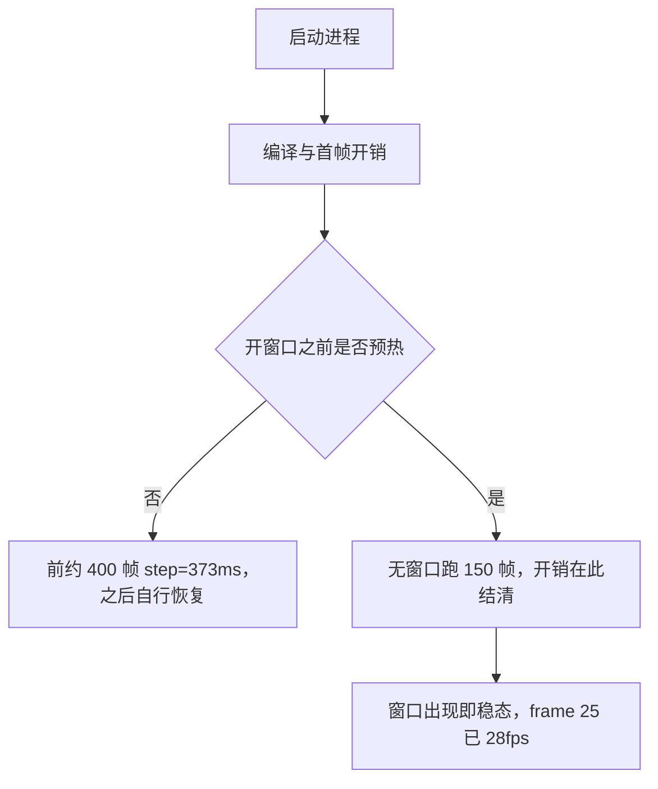
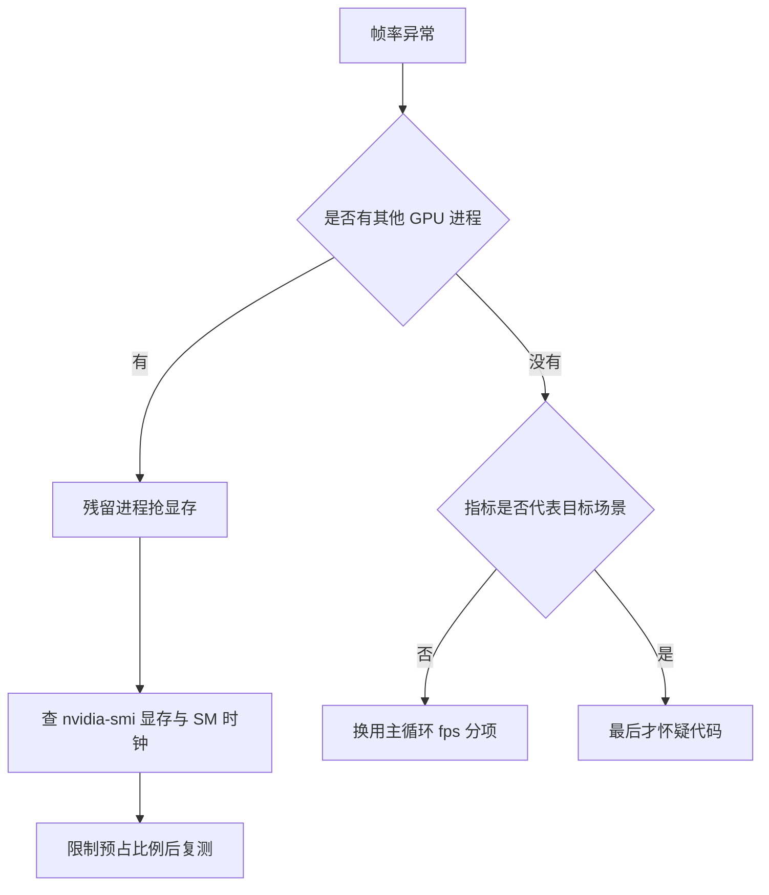
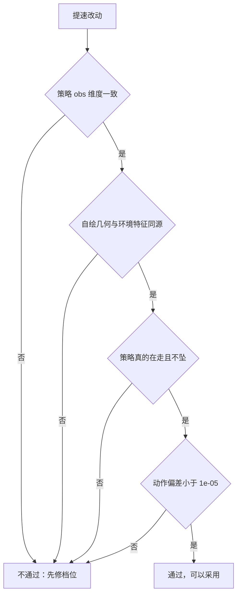

# 预热、显存与等价性闸门

优化到稳态之后，剩下三类问题会让帧率再次失真：窗口刚出现的早期暂态、显存被预占导致的 GPU 降频，以及为了提速改动物理而失去观测意义。前两类是「测得不准」，第三类是「测得对但已经不是同一个东西」。

三类问题的处理办法依次是：开窗前预热、限制显存预占、把提速改动过一遍等价性闸门；交付前还要按配置清单核对代码。数字来自 `mjx-go1-getup/docs/viewer-guide.md` 与 `RLcontroller_go1_moreinformation/实验记录_Go1复现.md`。

## 窗口暂态与预热

窗口刚出现的头约 400 帧里 `step` 会停在高位（373 ms），之后自行恢复到 52 ms，期间还可能再爆一次；同一份配置在进程早期测 63 ms、稍后测 14.9 ms（`viewer-guide.md:209-212`）。它来自编译与首帧开销落在正式循环里，与代码逻辑无关。

解法是在打开窗口之前，用与主循环相同的调用序列先跑若干帧（默认 150），把编译与首帧开销在「还没有窗口」时结清（`viewer-guide.md:214-224`）：

```python
for _ in range(args.warmup):
    state, qpos, qvel, _, _ = frame(state, d_view)   # 与主循环同一个 frame()
if show_scan:
    jax.block_until_ready(scan_viz(state.data, state.data.qpos))   # 扫描也预热
```

| 阶段 | 表现 |
| --- | --- |
| 预热前 | 前约 400 帧 step 约 373 ms，稳态只有 52 ms |
| 预热后 | frame 25 已 28 fps，frame 100 到 50 fps，没有高位段 |



## 预热必须走同一个函数

预热用的是与主循环完全相同的 `frame()`，而不是另写一份简化版；否则漏掉某个 kernel 就白预热了，本项目第一版就漏了扫描点的预热（`viewer-guide.md:226-227`）。本机脚本的预热循环与主循环共用同一个 `frame()`，扫描计算也单独 `block_until_ready` 一次（`mjx-go1-getup/sim/watch_v20_fast.py:467-479`）。

同一个位置还有一条容易被忽视的细节：不要在预热阶段打印「无窗口稳态 step」，它比窗口内偏高约两倍，并且受开窗口前的驱动与排队状态影响，据此判断窗口外更慢是错的；主循环的 fps 分项才是判据（`watch_v20_fast.py:476-478`、`viewer-guide.md:406-409`）。

## 显存预占导致的帧率塌方

第二类失真来自显存。XLA 默认预占约 75% 的显存，两个进程同时跑时把 8 GiB 打满，GPU 时钟掉到 180 MHz，其中一个进程塌到 3.3 fps，另一个仍有 30.8 fps（`viewer-guide.md:231-248`、`:398-401`）。

| 场景 | 显存 | SM 时钟 | 帧耗时 | fps |
| --- | --- | --- | --- | --- |
| 单进程 | 未打满 | 1500+ MHz | 15.7 ms | 63.7 |
| 双进程，默认预占 | 7674 / 8192 MiB | 180 MHz | 306.9 / 32.4 ms | 3.3 / 30.8 |
| 双进程，`MEM_FRACTION=0.25` | 未打满 | 正常 | 27.1 / 27.1 ms | 36.9 / 36.9 |

关键观察是中间那行：两个进程里通常只有一个被拖住，另一个照常有 30 fps，症状因此表现为「某一个查看器莫名只有 3 fps」，很容易误判成代码问题（`viewer-guide.md:247-248`）。修复方式是在 `import jax` 之前限制预占比例（`viewer-guide.md:250-257`）：

```python
os.environ.setdefault("XLA_PYTHON_CLIENT_MEM_FRACTION", "0.25")  # 8G 卡 -> ~2G
```

不同脚本的取值不同：观测脚本 0.25，评估与诊断脚本 0.3 到 0.55，训练侧 0.80（`viewer-guide.md:256-257`）。

## 从 GPU 状态分辨这类问题

这类问题在 CPU 侧看不出来：WSL 内的 `load average` 只有 0.11（`viewer-guide.md:234`、`:402`）。要看的是 GPU 进程与显存占用（`viewer-guide.md:259-267`）：

```bash
nvidia-smi --query-compute-apps=pid,used_memory --format=csv
nvidia-smi --query-gpu=memory.used,pstate,clocks.sm --format=csv
```

| 观察量 | 正常 | 异常指纹 |
| --- | --- | --- |
| `memory.used` | 明显低于上限 | 接近上限 |
| `clocks.sm` | 1500 MHz 以上 | 低于 200 MHz |
| `load average` | 不重要 | 低也可能异常，不能据此排除 |

做对照实验之前先 `pkill -f 你的脚本` 确认残留进程退干净（`viewer-guide.md:267`）。本项目对这个问题的定位用了两步：先跑一个无窗口基准复刻完整帧流程，单进程只有 15.7 ms，排除软件栈本身；再做双进程并发把 306.9 ms 复现出来，并用限制预占反证回 27 ms（`viewer-guide.md:277-281`）。复现脚本是 `probe_viewer_slow.py`，在当前检出中位于 `RLcontroller_go1_moreinformation/sim/`。



## 被否决的加速改动

有一类改动确实能省时间，但改变了物理，因此被否决并记录在案。把接触数组容量 `naconmax` 从 65536 降到 512 到 2048，单环境步耗时从 14.94 ms 降到 12.28 ms，省下 18%（`viewer-guide.md:416-419`）。

等价性验证用固定动作序列跑 500 步比对轨迹（`viewer-guide.md:421-424`、`实验记录_Go1复现.md:4179-4184`）：

| naconmax | 与默认的最大偏差 | 第 1 步偏差 |
| --- | --- | --- |
| 2048 | 8.88e-01 | 1.67e-03 |
| 1024 | 4.23e-01 | 未记录 |
| 512 | 5.19e-01 | 7.81e-03 |

判据要点是看第 1 步是否分叉：1.7e-3 已经远超 float32 舍入，说明从第一步起物理就不再等价，后面的米级差异只是混沌放大（`viewer-guide.md:426-430`）。机理是接触数组容量改变了求解器里的求和与排序顺序（`viewer-guide.md:427`）。

| 改动 | 收益 | 是否采用 | 理由 |
| --- | --- | --- | --- |
| `naconmax` 降到 512 到 2048 | 单步省 18% | 否 | 第 1 步即分叉，物理不等价 |
| 策略 jit | 每帧省约 11 ms | 是 | 动作偏差 1.19e-06 |
| 开窗预热 | 消除 373 ms 段 | 是 | 只改时序，不改数值 |
| 换渲染后端 | 渲染快约 32 倍 | 是 | 不影响物理与数值 |

## 正确性闸门

任何提速改动都要过闸门，而不是看到帧率上涨就收工。本项目的闸门脚本是 `sim/verify_watch_v20_fast.py`，四道检查全部通过（`viewer-guide.md:372-391`、`实验记录_Go1复现.md:4215-4234`）：

| 检查 | 判据 | 实测结果 |
| --- | --- | --- |
| 策略 obs 与环境 obs 维度一致 | 91 / 162 | 一致 |
| 自绘几何与环境特征同源 | 偏差接近 0 | 0.000e+00 |
| 策略真的在走 | 机体系速度跟得上指令 | 指令 0.500，实测 +0.410 |
| 躯干高度不坠 | 保持标称范围 | 均值 0.342，最低 0.275（标称 0.28） |
| jit 与 eager 的差异 | 动作偏差小于 1e-05 | 1.19e-06 |



闸门脚本本身也会出错，记录里就记了三处误判：用世界系速度比机体系指令、步数太多走出地形边界、用 `qpos` 判 jit 等价性（`实验记录_Go1复现.md:4228-4234`）。指标报异常时，先怀疑指标（`viewer-guide.md:391`）。

## 交付清单的用法

交付前对着清单过一遍，并用 grep 核对代码，而不是对着文档确认（`viewer-guide.md:434-450`）。清单里直接相关的几项：

| 检查项 | 核对方式 |
| --- | --- |
| 策略前向已 jit | 看是否有 `act_jit` 一类封装 |
| 图模式为 `WARP_STAGED` | `grep -n "graph_mode" sim/*.py` |
| 显存预占比例已设 | `grep -n "XLA_PYTHON_CLIENT_MEM_FRACTION" sim/*.py` |
| 只搬 `qpos`/`qvel` 且计时点在同步之后 | 看搬运与计时语句顺序 |
| 开窗前预热且复用同一个函数 | 看预热循环调用的函数名 |
| 任何省时改动都先证明物理等价 | 有固定动作序列的对照记录 |

## 易错点

| 现象 | 原因 | 判据 |
| --- | --- | --- |
| 窗口刚出现时极慢 | 编译与首帧开销落在循环里 | 预热后第一行日志应已接近稳态 |
| 预热了但没改善 | 预热用了简化版，漏掉 kernel | 预热与主循环是否同一个函数 |
| 某个查看器莫名 3 fps | 残留进程抢显存 | 查显存占用与 SM 时钟 |
| CPU 侧看不出异常 | `load average` 低不代表正常 | 必须看 GPU 侧 |
| 提速后观测结论变了 | 改动影响物理 | 用第 1 步偏差判等价性 |
| 闸门全部通过但结果可疑 | 闸门脚本自身写错 | 先检查判据的坐标系与窗口长度 |

## 小结

### 核心概念

- 开窗口前的预热用同一个函数把编译与首帧开销提前结清。
- 显存预占会让 GPU 降频，两个进程里通常只有一个被拖住。
- 判断显存类问题必须看 GPU 侧，CPU 侧指标不可靠。
- 提速改动要先证明物理等价，判据看第 1 步是否分叉。

### 设计权衡

| 决策 | 选择 | 收益 | 代价 |
| --- | --- | --- | --- |
| 预热方式 | 复用同一个函数跑若干帧 | 不漏 kernel | 启动时间增加十余秒 |
| 显存预占 | 观测脚本限到 0.25 | 并发不再塌方 | 单进程可用显存降低 |
| 提速把关 | 固定动作序列比对 | 拦住改变物理的改动 | 需要额外验证脚本 |
| 交付核对 | 用 grep 核代码 | 拦住文档与代码不一致 | 需要维护清单 |

## 练习

### 基础题

1. 窗口刚出现的头几百帧为什么特别慢？预热放在什么位置？
2. 两个进程同时跑时，为什么只有一个会塌到 3 fps？
3. 判断提速改动是否可用的第一步判据是什么？

### 挑战题

4. 设计一套排查流程，从「帧率突然下降」走到「确认是残留进程抢显存」，列出每一步的观察量。

5. 说明为什么必须用与主循环相同的函数预热，并给出验证预热是否完整的方法。

6. 给出一份等价性验证方案：如何选择动作序列、跑多少步、以哪一步的偏差作为判据。

### 附：本页引用的路径

| 路径 | 用途 |
| --- | --- |
| `mjx-go1-getup/docs/viewer-guide.md` | 预热、显存预占、GPU 指纹与非等价改动（`:209-284`、`:391-430`、`:434-450`） |
| `RLcontroller_go1_moreinformation/实验记录_Go1复现.md` | 预热实测、被否决的改动与闸门结果（`:4166-4171`、`:4173-4187`、`:4215-4234`） |
| `mjx-go1-getup/sim/watch_v20_fast.py` | 预热循环与无窗口读数说明（`:467-479`） |
| `RLcontroller_go1_moreinformation/sim/probe_viewer_slow.py` | 帧率塌方的复现脚本（当前检出路径） |
| `RLcontroller_go1_moreinformation/sim/verify_watch_v20_fast.py` | 正确性闸门脚本（当前检出路径） |

（引用的文件以 /home/tc63/mujoco 为根。）