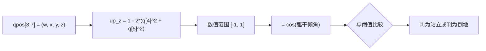
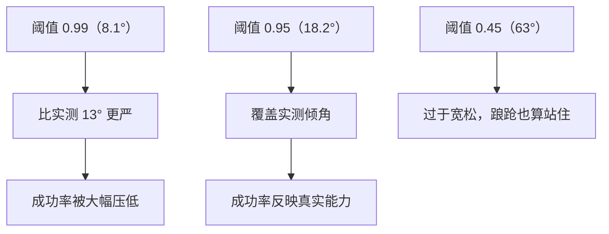

# 站立姿态判据 up_z

「站起来了吗」这件事在不同场合有两种问法：机器人当前是不是竖直，以及它能不能在一段时间里保持竖直。第一种问法靠一个由根四元数算出的标量就够了，第二种问法还要加上时间条件。第一种问法是所有其他判据的基座，先把它讲透。

这个标量在本项目里叫 `up_z`。它来自根四元数，取值范围从 -1 到 1，与躯干倾角的余弦对应。数值上取哪个阈值，直接决定评估出来的成功率是七成还是三成，所以它属于必须先统一口径再谈结果的那一类量。

## 从根四元数到竖直投影

`qpos` 的前七个分量是自由关节的位置与姿态，其中 `qpos[3:7]` 是根四元数 `(w, x, y, z)`——四个数一起描述机身朝向，前三个数是位置，后四个数是姿态，这里只看姿态那部分。本项目用下面这一行算出竖直投影（`mjx-go1-getup/sim/eval_getup.py`）：

```python
up = 1.0 - 2.0 * (q[:, 4] ** 2 + q[:, 5] ** 2)
```

同一个表达式在查看器里写作 `upz_now = 1 - 2*(q[4]**2 + q[5]**2)`，注释把它说明为「根四元数到躯干 up 轴在世界 z 的分量」，并指出它等于倾角的余弦：1 是竖直、0 是侧躺 90 度、-1 是倒扣（`RLcontroller_go1_moreinformation/实验记录_Go1复现.md`）。

这个量与旋转矩阵的一项相同。评估脚本里 `rpy_deg` 展开的旋转矩阵第一行第一列是 `1 - 2*(y*y + z*z)`（`eval_getup.py`），而 `up` 用的是 `q[4]`、`q[5]` 两个分量，代入的是同一项。



需要注意分量命名在不同文件里不一致：`当前状态.md` 把公式写成 `1 - 2*(qy² + qz²)`（`当前状态.md`），而代码按下标取 `q[4]`、`q[5]`。引用这个公式时要先确认索引基准是「四元数分量名」还是「`qpos` 下标」，否则会代入错分量。

## 倾角换算与阈值选择

把 `up_z` 换算成倾角就是取反余弦。项目里常用的几档如下（`当前状态.md`）：

| up_z | 倾角 | 含义 |
| --- | --- | --- |
| 1.00 | 0° | 完全竖直 |
| 0.99 | 8.1° | 旧硬编码判据 |
| 0.95 | 18.2° | 当前默认口径（查看器与评估脚本都用它） |
| 0.93 | 21.6° | 更宽的一档 |
| 0.45 | 63° | 旧摔倒阈值，太松 |
| 0.00 | 90° | 侧躺 |

换算关系是单调的，因此阈值的高低等价于倾角容差的宽窄。选阈值要回答的问题就是：允许多大的姿态偏差还算「站起来了」。

## 旧阈值 0.99 为什么让成功率失真

`0.99` 对应 8.1 度，而本项目实测学习型策略稳定站立时大约有 13 度倾角（`eval_getup.py`）。评估脚本的 help 里把后果写得很直接：这个阈值决定了成功率差一个数量级。

| 阈值 | 倾角容差 | 与实测姿态的关系 |
| --- | --- | --- |
| 0.99 | 8.1° | 比实测倾角更严，成功率被压低 |
| 0.95 | 18.2° | 覆盖实测倾角，作为默认口径 |

另一组数据说明策略本身并没有「站不起来」的问题：在 128 个真摔倒样本里，高度带内最好的 `up_z` 均值 0.974、中位数 0.999（`实验记录_Go1复现.md`）。也就是说姿态早已达标，被卡住的是时间条件而不是倾角。

早期版本用的是另一套写法：站立判据为 `z > 0.25` 且 `up_z > 0.9`（`实验记录_Go1复现.md`）。从 0.9 到 0.95 的变化说明口径在收敛，而收敛的依据是实测倾角分布，不是拍脑袋。



## 严格档与实用档的分工

评估脚本并不只报一个数字，而是同时给两档倾角闸门（`eval_getup.py`）：

```python
strict = stable & (tilt < 2.0)        # 严格: 末态倾角小于 2 度
practical = stable & (tilt < 20.0)    # 实用: 末态倾角小于 20 度
```

| 档位 | 判据 | 用途 |
| --- | --- | --- |
| 严格 | 站住且末态倾角小于 2° | 看姿态质量上限 |
| 实用 | 站住且末态倾角小于 20° | 看能否交还给走路策略 |

这里 `stable` 是时间条件（连续站住若干步），`tilt` 由 `rpy_deg` 从末态四元数算出（`eval_getup.py`）。两档分开报告的价值在于：如果严格档很低而实用档很高，瓶颈就在姿态这一侧，而非起身能力，优化方向完全不同。

## 训练侧倾角约束与评估阈值

训练时躯干倾角约束是 ±17.5 度（`mjx-go1-getup/docs/viewer-guide.md`），与默认评估阈值 18.2 度基本对齐。口径对齐的意义是：训练奖励里约束的姿态范围与评估认可的范围应当一致，否则会出现「训练时被奖励的姿态，评估时不认」的错位。

| 环节 | 倾角范围 |
| --- | --- |
| 训练姿态约束 | ±17.5° |
| 评估默认阈值 0.95 | 18.2° |
| 旧评估阈值 0.99 | 8.1° |

## 按初始姿态分桶

只报一个总成功率会掩盖「哪一类躺法不会」。评估脚本按初始 `up_z` 分四个桶（`eval_getup.py`）：

```python
"仰卧 (up_z<-0.5)": up0 < -0.5,
"侧躺 (|up_z|<=0.5)": np.abs(up0) <= 0.5,
"俯卧 (0.5<up_z<=0.9)": (up0 > 0.5) & (up0 <= 0.9),
"站立出生 (up_z>0.9)": up0 > 0.9,
```

`站立出生` 必须单列一桶：站着开局本来就满足判据，如果把它归进俯卧桶，成功率会被虚高，姿态桶也串了（`eval_getup.py`）。评估默认只用真摔倒样本，也是同一个理由（`实验记录_Go1复现.md`）。

| 桶 | 初始 `up_z` | 说明 |
| --- | --- | --- |
| 仰卧 | 小于 -0.5 | 倒扣姿态 |
| 侧躺 | 绝对值小于等于 0.5 | 90 度附近 |
| 俯卧 | 0.5 到 0.9 | 面朝下 |
| 站立出生 | 大于 0.9 | 开局即满足判据，单列排除污染 |

## 易错点

| 现象 | 原因 | 判据 |
| --- | --- | --- |
| 成功率比预期低一个量级 | 用了 0.99 的旧阈值 | 确认 `--up_th` 取值 |
| 代入公式算出的值不对 | 四元数分量名与 `qpos` 下标混用 | 确认索引基准 |
| 严格档低而实用档高 | 策略能站住但站不直 | 同时看两档数字 |
| 成功率虚高 | 把站立出生混进了摔倒样本 | 检查是否包含站立桶 |
| 只报总成功率 | 无法定位不会的姿态 | 分桶报告 |
| 训练被认可、评估不认 | 训练约束与评估阈值未对齐 | 对照倾角范围 |

## 小结

### 核心概念

- `up_z` 由根四元数算出，等于躯干倾角的余弦，范围 -1 到 1。
- 阈值 0.99 对应 8.1°，0.95 对应 18.2°；实测策略倾角约 13°，所以旧阈值压低成功率。
- 评估同时给严格（末态小于 2°）与实用（小于 20°）两档。
- 按初始姿态分桶，站立出生必须单列以免污染成功率。

### 设计权衡

| 决策 | 选择 | 收益 | 代价 |
| --- | --- | --- | --- |
| 判据形式 | 单个标量 `up_z` | 计算便宜、含义清楚 | 只反映倾角不反映高度 |
| 默认阈值 | 0.95 | 与训练约束、实测姿态对齐 | 比旧口径宽，需要说明 |
| 报告方式 | 严格与实用两档 | 能区分站不直与起不来 | 报告字段变多 |
| 分桶 | 按初始 `up_z` 四桶 | 定位不会的姿态 | 每个桶样本变少 |

## 练习

### 基础题

1. 写出 `up_z` 的表达式，并说明它为什么等于倾角的余弦。
2. 阈值 0.99 与 0.95 分别对应多少度？
3. 为什么站立出生要单独分桶？

### 挑战题

4. 给定一段 `qpos` 轨迹，设计一个函数输出逐帧倾角与 `up_z`，并说明如何验证两者换算一致。

5. 说明为什么「高度带内最好 up_z 中位数 0.999」与「成功率只有 77%」并不矛盾。

6. 设计一份评估报告字段表，要求能区分「起不来」「站不直」「站不住」三类失败。

### 附：本页引用的路径

| 路径 | 用途 |
| --- | --- |
| `当前状态.md` | `up_z` 定义、倾角换算表与阈值含义（） |
| `RLcontroller_go1_moreinformation/实验记录_Go1复现.md` | 表达式的注释、实测 `up_z` 与早期判据（） |
| `mjx-go1-getup/sim/eval_getup.py` | `up_z` 计算、两档倾角闸门、分桶与末态统计（） |
| `mjx-go1-getup/docs/viewer-guide.md` | 训练侧终止倾角 ±17.5° 与对应开关（） |

（引用的文件以 /home/tc63/mujoco 为根。）