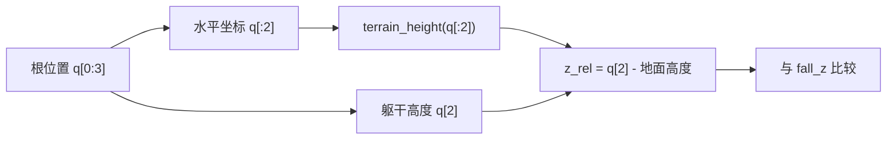
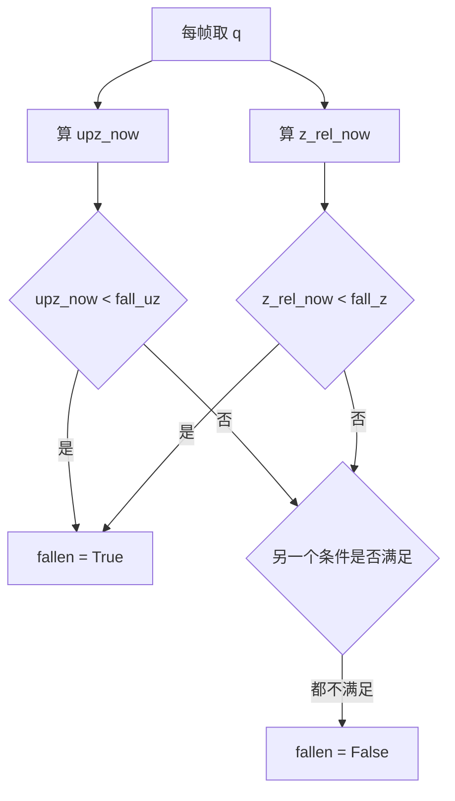
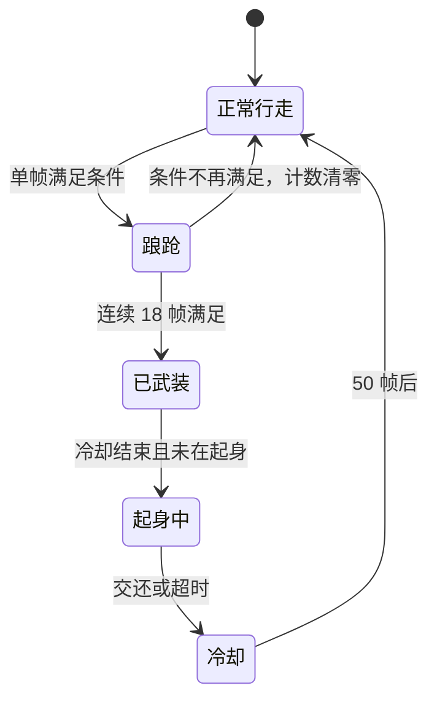

# 跌倒判据与去抖

「摔了吗」看似可以直接看高度，但在起伏地形上，站着的位置本身就可能比别处的地面低或高，用世界高度绝对值判断会把正常行走误判成跌倒。同样的道理也适用于姿态：走路时的一次深度踉跄能在一两帧里满足倾斜条件，但它并不是摔倒。

处理办法有两处：高度用相对它正下方地面的高度，姿态加上连续帧计数去抖。这两条合起来构成查看器的摔倒判据，也是离线评估冻结摔倒姿态时用的同一套条件。

## 世界高度为什么不能用

地形是一张高度场，不同水平位置的地面高度不同。躯干的世界 `z` 只说明它在世界坐标里的高度，不说明它离脚下的地面有多远，因此单独看 `z` 会把上下坡与跌倒混在一起。项目在较早的一轮里就把终止判据改成相对地形（`RLcontroller_go1_moreinformation/实验记录_Go1复现.md:2201`），查看器现在沿用的也是这套写法。

| 判据形式 | 在上坡处 | 在下坡处 |
| --- | --- | --- |
| 世界高度阈值 | 上坡时容易被判为站立 | 下坡时容易被判为跌倒 |
| 相对地面高度 | 与坡度无关 | 与坡度无关 |

## 相对地面高度的算法

相对高度是躯干 `z` 减去它正下方地面的高度（`实验记录_Go1复现.md:6298`、`当前状态.md:75`）：

```python
z_rel_now = q[2] - terrain_height(q[:2])   # 躯干离它正下方地面的高度
```

`terrain_height` 由环境提供，输入是水平坐标，输出该处地面高度。查看器每帧对根位置调用一次，因此在起伏地形上也能得到一致的判据。

站着与躺下时的参考值给了这个量的量级（`当前状态.md:85`）：

| 姿态 | `z_rel` 参考值 |
| --- | --- |
| 站直 | 约 0.277 m |
| 躺地 | 约 0.13 m |
| 跌倒阈值 | 0.16 m |



## 两个条件的或关系

摔倒判据同时看姿态与高度，任意一个满足就算跌倒（`实验记录_Go1复现.md:6296-6299`、`当前状态.md:74-76`）：

```python
upz_now   = 1 - 2*(q[4]**2 + q[5]**2)              # 竖直投影 = cos(倾角)
z_rel_now = q[2] - terrain_height(q[:2])          # 相对地面高度
fallen = (z_rel_now < fall_z) or (upz_now < fall_uz)
```

| 条件 | 参数 | 默认 | 含义 |
| --- | --- | --- | --- |
| 高度 | `--fall_z` | 0.16 m | 躯干离地不足 16 cm |
| 姿态 | `--fall_uz` | 0.30 | 倾角大于 72.5° |

两个条件取或的原因很直接：侧躺时高度可能还够，但姿态明显不合格；被压在低处时姿态可能接近竖直，但高度已经掉了下去。任一失效都意味着此刻不再处于正常行走状态。



## 连续帧计数作为去抖

单帧条件会被瞬间姿态波动触发，因此查看器要求条件连续满足若干帧才算「真摔倒」（`当前状态.md:77-79`、`实验记录_Go1复现.md:6300-6301`）：

```python
fall_count = fall_count + 1 if fallen else 0   # 中间有一帧不满足就清零
armed = fall_count >= fall_debounce            # 连续满足才"武装"
```

| 情形 | 条件是否持续满足 | 计数结果 |
| --- | --- | --- |
| 走路中的深度踉跄 | 只满足一两帧 | 计数清零，不触发 |
| 真摔倒 | 之后一直满足 | 计数累积到阈值，触发 |

这条去抖针对的是一个具体的用户反馈：机器人明明还能走路，查看器却触发了起身。原因是旧值太松——姿态阈值 0.45（63 度）配合 8 帧去抖，踉跄就能满足（`当前状态.md:90-91`、`实验记录_Go1复现.md:6312-6314`）。



## 参数取值与旧值对照

当前默认值与它们替代的旧值如下（`当前状态.md:82-88`、`实验记录_Go1复现.md:6305-6310`）：

| 参数 | 默认 | 旧值 | 变化理由 |
| --- | --- | --- | --- |
| `--fall_uz` | 0.30（72.5°） | 0.45（63°） | 旧值太松会误触发 |
| `--fall_z` | 0.16 m | 同 | 介于站直 0.277 与躺地 0.13 之间 |
| `--fall_debounce` | 18 帧 = 0.36 s | 8 帧 = 0.16 s | 延长去抖窗口 |
| `--getup_cooldown` | 50 帧 = 1.0 s | 25 帧 | 交还后给走路策略恢复时间 |
| `--oob_reset_xy` | 5.8 m | 无 | 出界不再试图起身 |

一帧等于控制步长 `ctrl_dt = 0.02 s`，所以帧数与秒数可以互相换算（`当前状态.md:86`）。去抖窗口从 0.16 s 延长到 0.36 s 是这次口径调整里最直接的一处。

## 出界重置

地形高度场只有有限范围，界外没有地面。本项目地形用 `hfield size="6 6 0.3 0.096"`，水平半边长 6.0 m，而随机出生范围是 ±5.0 m，离边缘最近只有 1 m（`实验记录_Go1复现.md:6459-6460`）。

走出边缘之后的实测表现是自由落体：每帧速度增加 0.196（等于 9.81 乘 0.02），几十秒后相对高度到 -2558 m；一批 128 个环境里曾有 124 个是这样掉出去的，只有 4 个确实在界内摔倒（`实验记录_Go1复现.md:6461-6463`）。

查看器里这会造成一串误动作：掉出边缘、摔倒判据满足、在半空中触发起身、策略挥腿、超时重置（`实验记录_Go1复现.md:6465-6467`）。修法是新增 `--oob_reset_xy`，水平距离超过它就直接重置，不试图起身；默认 5.8 m 与训练环境的 `out_of_bounds_xy` 一致（`实验记录_Go1复现.md:6469-6470`、`当前状态.md:88`）。

| 参数 | 值 | 作用 |
| --- | --- | --- |
| 地形半边长 | 6.0 m | 有地面的范围 |
| 随机出生范围 | ±5.0 m | 离边缘最近 1 m |
| `--oob_reset_xy` | 5.8 m | 超过即重置 |

## 交还冷却

起身结束之后要有一段时间不再触发起身，否则走路策略刚接手、身体还在晃时会被立刻判为摔倒并重新起身（`当前状态.md:87`）。默认冷却 50 帧，即 1.0 s。

| 阶段 | 时长 | 作用 |
| --- | --- | --- |
| 去抖 | 18 帧 | 排除踉跄 |
| 冷却 | 50 帧 | 交还后给走路策略恢复时间 |

## 易错点

| 现象 | 原因 | 判据 |
| --- | --- | --- |
| 上坡处误判站立 | 用了世界高度绝对值 | 检查是否用 `terrain_height` |
| 还能走路就触发起身 | 姿态阈值或去抖太松 | 对照 0.30/18 帧的默认值 |
| 掉出地形后在半空挥腿 | 缺少出界重置 | 检查 `--oob_reset_xy` |
| 交还后立刻又摔倒 | 冷却过短 | 检查 `--getup_cooldown` |
| 帧数与秒数换算错误 | 未按 `ctrl_dt = 0.02` 换算 | 用 0.02 s 乘帧数 |
| 界外样本污染统计 | 未剔除掉出地形的环境 | 检查出界计数与样本筛选 |

## 小结

### 核心概念

- 相对地面高度 `z_rel = q[2] - terrain_height(q[:2])` 是高度判据的正确形式。
- 姿态与高度取或：任一失效就算此刻不再是正常行走。
- 连续帧计数把瞬间踉跄与持续跌倒分开，默认去抖 18 帧。
- 界外没有地面，需要出界重置而不是尝试起身。

### 设计权衡

| 决策 | 选择 | 收益 | 代价 |
| --- | --- | --- | --- |
| 高度基准 | 相对正下方地面 | 与地形起伏无关 | 每帧要调用地形高度函数 |
| 条件组合 | 姿态或高度 | 覆盖两类退化 | 参数变多，需分别调 |
| 去抖 | 连续帧计数 | 排除踉跄误触发 | 真摔倒的响应延迟 0.36 s |
| 出界 | 直接重置 | 避免半空起身 | 观察会被打断 |

## 练习

### 基础题

1. 为什么世界高度绝对值不适合做跌倒判据？
2. 摔倒判据的两个条件分别是什么，默认值多少？
3. 去抖窗口是 18 帧，换算成秒是多少？

### 挑战题

4. 设计一个实验，证明相对高度判据在上坡与下坡上都稳定，而世界高度判据会失效。

5. 说明为什么出界之后要重置而不是尝试起身，给出两个可观测的证据。

6. 给出一套参数调整顺序：当出现误触发时先动哪个参数，理由是什么。

### 附：本页引用的路径

| 路径 | 用途 |
| --- | --- |
| `当前状态.md` | 摔倒判据代码、参数表与去抖理由（`:71-91`） |
| `RLcontroller_go1_moreinformation/实验记录_Go1复现.md` | 判据注释与参数、相对地形改动、出界灾难源（`:2201`、`:6295-6314`、`:6457-6470`） |

（引用的文件以 /home/tc63/mujoco 为根。）