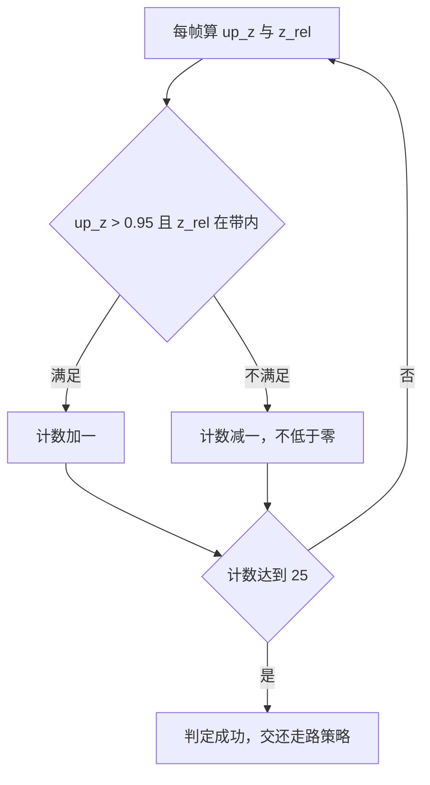
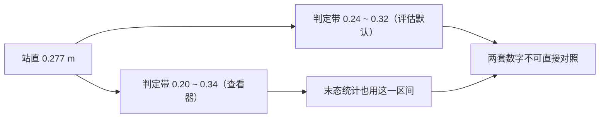
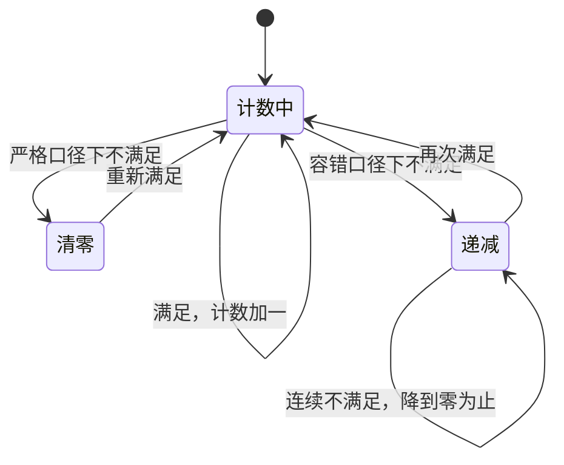
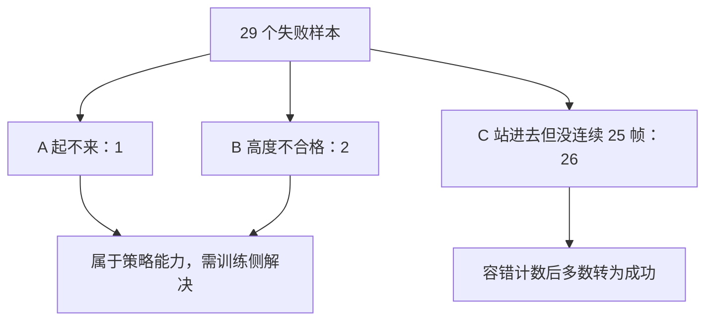

# 起身成功判据与容错计数

起身任务的「成功」由两件事共同决定：姿态合格，并且这个合格姿态维持了一小段时间。把持续时间作为判据的一部分，就必然要回答一个工程问题：这段时间里允许不允许有中断。允许与不允许，本项目的实测成功率相差约四个百分点，而失败样本的形态几乎全是「站进去了但中间掉出一两帧」。

成功判据有三个组成部分、高度带有两处来源、计数有两种方式，它们的差别直接体现在实测数字上；「曾经站住」之所以不足以作为交还条件，要看末态统计才说得清。

## 三个条件组成的成功判据

查看器的起身成功判据由姿态、高度与持续时间三部分组成（`当前状态.md:95`、`实验记录_Go1复现.md:6455`）：

```python
ok = (upz > getup_up_th) and (zlo <= zr <= zhi)
if ok: getup_hold_cnt += 1
else:  getup_hold_cnt = max(getup_hold_cnt - 1, 0)
成功 = getup_hold_cnt >= 25
```

| 组成部分 | 默认 | 含义 |
| --- | --- | --- |
| 姿态 | `up_z > 0.95` | `up_z` 是机身竖直程度（1 为完全竖直），0.95 约合倾角 18.2 度 |
| 高度 | `z_rel ∈ [0.20, 0.34]` | 躯干相对地面高度落在带内 |
| 持续时间 | 计数达到 25 | 25 帧 = 0.5 s（`ctrl_dt = 0.02 s`） |



离线评估用的是同一套条件，只是把持续时间表述为「保持 0.5 s」这类等价说法；评估脚本的注释明确要求判定按查看器实际使用的那套来，训练日志里的 `eval_reward` 只当参考（`mjx-go1-getup/sim/eval_getup.py:2-5`）。

## 高度带的来源

高度带的下界与上界对应「站直」附近的一个区间：站直时相对地面高度约 0.277 m（`当前状态.md:85`）。查看器与离线探针用 `[0.20, 0.34]`（`当前状态.md:95`、`实验记录_Go1复现.md:6455`）。

离线评估脚本的默认判定带略窄：`--z_lo 0.24`、`--z_hi 0.32`（`eval_getup.py:63-65`）。同一份脚本在打印末态分布时又用 `[0.20, 0.34]` 统计「落在带内的比例」，并把同一区间用于「接近站立」这一档（`eval_getup.py:230-234`）。

| 场合 | 高度带 | 用途 |
| --- | --- | --- |
| 查看器与离线探针判定 | 0.20 到 0.34 | 成功判据 |
| 评估脚本默认判定 | 0.24 到 0.32 | 成功判据，略窄 |
| 评估脚本末态统计 | 0.20 到 0.34 | 描述分布与「接近站立」 |

两处取值的差别不影响结论方向，但会让数字不可直接对照，属于口径记录里必须写清楚的一项。改动高度带时，要同时确认判定与统计用的是哪一个。


## 连续计数：严格口径

严格口径要求计数连续累积，中间任何一帧不满足就把计数清零：

```python
if ok: hold += 1
else:  hold = 0      # 严格: 一帧不满足就归零
```

这种写法对姿态抖动的容忍度为零。它在逻辑上干净：只有稳定保持 0.5 s 才算成功。代价是当策略的站立姿态在阈值附近抖动时，计数会被反复打断，成功率低估真实能力。

## 容错计数：满足加一、不满足减一

容错口径把清零改成减一，并保持不低于零（`当前状态.md:97-100`）：

```python
if ok: getup_hold_cnt += 1
else:  getup_hold_cnt = max(getup_hold_cnt - 1, 0)   # 容错, 不归零
```

| 口径 | 不满足时的动作 | 允许的中断 |
| --- | --- | --- |
| 严格 | 计数清零 | 无 |
| 容错 | 计数减一 | 短时中断会被后续满足逐步补回 |



## 实测：77.3% 到 81.2%

两种计数在同一批 128 个界内真摔倒样本上的对比如下（`实验记录_Go1复现.md:6474-6482`、`当前状态.md:102-104`）：

| 指标 | 严格 | 容错 |
| --- | --- | --- |
| 成功数 | 99 / 128 = 77.3% | 104 / 128 = 81.2% |
| 到站时间 | 5.71 s | 4.89 s |

同一批样本上，高度带内最好的 `up_z` 均值 0.974、中位数 0.999，总最好 `up_z` 均值 0.992、中位数 1.000（`实验记录_Go1复现.md:6481-6482`）。姿态数据说明策略有能力站起来，差别出在保持过程与计数口径上。

到站时间同时缩短，原因是容错计数让那些「站进去又掉出一两帧」的样本更早累积到阈值。这一项与成功率一起报，才能说明改动不是单纯放宽判据。

## 失败形态分解

严格口径下的 29 个失败样本可以分成三类（`实验记录_Go1复现.md:6484-6490`）：

| 形态 | 个数 | 含义 |
| --- | --- | --- |
| A 从来没直起来 | 1 | 总最好 `up_z` 小于 0.95，没有起来 |
| B 直起来了但高度不在带内 | 2 | 姿态可以，高度不合格 |
| C 满足过判据但没连续 25 帧 | 26 | 站进去了，中间掉出一两帧就归零 |

形态 C 占了绝大多数，而它正是用户反馈里那句「看着站起来了却提示没成功」的来源（`当前状态.md:103-104`）。这说明当时的主要瓶颈在判据的时间条件，不在策略能力。



## 曾站住不等于末态站着

判据通过一次并不等于可以交还。评估脚本对此有一条明确的说明：站住之后又倒下时，调度器会在那 0.5 s 窗口里把控制权交还给走路策略，然后指望走路策略去救，这正是要避免的情况（`eval_getup.py:191-193`）。

因此评估额外统计「末态仍满足站住判据」的比例，并同时给出末态倾角小于 20 度的版本（`eval_getup.py:193-207`）。

| 指标 | 含义 | 用途 |
| --- | --- | --- |
| 至少站住过一次 | 判据曾被满足 | 看能力上限 |
| 末态仍满足判据 | 结束时还站着 | 看能否安全交还 |

## 站住之后怎么交还

交还方式本身也是判据的一部分：交还瞬间的动作质量决定交还后会不会立刻摔倒。实测 227 个起身终态、500 帧的对照结果如下（`当前状态.md:108-118`）：

| 方案 | 摔倒比例 | 末态站住比例 |
| --- | --- | --- |
| 不混合（当前默认） | 7.9% | 85.9% |
| 走路策略原生基线（对照） | 8.4% | 92.1% |
| 混合系数 10 | 38.3% | 59.5% |
| 混合系数 30 | 73.6% | 35.2% |
| 一直保持起身末目标不交还 | 90.7% | 0.0% |

原因是起身「站住」那一帧的动作顶在裁剪上：动作绝对值中位数等于裁剪上限 8.0，目标偏离关节实际位置 2.7 rad，从这种发力状态开始混合会把人推倒（`当前状态.md:119-120`）。相关修复在同一轮记录里列出（`实验记录_Go1复现.md:6498-6503`）。

## 易错点

| 现象 | 原因 | 判据 |
| --- | --- | --- |
| 成功率被低估 | 用了严格计数 | 对照两种计数下的数字 |
| 高度带两处数字对不上 | 判定带与统计带不同 | 确认用的是 0.24/0.32 还是 0.20/0.34 |
| 曾站住却被认为可以交还 | 未统计末态 | 看「末态仍满足判据」一列 |
| 交还后立刻摔倒 | 从发力顶裁动作直接混合 | 检查交还方式与混合系数 |
| 到站时间与成功率方向相反 | 只改了一处口径 | 两项一起看 |
| 样本里混入出界环境 | 未剔除自由落体样本 | 检查出界计数 |

## 小结

### 核心概念

- 起身成功判据由姿态、高度与持续时间三部分组成。
- 高度带存在两处取值：查看器 0.20 到 0.34，评估默认 0.24 到 0.32。
- 严格计数一帧不满足即归零，容错计数逐帧递减，两者相差约四个百分点。
- 判据曾满足不等于可以交还，还要看末态是否仍站着。

### 设计权衡

| 决策 | 选择 | 收益 | 代价 |
| --- | --- | --- | --- |
| 计数方式 | 容错递减 | 成功率与到站时间都更好 | 判据略微宽松，需说明 |
| 持续时间 | 25 帧 = 0.5 s | 与交还窗口一致 | 站住判定有半秒延迟 |
| 交还 | 不混合直接交还 | 摔倒比例最低 | 需要起身终态动作可控 |
| 统计 | 曾站住与末态分开报 | 能区分能力与稳定性 | 字段更多 |

## 练习

### 基础题

1. 起身成功判据的三部分分别是什么？
2. 严格计数与容错计数在不满足那一帧分别做什么？
3. 为什么「曾经站住」不足以作为交还条件？

### 挑战题

4. 在给定的一段 `up_z`/`z_rel` 序列上，手算两种计数方式的结果，并说明差异来源。

5. 设计一个实验区分「策略站不住」与「判据太严」，给出两条证据链。

6. 说明交还混合系数为什么会加重摔倒，并给出一个能降低终态动作幅度、从而扩大交还余量的训练侧改动方向。

### 附：本页引用的路径

| 路径 | 用途 |
| --- | --- |
| `当前状态.md` | 成功判据与容错计数、失败形态、交还对照表（`:93-120`） |
| `RLcontroller_go1_moreinformation/实验记录_Go1复现.md` | 判据代码、128 样本实测、失败形态与修复汇总（`:6455`、`:6474-6503`） |
| `mjx-go1-getup/sim/eval_getup.py` | 保持步数、高度带默认值、末态统计与交还理由（`:2-5`、`:54-56`、`:63-65`、`:187-207`、`:230-234`） |

（引用的文件以 /home/tc63/mujoco 为根。）