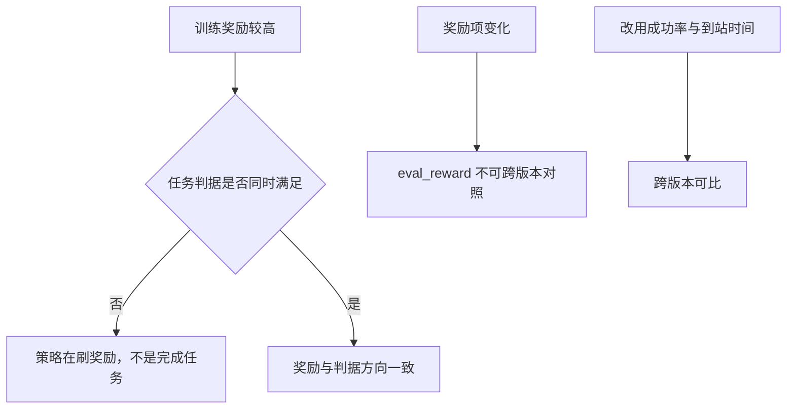
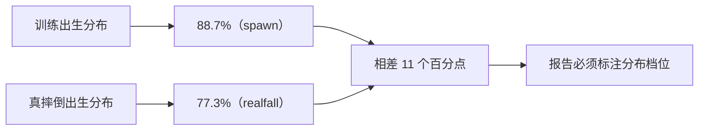
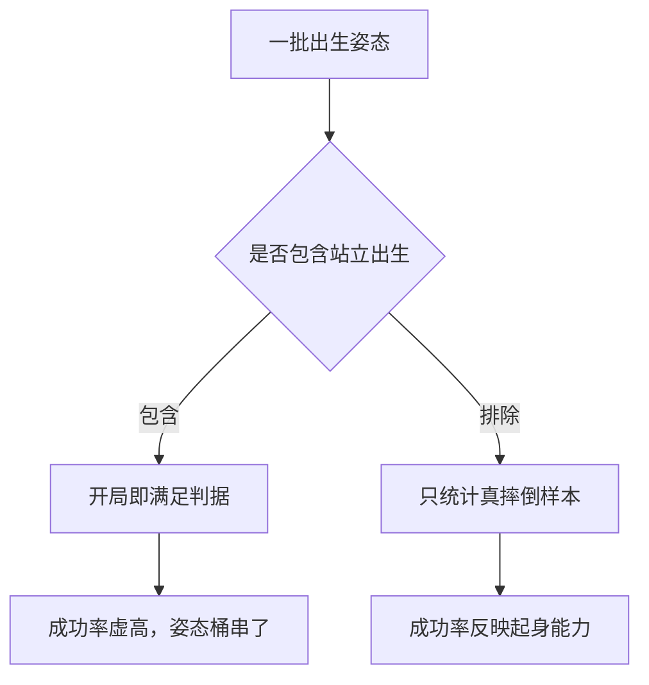
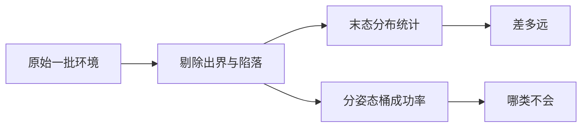
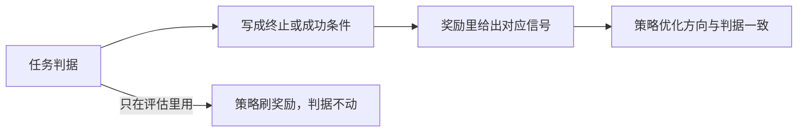

# 评估口径的统一与可比性

同一份策略在不同脚本里评估出不同的数字，多数情况下脚本都没有错，问题出在两套口径衡量的对象不同：出生姿态不同、指令分布不同、动作范围不同、结算频率不同。这些差异会让「谁更强」的结论完全反过来，所以比较之前必须先确认两边在同一个口径上。

口径里需要固定的有几项，每一项不一致都会造成方向不同的偏差；把这些固定下来之后，才有资格与公开工作的成功判据对照，也才谈得上奖励与判据的对齐。

## 训练奖励不是判据

训练日志里的 `eval_reward`（固定评估回合里拿到的奖励总和）只适合当参考。评估脚本在文件开头就写明：判定必须按查看器实际使用的那一套来做（`mjx-go1-getup/sim/eval_getup.py`）。原因是奖励是多项平滑惩罚与奖励之和，它可以被策略「刷高」而不同时满足任务判据。

项目里出现过这种极端情况：某次训练回合一拿 468 分（站立任务上限 529），成功率却是 0%（`getup_sota.md`）。奖励与判据之间没有强绑定关系时，优化奖励并不等价于完成任务。

| 指标 | 反映什么 | 能否替代判据 |
| --- | --- | --- |
| `eval_reward` | 各项奖励加权之和 | 不能 |
| 成功率 | 任务判据被满足的比例 | 是判据本身 |
| 到站时间 | 满足判据所需时间 | 判据的辅助指标 |

奖励口径本身也会随奖励项变化而漂移：内置评估的 `eval_reward` 从 771 到 763 再到 917、`ep_len` 从 609 到 534 再到 599（`实验记录_Go1复现.md`），这些数字跨版本不可直接对照，因为奖励里加入了新的项（`实验记录_Go1复现.md`）。



## 出生分布决定可比性

同一策略在不同出生分布上的成功率可以差到十几个百分点。本项目两套出生分布的对照如下（`实验记录_Go1复现.md`）：

| 出生分布 | 成功率 | 说明 |
| --- | --- | --- |
| 训练分布（`--stage spawn`） | 88.7% | 地面加 0.35 m 自由落体、随机关节与朝向 |
| 走路真摔倒（`--stage realfall`） | 77.3% | 从走路策略真的摔了的姿态开始 |

两者相差 11 个百分点，属于训练与推理的分布差，但不是数量级的差异（`实验记录_Go1复现.md`）。结论是：报告成功率时必须写明出生分布，否则两个数字没有可比性。

评估脚本为此提供了专门的开关：`--difficulty` 控制关节随机度，`--orient_rand` 控制朝向随机度，`--drop_height` 覆盖掉落高度，并注明「真实摔倒」档给 0.15，因为走路中摔倒不是 0.5 m 自由落体（`eval_getup.py`）。



## 动作范围与难度参数必须一致

动作裁剪范围不一致会让评估失去意义。评估脚本的 help 里写得很直接：`--getup2_action_clip` 默认 3.0，但本项目实测 Go1 需要 8.0（大腿行程 5.2 rad）；不一致会把策略动作夹掉，成功率假零（`eval_getup.py`）。

同样的问题也出现在难度参数上：评估课程中间档时必须与训练时一致，否则会拿全随机摔倒去考一个只练过简单起手的策略，成功率虚低（`eval_getup.py`）。

| 参数 | 不一致的后果 | 检查方式 |
| --- | --- | --- |
| 动作裁剪范围 | 动作被夹掉，成功率假零 | 对照训练配置的裁剪值 |
| 出生难度 | 成功率虚低或虚高 | 对照训练课程档位 |
| 掉落高度 | 出生分布不同，不可比 | 对照训练时的掉落设置 |
| 朝向随机度 | 姿态桶分布偏移 | 对照训练时的随机度 |
## 站立出生要不要纳入

这是一个看起来无害、实际会污染结论的选择。站立出生的样本在开局就满足站住判据，如果把它和摔倒样本混在一起统计，成功率会虚高，姿态桶也会串掉（`eval_getup.py`）。

评估脚本的处理是默认不纳入，需要时才用 `--include_standing` 打开（`eval_getup.py`）。项目后来把评估出生分布默认改成只用真摔倒（`实验记录_Go1复现.md`）。

| 选择 | 后果 | 适用场合 |
| --- | --- | --- |
| 只用真摔倒样本 | 成功率反映起身能力 | 主指标 |
| 纳入站立出生 | 成功率虚高、桶被串 | 只用于调试出生分布 |



一次评估的固定流程可以用几行伪代码概括：

```python
# 示意：可比的评估流程
for i in range(N_ENVS):
    s = env.reset(BASE_SEED + i)            # 出生分布固定
    hold = 0
    for t in range(MAX_STEPS):
        s = env.step(s, policy(s.obs))
        hold = hold + 1 if stand(s) else 0  # 连续计数；容错版是失败时减一
        if hold >= HOLD_STEPS: break
    results.append((hold >= HOLD_STEPS, t))
report(success_rate, median_time, p10, p90) # 概率与时间分布一起报
```

协议里有三个常量：出生分布、步数上限、连续保持门槛。任意一个变了，成功率就不再可比；所以跨实验对照时应当把它们写进结论，而不是只报一个百分比。

## 样本量、步数与结算频率

评估脚本的默认设置是 256 个环境、300 步、固定种子 0（`eval_getup.py`）。项目实际用过的几组配置如下：

| 用途 | 环境数 | 步数 | 出处 |
| --- | --- | --- | --- |
| 评估脚本默认 | 256 | 300 | `eval_getup.py` |
| 多 checkpoint 对比 | 128 | 300 | `实验记录_Go1复现.md` |
| 真摔倒起身探针 | 128 | 1500（起身 600） | `当前状态.md` |
| 稳态步态口径 | 128 | 每轮 200，共 8 轮 | `实验记录_Go1复现.md` |

结算频率也影响结果。评估脚本每 5 步结算一次判据，理由写得很实在：每步都调用一次数据同步会拖慢评估（`eval_getup.py`）。这意味着「连续 25 步」在实现上按每次检查推进 5 步来累积（`eval_getup.py`），检查间隔与持续时间的组合决定了实际的时间分辨率。

稳态口径还有一个细节：每轮丢弃前 30 步瞬态，8 轮共约 15.8 万帧（`实验记录_Go1复现.md`）。丢弃瞬态是为了让统计落在稳定行走段上，而不是起步阶段。

## 分桶与末态分布怎么看

单个成功率说明不了问题出在哪。评估脚本的输出里，下面几项要一起看（`eval_getup.py`）：

| 输出项 | 回答的问题 |
| --- | --- |
| 严格与实用两档成功率 | 是站不直还是起不来 |
| 至少站住过一次 | 策略能力上限 |
| 末态仍满足判据 | 能否安全交还 |
| 分初始姿态桶 | 哪一类躺法不会 |
| 末态 `up_z` 与相对高度分布 | 差多远、往哪个方向差 |
| 出界与陷落终止数 | 统计是否被污染 |

出界与陷落样本不进入末态统计（`eval_getup.py`），这一步很关键：在真摔倒探针里，如果越界重生没做好，一批 128 个环境里曾出现 124 个掉出地形，统计会完全失真（`实验记录_Go1复现.md`）。



## 同一策略在两套口径下的差异

项目里反复遇到同一个策略在两套脚本下数字不同，原因都是口径。步态脚本与固定种子评估脚本被明确标注为「两套口径不可混比」（`实验记录_Go1复现.md`）。

| 指标 | 评估口径 | 步态口径 | 差异来源 |
| --- | --- | --- | --- |
| 前进速度 | 0.187 | 0.370 | 评估含随机出生与全部指令档，含零速指令 |
| 存活率 | 77% | 78% 到 84% | 同档，差异来自样本与指令分布 |

前进速度差近一半的原因写得很清楚：评估口径包含随机出生与全部指令档（速度指令从 0 到 0.5），零速样本会把均值拉低（`实验记录_Go1复现.md`）。另一处口径问题更隐蔽：某步态诊断脚本不重置环境，摔倒之后状态一直「死」着，统计的是残骸而不是步态（`实验记录_Go1复现.md`）。

## 跨工作的判据对照

公开工作的成功判据并不统一，报告的数字因此不能直接比较。下表整理自本仓库的调研笔记（`getup_others.md`、`getup_sota.md`）：

| 工作 | 出生分布 | 终止或成功判据 | 报告内容 |
| --- | --- | --- | --- |
| AFR | 随机仰卧 | 350 步上限，或稳定站立 100 连续步 | 每地形 50 次试验，成功率与恢复时间 |
| Learning to Get Up | 1.5 m 掉落加随机姿态 | 固定 80 控制步，首阶段无早停 | 运动多样性与质量，非单一成功率 |
| HoST | 随机姿态加地形课程 | 四组奖励加多 critic，含站立后的后任务奖励 | 成功率与训练稳定性 |
| 本项目 | 走路真摔倒 | `up_z > 0.95` 且相对高度在带内，连续 25 帧（0.5 s） | 128 样本下 77.3%（严格）/ 81.2%（容错） |

从这张表能看出两件事：一是「连续站立多少步」是常见的成功条件，本项目用 0.5 s 是同类思路里偏短的一档；二是多数工作会同时报成功率与时间，本项目也遵循这一点（`当前状态.md`）。官方 playground 的 Go1Getup 从未公布成功率，它的默认配置本身很难，不能当作对照基准（`getup_sota.md`）。

## 奖励与判据对齐

调研笔记把「奖励与判据对齐」列为这个任务里最关键的一条（`getup_sota.md`）。做法上是把成功条件直接写进终止或奖励：AFR 把稳定站立 100 连续步作为成功终止条件；HoST 用一组专门描述「站起来之后应当保持站立」的后任务奖励（`getup_sota.md`）。

本项目的问题是对齐不足：奖励由 9 项平滑项之和加一个很窄的评估判据组成，策略可以在站不起来的情况下拿到 468（站立任务上限 529），成功率却是 0%（`getup_sota.md`）。这类错位的表现就是训练曲线很好、任务指标不动。



## 易错点

| 现象 | 原因 | 判据 |
| --- | --- | --- |
| 两套脚本数字对不上 | 口径不同 | 先对齐出生分布与指令档 |
| 成功率假零 | 动作裁剪与训练不一致 | 对照裁剪范围配置 |
| 成功率虚低 | 出生难度与训练不一致 | 对照课程档位 |
| 成功率虚高 | 混入站立出生样本 | 检查出生分布与样本筛选 |
| 奖励涨而指标不动 | 奖励与判据未对齐 | 把成功条件写进终止或奖励 |
| 末态统计被污染 | 未剔除出界样本 | 看终止计数与样本筛选 |

## 小结

### 核心概念

- 训练奖励不能替代任务判据，二者的对齐需要显式设计。
- 出生分布、动作范围、难度参数必须与训练一致，否则成功率失真。
- 站立出生样本会让成功率虚高，默认应当排除。
- 跨工作的成功判据不统一，报告时必须写明口径与样本量。

### 设计权衡

| 决策 | 选择 | 收益 | 代价 |
| --- | --- | --- | --- |
| 主指标 | 成功率加到站时间 | 跨版本可比 | 需要维护评估脚本 |
| 出生分布 | 只用真摔倒 | 反映真实场景 | 与训练分布存在 11 点差距 |
| 结算频率 | 每 5 步一次 | 评估更快 | 时间分辨率变粗 |
| 奖励设计 | 把成功条件写进终止或奖励 | 优化方向与判据一致 | 需要重训验证 |

## 练习

### 基础题

1. 为什么 `eval_reward` 不能当成功率的替代指标？
2. 训练分布与真摔倒分布的成功率差了多少个百分点？
3. 评估为什么要默认排除站立出生样本？

### 挑战题

4. 拿到两份不同脚本的成功率报告，列出你需要核对的口径项，并说明每一项不一致会造成什么方向的偏差。

5. 说明为什么「奖励很高但成功率 0%」是可能出现的，并给出一个把判据写进奖励的具体方案。

6. 设计一份评估报告模板，要求读者仅凭报告就能判断数字是否可与其他版本对照。

### 附：本页引用的路径

| 路径 | 用途 |
| --- | --- |
| `mjx-go1-getup/sim/eval_getup.py` | 评估开关、默认样本量、结算频率、分桶与末态统计（） |
| `RLcontroller_go1_moreinformation/实验记录_Go1复现.md` | 两套口径差异、样本量与稳态口径、出生分布对照（） |
| `RLcontroller_go1_moreinformation/notes/getup_sota.md` | 公开工作判据对照与奖励-判据对齐（） |
| `当前状态.md` | 样本数、探针命令与成功率口径（） |

（引用的文件以 /home/tc63/mujoco 为根。）