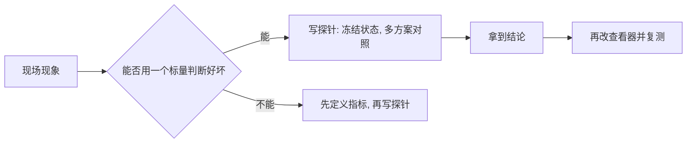
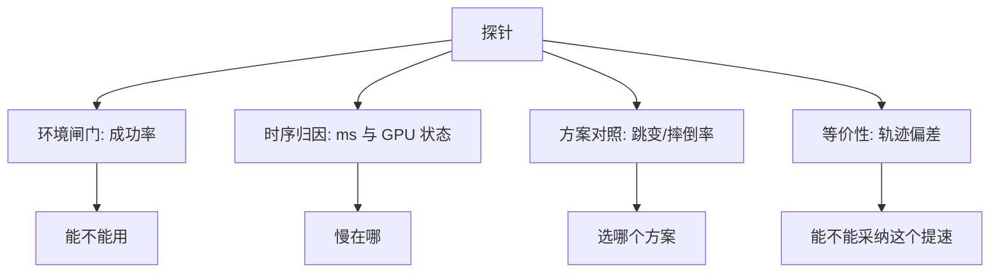

# 探针的分类与选型

查看器里出现「抽搐」「越跑越慢」「成功率对不上」这类现象时，直接在查看器里改参数是最慢的一条路：一帧只能看到一个现象，改完要重新跑到同样的场景才知道有没有用，而且两次摔倒的姿态不会一样。等到能判断某个改动是否有效，往往已经过去大半天。

探针把这件事换了个做法：把待验证的假设搬到一个无头脚本里，冻结一批状态或固定一批输入，一次跑多个方案，用同一套标量输出结果。它的价值不在自动化，而在可比性——同一次运行里，除被验证的变量之外，其他条件全部相同。

## 什么时候该先写探针

判断标准可以归结成两句话：需要对照两个以上方案时，先写探针；需要在同一批状态上重复测量时，先写探针。查看器适合确认「现象存在」，不适合回答「哪个方案更好」。

本项目的一条经验是把这条顺序写进流程：修改查看器之前，先用探针拿到数据。交还方案的选择就是典型例子——查看器里只能看到「抽搐、摔倒、再起身」，而探针把交还瞬间冻结下来，在同一批终态上跑十种处理方式（`probe_handover.py:2-13`）。

## 探针的四种类型

项目里的探针按回答的问题分成四类，名字不必记，类型要记：

| 类型 | 回答的问题 | 代表脚本 |
| --- | --- | --- |
| 环境闸门 | 这套策略在目标后端上还成立吗 | `probe_getup_mjx.py` |
| 时序归因 | 慢是预热、漂移还是降频 | `diag_speed.py`、`diag_viewer_perf.py` |
| 方案对照 | 哪个处理方式更好 | `probe_handover.py` |
| 等价性检查 | 这个提速改动改了物理吗 | 固定动作序列的对比探针 |

四类探针的共同点是把「现象」翻译成「数字」：环境闸门给出成功率，时序归因给出每块的毫秒数，方案对照给出跳变与摔倒比例，等价性检查给出轨迹偏差。

## 一个进程只建一个环境

写探针时会自然想在同一个进程里先跑平地、再跑地形，省一次启动时间。这条路在本项目走不通：两个环境的缓冲区尺寸相同时会落在同一批地址上，warp 的 CUDA 图按地址缓存，于是第二次建的模型复用了第一次的捕获图，现象是「地形里关键帧动作完全不动」或者「平地里莫名翻倒」（`probe_getup_mjx_trace.py:2-11`）。

| 做法 | 结果 |
| --- | --- |
| 一个进程一个环境 | 正常 |
| 一个进程两个环境 | 图缓存命中错误，行为与预期不符 |

因此探针普遍采用两段式：一段跑一个环境，把中间状态 dump 成 npz，下一段另起进程读回来（`probe_handover.py:19-22`）。这也是为什么探针的命令行通常要分 `--stage`。

## 用固定输入换可比性

可比性来自「除了被验证的变量，其他都一样」。探针里有三种固定手段：

| 手段 | 做法 | 效果 |
| --- | --- | --- |
| 固定状态 | 把终态 dump 下来重复使用 | 方案之间面对同一批姿态 |
| 固定动作 | 保存一串动作逐步回放 | 轨迹差异只来自物理改动 |
| 固定种子 | 显式指定随机种子 | 出生点与随机数可复现 |

固定动作序列的用法比较特别：它不评估策略，只用来验证「改了参数之后物理是否还等价」。此时策略质量无关紧要，重要的是输入完全一致。

## 从现象到探针的对照表

| 现场现象 | 先怀疑 | 该跑的探针 |
| --- | --- | --- |
| 查看器里策略不动或姿势怪异 | 物理后端或地形档不一致 | 环境闸门探针 |
| 越训练越慢、越跑越慢 | 预热、热降频或真漂移 | 逐块计时探针 |
| 交还后抽搐摔倒 | 交还瞬间的动作处理 | 方案对照探针 |
| 某个提速改动省了很多时间 | 是否改了物理 | 固定动作序列的等价性检查 |
| 指标说好但看着不对 | 指标测的不是要修的东西 | 换指标或加接触级指标 |

最后一条来自项目里的一次教训：几何近似的指标无法区分「被认为正常」与「被指出拖地」的两版策略，两版的小腿触地率分别是 30% 与 24%，后者反而更低；换用 MuJoCo 自己的接触判定后才出现干净的区分（`check_body_contact.py:2-8`）。指标报出意料之外的结果时，先怀疑指标。

## 探针的代价

探针不是免费的，写之前要知道代价在哪里：

| 代价 | 说明 |
| --- | --- |
| 启动与编译 | 每次运行都要付 JIT 与预热时间 |
| 双份代码 | 判据要与查看器保持一致，否则数字对不上 |
| 判据漂移 | 查看器改了阈值，探针不跟着改就会给出旧结论 |
| 环境约束 | 一个进程一个环境，多档位要多次运行 |

判据一致性尤其要留意：探针的注释里通常写着「与查看器逐行同款」，改查看器判据时要把这些地方一起改（`probe_handover.py:12-13`、`实验记录_Go1复现.md:6454-6455`）。

## 易错点

| 现象 | 原因 | 判据 |
| --- | --- | --- |
| 探针结果与查看器对不上 | 判据或环境档不一致 | 对照阈值与出生分布 |
| 同进程第二个环境行为异常 | 图缓存按地址命中 | 拆成两个进程 |
| 两次运行结论不同 | 未固定种子或状态 | 检查固定的输入 |
| 探针说好、实际没改善 | 探针测的不是现场场景 | 对照出生分布与控制频率 |
| 指标异常就改策略 | 未先检查指标 | 先确认指标测的是要修的东西 |
| 每次运行都重新编译 | 输入形状或地址变化 | 固定输入形状 |

## 小结

### 核心概念

- 探针的核心价值是可比性，不是自动化。
- 四类探针分别回答能不能用、慢在哪、选哪个方案、能否采纳提速。
- 一个进程只建一个环境，多档位用多进程加中间产物串联。
- 指标异常时先怀疑指标本身。

### 设计权衡

| 决策 | 选择 | 收益 | 代价 |
| --- | --- | --- | --- |
| 先探针还是先改代码 | 先探针 | 结论有对照 | 多写一个脚本 |
| 环境数量 | 一进程一环境 | 行为可靠 | 启动次数增加 |
| 状态来源 | 冻结终态或固定动作 | 方案间可比 | 需要 dump 与回读 |
| 判据来源 | 与查看器同款 | 数字可搬回现场 | 两处要同步维护 |

## 练习

### 基础题

1. 什么情况下应该先写探针再去改查看器？
2. 一个进程里建两个环境会发生什么？为什么？
3. 固定动作序列的探针用来回答什么问题？

### 挑战题

4. 针对「查看器里起身成功率明显低于离线评估」这一现象，列出一套探针方案，说明每支探针要固定什么、输出什么标量。

5. 说明探针与查看器的判据必须同步维护的理由，并给出一条能发现两者漂移的检查办法。

6. 设计一个探针，把「指标说好但看着不对」这类问题在下次出现前拦住。

### 附：本页引用的路径

| 路径 | 用途 |
| --- | --- |
| `mjx-go1-getup/sim/probe_handover.py` | 离线冻结终态做交还方案对照的写法（`:2-22`） |
| `RLcontroller_go1_moreinformation/sim/probe_getup_mjx_trace.py` | 两环境同进程导致图缓存错误的记录（`:2-11`） |
| `RLcontroller_go1_moreinformation/sim/check_body_contact.py` | 接触级指标与两版策略参照值（`:2-12`、`:33-37`） |
| `RLcontroller_go1_moreinformation/sim/diag_speed.py` | 逐块计时与 GPU 状态采样（`:2-15`、`:30-40`） |
| `RLcontroller_go1_moreinformation/实验记录_Go1复现.md` | 越界重生与判据同款说明（`:6443-6470`） |

（引用的文件以 /home/tc63/mujoco 为根。）