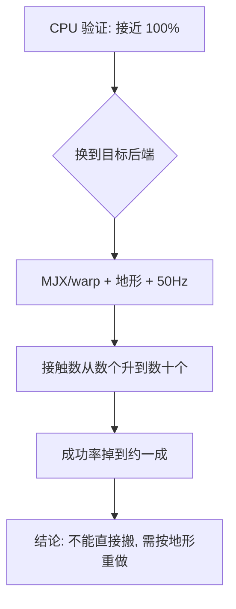
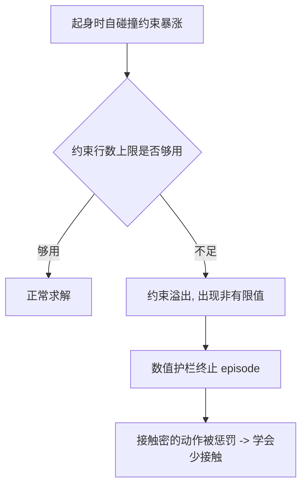
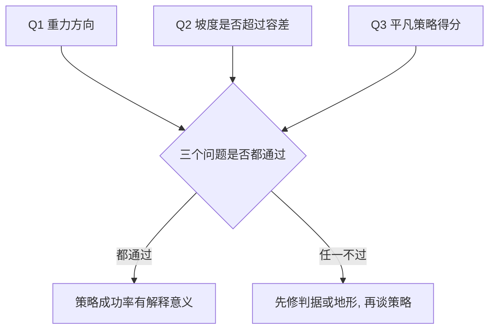

# 环境闸门与单步探针

一套关键帧起身动作在 CPU MuJoCo 上跑出接近 100% 的成功率，搬到查看器里只剩一成左右。这种落差容易让人怀疑策略或动作序列本身，但差别在环境：CPU 版是平面地板、500 Hz 单进程，查看器跑的是 MJX/warp、高度场地形、50 Hz 控制。物理后端、地面模型与控制频率同时变了，动作的可行性也就变了。

环境闸门探针要回答的就是这一步：这套东西在目标环境上还成立吗。它不优化策略，只给出「能不能搬过去」的结论，并且在多数情况下给出不能搬的具体原因。

## 为什么要在目标后端上重验

同一段动作在两种地面上的接触情况完全不同。实测记录里，关键帧动作在平面上只有 4 到 8 个接触、机器人离地 35 cm；换成高度场地形后有 20 到 40 个接触，腿被格子拖住，躯干只抬起 9 cm（`probe_getup_mjx.py:4-10`）。动作序列没变，物理条件变了，结果自然不同。

| 维度 | CPU 验证环境 | 查看器环境 |
| --- | --- | --- |
| 物理后端 | CPU MuJoCo | MJX / warp |
| 地面 | 平面地板 | 高度场地形 |
| 控制频率 | 500 Hz | 50 Hz |
| 接触数量级 | 数个 | 数十个 |

这条落差说明一件事：策略在哪个环境里验证，就只对那个环境有效。后续所有成功率数字都必须标注环境档位。



## 环境闸门探针的判据

闸门探针的判据与站住判据一致，但高度基准换成相对足下地面，因为地形不是平的（`probe_getup_mjx.py:12-14`）：

| 条件 | 阈值 |
| --- | --- |
| 竖直度 | `up_z > 0.99` |
| 姿态 | 横滚与俯仰的绝对值小于 2 度 |
| 高度 | 躯干相对足下地面不小于 0.26 m |

探针的运行方式给了三个档位，用来分辨「动作本身不行」与「地形拖住了它」（`probe_getup_mjx.py:16-19`）：

```bash
../.venv/bin/python sim/probe_getup_mjx.py                       # 平地, 64 trials
../.venv/bin/python sim/probe_getup_mjx.py --terrain --trials 96 # 地形 (查看器实际档)
../.venv/bin/python sim/probe_getup_mjx.py --terrain --origin    # 地形但落在原点压平区
```

| 档位 | 用途 | 读法 |
| --- | --- | --- |
| 平地 | 确认动作本身可行 | 平地高、地形低说明地形是障碍 |
| 地形 | 查看器实际档 | 成功率直接决定能不能搬 |
| 地形加原点 | 排除地形起伏 | 接近平地说明后端不是问题 |

单次 trial 的预算写在脚本里：最多 2600 个控制步，其中包含最多 4 次关键帧重试（`probe_getup_mjx.py:38`）。预算用完仍不满足判据就算失败，这个上限要与其他地方保持一致，否则成功率不可比。
## 单环境逐步 trace

闸门探针给出的是「成不成」，逐步 trace 给出的是「哪一步开始不成」。它在每个相位切换点打印状态量（`probe_getup_mjx_trace.py:2-13`）：

| 输出项 | 用途 |
| --- | --- |
| 高度与竖直度 | 看是否抬起、是否竖直 |
| 横滚与俯仰 | 看姿态在哪一步开始偏 |
| 最大执行器力 | 看是否顶在出力上限 |
| 塌落后状态 | 给出失败时刻的完整快照 |

这支探针还有一个附带用途：验证图模式。它支持显式指定 `--graph_mode WARP_STAGED`，因此可以对比同一场景在不同图模式下的逐步行为（`probe_getup_mjx_trace.py:7-11`）。


## 移植版环境的自检

环境从一个仓库移植到另一个仓库时，行为可能与原版悄悄不同。移植版自检探针的做法是把奖励项与终态指标一起打出来，与环境文件里定义的名字逐项对应（`probe_getup_v2.py:1-27`）。

| 输出 | 来源 | 用途 |
| --- | --- | --- |
| 各奖励项的平均每步值 | 环境指标字典 | 与训练侧奖励项对照 |
| 终态姿态与高度 | 状态快照 | 与判据对照 |
| 非有限值计数 | 状态量检查 | 判断是否发生数值溢出 |

脚本里还硬编码了一组名义关节角（`probe_getup_v2.py:16-17`），用于确认「名义站姿」在移植后仍然是同一个姿态。这类常量看着琐碎，却是发现移植偏差最便宜的检查。

## 约束行数上限探针

`njmax` 是每个世界允许的约束行数上限，而摔倒时躯干与大腿、小腿互相挤压，自碰撞约束会暴涨（`probe_nefc.py:2-5`）。项目把走路档的上限设成 256，这在走路上够用，在起身任务上需要单独验证。

这支探针用 768 个环境跑 300 步，直接统计状态量里的非有限值个数（`probe_nefc.py:6-11`）：

| 观察 | 含义 | 后续影响 |
| --- | --- | --- |
| 无溢出 | 上限够用 | 可以继续 |
| 溢出且出现非有限值 | 上限不足 | 训练里 episode 会被数值护栏杀掉 |

记录里的实测是另一个方向的证据：起身环境下单个世界需要的约束数约 1300，而配置里只有 256，溢出告警在一次训练里出现 719 次（`当前状态.md` 的环境与性能事实段）。溢出会让「用力收腿」这类接触最密的动作被惩罚，策略转而学会避免制造接触，形成趴平的退化姿态（`probe_nefc.py:8-10`）。



## 判据可行性的三个问题

有些失败的责任不在策略，而在判据：它在目标场景里不可达。可行性探针把这类问题拆成三问（`probe_standability.py:2-8`）：

| 问题 | 检查内容 | 不可行时的表现 |
| --- | --- | --- |
| Q1 | 名义站姿下的重力方向是否为竖直向下 | 姿态站点带旋转时方向会偏 |
| Q2 | 坡度分布是否超过判据允许的倾角 | 坡度大于 8 度处判据物理上不可达 |
| Q3 | 保持名义姿态不动能拿多少成功率 | 这是平凡策略的分数，学习策略的及格线 |

Q2 尤其要留意：要求躯干相对世界竖直小于 8.1 度，而四足站在斜坡上时躯干必然随坡面倾斜。只要地形里有超过 8 度的坡，这条判据在这些位置上就不可能满足，成功率上不去属于判据与地形的冲突，不是策略能力问题。



## 易错点

| 现象 | 原因 | 判据 |
| --- | --- | --- |
| 离线成功率远高于现场 | 环境档不同 | 对照后端、地面与控制频率 |
| 地形档全部失败 | 地形是主要障碍 | 加原点档再测一次 |
| 逐步 trace 显示第一步就异常 | 图缓存命中错误 | 确认一个进程只建一个环境 |
| 训练中 episode 被莫名其妙终止 | 约束行数溢出 | 跑上限探针统计非有限值 |
| 成功率上不去但姿态看着没问题 | 判据在高坡度处不可达 | 跑可行性探针看第二问 |
| 移植后动作语义变了 | 环境实现有差异 | 用自检探针对照奖励项与名义姿态 |

## 小结

### 核心概念

- 动作只在验证过的环境里成立，后端、地面与控制频率都会改变可行性。
- 环境闸门探针给出「能不能搬」以及搬不过去的原因。
- 逐步 trace 定位第一个偏离的相位，也用于对比图模式。
- 判据本身可能不可行，坡度与重力方向要先检查。

### 设计权衡

| 决策 | 选择 | 收益 | 代价 |
| --- | --- | --- | --- |
| 验证环境 | 目标后端加真实地形 | 结论可直接搬到现场 | 运行更慢、更多失败 |
| 判据高度 | 相对足下地面 | 与起伏地形兼容 | 需要地形高度函数 |
| 档位 | 平地、地形、原点三档 | 能分离动作与地形因素 | 三次运行 |
| 上限检查 | 显式统计非有限值 | 提前发现数值溢出 | 需要另一支探针 |

## 练习

### 基础题

1. 为什么 CPU MuJoCo 上的成功率不能直接搬到查看器？
2. 环境闸门探针的三个档位分别用来分离什么因素？
3. 约束行数上限溢出为什么会把策略推向趴平的姿态？

### 挑战题

4. 设计一支探针，判断成功率偏低是判据不可行还是策略不足，列出输入与输出。

5. 说明逐步 trace 与闸门探针的分工，并给出一条从 trace 输出推断问题相位的规则。

6. 移植一个环境后，给出一份最小自检清单，要求能发现奖励项或姿态约定的偏差。

### 附：本页引用的路径

| 路径 | 用途 |
| --- | --- |
| `mjx-go1-getup/sim/probe_getup_mjx.py` | 环境闸门探针的判据、三档位与预算（`:2-38`） |
| `RLcontroller_go1_moreinformation/sim/probe_getup_mjx_trace.py` | 逐步 trace 的输出与图模式对比（`:2-13`） |
| `mjx-go1-getup/sim/probe_getup_v2.py` | 移植版环境自检（`:1-27`） |
| `mjx-go1-getup/sim/probe_nefc.py` | 约束行数上限与数值溢出（`:1-11`） |
| `mjx-go1-getup/sim/probe_standability.py` | 判据可行性的三个问题（`:1-12`） |
| `当前状态.md` | 起身环境约束数与溢出告警的待办记录 |

（引用的文件以 /home/tc63/mujoco 为根。）