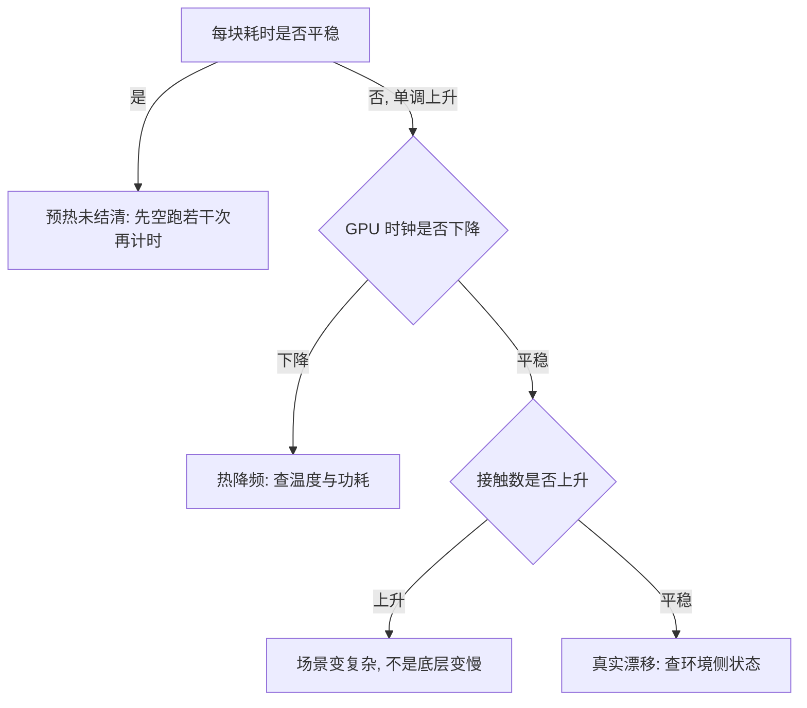
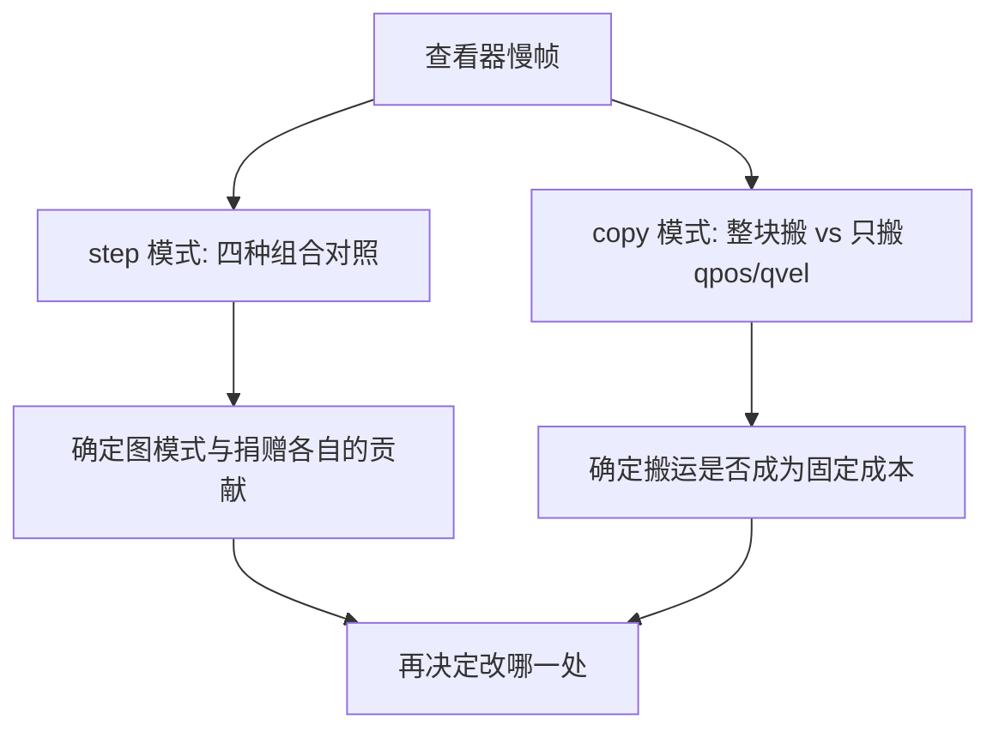

# 逐块计时与漂移诊断

同一个基准脚本，跑 40 次迭代得到 6958 环境-步每秒，跑 300 次得到 12965，差了一倍。这个差距有几种互不相容的解释：前 40 次被 JIT 与 autotune 的预热污染了；或者环境确实越跑越慢；又或者 GPU 因为温度上升降了频。分不清是哪一种，后面的性能数字就都不能用。

逐块计时探针把一次长跑切成若干块，每块打印耗时与 GPU 状态，用「耗时是否单调上升」配合「时钟是否下降」来区分这几种解释（`diag_speed.py:2-8`）。这是性能类问题的第一支探针，先跑它再谈优化。

## 三种解释与对应证据

三种解释在数据上的特征各不相同（`diag_speed.py:6-8`）：

| 解释 | 每块耗时 | GPU 时钟 | 接触数 |
| --- | --- | --- | --- |
| 预热未结清 | 先高后平 | 平稳 | 平稳 |
| 热降频 | 单调上升 | 下降 | 平稳 |
| 真实漂移 | 单调上升 | 平稳 | 可能变化 |

判读顺序是先看耗时是否平稳。平稳就说明没有漂移，最初的差距来自预热；只有在单调上升时，才需要看时钟与接触数来区分降频与漂移。接触数会随策略行为变化，若它同步上升，慢下来的原因可能是场景变复杂，而不是底层变差。



## 逐块计时的做法

脚本的结构是「先空跑、再分块、每块同时采样三个维度」（`diag_speed.py:2-8`）：

| 阶段 | 内容 | 目的 |
| --- | --- | --- |
| 预热 | 空跑若干次不计时 | 让编译与自动调优结清 |
| 分块 | 每块跑固定次迭代并计时 | 看耗时是否随时间变化 |
| 采样 | 每块打印时钟、温度、接触数 | 为耗时变化找伴随变量 |

两个实现细节会影响结论。第一，块内取平均而不是取总时间，避免块大小不同带来的偏差；第二，采样与计时在同一块内完成，否则时钟变化与耗时变化对不上时间点。


## GPU 侧的采样量

采样用一条 `nvidia-smi` 查询完成，取四个量（`diag_speed.py:30-40`）：

```bash
nvidia-smi --query-gpu=clocks.sm,temperature.gpu,power.draw,utilization.gpu \
         --format=csv,noheader,nounits
```

| 量 | 回答的问题 | 异常时的含义 |
| --- | --- | --- |
| 流处理器时钟 | 是否降频 | 明显低于常态说明被限频 |
| 温度 | 是否触到温度墙 | 接近上限时降频是保护行为 |
| 功耗 | 是否触到功耗墙 | 顶到上限时会主动降频 |
| 利用率 | GPU 是否真的在忙 | 很低却还慢，说明瓶颈在别处 |

最后一项尤其重要：利用率低而耗时高，说明等待发生在 GPU 之外。此时要看 CPU 侧是否被别的进程抢核，判断依据是渲染后端与实际帧率分项，而不是这里的数字（相关机理见 `15-仿真查看器与性能/02-渲染后端`）。

## 查看器帧率的分项测量

查看器慢帧还有一支专门的探针，把一次迭代拆成两段分别测（`diag_viewer_perf.py:1-15`）：

| 模式 | 测什么 | 对照变量 |
| --- | --- | --- |
| `step` | 策略推理加环境一步的墙钟耗时 | 四种图模式与是否捐赠 |
| `copy` | 状态搬回 CPU 的耗时 | 整块 Data 对 qpos/qvel 加 `mj_forward` |

`step` 模式覆盖的四种组合是：默认图模式、默认图模式加捐赠、关闭图模式、关闭图模式加捐赠（`diag_viewer_perf.py:2-11`）。这个二维对照把「图模式」与「是否捐赠」两个变量分开，避免把两种改动的效果混在一起。



## 冷热 A/B 排除进程早期效应

进程早期的编译与热机效应会让第一次测量偏慢，所以「两个方案各测一次」的做法不可靠。项目里做这件事的写法是在同一个进程内交替测量，并各跑两轮（`实验记录_Go1复现.md:4155-4163`）：

| 变体 | 冷，第一轮 | 热，第二轮 |
| --- | --- | --- |
| 策略 jit | 16.95 ms | 17.06 ms |
| 策略 eager | 28.90 ms | 27.24 ms |
| 策略 jit，再测一次 | 17.06 ms | 16.94 ms |

两轮都保持约 11 ms 的差距，说明差异来自写法。记录里把这支冷热对照的探针列在交付文件里，但当前检出中已看不到该脚本文件，只能从记录读取结论（`实验记录_Go1复现.md:4257-4259`）。要做同类对照时按这个结构重写即可：同进程、同输入、交替测量、各两轮。

## 无头复现慢帧

现场帧率突然掉到个位数时，第一件事是把帧流程搬到无头环境里复刻一遍。项目的做法分三步（`viewer-guide.md:277-281`）：

| 步骤 | 做法 | 目的 |
| --- | --- | --- |
| 单进程基准 | 无窗口复刻完整帧流程 | 单进程只有 15.7 ms 时，排除软件栈问题 |
| 双进程并发 | 同时启动两个实例 | 复现 306.9 ms 的塌方 |
| 反证 | 限制显存预占比例后重测 | 回到 27 ms 即确认原因 |

复现脚本是 `RLcontroller_go1_moreinformation/sim/probe_viewer_slow.py`。三步法的关键在于第二步必须先复现出异常，否则后面的反证没有意义——只有「改一个量就能消除异常」才算定位到原因。


## 易错点

| 现象 | 原因 | 判据 |
| --- | --- | --- |
| 短跑比长跑快一倍 | 预热未结清 | 先空跑再分块计时 |
| 越跑越慢就归因于代码 | 可能是热降频 | 看时钟与温度 |
| 时钟没降就认为无异常 | 接触数或场景可能变了 | 同块采样接触数 |
| 两个方案各测一次就下结论 | 进程早期效应 | 同进程交替、各两轮 |
| GPU 利用率低却慢 | 瓶颈在 CPU 或其他进程 | 查渲染后端与并发进程 |
| 改一个量后异常没了就收工 | 未复现异常本身 | 先复现再反证 |

## 小结

### 核心概念

- 同一个基准的耗时差异可能来自预热、热降频或真实漂移。
- 逐块计时配合 GPU 侧四个采样量可以区分这三种情况。
- 查看器慢帧要按 step 与 copy 两段分别测，图模式与捐赠分开对照。
- 无头复现的思路是先复现异常，再用单变量反证定位原因。

### 设计权衡

| 决策 | 选择 | 收益 | 代价 |
| --- | --- | --- | --- |
| 计时方式 | 先空跑再分块 | 排除预热干扰 | 总运行时间增加 |
| 采样位置 | 与计时同块 | 时间点对得上 | 每块多一次系统调用 |
| 对照设计 | 同进程交替两轮 | 排除进程效应 | 需要改脚本结构 |
| 定位方式 | 先复现再改一个变量 | 结论可靠 | 可能要多轮尝试 |

## 练习

### 基础题

1. 短跑与长跑耗时差一倍，最先要排除哪一种解释？
2. GPU 侧采样要取哪四个量，各自回答什么问题？
3. 为什么两个方案不能各测一次就下结论？

### 挑战题

4. 设计一份逐块计时的输出格式，要求读一次就能判断是预热、降频还是漂移。

5. 说明无头复现三步法中「先复现」这一步为什么不能省，并给出复现失败的下一步排查方向。

6. 给定一段耗时单调上升的数据，列出区分「场景变复杂」与「底层变差」所需的全部观察量。

### 附：本页引用的路径

| 路径 | 用途 |
| --- | --- |
| `RLcontroller_go1_moreinformation/sim/diag_speed.py` | 逐块计时、GPU 采样与三种解释（`:2-45`） |
| `RLcontroller_go1/sim/diag_viewer_perf.py` | 查看器 step 与 copy 两段测量（`:1-15`） |
| `RLcontroller_go1_moreinformation/sim/probe_viewer_slow.py` | 帧率塌方的无头复现脚本 |
| `RLcontroller_go1_moreinformation/实验记录_Go1复现.md` | 冷热 A/B 数据与探针清单（`:4155-4163`、`:4257-4259`） |
| `mjx-go1-getup/docs/viewer-guide.md` | 无头基准与双进程定位过程（`:277-281`） |

（引用的文件以 /home/tc63/mujoco 为根。）