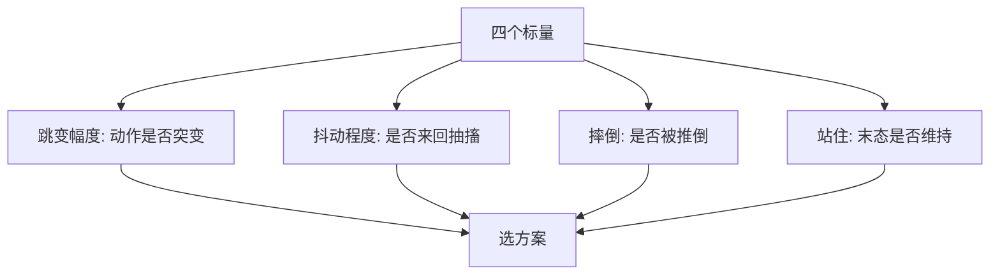
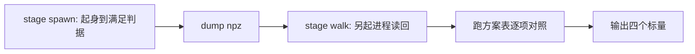
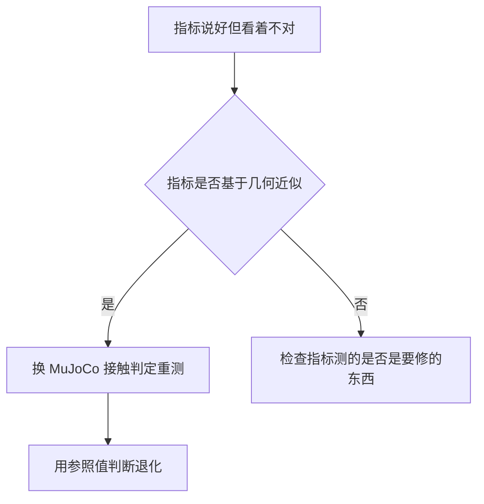
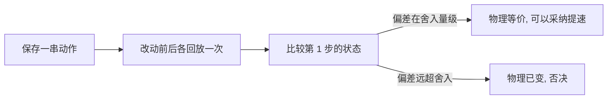

# 对照探针与等价性检查

交还瞬间该不该清零上一动作？这个问题在查看器里争不出结果：每次摔倒的姿态都不一样，两次观察之间没有可比性，改完还要重新走到同样的场景才看得到差别。对照探针把交还那一帧冻结下来，在同一批终态上跑十种处理方式，用几个标量一次比出高低（`probe_handover.py`）。

同类的思路还有两个变种：用固定动作序列检查「改了一个参数之后物理是否还等价」，以及用与环境特征同源的检查确认「画出来的东西就是算出来的东西」。这三种都属于对照类探针，共同点是输入固定、只让被验证的变量变化。

## 冻结终态做方案对照

冻结的对象是「起身策略刚刚满足站住判据的那一帧」。这一帧在查看器里是交还发生的时刻，也是抽搐现象出现的位置。把它连同随机密钥一起 dump 下来，后续所有方案面对完全相同的起点（`probe_handover.py`）。

| 冻结内容 | 作用 |
| --- | --- |
| 终态状态量 | 所有方案起点一致 |
| 随机密钥 | 随机数序列一致 |
| 环境配置 | 物理与奖励配置一致 |

被冻结的终态里有一个关键字段：上一动作 `last_act`。走路策略的观测是单帧的，其中 48 维基础量里有 12 维是上一动作，语义是上一步的控制目标（绝对位置目标，缩放系数为 1.0）。起身用锚定动作时它可能到名义值加减 4 rad，而走路时只在加减 1.5 附近——这个量级差正是交还瞬间最容易出问题的地方（`probe_handover.py`）。


## 四个可比标量

方案之间的差别必须能被标量说清，否则还是回到「看着像」。探针定义的四个量分别覆盖跳变、抖动、摔倒与站住（`probe_handover.py`）：

| 标量 | 定义 | 回答的问题 |
| --- | --- | --- |
| 跳变幅度 | 相邻两步动作分量的最大差 | 交还瞬间动作是否突变 |
| 抖动程度 | 动作的二阶差分最大值 | 是否出现来回抽搐 |
| 摔倒 | 连续满足查看器摔倒判据 | 交还后是否被推倒 |
| 站住 | 末态仍满足交还判据 | 交还后是否维持站立 |

前两个量刻画「动作像不像抽搐」，后两个量刻画「结果稳不稳」。四个量一起看才能避免单一指标的误导：只看跳变可能会选出一个跳变小但站不住的方案，只看站住则无法解释为什么某个方案更平滑。


## 十种方案与两段式

探针的方案表把交还瞬间的处理拆成两个维度：上一动作怎么取，以及是否做混合（`probe_handover.py`）。

| 方案 | 上一动作 | 混合帧数 | 目的 |
| --- | --- | --- | --- |
| 原生基准 | 走路策略自己出生 | 0 | 参照，不是交还 |
| 不交还 | 保持起身末目标 | 0 | 判断终态本身稳不稳 |
| 保留真值 | 起身最后的目标 | 0 | 相当于什么都不做 |
| 清零重算 | 清零并重算观测 | 0 | 查看器原本想做的事 |
| 自洽首帧 | 换成不动点动作 | 0 | 用自洽的目标开局 |
| 混合 10 帧 | 起身最后的目标 | 10 | 平滑过渡 |
| 混合 30 帧 | 起身最后的目标 | 30 | 更长过渡 |
| 清零加混合 10 帧 | 清零并重算 | 10 | 两种处理叠加 |

运行结构是两段式：第一段建起身环境，跑到满足判据后把那一帧状态 dump 成文件；第二段另起进程，建走路环境，从 dump 的状态出发跑各方案并输出标量（`probe_handover.py`）。分两个进程是因为同进程建两个环境会命中错误的图缓存，这一点在选型页里已经说明。



实测结论与查看器对照表一致：从发力顶裁的状态直接混合会把机器人推倒，混合越久摔倒比例越高；不混合直接交还的摔倒比例反而是最低的一档（`当前状态.md`）。根因是「站住」那一帧的动作顶在裁剪上限上——动作绝对值中位数等于上限 8.0，目标偏离关节实际位置 2.7 rad（`当前状态.md`）。

## 真摔倒档与越界重生

出生分布是方案对照之外的另一半。真摔倒档的探针把「第一次被判定摔倒的那一帧」冻结下来作为起点，而不是用随机姿态模拟摔倒（`当前状态.md`）。它同样分两段：先让走路策略跑到摔倒，冻结该帧；再让起身策略从该帧出发，最多 600 帧内判断是否站住，判据与查看器一致（`实验记录_Go1复现.md`）。

```bash
../.venv/bin/python sim/probe_handover.py --stage realfall --envs 128 \
    --steps 1500 --getup_steps 600 --cmd 0.5 --bound_xy 5.0
```

这里有一个必须处理的边界：水平边界取 5.0 m 时，地形半边长只有 6.0 m，走出边缘之后没有地面，环境会一直自由落体。未修正的一批 128 个环境里有 124 个掉出地形，统计出的成功率因此失真；修法是在界内重新生成出生点，把真摔倒样本稳定在 128 个（`实验记录_Go1复现.md`）。

| 参数 | 值 | 作用 |
| --- | --- | --- |
| 环境数 | 128 | 统计样本量 |
| 走路步数 | 1500 | 跑到第一次摔倒 |
| 起身步数上限 | 600 | 单次尝试的预算 |
| 水平边界 | 5.0 m | 出生范围 |
| 起身判据 | 与查看器一致 | 数字可搬回现场 |

## 接触级指标对照

不是所有问题都能用成功率描述。某版策略在指标上看着正常，实际后腿一直拖地；当时用的指标基于几何近似，反而给出「拖地版本触地率更低」的结论。换用 MuJoCo 自己的接触判定后区分才干净（`check_body_contact.py`）。

| 指标 | 公认正常的一版 | 拖地的那一版 |
| --- | --- | --- |
| 大腿与膝部触地率 | 0.0% | 6.6% |
| 后腿小腿轴向倾角 | 55.6 度 | 74.1 度 |
| 前后腿倾角差 | 11.9 度 | 22.6 度 |

这三行参照值被直接写进脚本当基线（`check_body_contact.py`），新策略跑出来与它们对比即可判断是否出现同类退化。接触级指标的代价是要额外建模型、逐环境统计，因此只在怀疑步态问题时使用。



## 等价性检查

提速改动的第一道闸门是「物理有没有变」。做法是保存一串动作，逐步回放，对比轨迹。项目里被否决的一次优化正好说明判据的形状：把接触数组容量从 65536 降到 512 到 2048，单环境步耗时从 14.94 ms 降到 12.28 ms，省 18%；但固定动作序列跑 500 步后，从第 1 步就出现 1.67e-03 的偏差，远超浮点舍入，随后被混沌放大到接近 0.5 m（`实验记录_Go1复现.md`、`viewer-guide.md`）。

| 接触数组容量 | 末态最大偏差 | 第 1 步偏差 |
| --- | --- | --- |
| 2048 | 8.88e-01 | 1.67e-03 |
| 1024 | 4.23e-01 | 未记录 |
| 512 | 5.19e-01 | 7.81e-03 |

机理是接触数组容量会改变求解器内部的求和与排序顺序，物理不再等价。判据的要点是看第 1 步是否分叉：末态差异可能是混沌放大造成的，用末态差异当证据会把任何微小的实现差别都判成不等价。



## 自绘几何同源校验

查看器里有两种地形数据：环境用于物理与观测的高度，以及自绘可视化画的网格。两者若不同源，画面会与物理脱节。检查办法是对同一批采样点分别取两个来源的值并比较（`实验记录_Go1复现.md`）：

| 检查项 | 结果 |
| --- | --- |
| 策略观测与环境观测维度 | 91 与 162 一致 |
| 35 点扫描特征与环境特征函数 | 最大偏差 0.000e+00 |
| 渲染点地面高与环境地形高度 | 最大偏差 0.000e+00 |
| jit 与 eager 策略动作（50 个状态） | 最大偏差 1.19e-06 |

偏差为严格零说明两者调用的是同一个函数，而不是各自实现了一遍公式。这类检查比逐帧比对画面可靠得多，也能顺便覆盖策略动作在不同执行方式下的一致性。

## 易错点

| 现象 | 原因 | 判据 |
| --- | --- | --- |
| 方案对比结论不稳定 | 起点姿态不同 | 冻结终态与随机密钥 |
| 只看一个标量就选方案 | 指标覆盖不全 | 跳变、抖动、摔倒、站住一起看 |
| 真摔倒样本大量掉出地形 | 未做界内重生 | 检查出界计数与重生设置 |
| 用末态差异判断等价性 | 混沌放大会掩盖第 1 步 | 只看第 1 步偏差 |
| 指标给出反直觉结果 | 指标基于几何近似 | 换用引擎自身的接触判定 |
| 画面与物理对不上 | 两套地形数据不同源 | 对同一批采样点比较数值 |

## 小结

### 核心概念

- 冻结终态与随机密钥，方案之间才有可比性。
- 交还对照要看跳变、抖动、摔倒、站住四个标量。
- 等价性检查的判据是第 1 步是否分叉，不是末态差异。
- 指标反直觉时先怀疑指标，接触级判定比几何近似可靠。

### 设计权衡

| 决策 | 选择 | 收益 | 代价 |
| --- | --- | --- | --- |
| 对照素材 | 冻结终态 | 方案间可比 | 需要 dump 与回读 |
| 起点来源 | 真摔倒那帧 | 贴近实际场景 | 需要处理越界重生 |
| 指标层级 | 引擎接触判定 | 区分干净 | 运行更慢 |
| 等价性判据 | 第 1 步偏差 | 不受混沌干扰 | 需要保存动作序列 |

## 练习

### 基础题

1. 对照探针为什么要冻结终态与随机密钥？
2. 四个可比标量分别回答什么问题？
3. 等价性检查为什么只看第 1 步偏差？

### 挑战题

4. 给定交还瞬间的观测结构，说明清零上一动作会影响哪些分量，并预测它对首帧动作的影响方向。

5. 设计一份方案对照报告模板，要求读者能从中看出每个方案的收益与代价。

6. 说明越界重生对成功率统计的影响，并给出一个能发现它是否生效的检查。

### 附：本页引用的路径

| 路径 | 用途 |
| --- | --- |
| `mjx-go1-getup/sim/probe_handover.py` | 冻结终态、方案表、四个标量与两段式（） |
| `RLcontroller_go1_moreinformation/sim/check_body_contact.py` | 接触级指标与参照值（） |
| `RLcontroller_go1_moreinformation/实验记录_Go1复现.md` | 越界重生与判据一致性、被否决的等价性对照、自绘几何校验（） |
| `mjx-go1-getup/docs/viewer-guide.md` | 固定动作序列的等价性判据（） |
| `当前状态.md` | 真摔倒探针命令与交还对照表（） |

（引用的文件以 /home/tc63/mujoco 为根。）