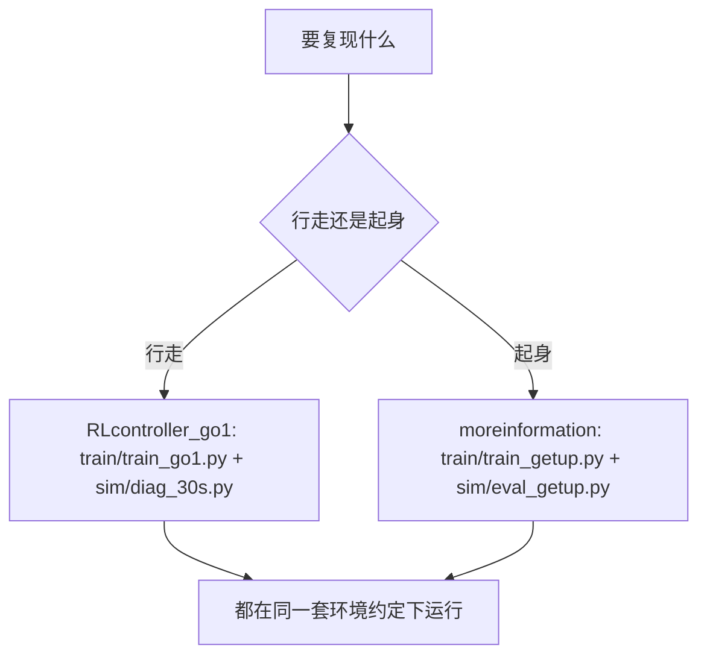
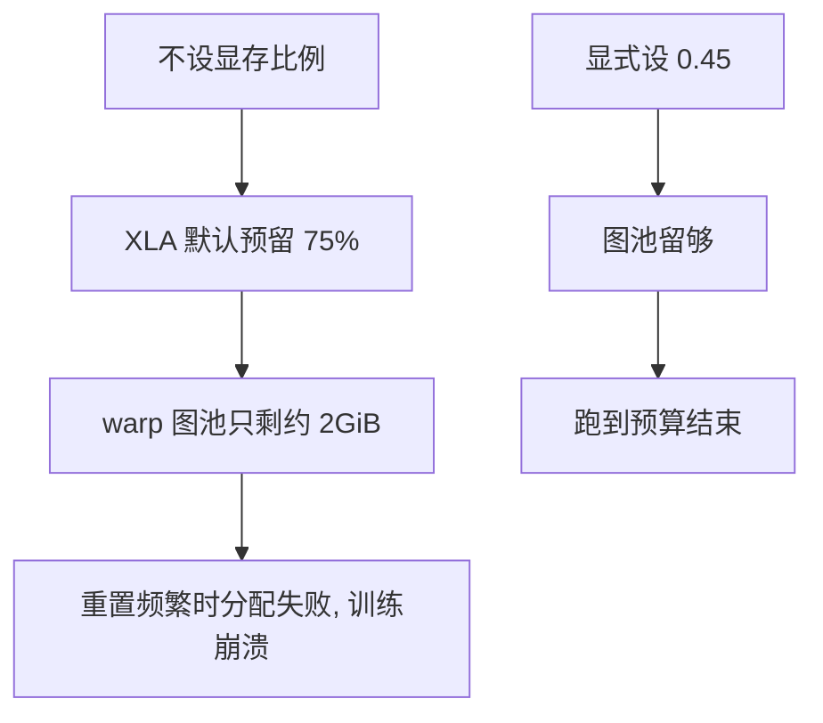
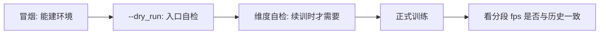

# 两条复现路径与入口脚本

从零复现这套东西，最短的路径是四条命令依次跑完：训练、无头长测、可视化、冒烟。四条命令本身不难记，容易出错的是每次都要重新确认的三个条件：物理接触档是否与训练一致、显存预占比例是否显式设置、以及这次要跑的入口脚本在哪个仓库里。

本单元面向两种复现：一条是行走策略（从零到能按指令走并保持三十秒不摔），另一条是起身策略（从真摔倒姿态恢复到站立）。两者的入口、预算与判据都不同，但共享同一套环境变量约定与检查顺序。

## 四条命令构成的最短路径

训练、长测、可视化与冒烟这四步在记录里是连在一起写的（`实验记录_Go1复现.md`）：

```bash
cd /home/tc63/mujoco/RLcontroller_go1

# 从零训练一条行走策略 (约 35 分钟, RTX 5060 Laptop 8GB)
XLA_PYTHON_CLIENT_MEM_FRACTION=0.80 ../.venv/bin/python -u -m train.train_go1 \
  --num_timesteps 5000000 --num_evals 20 --sb3_full --hard_contact \
  --logdir models/go1_v10_logs --save_name go1_walk_policy_v10.pkl

# 30 秒无头长测 (验收指标)
XLA_PYTHON_CLIENT_MEM_FRACTION=0.80 ../.venv/bin/python sim/diag_30s.py \
  --ckpt models/go1_v10_logs/checkpoints/best --hard_contact

# 可视化 (WSLg 需能开窗; W/S 调速, R 复位)
XLA_PYTHON_CLIENT_MEM_FRACTION=0.80 ../.venv/bin/python sim/view_go1.py \
  --pkl models/go1_walk_policy_v10.pkl --hard_contact
```

| 步骤 | 脚本 | 产出 |
| --- | --- | --- |
| 训练 | `train/train_go1.py` | 策略文件与检查点目录 |
| 长测 | `sim/diag_30s.py` | 三十秒内的速度、姿态与是否摔倒 |
| 可视化 | `sim/view_go1.py` | 人工观察，确认现象与数字一致 |
| 冒烟 | `sim/smoke_go1.py` | 环境与依赖能否建起来 |


顺序不能颠倒的原因很实际：冒烟不通过时后面的失败信息会被训练日志淹没；长测不通过时可视化只能告诉你「确实摔了」，而速度与姿态的数字才能定位是哪一段。

## 两个仓库的分工

当前检出里有两个目录容易混：`RLcontroller_go1` 是行走策略与查看器所在的主仓库，`RLcontroller_go1_moreinformation` 是补充实验与起身相关脚本所在的位置。两边的 `train/` 与 `sim/` 都有同名文件，跑之前要先确认自己在哪个目录。

| 位置 | 内容 |
| --- | --- |
| `RLcontroller_go1/` | 行走训练、查看器、步态诊断与验收长测 |
| `RLcontroller_go1_moreinformation/` | 起身训练入口、行为克隆、探针与实验记录 |

还有一处与任务描述不符：`RLcontroller_go1_moreinformation/scripts/` 目录在当前检出里是空的，实际入口脚本都在 `train/` 与 `sim/` 下。按目录名找脚本会找不到东西，这一点在排查时容易浪费时间。



## 入口脚本的位置

三个入口脚本的分工如下：

| 脚本 | 任务 | 默认预算 | 用法出处 |
| --- | --- | --- | --- |
| `train/train_go1.py` | 行走 | 100M 环境步 | `train_go1.py` |
| `train/train_getup.py` | 起身 | 50M 环境步 | `train_getup.py` |
| `train/bc_getup.py` | 行为克隆热身 | 400 轮 | `bc_getup.py` |

行走入口对齐官方 locomotion 配置：100M 步、8192 环境、三层网络、价值网络用特权状态；参考仓库用单机 CPU 加默认超参，两边任务与环境保持一致，训练框架差异本身就是被验证的变量之一（`train_go1.py`）。

起身入口被单独拆出来，理由是行走入口里有四百多行走路专属接线（奖励开关、地形、指令、续训维度自检），复用会把已验证的链路搅乱；起身是单任务，一组超参就够（`train_getup.py`）。

起身入口提供三种运行方式，从轻到重依次是静态自检、冒烟与正式训练（`train_getup.py`）：

```bash
# 只建环境与网络, 不训练
../.venv/bin/python -m train.train_getup --dry_run

# 一千万步冒烟
../.venv/bin/python -u -m train.train_getup --num_timesteps 1000000 \
    --num_evals 2 --save_name go1_getup_policy_smoke.pkl --logdir models/go1_v24_getup_logs

# 正式五千万步
../.venv/bin/python -u -m train.train_getup --num_timesteps 50000000 \
    --num_evals 20 --save_name go1_getup_policy_v24.pkl --logdir models/go1_v24_getup_logs
```
## 显存预占为什么必须显式设置

`XLA_PYTHON_CLIENT_MEM_FRACTION` 必须在导入 jax 之前设置，因为 XLA 会按这个比例一次性预留显存，事后再改没有意义（`train_getup.py`）。

不设置时默认按 75% 预留，8 GiB 的卡上等于 6.1 GiB，留给 warp 的图池只剩约 2 GiB。起身训练带 `--num_resets_per_eval` 时会反复调用重置，到一百五十万步左右就会报「无法分配 83MB」直接崩掉；把比例显式设成 0.45 之后不再出现（`train_getup.py`）。

| 场景 | 比例 | 出处 |
| --- | --- | --- |
| 行走训练 | 0.80 | `实验记录_Go1复现.md` |
| 起身训练 | 0.45 | `train_getup.py` |
| 行为克隆 | 0.40 | `bc_getup.py` |
| 探针脚本 | 0.30 到 0.40 | 各探针文件开头 |

比例不是越大越好：给 XLA 留得越多，warp 的图池越小，重置与多图模式下的分配就越容易失败。反过来说，小比例会限制批大小，所以不同任务的取值不同。



## 接触档必须与训练一致

行走任务的评估有一条硬性要求：评估 v5 及之后的策略必须带硬接触开关，因为训练用的就是硬接触；不加会跑在早期版本那套软接触上，机器人一被推就弹飞，结论完全反了（`实验记录_Go1复现.md`）。

| 接触档 | 静平衡残差 | 现象 |
| --- | --- | --- |
| 软接触 | 324 | 随机动作把机器人弹飞，站着不动成了最优策略 |
| 硬接触 | 0.083 | 求解收敛，正常行走 |

残差差了三个数量级，说明软接触下求解器根本没有收敛到静平衡（`实验记录_Go1复现.md`）。这条要求是复现里最容易被忽略的一处：脚本本身能跑、训练曲线也像模像样，只是物理不是训练时的那套。

## 冒烟与自检的顺序

在正式训练前，项目要求先过一遍与任务无关的检查，顺序如下：

| 顺序 | 检查 | 通过标准 |
| --- | --- | --- |
| 1 | 环境构造冒烟 | 能建起环境并完成一步 |
| 2 | 训练入口静态自检 | `--dry_run` 不报错即退出 |
| 3 | 观测与动作维度自检 | 与配置声明一致 |
| 4 | 正式训练 | 分段 fps 与历史同档一致 |

第三步在起身入口里是续训前的强制检查：恢复检查点前要确认路径可读、观测维度与本次一致，因为 brax 对「半个目录」或维度不匹配的报错信息几乎无法定位（`train_go1.py`）。



第四步的判据要单独说：分段 fps 落在历史区间内，说明训练本身是健康的；此时无论成败，问题都出在任务或奖励设计上，而不是性能或环境搭建。记录里起身训练的一千万步实测是 45 分钟、分段 fps 3546 到 4101，据此推算五千万步约 3.5 到 4 小时（`实验记录_Go1复现.md`）。

日志里还有一处误判要留意：训练日志里的 `loss=nan` 曾经是取值键名写错造成的，与训练无关（`实验记录_Go1复现.md`）。看到 NaN 先确认取的是不是正确的键，再去查数值问题。

## 易错点

| 现象 | 原因 | 判据 |
| --- | --- | --- |
| 按目录名找不到脚本 | `scripts/` 为空 | 入口在 `train/` 与 `sim/` |
| 训练跑到一半分配失败 | 未显式设显存比例 | 导入 jax 前设好 |
| 评估结论与训练相反 | 接触档不一致 | 检查硬接触开关 |
| 续训报错无法定位 | 路径或观测维度不匹配 | 先跑维度自检 |
| 日志出现 NaN 就怀疑数值 | 取值键名写错 | 先核对键名 |
| 改了入口行为就变 | 两个仓库同名脚本 | 确认当前目录 |

## 小结

### 核心概念

- 最短复现路径是冒烟、训练、长测、可视化四步。
- 两个仓库各有一套 `train/` 与 `sim/`，跑之前先确认目录。
- 显存预占必须在导入 jax 前显式设置，比例按任务取。
- 评估必须使用训练时的接触档，否则结论会反向。

### 设计权衡

| 决策 | 选择 | 收益 | 代价 |
| --- | --- | --- | --- |
| 训练入口 | 行走与起身各自独立 | 已验证链路不被搅乱 | 两处超参要手动对齐 |
| 显存比例 | 按任务分别设置 | 避免分配失败 | 每次跑都要带环境变量 |
| 复现顺序 | 先冒烟后训练 | 失败信息清晰 | 多一步操作 |
| 判据来源 | 分段 fps 加长测 | 能区分训练健康与任务设计 | 需要历史区间做对照 |

## 练习

### 基础题

1. 复现一条行走策略最少需要哪几步？
2. 为什么显存预占比例必须在导入 jax 前设置？
3. 评估时忘记带硬接触开关会发生什么？

### 挑战题

4. 给你一台显存更小的机器，说明三个训练入口与探针脚本各自的比例该怎么调整，依据是什么。

5. 设计一份从零到验收的操作清单，要求每一步都有明确的通过标准。

6. 说明「分段 fps 与历史同档」这条判据能排除哪些原因，不能排除哪些原因。

### 附：本页引用的路径

| 路径 | 用途 |
| --- | --- |
| `RLcontroller_go1_moreinformation/实验记录_Go1复现.md` | 复现命令、接触档要求、健康训练的分段 fps（） |
| `RLcontroller_go1_moreinformation/train/train_go1.py` | 行走入口的定位、用法与续训自检（） |
| `RLcontroller_go1_moreinformation/train/train_getup.py` | 起身入口的拆分理由、三种运行方式与显存设置（） |
| `RLcontroller_go1_moreinformation/train/bc_getup.py` | 行为克隆入口与显存比例（） |

（引用的文件以 /home/tc63/mujoco 为根。）