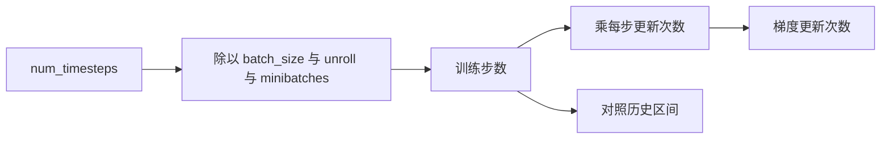
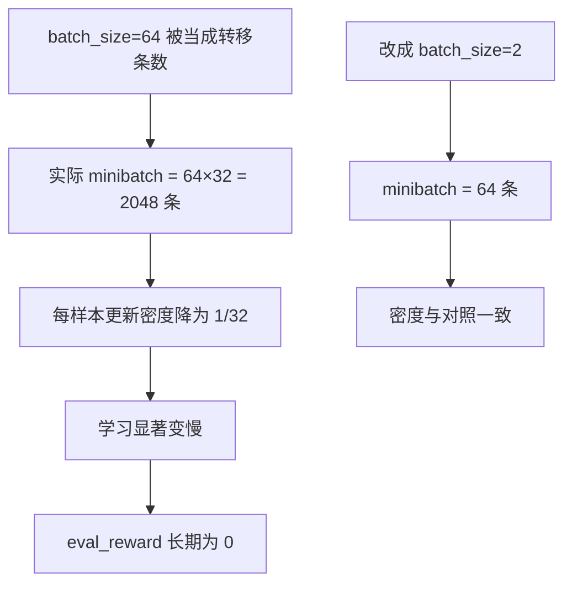
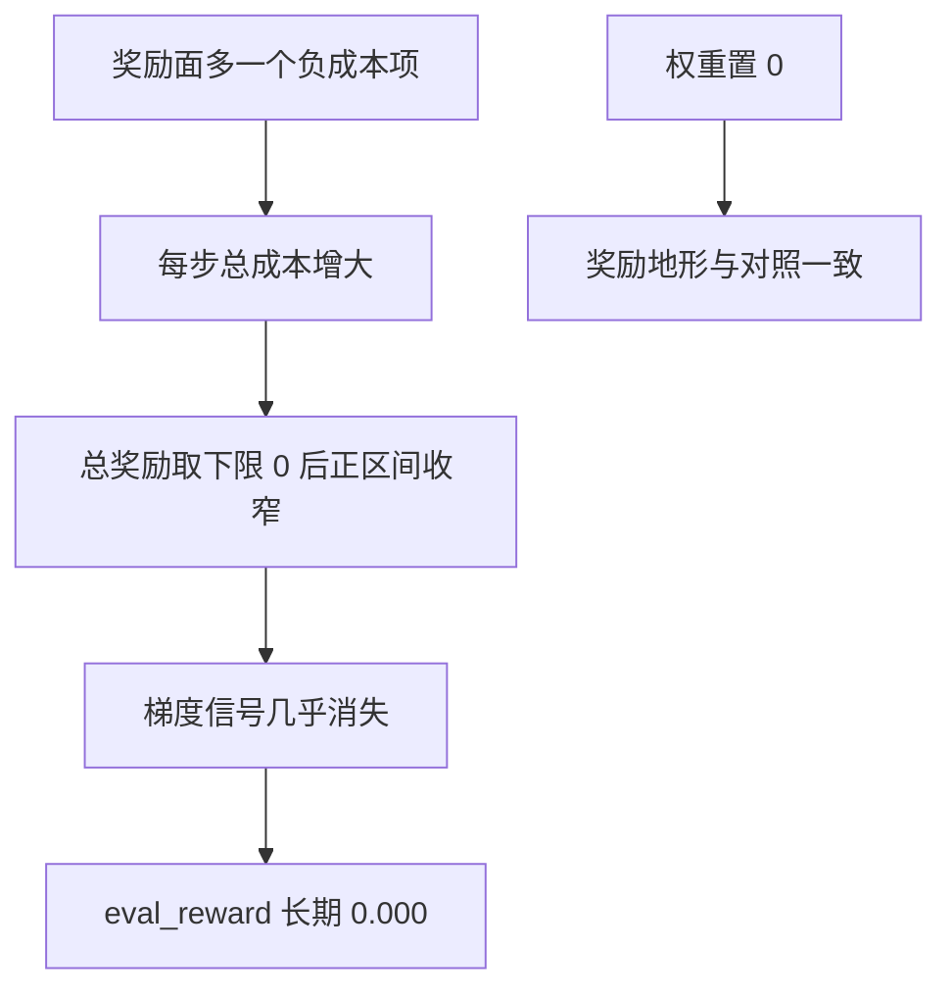
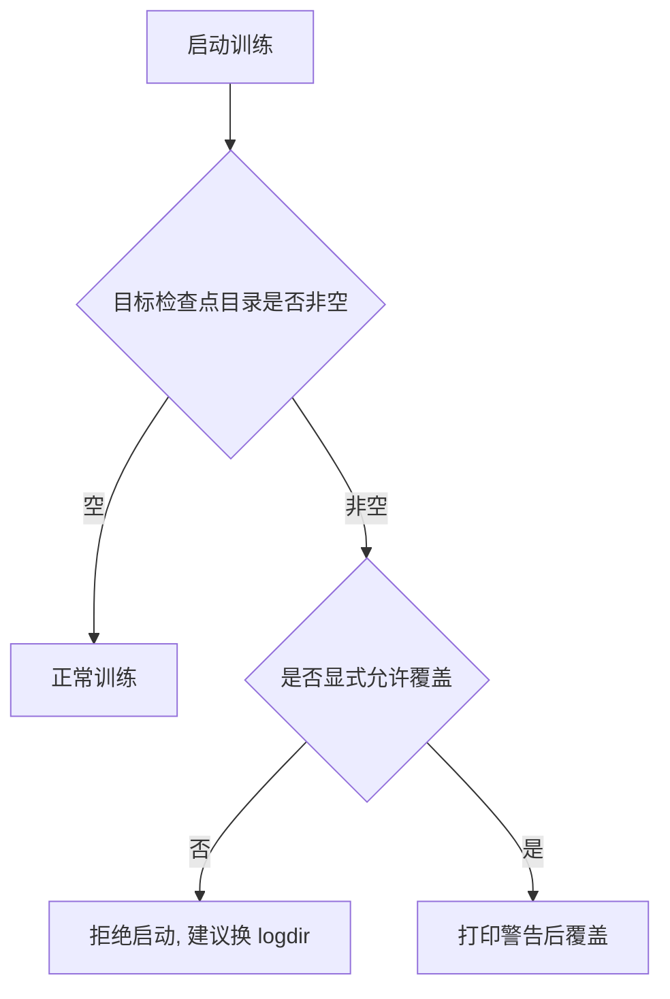

# 训练入口与预算记账

五百万步跑完，训练日志里的 `eval_reward` 全程 0.000。这件事在早期待了很久没被当成问题，因为奖励有下限，早期为 0 看起来合理。事后复盘发现实际账目错了 32 倍：一个 minibatch 实际装了两千多条转移，而对照实现里只有六十四条。

预算记账是本单元里最容易出错、也最难自己发现的一类问题：脚本不报错，曲线也在动，只是「五百万步」的含义与预期完全不同。三个步数的换算、奖励面、检查点与课程开关，是这条线上的四个检查点。

## 训练步、梯度更新与环境步

brax 的 `num_timesteps` 是环境总步数，不是梯度更新次数，两者之间隔着两个量（`实验记录_Go1复现.md:168-173`）：

```text
训练步数 = num_timesteps / (batch_size × unroll_length × num_minibatches)
梯度更新次数 = 训练步数 × num_minibatches × updates_per_batch
```

按这个关系，对照实现的五百万步等于 203 个训练步、约七十八万次梯度更新；而当时给出的四十万步只等于 16 个训练步、约六万次更新，只有对照的十二分之一（`实验记录_Go1复现.md:169-173`）。步数写着「四十万」，实际训练量差了一个数量级。

| 量 | 含义 | 能否直接对照 |
| --- | --- | --- |
| `num_timesteps` | 环境总步数 | 要换算后才可比 |
| 训练步数 | 一次采样加更新循环 | 是主要对照量 |
| 梯度更新次数 | 训练步数乘每步更新次数 | 最精确的对照量 |



判断预算是否对上有一个磁盘级的证据：检查点目录的间隔。v4 到 v8 的间隔是 786432 步，恰好是 64 乘 32 乘 384，也就是参考 rollout 的 32 倍；v10 的间隔是 270336，等于 11 乘 24576，恢复正常（`实验记录_Go1复现.md:164-166`）。检查点间隔不会撒谎，它是事后复盘的可靠依据。

## brax 的 batch_size 语义

记错预算的直接原因是一个命名差异：brax 的 `batch_size` 是每个 minibatch 的序列数，一个 minibatch 的转移数等于 `batch_size × unroll_length`；对照实现里的 batch 是转移条数（`实验记录_Go1复现.md:159-162`）。

| 参数 | 对照实现 | brax |
| --- | --- | --- |
| batch | 64 条转移 | 2 个序列乘 32 步 = 64 条 |
| minibatch 数 | 384 | 384 |
| 每批更新轮数 | 10 | 10 |
| 样本与更新之比 | 6.4 | 6.4 |

上表是修正后的映射（`实验记录_Go1复现.md:175-177`）。用 `batch_size=64` 时，一个 minibatch 是 2048 条，更新密度只有对照的三十二分之一——同样的样本数下参数被更新的次数少得多，学习自然慢，`eval_reward` 长期为 0 就有了第二个解释。

起身入口沿用了同一套映射，并把对应关系写在文件开头：768 个环境乘 32 步的展开长度等于 24576，与对照的「环境数乘步数」一致；batch 设为 2、minibatch 设为 384，恰好铺满（`train_getup.py:10-15`）。这些注释的作用就是让下一个人不必重新推一遍。


## 奖励面漏项与下限

预算是第三个原因，奖励面还有第四个。对照实现里算了一项关节速度成本却没有加进总成本，本项目照着「完整列表」把它实现了，结果是随机策略下最大的一项单项成本：每步负 1.98（`实验记录_Go1复现.md:153-157`）。

这一项的效果被总奖励的下限放大：总奖励写成「奖励减去成本，再取下限 0」，多出来的大成本会大幅收窄正奖励区间，策略几乎得不到正向信号。把关节速度与碰撞两项权重置 0 之后，奖励地形才与对照一致（`实验记录_Go1复现.md:155-157`）。

| 原因 | 表现 | 修复 |
| --- | --- | --- |
| 预算记错 32 倍 | 更新密度只有 1/32 | 换对 batch 语义 |
| 预算少一个数量级 | 训练步与更新次数不足 | 按换算关系重算 |
| 奖励面多一个负 1.98 的漏项 | 正奖励区间被下限压没 | 权重置 0 |
| 动作语义错误 | 零动作对应到中位目标 | 动作直接裁剪到控制范围 |

这张表的四行是叠加关系：任何一行单独存在都会让 `eval_reward` 长期为 0，所以修好其中一处看不到变化，只有全部修完才第一次出现非零的评估奖励（`实验记录_Go1复现.md:146-147`）。多因素叠加的故障要按表逐项排除，不能修一处等结果。



## 续训与检查点覆盖闸门

续训有一个静默的数据损失风险：brax 的保存是强制覆盖，而续训时步数计数会从零重新开始，新的检查点于是沿用五百万、一千万、一千五百万这套名字。如果 `--logdir` 指向上一次训练的目录，就会覆盖掉它的证据，过程中没有任何提示（`train_go1.py:37-42`）。

现在入口在启动时会检查目标目录，非空且未显式允许覆盖时直接拒绝启动，并把已有检查点数量与前几个名字打印出来，同时提示上一版训练的备份位置（`train_go1.py:43-53`）。

| 情形 | 行为 |
| --- | --- |
| 目标目录为空 | 正常启动 |
| 目录非空且未允许覆盖 | 拒绝启动并列出已有检查点 |
| 目录非空且显式允许 | 打印警告后覆盖 |



续训前还有一道观测维度自检：恢复的检查点必须可读，且观测维度与本次一致（`train_go1.py:57-60`）。这道检查的价值在于失败信息：brax 对不存在的路径会抛错，但对「目录只有一半」或维度不匹配几乎没有可用的提示，靠它才能快速定位。

## 课程开关与任务选择

起身入口的参数可以分成四组（`train_getup.py:113-204`）：

| 组 | 代表参数 | 默认 |
| --- | --- | --- |
| 预算 | 环境步数、评估次数、评估环境数 | 50M、20、128 |
| 优化 | 环境数、展开长度、minibatch、每批轮数、学习率 | 768、32、384、10、3e-4 |
| 任务 | 任务档、动作裁剪、关节系数、目标高度 | 见任务开关 |
| 课程 | 难度、朝向随机度、掉落概率、重置次数 | 1.0、1.0、按任务、0 |

任务开关有四个取值：起身、带残差的起身、第二版起身环境与行走（`train_getup.py:186-190`）。切换任务档会同时改变奖励项与动作接口，因此每次切换都要重新确认动作裁剪与目标高度，否则会出现「训练正常但评估成功率恒为零」的情况——这与评估口径那一页讲的动作范围不一致是同一个问题。

课程参数（难度与朝向随机度）决定出生分布，必须与评估时使用的档位一致，否则数字不可比（`train_getup.py:164-173`）。这一条在评估口径那一页有详细展开，这里只强调它与训练入口的耦合。

## 观测与价值网络的信息差

两套实现的网络输入不同，这是有意保留的差异，记录里逐条列出（`实验记录_Go1复现.md:374-385`）：

| 项目 | 对照实现 | 本项目 | 影响 |
| --- | --- | --- | --- |
| 价值网络观测 | 与策略共享 48 维 | 特权状态 119 维 | 信息更多，理论上只赚不亏 |
| 优势估计视野 | 2048 步 rollout | 展开长度 32 | 衰减因子 0.72，影响有限 |
| 重力投影 | 直立时返回零向量 | 标准的体系重力 | 数值特征不同，本项目更规范 |

这些差异必须写进记录：它们让「两边都跑 5M 步」不构成严格对照。复现的目标是行为与指标对齐，不是逐行等价，因此差异清单要如实保留并说明影响方向（`实验记录_Go1复现.md:372-378`）。

## 易错点

| 现象 | 原因 | 判据 |
| --- | --- | --- |
| 评估奖励长期为零 | 预算、奖励面、动作语义叠加 | 按四行表逐项排除 |
| 训练量远小于预期 | batch 语义理解错误 | 用检查点间隔反算 |
| 续训覆盖了旧证据 | 未检查目标目录 | 看启动时的闸门输出 |
| 续训启动即失败且信息不明 | 路径或维度不匹配 | 先跑维度自检 |
| 成功率恒为零而训练正常 | 任务档的动作范围不一致 | 对照训练与评估的动作设置 |
| 数字与对照不可比 | 网络输入或视野不同 | 查差异清单 |

## 小结

### 核心概念

- 环境步数、训练步数与梯度更新次数之间要按公式换算后才能对照。
- brax 的 `batch_size` 是序列数，转移数要乘展开长度。
- 多个记账错误可以叠加，修一处看不到变化。
- 续训会复用检查点名字，必须先检查目标目录。

### 设计权衡

| 决策 | 选择 | 收益 | 代价 |
| --- | --- | --- | --- |
| 入口拆分 | 行走与起身各自独立 | 已验证链路不被搅乱 | 超参要手动对齐 |
| 覆盖行为 | 默认拒绝覆盖 | 旧证据不会被毁 | 需要另选目录 |
| 网络输入 | 价值网络用特权状态 | 价值估计更准 | 与对照不严格等价 |
| 优势视野 | 受显存限制用展开长度 | 能跑起来 | 视野比对照短 |

## 练习

### 基础题

1. `num_timesteps` 与梯度更新次数之间隔着哪两个量？
2. brax 的 `batch_size` 与对照实现的 batch 含义差在哪里？
3. 续训为什么可能覆盖掉旧检查点？

### 挑战题

4. 只根据一个检查点目录的间隔，反推这次训练用的 batch 语义与展开长度，写出推导过程。

5. 设计一个启动前自检，能在训练开跑前发现预算与动作范围两类设置错误。

6. 说明为什么「两边都跑同样步数」不等于严格对照，并列出需要在记录里写清的差异项。

### 附：本页引用的路径

| 路径 | 用途 |
| --- | --- |
| `RLcontroller_go1_moreinformation/实验记录_Go1复现.md` | 预算换算、batch 语义、奖励漏项与差异清单（`:146-177`、`:372-385`） |
| `RLcontroller_go1_moreinformation/train/train_go1.py` | 检查点覆盖闸门与续训维度自检（`:37-60`） |
| `RLcontroller_go1_moreinformation/train/train_getup.py` | 映射关系与全部课程开关（`:10-18`、`:113-204`） |

（引用的文件以 /home/tc63/mujoco 为根。）